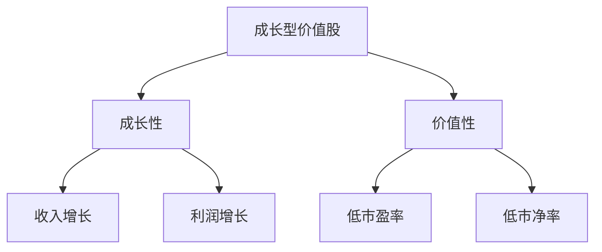
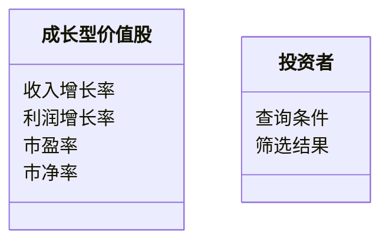
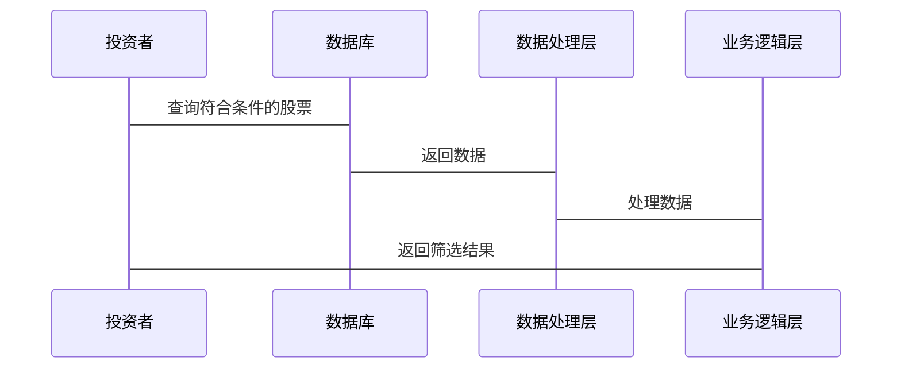

                 


```markdown
# 彼得林奇的"成长型价值股"定义

> 关键词：成长型价值股，彼得·林奇，投资策略，价值投资，成长股

> 摘要：本文深入探讨了彼得·林奇提出的“成长型价值股”概念，分析其核心要素、筛选标准、数学模型和实际应用，结合具体案例和系统架构，为投资者提供理论与实践指导。

---

## 第1章 成长型价值股的背景与定义

### 1.1 投资领域的基本概念

#### 1.1.1 价值投资的起源
价值投资由本杰明·格雷厄姆提出，强调以低于内在价值的价格购买优质股票。彼得·林奇在其基础上，发展出一套适用于成长型公司的投资策略。

#### 1.1.2 成长股与价值股的定义
- 成长股：具有高收入和利润增长率，但可能当前估值较高的股票。
- 价值股：估值低于其内在价值，通常为低增长或负增长的公司。

#### 1.1.3 彼得·林奇的投资理念
林奇强调，成长型价值股应兼具成长性和价值性，即在合理估值下，具备可持续的收入和利润增长潜力。

---

### 1.2 成长型价值股的核心要素

#### 1.2.1 成长型价值股的定义
成长型价值股是那些基本面良好、估值合理，同时具有稳定增长潜力的公司。这种投资策略旨在平衡成长和价值，避免极端估值。

#### 1.2.2 成长型价值股的特征
| 特征 | 成长性 | 价值性 |
|------|--------|--------|
| 收入增长率 | 高     | -     |
| 利润增长率 | 高     | -     |
| 市盈率 | 中低    | 低     |
| 市净率 | 中低    | 低     |

#### 1.2.3 成长型价值股的边界与外延
成长型价值股的边界在于避免高估的成长股和低估的价值股，而外延则包括那些在不同行业中有潜力的公司。

#### 1.2.4 概念结构与核心要素


---

## 第2章 成长型价值股的筛选标准

### 2.1 成长性分析

#### 2.1.1 收入增长率的计算
$$\text{收入增长率} = \frac{\text{收入}_t - \text{收入}_{t-1}}{\text{收入}_{t-1}}$$

#### 2.1.2 利润增长率的计算
$$\text{利润增长率} = \frac{\text{利润}_t - \text{利润}_{t-1}}{\text{利润}_{t-1}}$$

#### 2.1.3 市场占有率的评估
通过行业数据和公司财报，分析公司在市场中的占有率及其增长潜力。

---

### 2.2 价值性分析

#### 2.2.1 市盈率的计算
$$\text{市盈率} = \frac{\text{股价}}{\text{每股收益}}$$

#### 2.2.2 市净率的计算
$$\text{市净率} = \frac{\text{股价}}{\text{每股净资产}}$$

#### 2.2.3 股价与内在价值的对比
通过DCF模型估算内在价值，比较当前股价与内在价值的差距。

---

### 2.3 成长与价值的平衡

#### 2.3.1 成长与价值的权衡
避免只关注单一指标，综合考虑公司成长性和估值合理性。

#### 2.3.2 筛选标准的优化
设定合理的市盈率和市净率范围，同时要求一定的收入和利润增长率。

#### 2.3.3 筛选工具的使用
利用股票筛选工具或软件，根据设定的标准筛选出符合条件的股票。

---

## 第3章 成长型价值股的数学模型与算法

### 3.1 成长性评估模型

#### 3.1.1 收入增长率模型
$$\text{收入增长率} = \frac{\text{收入}_t - \text{收入}_{t-1}}{\text{收入}_{t-1}}$$

#### 3.1.2 利润增长率模型
$$\text{利润增长率} = \frac{\text{利润}_t - \text{利润}_{t-1}}{\text{利润}_{t-1}}$$`

---

### 3.2 价值性评估模型

#### 3.2.1 市盈率模型
$$\text{市盈率} = \frac{\text{股价}}{\text{每股收益}}$$`

#### 3.2.2 市净率模型
$$\text{市净率} = \frac{\text{股价}}{\text{每股净资产}}$$`

---

### 3.3 综合评估模型

#### 3.3.1 综合评分公式
$$\text{综合评分} = 0.4 \times \text{成长性评分} + 0.6 \times \text{价值性评分}$$`

#### 3.3.2 综合评估流程
1. 计算收入增长率和利润增长率，评估成长性。
2. 计算市盈率和市净率，评估价值性。
3. 根据权重计算综合评分。
4. 根据评分筛选出符合条件的股票。

---

## 第4章 成长型价值股的系统分析与架构设计

### 4.1 问题场景介绍
设计一个投资分析系统，帮助投资者筛选成长型价值股。

### 4.2 系统功能设计

#### 4.2.1 领域模型


#### 4.2.2 系统架构


#### 4.2.3 系统接口设计
- 数据库接口：连接股票数据源。
- 用户接口：接收投资者查询条件，返回筛选结果。

#### 4.2.4 系统交互流程


---

## 第5章 项目实战：成长型价值股的筛选与分析

### 5.1 环境配置

#### 5.1.1 安装Python
```bash
python --version
pip install pandas numpy matplotlib
```

#### 5.1.2 数据源获取
使用Yahoo Finance API获取股票数据。

---

### 5.2 核心实现代码

#### 5.2.1 数据获取与预处理
```python
import pandas as pd
import numpy as np

# 获取股票数据
def get_stock_data(ticker):
    # 实现从Yahoo Finance获取数据的函数
    pass

# 数据预处理
data = get_stock_data("AAPL")
data_processed = data[["Revenue Growth", "Net Income Growth", "PE Ratio", "PB Ratio"]]
```

#### 5.2.2 筛选函数
```python
def screen_growth_value_stocks(data, max_pe=15, max_pb=2):
    # 筛选成长性和价值性均满足条件的股票
    mask = (data["Revenue Growth"] > 5) & (data["Net Income Growth"] > 5) & \
           (data["PE Ratio"] < max_pe) & (data["PB Ratio"] < max_pb)
    return data[mask]
```

---

### 5.3 案例分析

#### 5.3.1 筛选过程
```python
selected_stocks = screen_growth_value_stocks(data)
print(selected_stocks)
```

#### 5.3.2 结果解读
解释筛选出的股票为何符合成长型价值股的标准，分析其投资价值。

---

## 第6章 最佳实践与总结

### 6.1 小结
成长型价值股结合了成长股和价值股的优点，是平衡风险与收益的有效策略。

### 6.2 注意事项
- 定期调整筛选标准，适应市场变化。
- 结合宏观经济环境进行投资决策。

### 6.3 拓展阅读
- 彼得·林奇的《选股第一课》
- 投资分析相关的学术论文

---

## 作者：AI天才研究院/AI Genius Institute & 禅与计算机程序设计艺术/Zen And The Art of Computer Programming
```

