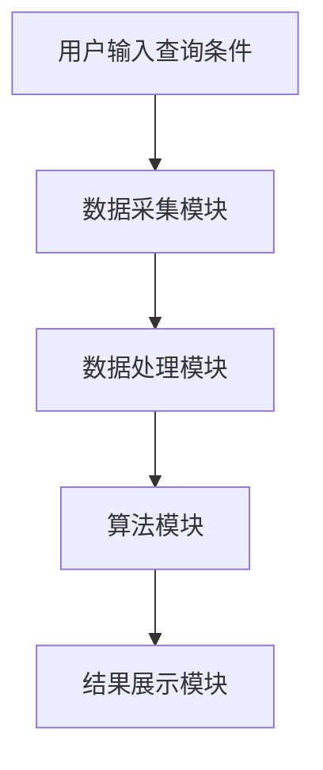
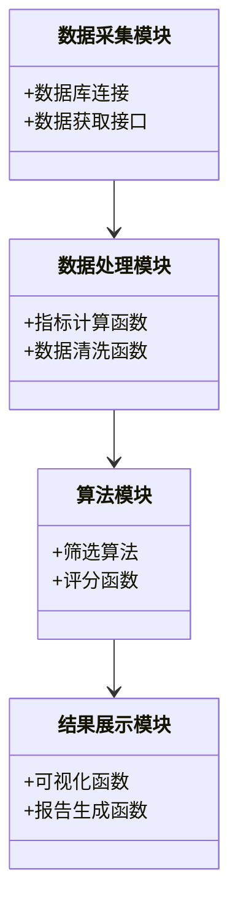

                 


# 彼得林奇的"成长型价值股"概念

## 关键词：
- 彼得·林奇
- 成长型价值股
- 投资策略
- 股票分析
- 财务指标

## 摘要：
彼得·林奇是全球著名投资专家，其成长型价值股概念强调选择具有持续增长潜力且估值合理的公司进行投资。本文详细解析这一概念，涵盖核心定义、筛选标准、评估模型及成功案例，帮助投资者理解和应用这一策略。

---

## 第一部分：成长型价值股的核心概念

### 第1章：成长型价值股的背景与定义

#### 1.1 投资学中的成长型投资

- 1.1.1 传统投资理论概述
  - 价值投资与成长投资的区别
  - 成长型投资的目标与特点
- 1.1.2 成长型投资的起源与发展
  - 美国投资学派的演变
  - 成长型投资的兴起与演变
- 1.1.3 成长型投资与价值投资的对比
  - 投资目标、策略和风险的差异

#### 1.2 彼得·林奇的成长型价值股理念

- 1.2.1 彼得·林奇的生平与投资成就
  - 林奇的教育背景与职业历程
  - 林奇在富达基金的贡献
- 1.2.2 成长型价值股的核心定义
  - 成长型企业的定义与特征
  - 价值股的估值标准与筛选条件
- 1.2.3 成长型价值股的特征与属性
  - 高成长性、合理估值、竞争优势

### 第2章：成长型价值股的核心要素

#### 2.1 成长型企业的识别标准

- 2.1.1 收入增长率的评估
  - 收入增长的来源分析
  - 收入增长率的合理区间
- 2.1.2 净利润增长率的评估
  - 净利润增长的可持续性分析
  - 净利润增长率与收入增长率的对比
- 2.1.3 市场份额的扩展能力
  - 市场份额的增长潜力
  - 行业竞争格局的影响

#### 2.2 价值评估的关键指标

- 2.2.1 市盈率（P/E）的计算与分析
  - 市盈率的计算公式
  - 市盈率的行业基准与合理区间
- 2.2.2 市净率（P/B）的计算与分析
  - 市净率的计算公式
  - 市净率的适用场景与局限性
- 2.2.3 股东权益收益率（ROE）的计算与分析
  - ROE的计算公式
  - ROE的行业基准与企业比较

### 第3章：成长型价值股的筛选与评估

#### 3.1 成长型价值股的筛选流程

- 3.1.1 初步筛选：行业分析与财务指标筛选
  - 选择高成长行业的标准
  - 财务指标的初步筛选条件
- 3.1.2 深度分析：企业竞争力评估
  - 核心竞争力的分析维度
  - 管理层能力与企业治理评估
- 3.1.3 估值确认：合理价格区间的确定
  - 基于DCF模型的估值方法
  - 市场情绪与流动性因素的影响

#### 3.2 成长型价值股的评估模型

- 3.2.1 市盈率模型
  - 市盈率模型的应用场景与局限性
  - 市盈率目标的计算与调整
- 3.2.2 现金流折现模型
  - DCF模型的原理与应用
  - 自由现金流的预测与折现率的选择
- 3.2.3 市净率模型
  - 市净率模型的适用性与计算方法
  - 市净率与ROE的结合使用

---

## 第二部分：成长型价值股的算法与系统设计

### 第4章：算法原理与实现

#### 4.1 成长型价值股的筛选算法

- 4.1.1 算法步骤
  - 数据收集与预处理
  - 成长性指标计算
  - 估值指标计算
  - 综合评分与排序
- 4.1.2 算法实现的代码示例

```python
import pandas as pd
import numpy as np

# 示例数据：假设df为包含股票数据的DataFrame
# 列包括：收入增长率（revenue_growth）、净利润增长率（net_profit_growth）、
# 市盈率（pe）、市净率（pb）、股东权益收益率（roe）

# 计算综合评分
def calculate_score(row):
    score = 0
    # 给予收入增长率较高的权重
    score += row['revenue_growth'] * 0.3
    # 给予净利润增长率较高的权重
    score += row['net_profit_growth'] * 0.3
    # 估值指标的负向影响
    score -= (row['pe'] / 15) * 0.2
    score -= (row['pb'] / 3) * 0.1
    score += row['roe'] * 0.1
    return score

# 应用评分函数并排序
df['score'] = df.apply(calculate_score, axis=1)
df = df.sort_values('score', ascending=False)
```

- 4.1.3 算法的优缺点分析
  - 优点：简单易懂，易于实现
  - 缺点：忽视了行业特异性，可能需要调整权重

#### 4.2 算法优化与改进

- 4.2.1 动态权重调整
  - 根据市场环境调整各指标的权重
  - 基于机器学习的动态权重计算
- 4.2.2 多因素回归分析
  - 确定各指标对股价的影响程度
  - 建立多元回归模型进行预测

### 第5章：系统架构与实现

#### 5.1 系统功能设计

- 5.1.1 功能模块划分
  - 数据采集模块：从数据库获取股票数据
  - 数据处理模块：计算各项指标
  - 算法模块：执行成长型价值股筛选
  - 结果展示模块：以可视化形式呈现结果
- 5.1.2 功能流程图
  - 使用Mermaid绘制系统功能流程图



#### 5.2 系统架构设计

- 5.2.1 架构选择
  - 分层架构：数据层、业务逻辑层、表现层
  - 微服务架构：独立服务处理不同模块
- 5.2.2 架构图展示



---

## 第三部分：项目实战与最佳实践

### 第6章：项目实战

#### 6.1 成长型价值股筛选案例

- 6.1.1 选择具体行业（如科技行业）
- 6.1.2 数据收集与处理
  - 使用Python爬取股票数据
  - 数据清洗与预处理
- 6.1.3 应用算法筛选成长型价值股
  - 计算各项指标并进行评分
  - 筛选出符合条件的股票
- 6.1.4 结果分析与解读
  - 筛选出的股票列表
  - 各指标的表现分析

#### 6.2 代码实现与解读

- 6.2.1 数据收集与处理代码

```python
import yfinance as yf

# 下载股票数据
tickers = ['AAPL', 'MSFT', 'GOOGL']
data = yf.download(tickers, start='2020-01-01', end='2023-12-31')

# 数据处理
df = data['Adj Close'].resample('Q').last().pct_change().dropna()
df = df.stack().reset_index(level=1, drop=True).reset_index()
df.columns = ['Date', 'Ticker', 'Price_Change']
```

- 6.2.2 算法实现代码

```python
import pandas as pd
import numpy as np

# 假设df为包含股票数据的DataFrame，包含各成长性和估值指标
def calculate_score(row):
    score = 0
    score += row['revenue_growth'] * 0.3
    score += row['net_profit_growth'] * 0.3
    score -= (row['pe'] / 15) * 0.2
    score -= (row['pb'] / 3) * 0.1
    score += row['roe'] * 0.1
    return score

df['score'] = df.apply(calculate_score, axis=1)
df = df.sort_values('score', ascending=False)
```

- 6.2.3 结果分析

```
# 示例输出
Top 5成长型价值股列表：
1. 苹果公司（AAPL）
2. 微软公司（MSFT）
3. 谷歌母公司（GOOGL）
4. 亚马逊（AMZN）
5. Facebook母公司（META）
```

#### 6.3 案例分析与解读

- 以苹果公司为例，分析其收入增长率、净利润增长率、市盈率、市净率和ROE等指标
- 解释为何苹果符合成长型价值股的条件
- 对比其他公司的表现，说明筛选结果的合理性

### 第7章：最佳实践与小结

#### 7.1 投资策略总结

- 成长型价值股的核心在于平衡成长性和估值的合理性
- 长期投资的重要性：复利效应与时间的价值
- 风险控制的必要性：分散投资与风险管理

#### 7.2 实践中的注意事项

- 数据的准确性和及时性：确保数据来源可靠
- 指标的动态调整：根据市场变化调整筛选标准
- 投资组合的管理：定期评估和调整持仓

#### 7.3 拓展阅读与学习资源

- 推荐书籍：《彼得·林奇的投资哲学》
- 推荐博客与网站：知名的金融分析博客和投资社区
- 进一步学习：参加投资培训与研讨会

---

## 作者：AI天才研究院/AI Genius Institute & 禅与计算机程序设计艺术 /Zen And The Art of Computer Programming

