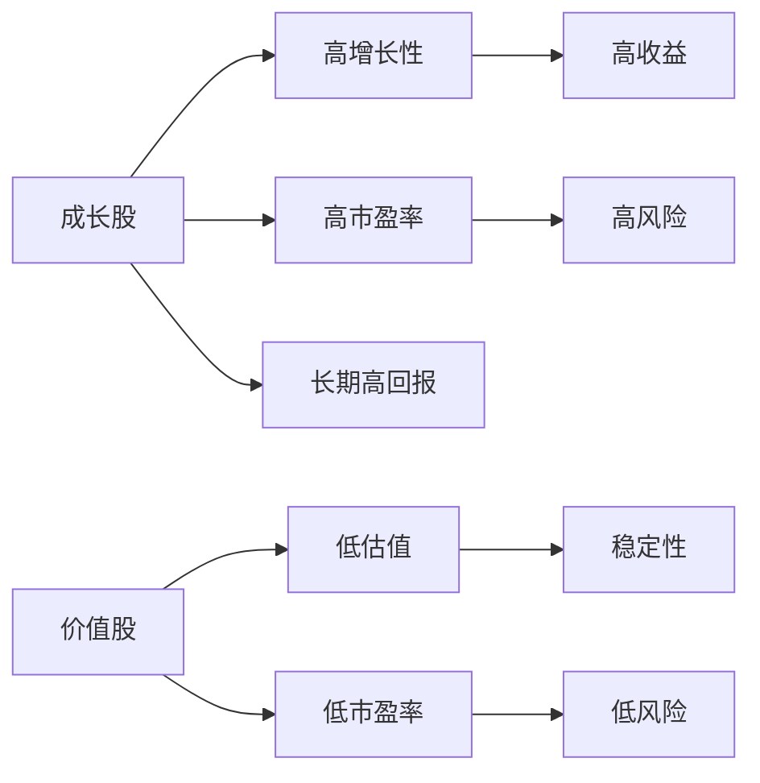
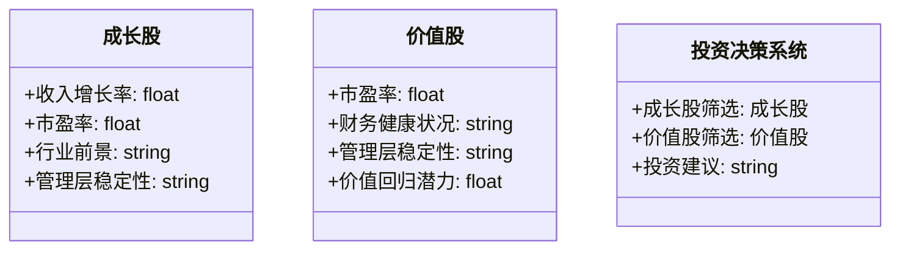
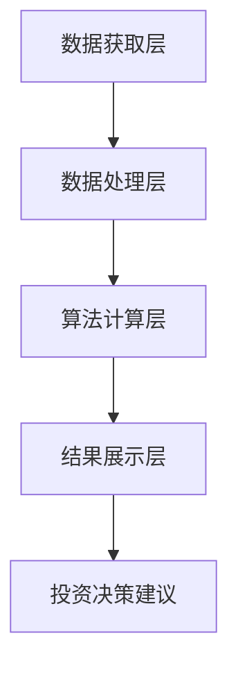

                 


# 彼得林奇的"成长股"vs"价值股"选择策略

## 关键词：成长股、价值股、彼得·林奇、投资策略、选股模型

## 摘要：本文详细探讨了彼得·林奇在成长股和价值股之间的选择策略，分析了两种投资策略的核心概念、算法原理、系统架构，并通过实战案例和最佳实践提供了深入的见解。文章帮助读者理解如何在实际投资中应用这些策略，做出明智的投资决策。

---

# 正文

## 第一部分: 彼得林奇的投资理念与方法论

### 第1章: 彼得林奇投资理念概述

#### 1.1 彼得林奇的生平简介
彼得·林奇（Peter Lynch）是美国著名的投资经理，被誉为“股票投资之父”。他在富达投资集团管理麦哲伦基金期间取得了卓越的业绩，年平均回报率高达29%，远超市场平均水平。林奇的成功不仅在于他的投资技巧，更在于他对市场和公司的深刻理解。

#### 1.2 投资理念的核心思想
林奇的投资理念基于基本面分析，强调长期投资和选择具有竞争优势的公司。他认为，投资的关键在于找到那些能够持续增长的公司，并在市场低估时买入，在高估时卖出。

#### 1.3 成长股与价值股的定义与区别
- **成长股**：指那些收入和利润快速增长，但市盈率较高的公司股票。这类公司通常处于扩张阶段，行业前景广阔。
- **价值股**：指那些市场价格低于其内在价值，通常市盈率、市净率较低的公司股票。这类公司可能处于成熟阶段，增长潜力有限，但价格被市场低估。

---

### 第2章: 成长股与价值股的核心概念

#### 2.1 成长股的特点与优势
- **高增长性**：收入和利润持续增长，具有较高的成长潜力。
- **高风险**：市盈率较高，波动性大，容易受市场情绪影响。
- **长期收益潜力**：适合长期投资者，能够带来高额回报。

#### 2.2 价值股的特点与优势
- **低估值**：市场价格低于内在价值，风险较低。
- **稳定性**：收益稳定，波动性小，适合风险厌恶型投资者。
- **周期性机会**：在市场低估时买入，等待价值回归。

---

## 第二部分: 成长股与价值股的对比分析

### 第3章: 成长股与价值股的属性对比

#### 3.1 成长股与价值股的属性对比
| 属性             | 成长股                     | 价值股                     |
|------------------|---------------------------|---------------------------|
| 市盈率（P/E）     | 高                         | 低                         |
| 市净率（P/B）     | 高                         | 低                         |
| 收益增长率（ROE）  | 高                         | 低                         |
| 市场风险           | 高                         | 低                         |
| 流动性             | 高                         | 中-低                     |

#### 3.2 成长股与价值股的ER实体关系图


---

## 第三部分: 成长股与价值股的算法原理

### 第4章: 成长股的选股算法

#### 4.1 成长股的选股步骤
1. **筛选高增长公司**：选择过去3-5年收入和利润持续增长的公司。
2. **评估市盈率**：排除市盈率过高的公司。
3. **分析行业前景**：选择处于成长行业的公司。
4. **验证管理层稳定性**：确保公司管理层稳定，战略清晰。

#### 4.2 成长股的数学模型
- **年增长率计算**：
  $$ \text{年增长率} = \frac{\text{本期收入} - \text{上期收入}}{\text{上期收入}} \times 100\% $$
- **市盈率计算**：
  $$ \text{市盈率} = \frac{\text{股票价格}}{\text{每股收益}} $$

---

### 第5章: 价值股的选股算法

#### 5.1 价值股的选股步骤
1. **筛选低市盈率股票**：选择市盈率低于行业平均水平的公司。
2. **评估财务健康状况**：确保公司负债率低，现金流稳定。
3. **分析管理层稳定性**：选择管理层稳定的公司。
4. **等待价值回归**：长期持有，等待市场价格回升。

#### 5.2 价值股的数学模型
- **市净率计算**：
  $$ \text{市净率} = \frac{\text{股票价格}}{\text{每股净资产}} $$
- **收益稳定性计算**：
  $$ \text{收益稳定性} = \frac{\text{连续三年平均收益波动率}}{\text{行业平均收益波动率}} $$

---

## 第四部分: 投资决策支持系统的架构设计

### 第6章: 系统功能设计

#### 6.1 领域模型类图


#### 6.2 系统架构设计


---

## 第五部分: 项目实战与案例分析

### 第7章: 项目实战

#### 7.1 环境安装与配置
1. **安装Python环境**：推荐使用Anaconda。
2. **安装数据获取库**：如`pandas`、`numpy`、`requests`。
3. **安装数据可视化库**：如`matplotlib`、`seaborn`。

#### 7.2 核心代码实现
```python
import pandas as pd
import numpy as np

# 成长股筛选函数
def screen_growth_stocks(df):
    growth_stocks = df[(df['收入增长率'] > 20) & (df['市盈率'] < 50)]
    return growth_stocks

# 价值股筛选函数
def screen_value_stocks(df):
    value_stocks = df[(df['市盈率'] < 15) & (df['财务健康状况'] == '健康')]
    return value_stocks

# 示例数据
data = {
    '股票代码': ['AAPL', 'GOOGL', 'MSFT', 'AMZN', 'KO'],
    '收入增长率': [25, 18, 12, 30, 8],
    '市盈率': [25, 20, 18, 30, 12],
    '行业前景': ['高', '高', '中', '高', '低'],
    '财务健康状况': ['健康', '健康', '健康', '健康', '一般']
}
df = pd.DataFrame(data)

# 筛选成长股
growth_stocks = screen_growth_stocks(df)
print("成长股筛选结果：\n", growth_stocks)

# 筛选价值股
value_stocks = screen_value_stocks(df)
print("价值股筛选结果：\n", value_stocks)
```

---

### 第8章: 案例分析

#### 8.1 成长股案例分析
以苹果公司（AAPL）为例，假设其收入增长率为25%，市盈率为25。根据筛选条件，符合成长股的定义，具有较高的成长潜力。

#### 8.2 价值股案例分析
以可口可乐公司（KO）为例，假设其收入增长率为8%，市盈率为12。根据筛选条件，符合价值股的定义，具有较低的估值和稳定的收益。

---

## 第六部分: 最佳实践与小结

### 第9章: 投资策略与注意事项

#### 9.1 最佳实践
1. **长期投资**：避免频繁交易，降低交易成本。
2. **分散投资**：不要将所有资金投入单一类型股票。
3. **定期评估**：定期检查投资组合，根据市场变化调整策略。

#### 9.2 小结
彼得·林奇的成长股与价值股策略各有优劣，投资者应根据自身风险承受能力和投资目标选择合适策略。成长股适合长期看好高增长行业，而价值股适合追求稳定收益。

#### 9.3 注意事项
- 市场波动会影响股票价格，需谨慎应对。
- 保持对公司的持续关注，及时了解公司动态。
- 避免情绪化投资，保持理性判断。

---

## 第七部分: 拓展阅读与经典书籍推荐

### 第10章: 经典书籍推荐

1. 《彼得·林奇的成功投资》
2. 《股票作手回忆录》
3. 《投资学原理》
4. 《价值投资入门》

---

## 作者信息

作者：AI天才研究院/AI Genius Institute & 禅与计算机程序设计艺术 /Zen And The Art of Computer Programming

---

感谢您的阅读！希望本文能为您提供有价值的投资策略和实践指导。

