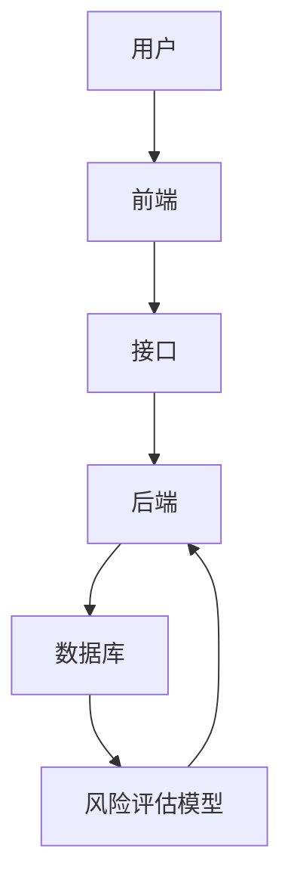

                 


# 彼得林奇的"成长股"在不同监管环境下的风险评估

> 关键词：彼得·林奇，成长股，风险评估，监管环境，投资策略

> 摘要：本文深入分析了彼得·林奇的成长股投资策略在不同监管环境下的风险评估方法，探讨了如何通过数学模型和系统架构设计来量化监管因素对成长股的影响，结合实际案例提供了风险评估的实战指导。

---

# 目录

## 第一部分：彼得·林奇的成长股投资理论

### 第1章：成长股的基本概念与投资策略

#### 1.1 成长股的定义与特点
- 1.1.1 成长股的定义
- 1.1.2 成长股的核心特征
- 1.1.3 成长股的投资理念

#### 1.2 彼得·林奇的成长股投资策略
- 1.2.1 成长股的选择标准
- 1.2.2 长期投资与价值发现
- 1.2.3 成长股的市场定位

## 第二部分：监管环境对成长股的影响

### 第2章：监管环境的多样性与复杂性

#### 2.1 不同国家的监管体系
- 2.1.1 美国的监管环境
- 2.1.2 欧盟的监管政策
- 2.1.3 中国的监管框架

#### 2.2 监管政策对企业的影响
- 2.2.1 行业政策的变动
- 2.2.2 税收政策的影响
- 2.2.3 法律法规的合规性

### 第3章：监管环境对成长股风险的具体影响

#### 3.1 政策变化的风险
- 3.1.1 政策变动对股价的影响
- 3.1.2 监管不确定性对企业的影响

#### 3.2 法律与合规风险
- 3.2.1 不合规的风险
- 3.2.2 法律诉讼的影响

#### 3.3 监管强度与市场流动性
- 3.3.1 监管强度对市场流动性的影响
- 3.3.2 市场流动性与成长股的关系

## 第三部分：成长股风险评估模型的构建

### 第4章：风险评估的核心概念与框架

#### 4.1 风险评估的基本概念
- 4.1.1 风险的定义与分类
- 4.1.2 成长股风险的特殊性

#### 4.2 监管因素在风险评估中的权重
- 4.2.1 监管因素的量化方法
- 4.2.2 监管因素对不同成长股的影响

### 第5章：基于监管环境的成长股风险评估模型

#### 5.1 模型构建的理论基础
- 5.1.1 监管因素的数学表达
- 5.1.2 成长股评估指标的选择

#### 5.2 模型的具体构建步骤
- 5.2.1 数据收集与处理
- 5.2.2 模型参数的设定
- 5.2.3 模型的验证与优化

### 第6章：模型的数学解析

#### 6.1 成长股风险评估的数学模型
- 6.1.1 模型的总体结构
- 6.1.2 监管因素的数学表达

#### 6.2 监管因素对成长股风险的具体影响
- 6.2.1 政策变化的数学分析
- 6.2.2 法律风险的量化

## 第四部分：系统设计与实现

### 第7章：系统功能设计

#### 7.1 问题场景介绍
- 7.1.1 系统的目标与范围
- 7.1.2 系统的主要功能

#### 7.2 领域模型设计
- 7.2.1 领域模型的mermaid类图
- 7.2.2 模型的属性与关系

### 第8章：系统架构设计

#### 8.1 系统架构的mermaid架构图
- 8.1.1 分层架构设计
- 8.1.2 模块间的依赖关系

#### 8.2 接口设计
- 8.2.1 API的设计与实现
- 8.2.2 接口的交互流程

### 第9章：系统交互设计

#### 9.1 系统交互的mermaid序列图
- 9.1.1 用户登录流程
- 9.1.2 风险评估流程

## 第五部分：项目实战

### 第10章：环境安装与核心实现

#### 10.1 环境安装
- 10.1.1 开发工具的安装
- 10.1.2 数据库的配置

#### 10.2 核心实现
- 10.2.1 数据收集与处理
- 10.2.2 模型训练与优化

### 第11章：案例分析与代码解读

#### 11.1 案例分析
- 11.1.1 选取的监管环境
- 11.1.2 成长股的选择与分析

#### 11.2 代码实现
- 11.2.1 数据处理代码
- 11.2.2 模型训练代码
- 11.2.3 结果输出与可视化

### 第12章：项目小结与优化建议

#### 12.1 项目小结
- 12.1.1 成果总结
- 12.1.2 经验分享

#### 12.2 优化建议
- 12.2.1 模型的改进方向
- 12.2.2 系统功能的扩展建议

## 第六部分：总结与展望

### 第13章：总结

#### 13.1 本书的核心内容回顾
- 13.1.1 成长股投资策略
- 13.1.2 监管环境的影响
- 13.1.3 风险评估模型

#### 13.2 投资策略的未来展望
- 13.2.1 数字化投资的趋势
- 13.2.2 人工智能在投资中的应用

### 第14章：最佳实践与注意事项

#### 14.1 最佳实践
- 14.1.1 数据收集的注意事项
- 14.1.2 模型选择的策略
- 14.1.3 投资决策的多元考量

#### 14.2 小结与展望
- 14.2.1 本书的不足之处
- 14.2.2 未来研究方向

## 附录

### 附录A：成长股风险评估模型的详细代码实现

#### A.1 数据处理代码
```python
import pandas as pd

# 读取数据
data = pd.read_csv('growth_stocks.csv')

# 数据清洗
data = data.dropna()
data = data[~data['revenue'].str.contains('None')]
```

#### A.2 模型训练代码
```python
from sklearn.linear_model import LinearRegression
import numpy as np

# 数据准备
X = np.array(data[['revenue', 'profit']].values)
y = np.array(data['risk_score'].values)

# 模型训练
model = LinearRegression()
model.fit(X, y)

# 预测
predictions = model.predict(X)
```

#### A.3 结果输出与可视化
```python
import matplotlib.pyplot as plt

# 绘制散点图
plt.scatter(X[:, 0], y, color='blue', label='真实值')
plt.scatter(X[:, 0], predictions, color='red', label='预测值')
plt.xlabel('收入')
plt.ylabel('风险评分')
plt.legend()
plt.show()
```

### 附录B：系统架构图



---

## 作者：AI天才研究院 & 禅与计算机程序设计艺术

---

通过以上目录，我们可以看到文章从彼得·林奇的成长股理论出发，结合监管环境的影响，构建了详细的风险评估模型，并通过系统设计和项目实战，提供了具体的实现方法。这种结构既保证了理论的深度，也兼顾了实践的可操作性，帮助读者全面理解并应用成长股的风险评估策略。

