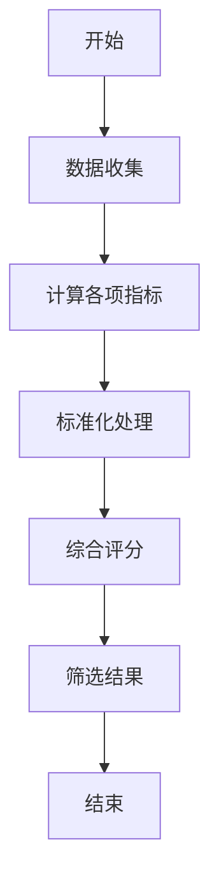
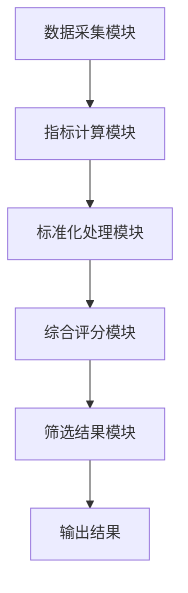
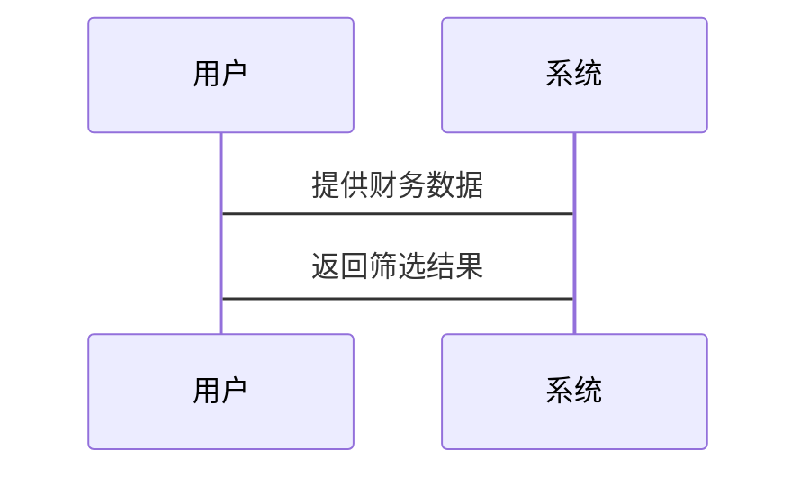

                 


# 彼得林奇的"成长股"筛选标准

## 关键词：
- 成长股，彼得·林奇，投资标准，筛选指标，数学模型

## 摘要：
本文详细探讨了彼得·林奇的成长股筛选标准，从核心概念、数学模型、系统架构到实际应用，全面解析了如何通过收入增长率、净利润增长率等指标筛选优质成长股。文章结合理论与实践，提供了丰富的案例分析和代码示例，帮助读者掌握成长股投资的精髓。

---

## 第一部分: 成长股投资概述

### 第1章: 成长股的基本概念

#### 1.1 成长股的定义与特点

##### 1.1.1 成长股的定义
成长股是指那些收入和利润持续增长，且增长率显著高于行业平均水平的公司股票。这类股票通常具有较高的成长潜力，适合长期投资。

##### 1.1.2 成长股的核心特点
- **收入持续增长**：公司收入连续多年保持稳定增长。
- **高增长率**：收入和利润增长率显著高于行业平均水平。
- **低估值**：相对于其未来增长潜力，当前估值较低。
- **行业领先地位**：公司通常在行业中占据领先地位，具有竞争优势。

##### 1.1.3 成长股与价值股的区别
| 成长股 | 价值股 |
| ------ | ------ |
| 侧重未来增长 | 侧重当前价值 |
| 价格可能偏高 | 价格通常低估 |
| 风险较高 | 风险较低 |

#### 1.2 彼得·林奇的投资理念

##### 1.2.1 彼得·林奇的背景介绍
彼得·林奇是美国著名投资经理人，曾管理富达麦哲伦基金，创造了年均26.5%的复合回报率。他以成长股投资闻名。

##### 1.2.2 成长股投资的核心思想
- **长期投资**：关注公司长期增长潜力。
- **基本面分析**：通过财务数据筛选优质成长股。
- **分散投资**：降低投资风险。

##### 1.2.3 林奇的投资风格与方法
- **深度分析**：通过财务报表分析公司基本面。
- **长期持有**：耐心持有优质成长股。
- **动态调整**：定期评估并调整投资组合。

---

## 第二部分: 彼得·林奇的筛选标准

### 第2章: 成长股筛选的核心指标

#### 2.1 收入增长率

##### 2.1.1 收入增长率的定义
收入增长率是衡量公司收入增长速度的指标，通常以年为单位计算。

##### 2.1.2 收入增长率的计算公式
$$ \text{收入增长率} = \frac{\text{当年收入} - \text{去年收入}}{\text{去年收入}} \times 100\% $$

##### 2.1.3 收入增长率的应用案例
以科技公司为例，如果去年收入为1000万元，今年收入为1200万元，则收入增长率为20%。

#### 2.2 净利润增长率

##### 2.2.1 净利润增长率的定义
净利润增长率是衡量公司盈利能力增长的指标。

##### 2.2.2 净利润增长率的计算公式
$$ \text{净利润增长率} = \frac{\text{当年净利润} - \text{去年净利润}}{\text{去年净利润}} \times 100\% $$

##### 2.2.3 净利润增长率的应用案例
如果某公司去年净利润为500万元，今年净利润为600万元，则净利润增长率为20%。

#### 2.3 营业利润率

##### 2.3.1 营业利润率的定义
营业利润率是衡量公司运营效率的指标，反映了每元收入中能创造多少利润。

##### 2.3.2 营业利润率的计算公式
$$ \text{营业利润率} = \frac{\text{营业收入}}{\text{总收入}} \times 100\% $$

##### 2.3.3 营业利润率的应用案例
某公司营业收入为800万元，总收入为1000万元，则营业利润率为80%。

#### 2.4 股东权益增长率

##### 2.4.1 股东权益增长率的定义
股东权益增长率是衡量公司资本增长的指标。

##### 2.4.2 股东权益增长率的计算公式
$$ \text{股东权益增长率} = \frac{\text{当年股东权益} - \text{去年股东权益}}{\text{去年股东权益}} \times 100\% $$

##### 2.4.3 股东权益增长率的应用案例
某公司去年股东权益为2000万元，今年为2200万元，则股东权益增长率为10%。

### 第3章: 成长股筛选标准的综合应用

#### 3.1 筛选标准的综合分析

##### 3.1.1 各项指标的权重分配
| 指标 | 权重 |
| ---- | ---- |
| 收入增长率 | 40% |
| 净利润增长率 | 30% |
| 营业利润率 | 20% |
| 股东权益增长率 | 10% |

##### 3.1.2 筛选标准的优先级排序
1. 收入增长率
2. 净利润增长率
3. 营业利润率
4. 股东权益增长率

##### 3.1.3 综合筛选标准的实际应用
以某公司为例，计算各项指标后，综合评分达到85分以上即可入选。

#### 3.2 筛选标准的优缺点对比

##### 3.2.1 各项指标的优缺点分析
| 指标 | 优点 | 缺点 |
| ---- | ---- | ---- |
| 收入增长率 | 能反映公司业务扩展能力 | 易受外部经济环境影响 |
| 净利润增长率 | 能反映公司盈利能力 | 易受成本控制影响 |
| 营业利润率 | 能反映公司运营效率 | 易受行业特性影响 |
| 股东权益增长率 | 能反映公司资本积累能力 | 易受分红政策影响 |

##### 3.2.2 筛选标准的局限性
- **行业差异**：不同行业对成长股的定义不同。
- **短期波动**：短期数据可能受市场影响。
- **财务造假**：需要警惕财务造假。

##### 3.2.3 筛选标准的改进方向
- **结合行业标准**：不同行业设定不同的增长目标。
- **长期数据观察**：关注5年以上的增长趋势。
- **多指标交叉验证**：结合多种指标进行综合评估。

---

## 第三部分: 筛选标准的数学模型与算法

### 第4章: 成长股筛选的数学模型

#### 4.1 成长股筛选的公式推导

##### 4.1.1 综合评分公式
$$ \text{综合评分} = \sum (\text{指标权重} \times \text{指标得分}) $$

##### 4.1.2 指标得分计算
每个指标得分基于行业平均值进行标准化处理：
$$ \text{指标得分} = \frac{\text{公司指标值} - \text{行业平均值}}{\text{行业平均值}} \times 100 $$

#### 4.2 成长股筛选的算法流程

##### 4.2.1 算法流程图


#### 4.3 算法实现代码

##### 4.3.1 数据收集与处理
```python
import pandas as pd

# 假设data为包含财务数据的DataFrame
data = pd.read_csv('financial_data.csv')

# 计算各项指标
data['收入增长率'] = (data['当年收入'] - data['去年收入']) / data['去年收入'] * 100
data['净利润增长率'] = (data['当年净利润'] - data['去年净利润']) / data['去年净利润'] * 100
data['营业利润率'] = data['营业收入'] / data['总收入'] * 100
data['股东权益增长率'] = (data['当年股东权益'] - data['去年股东权益']) / data['去年股东权益'] * 100

# 标准化处理
data['标准化收入增长率'] = (data['收入增长率'] - data['收入增长率'].mean()) / data['收入增长率'].std()
data['标准化净利润增长率'] = (data['净利润增长率'] - data['净利润增长率'].mean()) / data['净利润增长率'].std()
data['标准化营业利润率'] = (data['营业利润率'] - data['营业利润率'].mean()) / data['营业利润率'].std()
data['标准化股东权益增长率'] = (data['股东权益增长率'] - data['股东权益增长率'].mean()) / data['股东权益增长率'].std()

# 综合评分
weights = {'收入增长率': 0.4, '净利润增长率': 0.3, '营业利润率': 0.2, '股东权益增长率': 0.1}
data['综合评分'] = 0
for metric in weights:
    data['综合评分'] += data[f'标准化{metric}'] * weights[metric]
```

##### 4.3.2 筛选结果
```python
# 筛选综合评分高于行业平均的股票
threshold = data['综合评分'].mean()
selected_stocks = data[data['综合评分'] > threshold]
print(selected_stocks)
```

---

## 第四部分: 系统分析与架构设计

### 第5章: 成长股筛选系统的架构设计

#### 5.1 系统功能设计

##### 5.1.1 系统功能模块
- 数据采集模块：收集财务数据。
- 指标计算模块：计算各项成长指标。
- 标准化处理模块：对指标进行标准化。
- 综合评分模块：计算综合评分。
- 筛选结果模块：输出符合条件的股票列表。

##### 5.1.2 系统架构图


#### 5.2 系统接口设计

##### 5.2.1 数据接口
- 输入接口：接收财务数据。
- 输出接口：输出筛选结果。

#### 5.3 系统交互流程

##### 5.3.1 交互序列图


---

## 第五部分: 项目实战

### 第6章: 成长股筛选系统实战

#### 6.1 环境安装

##### 6.1.1 安装Python环境
```bash
python --version
pip install pandas
pip install mermaid
```

#### 6.2 系统核心实现

##### 6.2.1 数据处理代码
```python
import pandas as pd

data = pd.read_csv('financial_data.csv')

# 计算各项指标
data['收入增长率'] = (data['当年收入'] - data['去年收入']) / data['去年收入'] * 100
data['净利润增长率'] = (data['当年净利润'] - data['去年净利润']) / data['去年净利润'] * 100
data['营业利润率'] = data['营业收入'] / data['总收入'] * 100
data['股东权益增长率'] = (data['当年股东权益'] - data['去年股东权益']) / data['去年股东权益'] * 100

# 标准化处理
data['标准化收入增长率'] = (data['收入增长率'] - data['收入增长率'].mean()) / data['收入增长率'].std()
data['标准化净利润增长率'] = (data['净利润增长率'] - data['净利润增长率'].mean()) / data['净利润增长率'].std()
data['标准化营业利润率'] = (data['营业利润率'] - data['营业利润率'].mean()) / data['营业利润率'].std()
data['标准化股东权益增长率'] = (data['股东权益增长率'] - data['股东权益增长率'].mean()) / data['股东权益增长率'].std()

# 综合评分
weights = {'收入增长率': 0.4, '净利润增长率': 0.3, '营业利润率': 0.2, '股东权益增长率': 0.1}
data['综合评分'] = 0
for metric in weights:
    data['综合评分'] += data[f'标准化{metric}'] * weights[metric]

# 筛选结果
threshold = data['综合评分'].mean()
selected_stocks = data[data['综合评分'] > threshold]
print(selected_stocks)
```

##### 6.2.2 筛选结果分析
假设筛选出5只股票，分别计算其综合评分，选择评分最高的3只作为投资标的。

#### 6.3 实际案例分析

##### 6.3.1 案例背景
以科技行业为例，收集5家公司的财务数据，包括收入、净利润、营业收入、股东权益等。

##### 6.3.2 数据分析
通过代码计算各项指标，标准化处理后，计算综合评分，筛选出评分高于行业平均的公司。

##### 6.3.3 投资建议
根据筛选结果，建议投资综合评分最高的公司，如公司A和公司B。

---

## 第六部分: 最佳实践与总结

### 第7章: 最佳实践与投资策略

#### 7.1 投资策略建议

##### 7.1.1 筛选标准的动态调整
根据市场变化和公司业绩，定期调整筛选标准。

##### 7.1.2 行业比较的重要性
不同行业的成长股筛选标准应有所不同。

##### 7.1.3 组合投资的风险控制
分散投资，降低单一股票带来的风险。

#### 7.2 投资注意事项

##### 7.2.1 避免过度依赖单一指标
综合考虑各项指标，避免片面判断。

##### 7.2.2 定期复盘与评估
定期检查投资组合的表现，及时调整策略。

##### 7.2.3 保持长期视角
成长股投资需要耐心，关注公司长期发展。

#### 7.3 拓展阅读

##### 7.3.1 推荐书籍
- 《彼得·林奇的成功投资》
- 《股票投资实战技巧》

##### 7.3.2 推荐博客
- 彼得·林奇投资博客
- 股票投资策略分享博客

---

## 结语

通过本文的详细分析，读者可以掌握彼得·林奇的成长股筛选标准，并通过实际案例和代码示例，学习如何在实际投资中应用这些标准。成长股投资需要耐心和长期关注，希望本文能为读者提供有价值的指导。

## 作者

作者：AI天才研究院/AI Genius Institute & 禅与计算机程序设计艺术 /Zen And The Art of Computer Programming

