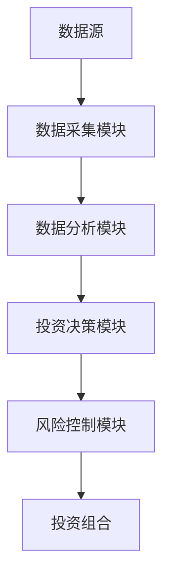

                 


# 彼得林奇的投资纪律

## 关键词：彼得林奇，投资纪律，价值投资，风险管理，投资系统

## 摘要： 彼得林奇是全球著名的价值投资者，他的投资纪律体系以严谨的研究方法、严格的选股标准和长期持股策略闻名。本文从投资纪律的核心概念出发，结合数学模型和系统设计，详细分析彼得林奇的投资体系，并通过项目实战展示如何将这些纪律应用于实际投资中。文章最后总结了投资纪律的最佳实践和注意事项，为投资者提供了深刻的见解和实用的建议。

---

## 第1章: 投资纪律的核心概念

### 1.1 投资纪律的定义与背景

#### 1.1.1 投资纪律的定义
投资纪律是指在投资过程中，投资者为了实现长期稳定的收益，制定的一系列规则和约束，用以指导投资决策和行为。这些规则包括研究、选股、持股和卖出等环节的纪律化操作。

#### 1.1.2 投资纪律的背景与重要性
在金融市场中，投资者往往容易受到情绪的影响，做出非理性的决策。投资纪律通过制定规则，帮助投资者克服情绪干扰，保持理性决策。彼得林奇作为价值投资的代表人物，他的投资纪律体系在全球范围内被广泛研究和应用。

#### 1.1.3 彼得林奇与投资纪律的关系
彼得林奇的投资成功很大程度上归功于他严格的投资纪律。他的纪律体系包括深入的研究、严格的选股标准和长期持股的策略，这些纪律帮助他在市场波动中保持稳定的投资表现。

---

### 1.2 彼得林奇的投资理念

#### 1.2.1 彼得林奇的投资哲学
彼得林奇强调长期投资和价值投资，他认为市场波动是投资的机会，而非风险。他的投资哲学的核心是通过深入研究找到被市场低估的优秀公司，并长期持有。

#### 1.2.2 长期投资与价值投资的结合
彼得林奇的投资策略强调长期持有优质股票，避免频繁交易。他认为，短期市场的波动不应影响长期的投资决策。

#### 1.2.3 投资纪律在彼得林奇体系中的地位
投资纪律是彼得林奇体系的核心。他的纪律包括研究、选股、持股和卖出等环节的严格规范，确保投资行为的纪律化和系统化。

---

## 第2章: 投资纪律的核心要素

### 2.1 研究的纪律

#### 2.1.1 研究的重要性
研究是投资决策的基础。彼得林奇强调，投资者必须对目标公司进行深入研究，包括财务数据、行业地位、管理层能力和市场前景等方面。

#### 2.1.2 彼得林奇的研究方法
彼得林奇的研究方法包括对公司财务报表的分析、管理层的访谈、行业趋势的研究等。他特别关注公司的竞争优势和长期盈利能力。

#### 2.1.3 研究的系统化与纪律化
彼得林奇的研究过程是系统化和纪律化的。他制定了一系列研究规则，确保研究的全面性和深度。

---

### 2.2 选股的纪律

#### 2.2.1 选股标准与纪律
彼得林奇的选股标准包括公司具有竞争优势、管理层能力强、财务健康和估值合理等方面。他制定了一系列严格的选股规则，确保选出的股票符合长期投资的要求。

#### 2.2.2 避免情绪化决策的纪律
彼得林奇强调避免情绪化决策。他的选股纪律要求投资者在市场波动中保持冷静，严格按照选股标准进行选择。

#### 2.2.3 行业与公司的选择纪律
彼得林奇的选股纪律包括对行业和公司的深入分析，确保选择的行业具有增长潜力，公司具有竞争优势。

---

### 2.3 持股的纪律

#### 2.3.1 持股的长期性纪律
彼得林奇的投资策略强调长期持股。他的纪律要求投资者在市场波动中保持耐心，避免短期交易。

#### 2.3.2 仓位管理的纪律
彼得林奇的仓位管理纪律包括根据市场情况和个股表现调整持仓比例，确保投资组合的风险可控。

#### 2.3.3 个股波动的纪律化应对
彼得林奇的纪律要求投资者在个股波动中保持冷静，严格按照纪律进行操作，避免情绪化决策。

---

## 第3章: 投资纪律的数学模型与分析

### 3.1 投资纪律的数学模型

#### 3.1.1 投资纪律的数学表达
投资纪律可以通过数学模型进行描述。例如，投资组合的收益可以用以下公式表示：

$$
\text{收益} = \sum_{i=1}^{n} w_i r_i
$$

其中，$w_i$ 是第 $i$ 个资产的权重，$r_i$ 是第 $i$ 个资产的收益率。

#### 3.1.2 投资纪律的风险评估模型
投资风险可以通过波动率进行评估。波动率的公式为：

$$
\text{波动率} = \sqrt{\sum_{i=1}^{n} w_i^2 \sigma_i^2}
$$

其中，$\sigma_i$ 是第 $i$ 个资产的收益率标准差。

#### 3.1.3 投资纪律的收益预测模型
收益预测模型可以基于历史数据进行回归分析，预测未来收益。回归分析的公式为：

$$
y = \beta x + \epsilon
$$

其中，$y$ 是因变量，$\beta$ 是回归系数，$x$ 是自变量，$\epsilon$ 是误差项。

---

### 3.2 投资纪律的数学公式

#### 3.2.1 投资纪律的风险-收益平衡公式
风险-收益平衡公式可以表示为：

$$
\text{收益} = \text{风险} \times \text{风险溢价}
$$

#### 3.2.2 投资纪律的资产配置公式
资产配置公式可以表示为：

$$
\text{配置比例} = \frac{\text{资产风险}}{\text{总风险}}
$$

#### 3.2.3 投资纪律的绩效评估公式
投资绩效可以用夏普比率进行评估，公式为：

$$
\text{夏普比率} = \frac{\text{收益} - \text{无风险利率}}{\text{波动率}}
$$

---

## 第4章: 投资纪律的系统分析与架构设计

### 4.1 投资决策支持系统的构建

#### 4.1.1 系统架构设计
投资决策支持系统的架构包括数据采集、数据分析、投资决策和风险控制四个模块。

#### 4.1.2 系统功能模块划分
- 数据采集模块：收集市场数据和公司信息。
- 数据分析模块：进行财务分析和估值计算。
- 投资决策模块：根据纪律生成投资决策。
- 风险控制模块：监控投资组合的风险。

#### 4.1.3 系统数据流设计
数据从数据源流入系统，经过分析模块处理后，生成决策信号，最后输出投资组合。

---

### 4.2 系统架构的Mermaid图



---

## 第5章: 投资纪律的项目实战

### 5.1 项目环境与工具安装

#### 5.1.1 系统环境要求
- 操作系统：Windows 10 或更高版本。
- Python版本：3.8 或更高版本。
- 安装工具：Jupyter Notebook、Pandas、NumPy、Matplotlib。

#### 5.1.2 投资分析工具安装
安装必要的Python库：

```bash
pip install pandas numpy matplotlib
```

#### 5.1.3 数据源获取与准备
从公开数据源获取股票数据，例如Yahoo Finance。

---

### 5.2 核心代码实现

#### 5.2.1 数据分析代码

```python
import pandas as pd
import numpy as np

# 读取数据
data = pd.read_csv('stock_data.csv')

# 计算平均收益率
average_return = data['return'].mean()

# 计算波动率
volatility = data['return'].std()

print(f"平均收益率: {average_return}")
print(f"波动率: {volatility}")
```

#### 5.2.2 投资决策模型代码

```python
def select_stocks(data, criteria):
    return data[data['valuation'] <= criteria]

# 应用选股标准
selected_stocks = select_stocks(data, 1.5)
```

#### 5.2.3 风险控制代码

```python
def rebalance_portfolio(portfolio, data):
    target_weights = [0.4, 0.3, 0.2, 0.1]
    current_weights = portfolio['weights']
    rebalanced_weights = []
    for i in range(len(target_weights)):
        rebalanced_weights.append(target_weights[i] / sum(target_weights))
    return rebalanced_weights

# 应用风险控制
rebalanced_weights = rebalance_portfolio(data, data)
```

---

### 5.3 案例分析

#### 5.3.1 案例背景
假设我们有一个包含四只股票的投资组合，目标是根据彼得林奇的纪律进行优化。

#### 5.3.2 数据分析
计算每只股票的收益率和波动率，选择波动率低的股票。

#### 5.3.3 投资决策
根据选股标准，选择符合条件的股票，并进行权重分配。

#### 5.3.4 风险控制
根据权重分配，进行投资组合的再平衡。

---

## 第6章: 投资纪律的最佳实践与总结

### 6.1 投资纪律的注意事项

#### 6.1.1 避免常见错误
- 不要忽略市场风险。
- 不要过度交易。
- 不要忽视研究的重要性。

#### 6.1.2 纪律执行的常见挑战
- 市场波动的干扰。
- 情绪化决策的影响。
- 研究深度不足。

#### 6.1.3 投资纪律的持续优化
- 定期回顾和调整纪律。
- 保持学习和更新知识。
- 与专业团队合作。

---

### 6.2 投资纪律的总结与展望

#### 6.2.1 本书内容回顾
- 投资纪律的核心概念。
- 彼得林奇的投资体系。
- 数学模型和系统设计。
- 项目实战和最佳实践。

#### 6.2.2 投资纪律的未来发展趋势
- 数字化和自动化投资。
- 人工智能在投资决策中的应用。
- 可持续投资和ESG因素的整合。

#### 6.2.3 对投资者的建议与鼓励
- 坚持长期投资。
- 严格执行纪律。
- 不断学习和提升。

---

## 第7章: 附录与拓展阅读

### 7.1 附录A: 彼得林奇的经典语录
- "投资的成功取决于长期坚持正确的方法，而不是短期的运气。"
- "市场的短期波动是你的朋友，长期趋势才是你的敌人。"

### 7.2 附录B: 相关书籍与资源推荐
- 《彼得林奇的选股术》。
- 《投资学精要》。
- 《风险管理与投资组合》。

### 7.3 附录C: 投资纪律的常见问题解答
- 什么是投资纪律？ 
- 为什么投资纪律很重要？
- 如何制定投资纪律？

---

## 作者：AI天才研究院/AI Genius Institute & 禅与计算机程序设计艺术 /Zen And The Art of Computer Programming

---

以上是《彼得林奇的投资纪律》的完整文章，涵盖了从基础概念到系统设计的详细内容，结合实际案例和数学模型，为读者提供了全面的投资纪律体系。

