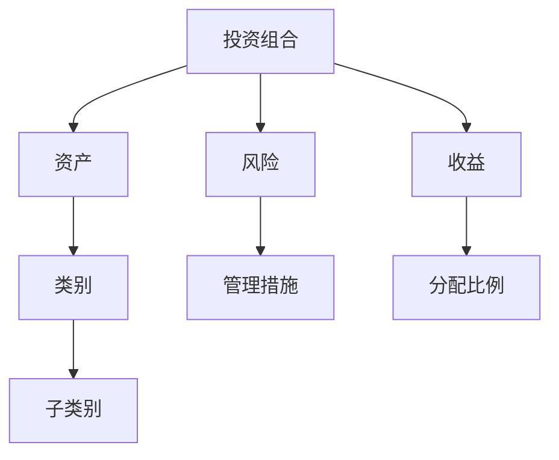
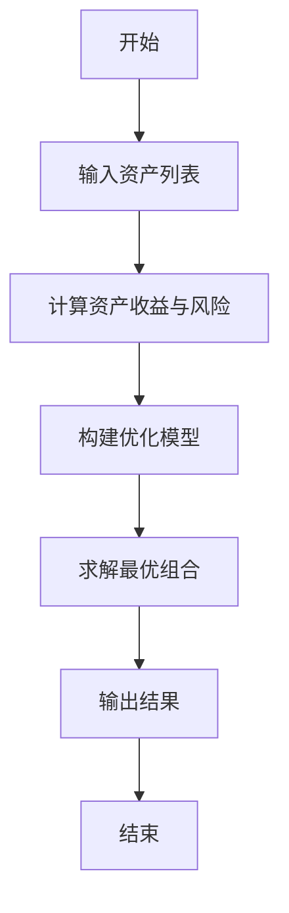
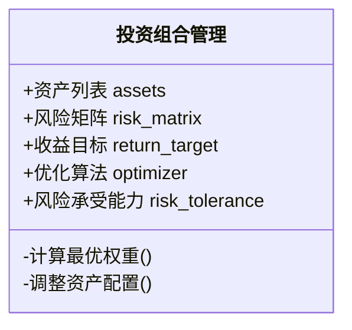
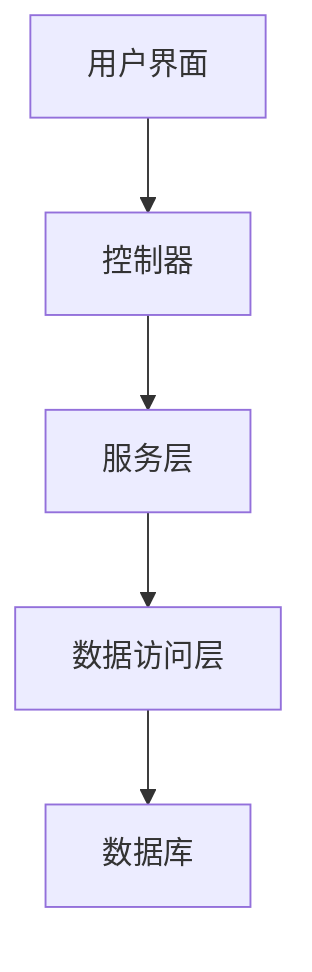

                 


# 彼得林奇的投资组合管理策略

> 关键词：投资组合管理，彼得·林奇，资产配置，风险控制，投资策略，价值投资

> 摘要：本文深入分析了彼得·林奇的投资组合管理策略，探讨其核心概念、算法原理、系统架构以及实际应用，结合案例和代码示例，为读者提供全面的理解和实践指南。

---

## 第一部分: 投资组合管理概述

### 第1章: 投资组合管理的背景与重要性

#### 1.1 投资组合管理的定义与概念

投资组合管理是指通过科学配置和调整投资组合中的资产，以实现既定目标（如收益最大化、风险最小化）的过程。其核心在于平衡风险与收益，优化资产配置。

- **定义**: 投资组合管理是对资产的科学管理和调整，以实现收益与风险的最佳平衡。
- **重要性**: 在不确定性市场中，科学的投资组合管理能有效分散风险，提升整体收益。

#### 1.2 投资组合管理的重要性

- **风险控制**: 通过分散投资降低特定资产的风险。
- **收益优化**: 合理配置资产以实现收益最大化。
- **适应市场变化**: 根据市场波动及时调整投资策略。

#### 1.3 彼得·林奇的背景与投资理念

彼得·林奇是著名的基金经理，强调长期投资和价值发现。他的策略注重基本面分析和分散投资。

- **生平简介**: 曾管理富达麦哲伦基金，创造了卓越的投资业绩。
- **投资哲学**: 强调长期持有、价值发现和分散投资。

---

## 第2章: 投资组合管理的核心概念与联系

### 2.1 核心概念原理

- **资产配置**: 决定组合收益和风险的核心因素。
- **风险调整后的收益**: 考虑风险后的收益评估。
- **流动性管理**: 确保资产的变现能力。

### 2.2 核心概念对比

表2.1展示了不同策略的核心要素对比：

| 策略类型 | 资产配置 | 风险控制 | 收益目标 |
|----------|----------|----------|----------|
| 现金管理 | 高流动性资产 | 极低风险 | 稳定收益 |
| 股票投资 | 股票为主 | 中高风险 | 较高收益 |

### 2.3 ER实体关系图



---

## 第三部分: 投资组合管理的算法原理

### 第3章: 现代投资组合理论与优化算法

#### 3.1 均值-方差优化模型

均值-方差模型由Harry Markowitz提出，用于优化资产配置。

- **数学模型**:

$$ \text{目标函数: } \min \sigma^2 $$
$$ \text{约束条件: } \sum w_i r_i = \mu $$

其中，$\sigma^2$为风险，$w_i$为权重，$r_i$为预期收益。

- **现代投资组合理论(MPT)**: 通过优化模型构建有效前沿，找到最优组合。

#### 3.2 投资组合优化算法

- **随机优化算法**: 如蒙特卡洛模拟。
- **确定性优化算法**: 如拉格朗日乘数法。
- **智能优化算法**: 如遗传算法。

#### 3.3 算法流程图



#### 3.4 Python代码实现

以下是优化算法的Python代码示例：

```python
import numpy as np
import matplotlib.pyplot as plt

# 假设资产收益和风险矩阵
mu = np.array([0.1, 0.15, 0.08])
sigma = np.array([[0.15, 0.05, 0.07],
                  [0.05, 0.20, 0.05],
                  [0.07, 0.05, 0.25]])

# 使用拉格朗日乘数法求解
def optimize_portfolio(mu, sigma):
    # 构建优化问题
    # ... 代码实现 ...
    pass

# 输出优化后的权重
weights = optimize_portfolio(mu, sigma)
print(weights)
```

---

## 第四部分: 投资组合管理的系统分析与架构设计

### 第4章: 投资组合管理系统架构

#### 4.1 系统功能设计

- **领域模型**:



- **系统架构图**:



---

## 第五部分: 项目实战

### 第5章: 投资组合管理的项目实战

#### 5.1 环境安装

- 安装Python和必要的库：
  ```bash
  pip install numpy pandas matplotlib
  ```

#### 5.2 核心代码实现

以下是实现投资组合优化的Python代码：

```python
import numpy as np
import pandas as pd

def mean_variance_optimization(mu, sigma):
    n = len(mu)
    # 构建协方差矩阵
    cov = sigma.T.dot(sigma)
    # 使用numpy求解
    inv_cov = np.linalg.inv(cov)
    w = inv_cov.dot(mu) / (mu.T.dot(inv_cov).dot(mu))
    return w

# 示例数据
mu = np.array([0.1, 0.15, 0.08])
sigma = np.array([[0.15, 0.05, 0.07],
                  [0.05, 0.20, 0.05],
                  [0.07, 0.05, 0.25]])

weights = mean_variance_optimization(mu, sigma)
print("最优权重:", weights)
```

---

## 第六部分: 总结与展望

### 6.1 最佳实践 Tips

- 定期调整投资组合。
- 保持分散投资以降低风险。
- 结合市场变化及时优化策略。

### 6.2 小结

本文系统地介绍了彼得·林奇的投资组合管理策略，从核心概念到算法实现，再到系统设计和项目实战，为读者提供了全面的指导。

### 6.3 注意事项

- 风险承受能力因人而异。
- 市场变化会影响组合表现，需定期调整。
- 确保数据的准确性和及时性。

### 6.4 拓展阅读

- Harry Markowitz的《投资学》
- 彼得·林奇的《击败市场》

---

## 作者

作者：AI天才研究院/AI Genius Institute & 禅与计算机程序设计艺术 /Zen And The Art of Computer Programming

---

以上就是《彼得林奇的投资组合管理策略》的完整目录和内容概要。如需进一步的详细内容或代码实现，请随时告知！

