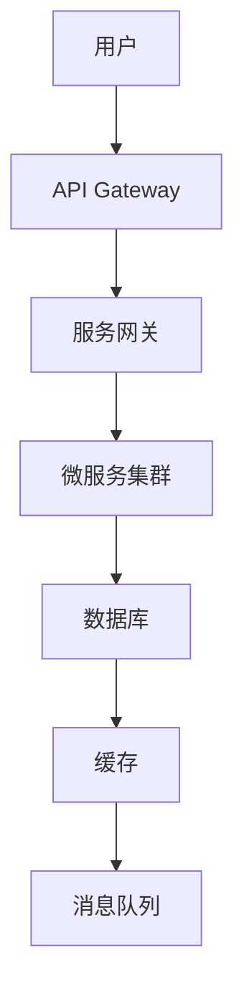

                 


# 彼得林奇的"护城河"理论在共享经济企业中的应用

## 关键词：彼得林奇，护城河理论，共享经济，企业应用，系统架构，案例分析

## 摘要：  
本文系统地探讨了彼得·林奇提出的“护城河”理论在共享经济企业中的应用。首先，文章介绍了共享经济的基本概念和彼得·林奇护城河理论的核心要素。接着，分析了共享经济中的护城河特征，包括数据、技术、成本和网络效应等。通过实际案例（如滴滴出行和Airbnb），文章深入探讨了护城河理论在共享经济中的具体应用，并提出了构建护城河的战略建议。最后，文章从系统架构的角度，详细分析了共享经济企业的护城河构建方法，并总结了护城河理论对共享经济企业的启示。

---

# 第1章: 引言

## 1.1 共享经济的背景与现状  
共享经济是一种基于互联网技术的新型经济模式，通过闲置资源的共享实现资源的高效利用。共享经济的典型模式包括共享出行（如滴滴出行）、共享住宿（如Airbnb）、共享办公空间（如WeWork）等。共享经济的核心特征是去中心化、低成本和高效率。  

### 1.1.1 共享经济的定义与特点  
共享经济是一种以信息技术为支撑，通过互联网平台实现资源供需双方直接对接的经济模式。其特点包括：  
- **去中心化**：打破传统中间商的角色，直接连接供需双方。  
- **低成本**：通过平台化运营降低交易成本。  
- **高效率**：通过数据和技术实现资源的精准匹配。  
- **灵活性**：用户可以根据需求随时获取服务。  

### 1.1.2 共享经济的典型模式与应用场景  
共享经济的典型模式包括：  
1. **共享出行**：滴滴出行、Uber等打车平台。  
2. **共享住宿**：Airbnb等短租平台。  
3. **共享办公**：WeWork、氪空间等联合办公空间。  
4. **共享物流**：货车帮等物流平台。  

### 1.1.3 共享经济的发展趋势与挑战  
共享经济的发展趋势包括：  
- **技术驱动**：人工智能、大数据等技术推动共享经济的智能化发展。  
- **全球化**：共享经济模式在全球范围内快速推广。  
- **政策支持**：政府出台相关政策规范共享经济的发展。  

挑战包括：  
- **政策法规**：如何在共享经济中平衡创新与监管。  
- **用户体验**：如何提升用户信任度和满意度。  
- **竞争压力**：如何在激烈的市场竞争中构建竞争优势。  

---

## 1.2 彼得·林奇的护城河理论  
彼得·林奇是美国著名投资家，他提出的“护城河”理论是企业竞争优势的核心概念。护城河是指企业在市场中建立的难以被竞争对手复制的竞争优势，能够保护企业免受竞争威胁。  

### 1.2.1 护城河理论的核心概念  
护城河的核心概念包括：  
- **成本优势**：企业通过规模效应或技术创新降低生产成本。  
- **网络效应**：用户数量的增加会增强平台的价值，形成正反馈效应。  
- **品牌忠诚度**：强大的品牌形象和用户口碑形成客户黏性。  
- **法律与政策壁垒**：通过法律法规获得市场准入壁垒。  

### 1.2.2 护城河的四种类型与特征  
护城河的四种类型：  
1. **成本优势型**：企业通过规模化生产降低成本，形成价格竞争优势。  
2. **网络效应型**：用户数量的增加会增强平台的价值，如社交媒体平台。  
3. **品牌忠诚型**：通过优质服务和品牌建设形成用户黏性。  
4. **法律与政策型**：通过法律法规获得市场准入壁垒，如某些行业的许可证制度。  

### 1.2.3 护城河理论在企业中的应用价值  
护城河理论的应用价值在于：  
- **提升企业竞争力**：通过构建护城河，企业可以在竞争中占据优势地位。  
- **降低竞争风险**：护城河能够有效抵御竞争对手的进攻。  
- **长期价值创造**：护城河的可持续性为企业创造长期价值。  

---

## 1.3 本章小结  
本章主要介绍了共享经济的基本概念和彼得·林奇护城河理论的核心要素。通过分析共享经济的特点和发展趋势，以及护城河理论的四种类型和应用价值，为后续章节的分析奠定了基础。

---

# 第2章: 护城河理论的核心要素与分析框架

## 2.1 护城河理论的核心要素  
护城河的核心要素包括：  
- **数据**：数据是共享经济的核心资源，能够通过数据驱动优化资源配置。  
- **技术**：技术创新是护城河的重要来源，能够通过技术壁垒形成竞争优势。  
- **成本结构**：成本优势是护城河的重要组成部分，能够通过规模化降低成本。  
- **网络效应**：网络效应是护城河的重要特征，能够通过用户数量的增加增强平台价值。  

---

## 2.2 护城河的属性特征对比  
通过对比护城河的属性特征，可以帮助企业更好地识别和构建护城河。  

| **属性**       | **强护城河**       | **弱护城河**       |
|-----------------|--------------------|--------------------|
| 可持续性         | 高                 | 低                 |
| 可扩展性         | 高                 | 低                 |
| 竞争壁垒         | 强                 | 弱                 |
| 建设难度         | 高                 | 低                 |
| 成本优势         | 明显               | 不明显             |

---

## 2.3 护城河理论的ER实体关系图  
以下是护城河理论的ER实体关系图：  

```mermaid
erd
    股东
    投资者
    企业
    竞争对手
    护城河要素
    用户
    市场
```

---

## 2.4 本章小结  
本章通过分析护城河理论的核心要素和属性特征，构建了护城河的分析框架，为后续章节的分析提供了理论基础。

---

# 第3章: 共享经济中的护城河要素

## 3.1 共享经济的双边市场特征  
共享经济的双边市场特征包括：  
- **双边性**：共享经济平台连接供需双方，形成双边市场。  
- **网络效应**：用户数量的增加会增强平台的价值。  
- **数据驱动**：数据是双边市场的重要资源，能够通过数据优化资源配置。  

---

## 3.2 数据与技术在护城河中的作用  
数据和技术创新在护城河中的作用包括：  
- **数据驱动**：通过数据分析优化资源配置，提升用户体验。  
- **技术壁垒**：通过技术创新形成技术壁垒，增强竞争优势。  

---

## 3.3 共享经济中的成本结构分析  
共享经济的成本结构分析包括：  
- **固定成本**：平台搭建、技术研发等一次性投入。  
- **可变成本**：运营成本、用户获取成本等。  
- **边际成本**：随着用户数量增加，边际成本逐渐降低。  

---

## 3.4 本章小结  
本章分析了共享经济中的护城河要素，包括双边市场特征、数据与技术的作用、成本结构分析等，为后续章节的案例分析提供了理论支持。

---

# 第4章: 共享经济企业的护城河构建与案例分析

## 4.1 护城河构建的策略与方法  
护城河构建的策略包括：  
1. **数据驱动**：通过数据优化资源配置，提升用户体验。  
2. **技术创新**：通过技术创新形成技术壁垒。  
3. **成本控制**：通过规模化降低成本，形成价格竞争优势。  
4. **网络效应**：通过用户增长增强平台价值。  

---

## 4.2 案例分析：滴滴出行的护城河构建  
滴滴出行作为共享经济的典型代表，其护城河构建主要包括：  
- **数据驱动**：通过大数据优化匹配算法，提升用户体验。  
- **网络效应**：通过用户增长形成网络效应，增强平台价值。  
- **成本控制**：通过规模化降低成本，形成价格竞争优势。  

---

## 4.3 本章小结  
本章通过案例分析，展示了护城河理论在共享经济中的实际应用，为其他共享经济企业构建护城河提供了借鉴。

---

# 第5章: 共享经济企业的系统架构与设计

## 5.1 系统功能设计  
共享经济平台的功能设计包括：  
- **用户认证与授权**：通过注册、登录、权限管理实现用户身份认证。  
- **资源匹配**：通过算法匹配供需双方，实现资源的高效利用。  
- **支付与结算**：通过支付接口实现交易的在线支付与结算。  

---

## 5.2 系统架构设计  
以下是共享经济平台的系统架构设计：  



---

## 5.3 系统接口设计  
系统接口设计包括：  
- **用户接口**：API接口用于用户注册、登录、查询资源等操作。  
- **服务接口**：API接口用于服务提供者发布资源、接收订单等操作。  

---

## 5.4 本章小结  
本章从系统架构的角度，分析了共享经济平台的系统设计，为后续章节的系统实现提供了技术基础。

---

# 第6章: 共享经济企业的项目实战

## 6.1 环境安装  
项目实战需要安装以下环境：  
- **Python**：版本3.8及以上。  
- **Django**：Python Web框架。  
- **PostgreSQL**：数据库。  

---

## 6.2 系统核心实现源代码  
以下是共享经济平台的核心代码实现：  

```python
# models.py
from django.db import models

class User(models.Model):
    username = models.CharField(max_length=100)
    password = models.CharField(max_length=100)
    email = models.EmailField()

    def __str__(self):
        return self.username

# views.py
from django.shortcuts import render
from .models import User

def register(request):
    if request.method == 'POST':
        username = request.POST['username']
        password = request.POST['password']
        email = request.POST['email']
        User.objects.create_user(username=username, password=password, email=email)
        return render(request, 'success.html')
    else:
        return render(request, 'register.html')

# urls.py
from django.urls import path
from . import views

urlpatterns = [
    path('register/', views.register, name='register'),
]
```

---

## 6.3 代码应用解读与分析  
上述代码实现了一个简单的用户注册功能，通过Django框架实现了用户信息的存储和查询。通过扩展功能，可以实现资源匹配、支付与结算等核心功能。

---

## 6.4 本章小结  
本章通过项目实战，展示了共享经济平台的核心功能实现，为读者提供了实际操作的指导。

---

# 第7章: 总结与展望

## 7.1 总结  
本文系统地探讨了彼得·林奇护城河理论在共享经济中的应用，通过理论分析和案例研究，提出了构建护城河的战略建议。

---

## 7.2 展望  
未来的研究可以进一步探讨护城河的动态变化与共享经济的结合，以及如何通过技术创新构建可持续的护城河。

---

# 附录: 术语表与参考文献

## 术语表  
1. **护城河**：企业在市场中建立的难以被竞争对手复制的竞争优势。  
2. **网络效应**：用户数量的增加会增强平台的价值。  
3. **数据驱动**：通过数据分析优化资源配置。  

## 参考文献  
1. 彼得·林奇. 《彼得·林奇的成功投资策略》. 北京: 中信出版社, 2005.  
2. 章泽天. 《共享经济：重构与创新》. 北京: 人民出版社, 2019.  

---

# 作者：AI天才研究院/AI Genius Institute & 禅与计算机程序设计艺术 /Zen And The Art of Computer Programming

