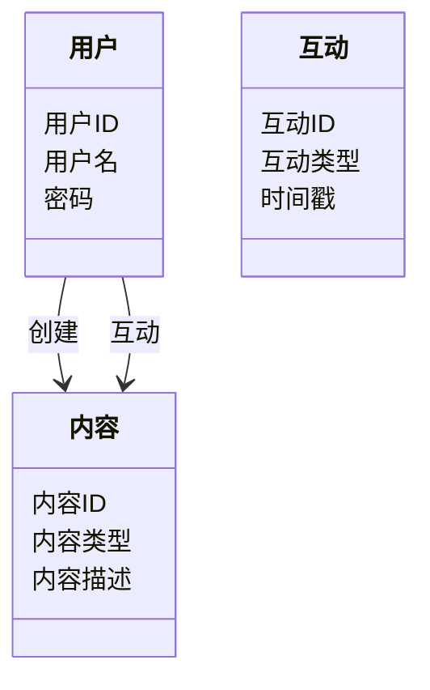
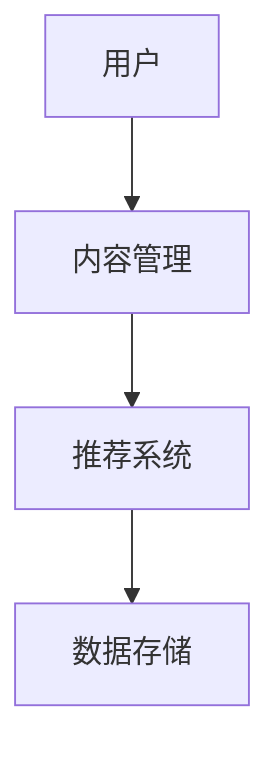

                 

# 彼得林奇的"护城河"理论在平台经济中的应用

## 关键词：  
彼得林奇，护城河理论，平台经济，用户粘性，数据壁垒，网络效应，系统架构  

## 摘要：  
本文探讨了彼得林奇的“护城河”理论在平台经济中的应用。通过分析护城河的核心要素，如用户粘性、数据壁垒、网络效应和成本优势，本文详细阐述了如何在平台经济中构建和强化护城河，以保持竞争优势。文章结合实际案例，通过系统架构设计和算法实现，展示了护城河理论在数字时代的实际应用价值。

---

## 第一部分：背景介绍

### 第1章：彼得林奇“护城河”理论的背景与核心概念

#### 1.1 护城河理论的定义与核心要素  
护城河理论是投资学中的重要概念，指公司拥有的竞争优势，能够保护其免受竞争对手的侵蚀。核心要素包括：  
1. **用户粘性**：用户对平台的依赖程度。  
2. **数据壁垒**：通过数据积累形成竞争优势。  
3. **网络效应**：用户数量的增加会增强平台的价值。  
4. **成本优势**：规模效应带来的边际成本降低。  

#### 1.2 护城河理论与平台经济的关系  
平台经济依赖于用户数量和用户粘性，因此护城河理论在其中尤为重要。通过构建用户粘性和数据壁垒，平台可以有效防止竞争对手的入侵。  

---

## 第二部分：核心概念与分类

### 第2章：护城河的核心要素与分类  

#### 2.1 护城河的核心要素  
- **用户粘性**：用户对平台的依赖性，例如社交媒体的用户粘性。  
- **数据壁垒**：通过数据积累形成的技术优势。  
- **网络效应**：用户数量增加带来的平台价值提升。  
- **成本优势**：规模效应带来的成本降低。  

#### 2.2 护城河的分类与对比  
通过对比分析表格，展示不同类型护城河的特征和优缺点：  

| 类型          | 特征               | 优缺点           |  
|---------------|--------------------|------------------|  
| 用户粘性       | 用户依赖平台         | 高粘性，但可能受替代品影响 |  
| 数据壁垒      | 数据驱动的技术优势   | 高壁垒，但依赖数据积累       |  
| 网络效应       | 用户数量决定价值     | 网络效应强，但可能受用户增长限制 |  
| 成本优势       | 规模效应降低成本       | 成本低，但可能受价格战影响     |  

---

## 第三部分：算法原理与数学模型

### 第3章：护城河评估的数学模型  

#### 3.1 用户增长模型  
用户增长模型用于评估平台的用户增长潜力。公式如下：  
$$ 用户增长速率 = (新用户数 - 用户流失数) / 平均用户数 $$  

#### 3.2 网络效应模型  
网络效应模型用于评估用户数量对平台价值的影响。公式如下：  
$$ 平台价值 = k \times 用户数量 + c $$  
其中，$k$ 是网络效应系数，$c$ 是常数项。  

#### 3.3 数据驱动的护城河评估公式  
数据驱动的护城河评估公式：  
$$ 护城河强度 = \frac{数据量 \times 网络效应}{用户流失率} $$  

### 第4章：护城河构建的算法原理  

#### 4.1 用户行为分析算法  
使用用户行为分析算法，识别用户的使用习惯和偏好，从而优化平台体验。  

#### 4.2 数据挖掘与预测算法  
通过数据挖掘技术，预测用户行为，优化平台的推荐系统。  

#### 4.3 网络效应的强化算法  
通过算法优化用户交互，增强网络效应。  

---

## 第四部分：系统分析与架构设计

### 第5章：平台经济中的护城河系统分析  

#### 5.1 问题场景介绍  
平台经济中的护城河构建需要考虑用户粘性、数据积累和网络效应。  

#### 5.2 系统功能设计  
设计一个社交平台的领域模型，展示用户、内容和互动的关系。  

#### 5.3 系统架构设计  
展示系统架构图，展示各个模块的交互关系。  

#### 5.4 系统接口设计  
设计系统接口，展示用户与平台的交互流程。  

#### 5.5 系统交互序列图  
展示用户登录、发布内容和互动的过程。  

---

## 第五部分：项目实战

### 第6章：护城河构建的项目实战  

#### 6.1 环境安装与代码实现  
安装必要的开发工具，编写核心代码实现护城河的构建。  

#### 6.2 核心代码实现与解读  
解读代码，展示如何通过算法和数据驱动构建护城河。  

#### 6.3 案例分析与经验总结  
通过社交平台案例，展示护城河构建的过程，并总结经验教训。  

---

## 第六部分：结论与展望

### 第7章：护城河理论在平台经济中的应用总结  

#### 7.1 全文总结  
总结护城河理论在平台经济中的重要性，强调用户粘性、数据壁垒和网络效应的作用。  

#### 7.2 未来研究方向  
提出未来的研究方向，如人工智能在护城河构建中的应用。  

#### 7.3 小结  
护城河理论是平台经济成功的关键，通过构建强大的护城河，企业可以在竞争中立于不败之地。  

---

## 结语：  
护城河理论在平台经济中的应用是一个复杂而深刻的话题。通过本文的分析，我们可以看到，护城河的构建不仅需要技术的支持，还需要对用户需求和市场趋势的深刻理解。未来，随着技术的不断进步，护城河理论在平台经济中的应用将更加广泛和深入。

---

## 作者：  
AI天才研究院/AI Genius Institute & 禅与计算机程序设计艺术 /Zen And The Art of Computer Programming

