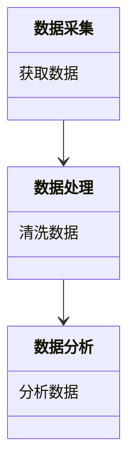
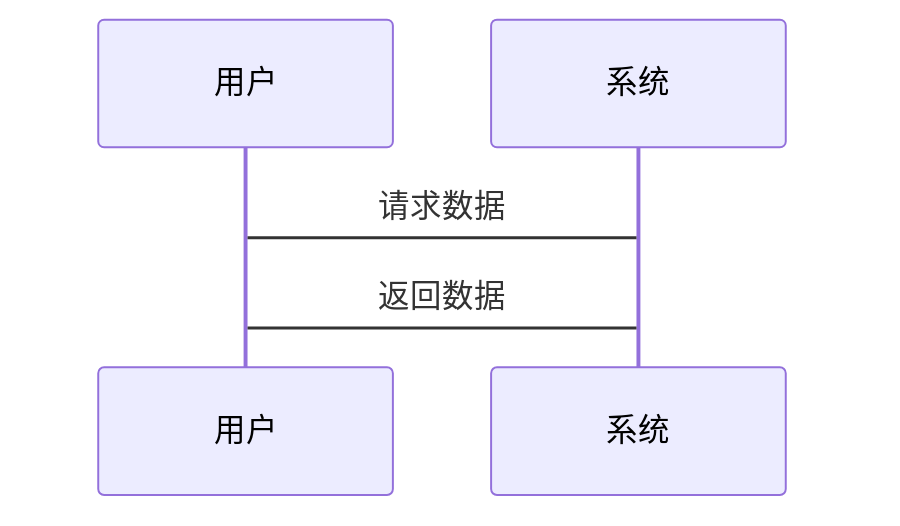

                 


# 彼得林奇的"护城河"理论在数字经济时代的演变

## 关键词：护城河理论，数字经济，彼得·林奇，竞争优势，数据资产

## 摘要：彼得·林奇的护城河理论强调企业通过建立竞争优势来保护自己的市场份额。在数字经济时代，护城河的构建发生了显著变化，数据和技术成为关键要素。本文探讨护城河理论在数字经济中的演变，分析其在数据驱动和技术创新环境下的新策略。

---

# 第一章：彼得·林奇“护城河”理论的背景与基础

## 1.1 护城河理论的定义与核心要素

### 1.1.1 护城河理论的定义

彼得·林奇的护城河理论源自《巴菲特的五个重要观点：投资》一书，核心在于识别具有持续竞争优势的企业，这些竞争优势能够长期保护企业免受竞争对手的侵蚀。护城河可以是成本优势、网络效应、品牌忠诚度等形式。

### 1.1.2 护城河的核心要素分析

1. **成本优势**：企业通过更低的生产成本或更高效的商业模式，形成价格优势。
2. **网络效应**：用户数量的增加会增强产品的价值，如社交媒体和平台型业务。
3. **品牌忠诚度**：强大的品牌认知度和客户忠诚度。
4. **技术壁垒**：拥有独特的技术或专利，防止竞争对手快速复制。

### 1.1.3 彼得·林奇对护城河理论的贡献

彼得·林奇将护城河理论系统化，强调通过识别护城河的宽度、深度和可持续性来选择投资标的。他的理论在投资界具有重要影响，尤其在寻找具有长期竞争优势的企业方面。

## 1.2 护城河理论的背景与演变

### 1.2.1 经济学视角下的护城河概念

护城河理论源于经济学中的可持续竞争优势概念，强调企业如何通过资源、能力和商业模式的差异，构建难以被竞争对手复制的优势。

### 1.2.2 彼得·林奇护城河理论的历史发展

彼得·林奇的理论基于巴菲特的投资理念，强调企业护城河的宽度和深度。随着时代的发展，护城河的内涵从传统的成本优势和品牌忠诚度扩展到数据和技术驱动的因素。

### 1.2.3 护城河理论在投资分析中的应用

投资者通过分析企业的护城河，评估其长期盈利能力。护城河越宽越深，企业的竞争优势越持久，投资价值越高。

## 1.3 护城河理论的数学模型与公式

### 1.3.1 护城河价值评估的数学模型

护城河价值 = 企业市场价值 - 可持续竞争优势的可替代价值

### 1.3.2 护城河宽度的量化公式

护城河宽度 = (市场份额 + 技术壁垒 + 品牌忠诚度) / 3

### 1.3.3 护城河可持续性的评估指标

可持续性指数 = (技术更新周期 + 市场反馈周期 + 企业研发投入) / 3

---

# 第二章：数字经济时代的特点与挑战

## 2.1 数字经济的定义与核心特征

### 2.1.1 数字经济的定义

数字经济是以数字技术为核心驱动力，以数据为关键生产要素的经济形态。

### 2.1.2 数字经济的核心特征

1. **数据驱动**：数据是核心生产要素。
2. **技术驱动**：依赖人工智能、大数据、云计算等技术。
3. **网络效应**：用户数量的增加提升平台价值。

### 2.1.3 数字经济与传统经济的对比

| 特性 | 传统经济 | 数字经济 |
|------|----------|----------|
| 生产要素 | 物资、劳动力 | 数据、技术 |
| 价值创造 | 线下交易 | 线上与线下融合 |
| 竞争优势 | 成本、品牌 | 数据、技术、网络效应 |

## 2.2 数字经济时代的企业竞争新特点

### 2.2.1 数据驱动的商业模式

企业通过收集和分析数据，优化产品和服务，提升用户体验。

### 2.2.2 技术创新驱动的竞争优势

技术创新是数字经济的核心竞争力，如人工智能和区块链技术的应用。

### 2.2.3 数字化转型对企业护城河的影响

企业需要通过数字化转型，构建新的护城河，以应对数据和技术驱动的竞争。

## 2.3 数字经济时代的护城河演变趋势

### 2.3.1 技术驱动的护城河建设

企业通过技术壁垒，如人工智能和区块链，构建难以复制的优势。

### 2.3.2 数据资产的护城河价值

数据成为核心资产，企业通过数据驱动的决策和创新，巩固护城河。

### 2.3.3 数字生态系统的构建

企业通过构建开放的数字生态系统，吸引多方参与者，形成协同效应。

---

# 第三章：数字经济时代护城河的关键要素分析

## 3.1 数据资产的护城河作用

### 3.1.1 数据资产的定义与分类

数据资产包括企业内部数据和外部数据，按类型可分为结构化数据、非结构化数据和半结构化数据。

### 3.1.2 数据资产在护城河中的价值

数据驱动决策优化、产品创新和市场洞察，提升企业竞争力。

### 3.1.3 数据资产的保护与管理

企业需要建立数据安全机制，防止数据泄露和滥用，同时优化数据治理体系。

## 3.2 技术创新的护城河构建

### 3.2.1 技术创新的定义与分类

技术创新包括产品创新、流程创新和管理创新，涵盖人工智能、大数据、区块链等领域。

### 3.2.2 技术创新在护城河中的作用

通过技术创新，企业可以提升效率、降低成本，并构建差异化竞争优势。

### 3.2.3 技术创新的实现路径

1. **研发投入**：加大研发力度，推动技术突破。
2. **合作创新**：与高校、研究机构合作，获取外部资源。
3. **持续改进**：建立创新机制，保持技术领先。

## 3.3 商业模式的护城河优化

### 3.3.1 商业模式的定义与分类

商业模式描述企业如何创造和传递价值，包括产品-市场、平台型和订阅制等模式。

### 3.3.2 数字经济时代商业模式的创新

通过数字化转型，企业可以采用新的商业模式，如订阅制和数据变现。

### 3.3.3 商业模式优化对护城河的影响

优化商业模式可以提升收入来源的多样性和稳定性，增强企业竞争力。

## 3.4 品牌价值的护城河意义

### 3.4.1 品牌价值的定义与分类

品牌价值是消费者对企业及其产品的认知和信任度，分为市场驱动和技术创新驱动两类。

### 3.4.2 品牌价值在护城河中的作用

强大的品牌价值可以提升客户忠诚度和市场影响力，降低竞争威胁。

### 3.4.3 品牌价值的提升策略

1. **品牌定位**：明确品牌定位，建立独特的品牌形象。
2. **用户体验**：通过优化用户体验，增强品牌忠诚度。
3. **营销策略**：利用数字营销手段，扩大品牌影响力。

---

# 第四章：数字经济时代护城河的经典案例分析

## 4.1 美国科技巨头的护城河构建

### 4.1.1 苹果公司的护城河案例

苹果通过技术创新（如iOS系统）和品牌忠诚度，构建强大的护城河。

### 4.1.2 微软公司的护城河案例

微软通过Azure云服务和生态系统合作，建立技术壁垒和网络效应。

### 4.1.3 谷歌公司的护城河案例

谷歌依靠搜索引擎技术和广告模式，巩固市场地位，形成强大的护城河。

---

# 第五章：数字经济时代护城河的系统架构与设计方案

## 5.1 系统功能设计

### 5.1.1 领域模型设计

使用Mermaid类图描述企业系统的功能模块，如数据采集、处理和分析模块。



### 5.1.2 系统架构设计

使用Mermaid架构图展示系统的分层结构，包括数据层、业务逻辑层和应用层。

```mermaid
git
    graph TD
        A[数据层] --> B[业务逻辑层]
        B --> C[应用层]
```

### 5.1.3 系统接口设计

定义系统接口，如API接口，用于数据采集和分析模块的交互。

### 5.1.4 系统交互设计

使用Mermaid序列图展示系统交互流程，如用户登录和数据查询。



## 5.2 项目实战

### 5.2.1 环境安装

安装必要的工具和库，如Python、Pandas、Matplotlib。

### 5.2.2 核心实现源代码

以下是数据处理和分析的Python代码示例：

```python
import pandas as pd
import numpy as np

# 数据采集
data = pd.read_csv('data.csv')

# 数据清洗
data.dropna(inplace=True)

# 数据分析
mean = data['销售额'].mean()
print(f'平均销售额为：{mean}')
```

### 5.2.3 代码应用解读与分析

该代码展示了数据采集、清洗和分析的基本流程，帮助企业构建数据驱动的护城河。

### 5.2.4 实际案例分析

以某电商平台为例，分析其如何通过数据和技术构建护城河。

---

# 第六章：总结与展望

## 6.1 总结

数字经济时代，护城河的构建需要考虑数据和技术因素，企业需通过数字化转型，建立可持续的竞争优势。

## 6.2 未来展望

随着技术的发展，护城河将更加依赖于数据和人工智能。企业需持续创新，以应对不断变化的市场环境。

---

作者：AI天才研究院/AI Genius Institute & 禅与计算机程序设计艺术/Zen And The Art of Computer Programming

