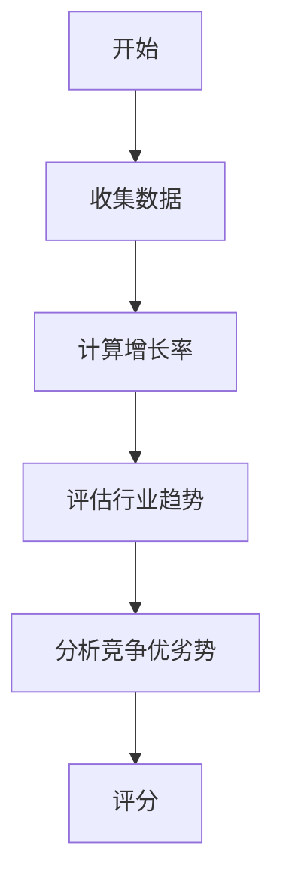
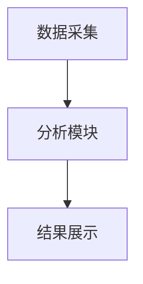

                 

# 彼得林奇的"未来增长潜力"分析法

---

## 关键词：
彼得林奇，增长潜力，投资分析，企业评估，财务指标

---

## 摘要：
彼得林奇是全球著名投资经理人，以其独特的“未来增长潜力”分析法闻名。本文将深入解析这一分析法的核心概念、数学模型、系统设计和实战案例，帮助读者掌握如何通过增长潜力评估企业投资价值。

---

## 第1章：彼得林奇投资理念与增长潜力分析概述

### 1.1 彼得林奇的生平与投资理念
彼得林奇是富达投资的传奇经理人，强调长期增长和基本面分析。他的成功在于对企业的深入研究和对市场趋势的精准判断。

### 1.2 增长潜力分析的重要性
增长潜力分析是评估企业未来表现的关键，通过分析财务指标和市场趋势，识别高增长潜力的企业。

---

## 第2章：增长潜力分析的核心概念与方法

### 2.1 增长潜力的核心指标
- **收入增长率**：衡量企业收入增长的速度。
- **利润率**：反映企业的盈利能力。
- **市场占有率**：显示企业在市场中的地位。

### 2.2 彼得林奇的增长潜力分析框架
包括企业基本面、行业趋势、竞争优势和管理层能力评估。

---

## 第3章：增长潜力分析的数学模型

### 3.1 增长率的计算公式
- **复合年均增长率（CAGR）**：
  $$CAGR = \frac{V_{final}}{V_{initial}}^{1/n} - 1$$
- **增长潜力评分模型**：
  $$Score = \alpha \times Growth + \beta \times Profitability + \gamma \times MarketPotential$$

### 3.2 增长潜力分析流程图

---

## 第4章：系统分析与架构设计

### 4.1 系统功能设计
- 数据采集模块：收集企业财务数据和行业趋势。
- 分析模块：计算增长率和评分模型。
- 结果展示模块：可视化报告生成。

### 4.2 系统架构图

---

## 第5章：项目实战：彼得林奇分析法的实现

### 5.1 环境安装与代码实现
- 使用Python编写数据分析代码，导入Pandas和Matplotlib库。

### 5.2 实战案例：苹果公司的分析
步骤包括数据收集、计算增长率、行业趋势分析和评分模型应用。

---

## 第6章：最佳实践与小结

### 6.1 小结
总结彼得林奇分析法的核心要点和实际应用。

### 6.2 注意事项
提醒读者注意数据质量、模型局限性和市场变化的影响。

### 6.3 拓展阅读
推荐相关书籍和资源，供读者深入学习。

---

## 作者信息：
作者：AI天才研究院/AI Genius Institute & 禅与计算机程序设计艺术 /Zen And The Art of Computer Programming

---

通过以上结构，文章详细解析了彼得林奇的增长潜力分析法，从理论到实践，帮助读者掌握投资分析的核心方法。

