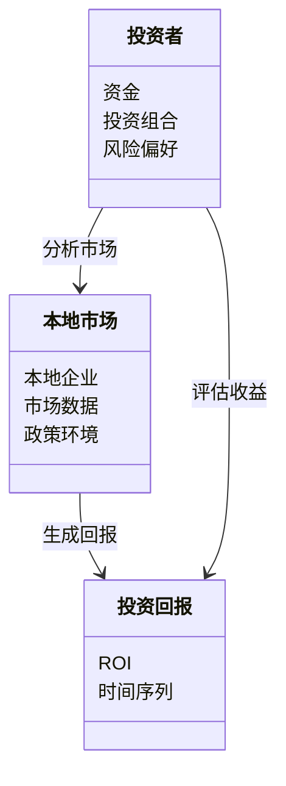

                 


# 彼得林奇的"本地优势"投资理念

> 关键词：彼得林奇，本地优势，投资理念，投资策略，风险管理，系统架构，算法原理

> 摘要：本文深入探讨了彼得林奇的“本地优势”投资理念，从背景介绍到核心概念，再到算法原理和系统架构，最后通过项目实战和总结，全面解析了这一理念在投资实践中的应用。文章结构清晰，内容详实，旨在帮助投资者更好地理解和应用本地优势投资策略。

---

## 第一部分：投资理念概述

### 第1章：投资的基本概念

#### 1.1 投资的基本定义

投资是将资金投入到各种资产中，以期获得未来收益的行为。投资的对象包括股票、债券、房地产等多种形式。投资的基本原则包括分散投资、长期持有的策略，以及对市场风险的合理规避。

#### 1.2 投资市场的基本构成

投资市场由投资者、发行人和中介服务机构组成。投资者是市场的主体，发行人通过发行股票、债券等融资工具获取资金，中介服务机构则提供交易、托管和信息等服务。

### 第2章：彼得林奇的投资理念概述

#### 2.1 彼得林奇的简介

彼得·林奇（Peter Lynch）是美国著名的投资专家，曾担任富达投资管理公司的基金经理。他以长期的优异业绩闻名，倡导价值投资和深入研究企业的投资策略。

#### 2.2 本地优势投资理念的定义

本地优势是指投资者在熟悉的本地市场中寻找投资机会，利用对本地市场的深入了解和竞争优势，实现投资回报最大化。与全球化投资相比，本地优势更加注重区域市场的独特性和可操作性。

---

## 第二部分：本地优势投资理念的核心概念

### 第3章：本地优势的背景与问题背景

#### 3.1 本地优势的背景介绍

在全球化背景下，本地市场的重要性日益凸显。本地市场的竞争优势体现在对市场环境的深刻理解、区域经济的特殊性以及对本地企业的熟悉程度。投资者通过本地优势可以降低信息不对称和市场进入壁垒，抓住区域市场的投资机会。

#### 3.2 本地优势的核心思想

本地优势的核心思想在于利用本地市场的独特优势，如本地企业的竞争优势、区域经济的发展趋势以及政策环境的支持。通过深入分析本地市场的特点，投资者可以制定更有针对性的投资策略。

### 第4章：本地优势的核心概念与联系

#### 4.1 核心概念原理

本地优势的核心概念包括本地市场的竞争优势、本地企业的核心竞争力以及本地市场的风险与机会。通过分析这些核心要素，投资者可以更好地识别投资机会，优化投资组合。

#### 4.2 核心概念属性对比表格

| 属性                | 本地市场                | 全球市场                |
|---------------------|-------------------------|-------------------------|
| 市场环境             | 熟悉                   | 陌生                   |
| 信息获取             | 便捷                   | 困难                   |
| 投资机会             | 丰富                   | 较少                   |
| 风险程度             | 较低                   | 较高                   |
| 投资回报             | 可观                   | 不稳定                 |

#### 4.3 ER实体关系图

```mermaid
er
    title 本地优势投资理念的ER图

    Market
    ----> [本地市场] Competitiveness
    Competitiveness
    ----> [本地企业] CoreCompetence
    Competitiveness
    ----> [投资回报] ReturnOnInvestment
```

---

## 第三部分：本地优势投资理念的算法原理

### 第5章：投资分析的数学模型

#### 5.1 投资分析的基本模型

投资回报率（ROI）计算公式：
$$ ROI = \frac{净收益}{初始投资} \times 100\% $$

风险与收益的关系模型：
$$ E(R_i) = R_f + \beta_i (R_m - R_f) $$

其中，$E(R_i)$ 是资产 $i$ 的预期回报率，$R_f$ 是无风险利率，$\beta_i$ 是资产的贝塔系数，$R_m$ 是市场预期回报率。

### 第6章：投资组合优化的算法

#### 6.1 投资组合优化的基本原理

投资组合优化的目标是最大化投资回报率，同时最小化风险。优化过程需要考虑资产的权重分配、风险偏好和市场波动性。

优化算法步骤：
1. 确定可选资产及其预期回报率和风险。
2. 构建优化模型，设定目标函数和约束条件。
3. 使用优化算法（如均值-方差优化）求解最优组合。
4. 动态调整组合以应对市场变化。

---

## 第四部分：本地优势投资理念的系统分析与架构设计

### 第7章：投资系统分析

#### 7.1 问题场景介绍

本地优势投资系统需要解决的问题包括：如何利用本地市场信息优化投资组合、如何实时监控市场变化、如何评估投资风险等。

#### 7.2 领域模型设计



---

## 第五部分：项目实战

### 第8章：本地优势投资策略的实现

#### 8.1 环境安装

安装Python和必要的库：
```bash
pip install numpy pandas matplotlib
```

#### 8.2 核心实现代码

```python
import numpy as np
import pandas as pd

def calculate_return(prices):
    return prices.pct_change().cumsum()

def portfolio_optimization(returns, weights):
    covariance_matrix = returns.cov()
    returns_expected = returns.dot(weights)
    risk = np.sqrt(weights.T.dot(covariance_matrix).dot(weights))
    return returns_expected, risk

# 示例数据
prices = pd.DataFrame({'stock1': [100, 105, 110], 'stock2': [80, 85, 90]})
returns = calculate_return(prices)
weights = np.array([0.5, 0.5])
returns_expected, risk = portfolio_optimization(returns, weights)
print(f"预期回报: {returns_expected:.2f}%，风险: {risk:.2f}")
```

#### 8.3 案例分析

以某本地企业为例，分析其财务数据、市场地位和竞争优势，制定投资策略。通过代码实现投资组合的优化，评估本地优势对投资回报的影响。

---

## 第六部分：总结与最佳实践

### 第9章：总结

彼得林奇的本地优势投资理念强调了对本地市场的深入理解，通过分析本地市场的竞争优势和企业核心竞争力，制定科学的投资策略。本文从背景、概念、算法、系统架构到项目实战，全面解析了这一理念的应用。

### 第10章：最佳实践

1. **投资建议**：投资者应深入研究本地市场，关注本地企业的竞争优势。
2. **风险管理**：建立完善的风险评估机制，合理配置资产。
3. **持续学习**：关注市场动态，及时调整投资策略。
4. **注意事项**：避免过度集中投资，分散风险。
5. **拓展阅读**：进一步学习彼得林奇的其他投资理念，如价值投资和成长投资。

---

## 作者

作者：AI天才研究院/AI Genius Institute & 禅与计算机程序设计艺术 /Zen And The Art of Computer Programming

---

通过本文的详细分析，读者可以全面理解彼得林奇的本地优势投资理念，并将其应用于实际投资中，提升投资收益。

