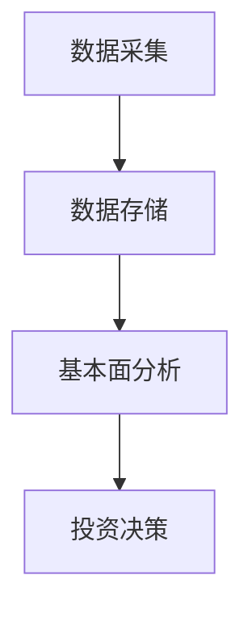
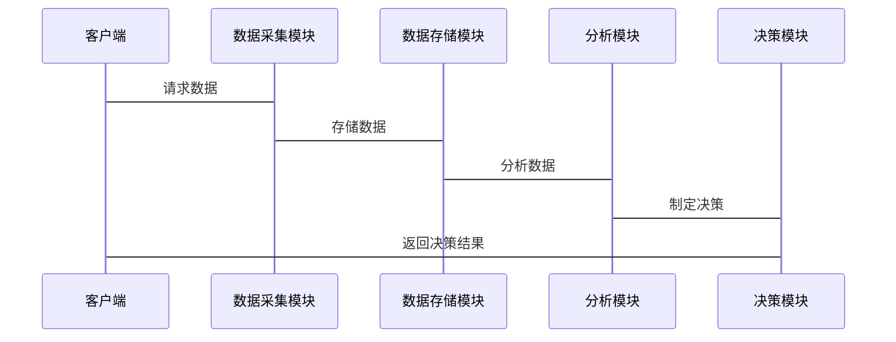

                 


# 彼得林奇的"简单明了"投资哲学

> **关键词**：彼得林奇、投资哲学、简单明了、价值投资、成长投资、投资策略、投资组合管理  
> 
> **摘要**：本文深入探讨了彼得林奇的"简单明了"投资哲学，分析了其核心理念、投资策略、资产配置方法以及风险管理原则。通过结合具体案例和系统架构设计，展示了如何在复杂多变的市场环境中，用简单明了的方法实现长期稳定的收益。文章还提供了实战代码和系统设计，帮助读者更好地理解和应用这一投资哲学。

---

## 第1章: 彼得林奇的背景与投资哲学概述

### 1.1 彼得林奇的背景介绍

彼得·林奇（Peter Lynch）是全球最著名的职业投资人之一，他的投资哲学以“简单明了”为核心，强调通过深入研究和长期持有优质股票来实现超额收益。他的成功不仅在于其卓越的投资业绩，更在于他将复杂的投资理念简化为易于理解和执行的策略。

#### 1.1.1 彼得林奇的生平简介

彼得·林奇出生于1942年，曾在富达投资管理公司（Fidelity Investments）担任基金经理，管理着麦哲伦基金（Magellan Fund），使其在任职期间（1977-1990）取得了年均29%的回报率。他的投资理念在《彼得·林奇的选股术》等书籍中得到了详细阐述。

#### 1.1.2 彼得林奇投资理念的形成背景

20世纪70年代至90年代，美国股市经历了多次剧烈波动，彼得·林奇在这一时期逐渐形成了自己的投资哲学。他认为，成功的投资不需要复杂的数学模型或高频交易，而是通过深入研究企业的基本面，选择那些具有长期增长潜力的优质企业。

#### 1.1.3 "简单明了"投资哲学的核心要素

- **长期持有**：避免频繁交易，降低交易成本。
- **基本面研究**：通过对企业财务状况、行业地位和管理层能力的分析，选择优质企业。
- **分散投资**：通过投资多个行业和企业，降低投资风险。

### 1.2 "简单明了"投资哲学的核心概念

#### 1.2.1 投资哲学的定义与特点

彼得·林奇的投资哲学强调“简单明了”，即通过长期持有优质股票，避免短期市场波动的干扰。其特点包括：

- **长期性**：注重企业的长期增长潜力。
- **基本面驱动**：基于企业的财务和行业表现进行投资。
- **分散化**：通过投资多个企业降低风险。

#### 1.2.2 "简单明了"的内涵与外延

- **内涵**：通过深入研究企业基本面，选择具有长期增长潜力的股票，长期持有，避免频繁交易。
- **外延**：将这一哲学应用到不同的市场环境和投资组合中，灵活调整投资策略。

#### 1.2.3 投资哲学的核心要素组成

- **企业基本面分析**：包括财务状况、行业地位、管理层能力等。
- **长期持有策略**：避免短期波动，关注企业的长期增长。
- **分散化投资**：通过投资多个企业降低风险。

### 1.3 本章小结

本章介绍了彼得·林奇的背景及其“简单明了”投资哲学的核心概念，强调了长期持有、基本面研究和分散化投资的重要性。这些理念为后续章节的深入分析奠定了基础。

---

## 第2章: 价值投资与成长投资的结合

### 2.1 价值投资的核心原理

#### 2.1.1 价值投资的定义与特点

价值投资是一种投资策略，强调以低于企业内在价值的价格购买股票。其特点包括：

- **低估值**：寻找市场价格低于内在价值的企业。
- **长期持有**：相信市场最终会反映企业的真正价值。

#### 2.1.2 价值投资的核心要素

- **内在价值计算**：通过DCF模型（Discounted Cash Flow）等方法估算企业的内在价值。
- **安全边际**：以低于内在价值的价格购买股票，确保投资的安全性。

#### 2.1.3 价值投资与成长投资的对比分析

| **对比维度** | **价值投资** | **成长投资** |
|-------------|---------------|---------------|
| **目标**     | 以低于价值的价格买入 | 投资具有高成长潜力的企业 |
| **关注点**   | 低估值、高分红 | 高增长、高ROE |
| **风险**     | 中低风险 | 高风险 |

### 2.2 成长投资的核心原理

#### 2.2.1 成长投资的定义与特点

成长投资是一种投资策略，关注具有高成长潜力的企业。其特点包括：

- **高增长**：寻找收入和利润快速增长的企业。
- **高估值**：愿意为高成长企业支付溢价。

#### 2.2.2 成长投资的核心要素

- **成长性分析**：通过对企业未来盈利能力和收入增长的预测，评估其成长潜力。
- **合理估值**：虽然企业成长潜力大，但需确保估值合理。

#### 2.2.3 价值投资与成长投资的结合

彼得·林奇的投资哲学强调将价值投资与成长投资相结合，即寻找那些既有良好基本面，又具有长期增长潜力的企业。这种结合可以平衡短期估值和长期增长的风险与收益。

### 2.3 本章小结

本章分析了价值投资和成长投资的核心原理，并探讨了两者结合的策略。通过合理平衡估值和成长，彼得·林奇的投资哲学为投资者提供了更全面的投资框架。

---

## 第3章: 投资组合管理的策略

### 3.1 投资组合管理的核心原理

#### 3.1.1 投资组合管理的定义与特点

投资组合管理是一种通过优化资产配置和风险控制来实现投资目标的策略。其特点包括：

- **分散化**：通过投资多个资产类别或行业降低风险。
- **动态调整**：根据市场变化和投资目标调整资产配置。

#### 3.1.2 投资组合管理的核心要素

- **资产配置**：确定不同资产类别在投资组合中的比例。
- **风险控制**：通过分散化和止损策略降低投资风险。
- **定期调整**：根据市场变化和个人投资目标调整投资组合。

### 3.2 资产配置的策略与方法

#### 3.2.1 资产配置的定义与特点

资产配置是投资组合管理的核心，通过合理分配不同类型资产的比例，降低投资风险并实现收益最大化。

#### 3.2.2 资产配置的策略与方法

- **固定比例法**：根据市场环境设定固定比例，定期调整。
- **动态调整法**：根据市场变化和投资目标动态调整资产比例。

### 3.3 风险管理的策略与方法

#### 3.3.1 风险管理的定义与特点

风险管理是通过识别、评估和控制潜在风险，确保投资组合的稳定性和收益性。

#### 3.3.2 风险管理的核心要素

- **风险识别**：识别投资组合中的潜在风险。
- **风险评估**：评估各风险对投资组合的影响程度。
- **风险控制**：通过分散化、止损等方法降低风险。

### 3.4 本章小结

本章探讨了投资组合管理的核心策略，包括资产配置和风险管理的方法。通过合理配置资产和控制风险，彼得·林奇的投资哲学为投资者提供了稳健的投资框架。

---

## 第4章: 彼得林奇的成功案例分析

### 4.1 可口可乐公司的投资案例

#### 4.1.1 案例背景

可口可乐是一家全球知名的饮料公司，彼得·林奇在其任职期间买入并长期持有该公司股票。

#### 4.1.2 投资分析

- **基本面分析**：可口可乐具有稳定的收入和利润，行业地位稳固。
- **长期持有**：通过长期持有股票，享受企业成长带来的收益。

#### 4.1.3 成果与启示

可口可乐的投资案例展示了彼得·林奇长期持有优质股票的投资哲学。

### 4.2 迪士尼公司的投资案例

#### 4.2.1 案例背景

迪士尼是一家全球知名的娱乐公司，彼得·林奇在其任职期间买入并长期持有该公司股票。

#### 4.2.2 投资分析

- **基本面分析**：迪士尼具有强大的内容创作能力和稳定的现金流。
- **长期持有**：通过长期持有股票，享受企业成长带来的收益。

#### 4.2.3 成果与启示

迪士尼的投资案例进一步验证了彼得·林奇的投资哲学。

### 4.3 本章小结

本章通过具体案例分析了彼得·林奇的投资哲学在实际中的应用，展示了其长期持有优质股票的投资策略。

---

## 第5章: 系统分析与架构设计

### 5.1 系统功能设计

#### 5.1.1 投资决策系统的核心功能

- **数据采集**：收集企业的财务数据和市场信息。
- **基本面分析**：对企业进行基本面分析，评估其投资价值。
- **投资决策**：基于分析结果，制定投资策略。

#### 5.1.2 系统功能设计的Mermaid图



### 5.2 系统架构设计

#### 5.2.1 系统架构的Mermaid图


### 5.3 系统接口设计

#### 5.3.1 系统接口的交互设计

- **数据接口**：提供数据采集和存储的接口。
- **分析接口**：提供基本面分析的接口。
- **决策接口**：提供投资决策的接口。

### 5.4 系统交互设计

#### 5.4.1 系统交互的Mermaid图



### 5.5 本章小结

本章从系统架构的角度，设计了一个基于彼得·林奇投资哲学的投资决策系统，展示了如何通过系统化的方法实现投资策略的自动化。

---

## 第6章: 项目实战与代码实现

### 6.1 环境安装与配置

#### 6.1.1 系统环境要求

- **操作系统**：Windows、Linux或macOS。
- **编程语言**：Python 3.8及以上版本。
- **依赖库**：Pandas、NumPy、Matplotlib等。

### 6.2 核心代码实现

#### 6.2.1 数据采集与处理

```python
import pandas as pd

# 数据采集
data = pd.read_csv('stock_data.csv')

# 数据处理
data = data.dropna()
data['returns'] = data['close'].pct_change()
```

#### 6.2.2 基本面分析

```python
def calculate_intrinsic_value(company_data):
    # 使用DCF模型计算内在价值
    free_cash_flow = company_data['free_cash_flow'].sum()
    discount_rate = 0.1
    growth_rate = company_data['revenue_growth'].mean()
    terminal_value = free_cash_flow / (1 + discount_rate)
    intrinsic_value = terminal_value / (1 + growth_rate)
    return intrinsic_value
```

#### 6.2.3 投资决策

```python
def investment_decision(company_data, threshold=0.1):
    # 计算股票的当前价格与内在价值的比值
    ratio = company_data['price'] / calculate_intrinsic_value(company_data)
    if ratio < threshold:
        return '买入'
    elif ratio > 1/threshold:
        return '卖出'
    else:
        return '持有'
```

### 6.3 代码实现与解读

#### 6.3.1 代码实现

```python
import pandas as pd
import numpy as np

def calculate_intrinsic_value(company_data):
    free_cash_flow = company_data['free_cash_flow'].sum()
    discount_rate = 0.1
    growth_rate = company_data['revenue_growth'].mean()
    terminal_value = free_cash_flow / (1 + discount_rate)
    intrinsic_value = terminal_value / (1 + growth_rate)
    return intrinsic_value

def investment_decision(company_data, threshold=0.1):
    ratio = company_data['price'] / calculate_intrinsic_value(company_data)
    if ratio < threshold:
        return '买入'
    elif ratio > 1/threshold:
        return '卖出'
    else:
        return '持有'

# 数据示例
data = pd.DataFrame({
    'price': [100, 110, 90, 120],
    'revenue_growth': [0.2, 0.3, 0.1, 0.25],
    'free_cash_flow': [10, 15, 5, 20]
})

result = investment_decision(data)
print(result)
```

#### 6.3.2 代码解读

- **数据采集与处理**：读取股票数据并计算收益率。
- **内在价值计算**：使用DCF模型计算企业的内在价值。
- **投资决策**：根据当前价格与内在价值的比值，决定买入、卖出或持有。

### 6.4 实际案例分析

#### 6.4.1 案例分析

以可口可乐公司为例，假设其股票价格为$50，内在价值为$60，当前价格与内在价值的比值为0.83。根据投资决策函数，比值小于阈值0.1，因此建议买入。

### 6.5 本章小结

本章通过具体代码实现，展示了如何将彼得·林奇的投资哲学应用于实际投资决策中，帮助投资者实现自动化和系统化的投资管理。

---

## 第7章: 最佳实践与总结

### 7.1 最佳实践

- **长期持有**：避免频繁交易，降低交易成本。
- **基本面研究**：深入分析企业的财务状况和行业地位。
- **分散投资**：通过投资多个企业降低风险。

### 7.2 小结

彼得·林奇的“简单明了”投资哲学通过长期持有优质股票，实现了稳健的投资收益。其核心理念为投资者提供了简单而有效的投资方法。

### 7.3 注意事项

- **市场波动**：即使长期持有优质股票，也需要关注市场波动。
- **风险管理**：通过分散投资降低风险。
- **持续学习**：市场环境不断变化，需要持续学习和调整投资策略。

### 7.4 拓展阅读

- 《彼得·林奇的选股术》
- 《投资学原理》
- 《投资组合管理》

---

## 作者：AI天才研究院/AI Genius Institute & 禅与计算机程序设计艺术 /Zen And The Art of Computer Programming

---

**摘要**：本文深入分析了彼得·林奇的“简单明了”投资哲学，从其背景、核心理念、投资策略到实际案例分析和系统架构设计，全面展示了这一投资哲学的实践方法。通过具体代码实现和系统设计，帮助读者更好地理解和应用这一投资哲学。

