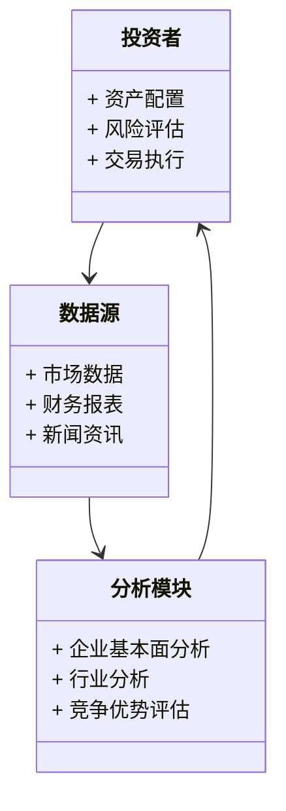

                 

# 彼得林奇的"简单明了"投资哲学解读

> 关键词：彼得林奇，投资哲学，简单明了，长期投资，价值投资，风险管理

> 摘要：本文深入解读了彼得林奇的"简单明了"投资哲学，从其核心理念、选股标准、风险管理策略到实际案例分析，全面剖析了这一投资哲学的精髓。通过详细阐述其方法论，本文为投资者提供了实用的指导，帮助他们在复杂多变的市场中做出明智的投资决策。

---

## 第一部分: 引言

### 1. 彼得林奇与他的投资哲学概述

#### 1.1 彼得林奇的生平简介
彼得·林奇（Peter Lynch）是美国著名的职业基金经理，被誉为“最伟大的基金经理”之一。他在富达投资管理公司（Fidelity Investments）管理麦哲伦基金（Magellan Fund）期间，创造了辉煌的投资业绩，使该基金在十几年间从1.3亿美元增长到140亿美元，年平均回报率达到29%。林奇的投资风格以长期投资、价值投资和深入研究为基础，强调选择那些具有持续增长潜力的公司。

#### 1.2 "简单明了"投资哲学的核心理念
彼得林奇的投资哲学以“简单明了”为特点，主张通过深入研究和分析公司基本面，选择那些具有竞争优势、管理层稳健、财务健康且估值合理的企业。他反对短期投机和复杂的投资策略，提倡投资者应以长期视角看待投资，避免被市场波动和短期趋势所干扰。

#### 1.3 本文的目的与结构安排
本文旨在深入解读彼得林奇的“简单明了”投资哲学，分析其核心思想、选股标准、风险管理策略，并结合实际案例，探讨其投资哲学在现代投资实践中的应用价值。文章分为以下几个部分：核心概念、数学模型、系统架构、项目实战等，结构清晰，内容详实。

---

## 第二部分: 投资的基础知识

### 2. 投资的基本概念与原理

#### 2.1 股票投资的基本概念
股票是企业的一部分所有权，投资者通过购买股票成为公司的股东，分享公司利润并承担相应的风险。股票市场的价格波动受多种因素影响，包括宏观经济环境、公司业绩、市场情绪等。

#### 2.2 彼得林奇的投资理念
林奇的投资理念可以概括为“买入并持有”，即通过选择优质企业长期持有，而非频繁交易。他认为，短期市场波动无法预测，但通过深入研究企业基本面，可以找到那些具有持续增长潜力的公司，从而实现长期收益。

#### 2.3 投资决策的基本原则
投资决策应基于对企业基本面的深入分析，包括财务报表、行业地位、管理层能力等因素。同时，投资者应注重风险控制，避免过度集中投资或承担过高风险。

---

## 第三部分: 核心概念与联系

### 3. 核心概念的分析

#### 3.1 企业基本面分析
企业基本面分析是彼得林奇选股的核心方法。他关注公司的财务状况、盈利能力、成长潜力以及行业地位。以下是关键指标的对比分析：

| 指标 | 定义 | 重要性 |
|------|------|--------|
| 净利润 | 公司在一定时期内实现的净收益 | 反映公司盈利能力 |
| 营业收入增长率 | 营业收入的年增长率 | 衡量公司成长潜力 |
| 市盈率（P/E） | 每股价格与每股收益的比率 | 评估股票估值是否合理 |

#### 3.2 行业分析与竞争优势
彼得林奇认为，选择行业龙头股是降低风险的有效方式。以下是一个简单的行业分析框架：

---

## 第四部分: 数学模型与算法原理

### 4. 投资组合优化的数学模型

#### 4.1 马科维茨投资组合理论
马科维茨（Harry Markowitz）的投资组合理论为现代投资组合理论奠定了基础。他提出，通过优化资产配置可以实现收益最大化和风险最小化。

#### 4.2 投资组合优化公式
投资组合的期望收益和风险可以通过以下公式计算：

$$
E(R_p) = \sum_{i=1}^{n} w_i E(R_i)
$$

$$
\sigma_p^2 = \sum_{i=1}^{n} \sum_{j=1}^{n} w_i w_j \sigma_i \sigma_j \rho_{ij}
$$

其中，\( w_i \) 是资产 \( i \) 的权重，\( E(R_i) \) 是资产 \( i \) 的期望收益，\( \sigma_i \) 是资产 \( i \) 的标准差，\( \rho_{ij} \) 是资产 \( i \) 和资产 \( j \) 的相关系数。

---

## 第五部分: 系统分析与架构设计

### 5. 投资决策系统的架构设计

#### 5.1 系统功能设计
以下是投资决策系统的功能模块图：

---

## 第六部分: 项目实战

### 6. 实战案例分析

#### 6.1 案例背景
以彼得林奇投资的可口可乐公司为例，分析他的投资逻辑。

#### 6.2 数据分析
以下是可口可乐公司部分财务数据的对比：

| 年份 | 营业收入（亿美元） | 净利润（亿美元） | 市盈率 |
|------|---------------------|------------------|--------|
| 2010 | 48,545              | 7,766            | 18.5   |
| 2011 | 48,968              | 7,935            | 18.2   |
| 2012 | 49,526              | 8,119            | 17.9   |

---

## 第七部分: 最佳实践与小结

### 7. 最佳实践 tips
- **长期持有**：避免频繁交易，降低交易成本和税收。
- **深入研究**：对公司基本面进行详细分析，避免盲目跟风。
- **分散投资**：通过投资多个行业和公司分散风险。

### 8. 小结
彼得林奇的“简单明了”投资哲学强调长期投资和价值投资，通过深入研究和分析企业基本面，选择优质企业进行投资。这种哲学在当今市场环境中仍然具有重要的指导意义。

### 9. 注意事项
- **市场波动**：短期市场波动可能影响股价，但长期趋势更应关注。
- **经济周期**：经济周期的变化会影响企业业绩，需谨慎应对。

### 10. 拓展阅读
- 《彼得林奇选股之道》
- 《投资最重要的少数事》

---

# 作者：AI天才研究院/AI Genius Institute & 禅与计算机程序设计艺术 /Zen And The Art of Computer Programming

