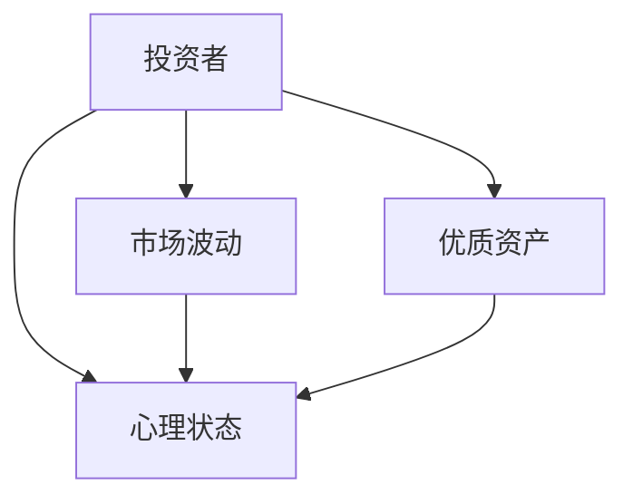

                 

# 彼得林奇的"耐心投资"在市场波动中的心理建设

> 关键词：耐心投资，市场波动，心理建设，彼得林奇，投资策略，风险管理，长期投资，心理韧性，价值投资，投资心理

> 摘要：本文探讨了彼得林奇的耐心投资理念在市场波动中的心理建设。通过分析市场波动对投资者心理的影响，结合彼得林奇的投资哲学，提出如何通过心理调节和策略选择来应对市场波动，保持长期投资的纪律性。文章详细介绍了耐心投资的核心理念、市场波动中的心理偏差、心理建设的具体方法，并通过实际案例和系统设计，帮助投资者在市场波动中实现心理稳定和投资成功。

---

# 第1章: 市场波动与耐心投资的背景

## 1.1 市场波动的定义与特征
### 1.1.1 市场波动的定义
市场波动指的是股票、基金等金融资产价格在短时间内频繁变化的现象。它通常由市场参与者的买卖行为、市场信息、宏观经济因素等多重因素引起。

### 1.1.2 市场波动的主要特征
- **短期性**：市场波动通常发生在较短的时间内，如几分钟、几小时或几天。
- **不可预测性**：尽管有技术分析和基本面分析，但市场波动往往具有不可预测性。
- **情绪驱动性**：市场波动常常受到投资者情绪的影响，如贪婪和恐惧。

### 1.1.3 市场波动对投资者的影响
- **情绪影响**：市场波动容易引发投资者的焦虑和恐慌。
- **决策偏差**：波动的市场可能导致投资者做出非理性的决策，如盲目追涨或恐慌抛售。
- **投资结果**：短期波动虽然会影响资产价格，但长期来看，优质资产的价值会逐渐显现。

## 1.2 耐心投资的定义与特点
### 1.2.1 耐心投资的定义
耐心投资是一种长期投资策略，强调在较长的时间内持有优质资产，避免频繁交易和短期波动的干扰。

### 1.2.2 耐心投资的核心特点
- **长期性**：耐心投资关注资产的长期价值，而非短期价格波动。
- **稳定性**：投资者在波动的市场中保持冷静，不被短期波动影响决策。
- **选择优质资产**：耐心投资注重选择具有持续竞争优势和良好财务状况的企业。

### 1.2.3 耐心投资与短期投资的区别
| 方面       | 耐心投资                         | 短期投资                         |
|------------|----------------------------------|----------------------------------|
| 时间跨度   | 长期（数年甚至更长）              | 短期（数月、数周甚至几天）        |
| 投资目标   | 资产的长期增值                   | 资产的短期价格波动               |
| 决策方式   | 基于企业的基本面分析             | 基于技术分析和市场情绪           |
| 风险承受   | 耐心较强，能够承受短期波动       | 风险承受较低，容易受波动影响     |

## 1.3 彼得林奇与耐心投资理念
### 1.3.1 彼得林奇的生平简介
彼得·林奇（Peter Lynch）是美国著名的职业基金经理人，曾管理富达麦哲伦基金，创造了长期优异的投资业绩。

### 1.3.2 彼得林奇的投资哲学
- **价值投资**：林奇强调购买具有强大竞争优势和良好财务状况的企业股票。
- **长期持有**：他主张长期持有优质股票，避免频繁交易。
- **分散投资**：通过分散投资降低风险，同时关注企业的基本面。

### 1.3.3 彼得林奇对耐心投资的贡献
林奇通过长期持有优质资产和分散投资策略，证明了耐心投资能够在长期为投资者带来稳定收益。

## 1.4 本章小结
本章介绍了市场波动的定义、特征及其对投资者的影响，详细阐述了耐心投资的核心理念和特点，并结合彼得林奇的投资哲学，强调了耐心投资在市场波动中的重要性。

---

# 第2章: 市场波动中的投资者心理分析

## 2.1 投资者心理与市场波动的关系
### 2.1.1 投资者心理的定义
投资者心理是指投资者在面对市场波动时的心理状态和决策过程。

### 2.1.2 市场波动对投资者心理的影响
- **情绪波动**：市场波动容易引发投资者的贪婪和恐惧情绪。
- **决策偏差**：波动的市场可能导致投资者出现过度自信、从众心理等偏差。

### 2.1.3 不同类型投资者的心理特征
- **保守型投资者**：倾向于规避风险，波动的市场容易引发其恐慌情绪。
- **激进型投资者**：喜欢追求高收益，容易在波动的市场中追涨杀跌。

## 2.2 市场波动中的常见心理偏差
### 2.2.1 过度自信偏差
投资者可能过度自信于自己的分析能力，忽视市场的不确定性。

### 2.2.2 损失厌恶偏差
投资者对损失的厌恶程度高于对收益的追求，容易在亏损时做出非理性决策。

### 2.2.3 追涨杀跌偏差
投资者容易跟随市场趋势，盲目追涨或恐慌抛售，忽视基本面分析。

## 2.3 心理因素对投资决策的影响
### 2.3.1 情绪化决策的危害
情绪化决策可能导致投资者错失长期投资机会或在市场低点卖出优质资产。

### 2.3.2 理性决策的重要性
理性决策能够帮助投资者在市场波动中保持冷静，做出正确的投资决策。

### 2.3.3 心理调节在投资中的作用
通过心理调节，投资者可以更好地控制情绪，避免决策偏差。

## 2.4 本章小结
本章分析了市场波动对投资者心理的影响，探讨了常见心理偏差及其对投资决策的影响，强调了心理调节在投资中的重要性。

---

# 第3章: 耐心投资的核心理念与策略

## 3.1 耐心投资的核心理念
### 3.1.1 长期投资的重要性
长期投资能够平滑市场波动的影响，让优质资产的价值逐渐显现。

### 3.1.2 价值投资的内涵
价值投资强调购买具有合理估值和强大竞争优势的企业股票。

### 3.1.3 耐心与纪律的结合
耐心投资需要投资者具备长期持有的耐心和严格执行投资纪律。

## 3.2 耐心投资的具体策略
### 3.2.1 选择优质企业的标准
- **行业地位**：选择行业龙头或具有竞争优势的企业。
- **财务状况**：关注企业的盈利能力、资产负债情况等。
- **管理团队**：选择管理团队稳定且有能力的企业。

### 3.2.2 长期持有优质股票的策略
- **分散投资**：通过投资不同行业的优质企业分散风险。
- **定期审视**：定期检查投资组合，调整不合理投资。

### 3.2.3 分批投资与风险分散
- **定额定投**：通过定期定额投资分散资金投入，降低市场波动的影响。
- **风险分散**：通过投资不同类型的资产降低风险。

## 3.3 彼得林奇的选股方法
### 3.3.1 企业基本面分析
- **收入与利润**：关注企业的收入增长和利润水平。
- **资产负债表**：分析企业的资产、负债和所有者权益情况。
- **现金流**：关注企业的现金流状况，确保企业具备健康的现金流。

### 3.3.2 企业竞争优势分析
- **核心竞争力**：分析企业在行业中的竞争优势，如技术、品牌、成本等。
- **市场地位**：关注企业在市场中的地位，如是否是行业龙头。

### 3.3.3 企业财务状况评估
- **盈利能力**：分析企业的净利率、毛利率等指标。
- **负债情况**：关注企业的债务水平和偿债能力。

## 3.4 本章小结
本章详细阐述了耐心投资的核心理念和具体策略，结合彼得林奇的选股方法，为投资者提供了选择优质资产和长期持有的指导。

---

# 第4章: 市场波动中的心理建设方法

## 4.1 心理建设的目标与意义
### 4.1.1 心理建设的目标
- **保持冷静**：在市场波动中保持冷静，避免情绪化决策。
- **增强信心**：增强投资者对长期投资的信心。
- **控制风险**：通过心理建设降低情绪波动对投资决策的影响。

### 4.1.2 心理建设在投资中的意义
- **提高决策质量**：心理建设能够帮助投资者做出理性的投资决策。
- **降低投资风险**：通过心理调节，投资者能够更好地控制风险。

## 4.2 市场波动中的情绪管理
### 4.2.1 情绪管理的基本原则
- **接受波动**：认识到市场波动是正常的市场现象，避免过度恐慌。
- **制定计划**：制定明确的投资计划，避免随波逐流。
- **定期反思**：定期反思自己的投资行为，分析情绪波动的原因。

### 4.2.2 情绪管理的具体方法
- **记录投资日记**：通过记录投资过程中的情绪变化，分析自己的心理状态。
- **设定止损点**：在投资计划中设定合理的止损点，避免重大损失。
- **分散注意力**：在市场波动时，避免过度关注市场动态，分散注意力。

## 4.3 心理韧性与投资纪律
### 4.3.1 心理韧性的重要性
- **应对市场波动**：心理韧性能够帮助投资者在市场波动中保持冷静。
- **坚持投资纪律**：心理韧性是坚持长期投资策略的重要保障。

### 4.3.2 投资纪律的具体表现
- **避免频繁交易**：坚持长期持有的投资策略，避免频繁买卖。
- **严格执行计划**：在市场波动中，严格执行预先制定的投资计划。

## 4.4 本章小结
本章探讨了市场波动中的心理建设方法，强调了情绪管理、心理韧性和投资纪律在长期投资中的重要性。

---

# 第5章: 耐心投资的系统分析与架构设计

## 5.1 问题场景介绍
### 5.1.1 市场波动对企业价值的影响
- **短期波动**：短期波动可能会影响企业的市场估值。
- **长期价值**：优质企业的长期价值能够抵御短期波动的影响。

## 5.2 系统功能设计
### 5.2.1 领域模型
- **核心要素**：投资者、市场波动、优质资产、心理状态。
- **关系**：投资者通过选择优质资产应对市场波动，保持心理稳定。

## 5.3 系统架构设计
### 5.3.1 系统架构图

## 5.4 系统接口设计
- **输入接口**：投资者的心理状态、市场波动数据、优质资产信息。
- **输出接口**：投资策略建议、心理调节方法。

## 5.5 系统交互设计
### 5.5.1 交互流程
1. 投资者输入市场波动数据和优质资产信息。
2. 系统分析市场波动对心理状态的影响。
3. 系统根据心理状态和资产信息，提供投资策略建议。
4. 投资者根据系统建议调整投资行为，保持心理稳定。

## 5.6 本章小结
本章通过系统分析和架构设计，为投资者提供了一个应对市场波动的心理-投资模型，帮助投资者在波动的市场中保持心理稳定，实现长期投资目标。

---

# 第6章: 项目实战——模拟投资实验

## 6.1 实验设计
### 6.1.1 实验目标
通过模拟投资实验，验证耐心投资策略在市场波动中的有效性。

### 6.1.2 实验步骤
1. 确定投资组合：选择优质资产，制定投资计划。
2. 模拟市场波动：设计模拟市场波动的场景。
3. 实验执行：在不同波动场景下执行投资策略。
4. 数据收集与分析：记录投资结果，分析波动对投资的影响。

## 6.2 数据收集与分析
### 6.2.1 实验数据
- **投资组合表现**：不同波动场景下的投资回报率。
- **心理状态记录**：投资者在波动中的情绪变化和决策过程。

## 6.3 实验结果与讨论
### 6.3.1 实验结果
- **长期投资的有效性**：长期持有优质资产能够在波动中实现稳定收益。
- **心理状态的影响**：投资者的心理状态对投资决策和结果有重要影响。

### 6.3.2 讨论
- **耐心投资的优势**：长期持有优质资产能够在波动中实现稳定收益。
- **心理建设的重要性**：心理建设能够帮助投资者在波动中保持冷静，避免情绪化决策。

## 6.4 本章小结
本章通过模拟投资实验，验证了耐心投资策略在市场波动中的有效性，强调了心理建设在投资中的重要性。

---

# 第7章: 最佳实践与小结

## 7.1 最佳实践
### 7.1.1 长期投资的纪律性
- **制定计划**：制定明确的投资计划，避免随波逐流。
- **严格执行**：在市场波动中，严格执行预先制定的投资计划。

### 7.1.2 情绪管理的重要性
- **保持冷静**：在市场波动中保持冷静，避免情绪化决策。
- **定期反思**：定期反思自己的投资行为，分析情绪波动的原因。

### 7.1.3 持续学习与自我提升
- **学习投资知识**：通过学习投资知识，提高自己的投资能力。
- **关注市场动态**：关注市场动态，了解经济形势和行业趋势。

## 7.2 小结
本文通过分析市场波动对投资者心理的影响，结合彼得林奇的耐心投资理念，提出了一套应对市场波动的心理建设方法。通过系统分析和项目实战，验证了耐心投资策略的有效性，并为投资者提供了心理调节和投资决策的具体指导。

## 7.3 注意事项
- **风险提示**：投资有风险，投资者需根据自身情况制定投资计划。
- **持续学习**：市场环境不断变化，投资者需要持续学习，更新自己的知识。

## 7.4 拓展阅读
- **推荐书籍**：《彼得林奇的选股术》、《价值投资入门》。
- **相关文章**：长期投资与市场波动的关系，心理因素对投资决策的影响。

---

# 作者：AI天才研究院/AI Genius Institute & 禅与计算机程序设计艺术 /Zen And The Art of Computer Programming

---

以上是一个详细的目录大纲，涵盖了从市场波动的背景到心理建设方法的各个方面，结合了理论分析和实际案例，帮助投资者在市场波动中实现心理稳定和投资成功。

