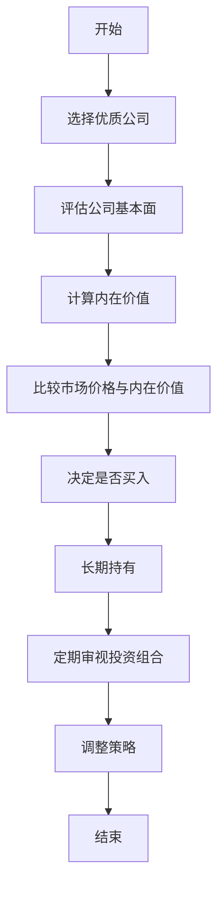
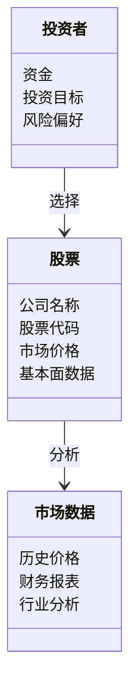
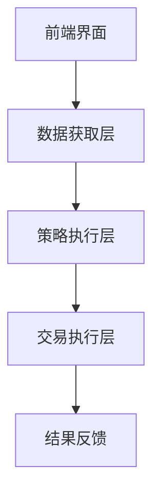
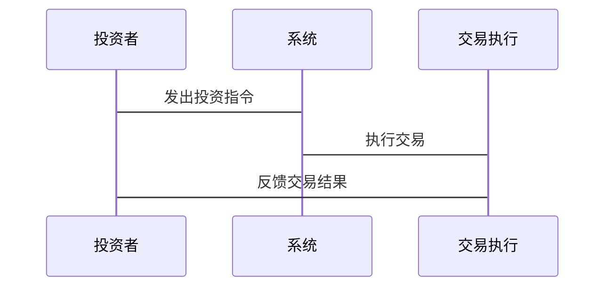

                 


# 彼得林奇的"耐心投资"在市场短期波动中的执行策略

---

## 关键词

- 耐心投资
- 市场波动
- 投资策略
- 选股方法
- 投资组合管理

---

## 摘要

彼得·林奇是全球著名的投资专家，他提倡的耐心投资策略强调长期持有优质股票，以实现稳健的回报。然而，在实际操作中，市场短期波动常常对投资者的心理和决策产生重大影响，甚至可能导致策略偏离。本文将详细分析彼得·林奇的耐心投资策略在市场短期波动中的执行策略，探讨如何在波动中保持耐心，制定科学的投资计划，并通过实际案例和系统设计帮助读者更好地理解和应用这一策略。

---

## 第一部分：耐心投资的背景与核心概念

### 第1章：耐心投资的定义与背景

#### 1.1 耐心投资的定义

- **耐心投资的核心理念**：耐心投资是指投资者在选择优质股票后，长期持有，避免频繁交易，以时间复利效应实现财富增长。
- **耐心投资与短期波动的关系**：市场短期波动可能导致投资者情绪波动，但耐心投资强调忽视短期波动，关注长期价值。
- **耐心投资的历史发展**：彼得·林奇通过长期实践总结出耐心投资策略，强调优质公司长期增长的重要性。

#### 1.2 市场短期波动的特性

- **短期波动的成因**：市场波动由投资者情绪、新闻事件、经济数据等多种因素引起。
- **短期波动对投资者心理的影响**：波动可能导致投资者恐慌性抛售或贪婪性追涨，影响投资决策。
- **短期波动与长期趋势的关系**：短期波动是市场的一部分，但长期趋势由公司基本面和宏观经济决定。

### 第2章：耐心投资与其他投资策略的对比

#### 2.1 耐心投资与趋势跟踪策略

- **趋势跟踪策略的定义**：基于价格走势进行买卖决策，强调顺势而为。
- **耐心投资与趋势跟踪的异同**：趋势跟踪注重短期价格变化，而耐心投资关注长期价值。
- **两种策略在不同市场环境下的表现**：在趋势明显时，趋势跟踪可能收益更高，但波动性较大；耐心投资在长期更稳定。

#### 2.2 耐心投资与技术分析策略

- **技术分析策略的定义**：通过分析价格图表和指标预测未来走势。
- **耐心投资与技术分析的优劣势对比**：技术分析适合短期交易，耐心投资适合长期持有。
- **两种策略在实际操作中的应用**：技术分析可用于辅助选股，但耐心投资强调长期价值。

### 第3章：耐心投资的核心要素

#### 3.1 耐心投资的选股标准

- **公司基本面分析**：评估公司盈利能力、财务状况、管理团队等因素。
- **行业地位与竞争优势**：选择行业龙头或具有独特竞争优势的公司。
- **财务健康状况评估**：关注公司的财务指标，如ROE、负债率等。

#### 3.2 投资组合的构建与管理

- **投资组合的分散化原则**：避免过度集中，降低风险。
- **定期审视与调整策略**：根据市场变化和个人财务状况调整投资组合。
- **风险管理与心理控制**：设定止损点，避免重大损失。

---

## 第二部分：耐心投资的算法原理与数学模型

### 第4章：耐心投资的算法原理

#### 4.1 耐心投资的选股算法

- **基本面分析的步骤**：
  1. 评估公司盈利能力：如ROE、净利润率。
  2. 分析财务健康状况：如资产负债表、现金流。
  3. 评估管理团队：如管理层稳定性、战略眼光。

- **价值评估方法**：
  1. 市盈率（P/E）：用于评估股票是否被低估。
  2. 市净率（P/B）：用于评估股票相对于账面价值的高低。
  3. 内在价值计算：如DCF模型评估公司真实价值。

#### 4.2 耐心投资的数学模型

- **长期复合增长率计算**：
  使用几何平均回报率计算长期收益，公式为：
  $$ (1 + r_1) \times (1 + r_2) \times \cdots \times (1 + r_n) - 1 $$
  其中，\( r_i \) 是各年的收益率。

- **短期波动的标准差计算**：
  使用统计学方法计算收益率的标准差，公式为：
  $$ \sigma = \sqrt{\frac{1}{n} \sum_{i=1}^{n} (x_i - \mu)^2} $$
  其中，\( x_i \) 是各年的收益率，\( \mu \) 是平均收益率。

### 第4.3 算法流程图



### 第4.4 Python代码示例

```python
import pandas as pd

def calculate_long_term_growth(rates):
    geometric_mean = 1
    for rate in rates:
        geometric_mean *= (1 + rate)
    return (geometric_mean - 1) * 100

# 示例收益率
rates = [0.08, 0.10, 0.05, 0.12]
growth = calculate_long_term_growth(rates)
print(f"长期复合增长率：{growth}%")
```

---

## 第三部分：耐心投资的系统分析与架构设计

### 第5章：系统分析与架构设计方案

#### 5.1 问题场景介绍

- **投资目标**：实现长期财富增长。
- **市场环境**：波动的股票市场。
- **投资策略**：耐心投资，长期持有优质股票。

#### 5.2 领域模型设计



#### 5.3 系统架构设计



#### 5.4 接口设计

- **数据获取接口**：从数据库获取股票历史数据。
- **信号生成接口**：根据算法生成买卖信号。
- **交易执行接口**：根据信号执行交易。

#### 5.5 交互流程图



---

## 第四部分：耐心投资的项目实战

### 第6章：项目实战

#### 6.1 环境安装

- **安装Python和Pandas**：
  ```bash
  pip install numpy pandas
  ```

#### 6.2 核心代码实现

```python
import pandas as pd
import matplotlib.pyplot as plt

# 示例数据：假设我们有两只股票A和B的历史收盘价
data = {
    'A': [50, 52, 51, 55, 60],
    'B': [30, 32, 33, 35, 40]
}
df = pd.DataFrame(data)

# 计算每只股票的年收益率
returns = df.pct_change().dropna()

# 计算长期复合增长率
def calculate_growth(returns):
    return (1 + returns).prod() - 1

growth_A = calculate_growth(returns['A'])
growth_B = calculate_growth(returns['B'])

print(f"股票A的长期复合增长率：{growth_A * 100}%")
print(f"股票B的长期复合增长率：{growth_B * 100}%")

# 可视化展示
df.plot(kind='line', title='股票价格走势')
plt.show()
```

#### 6.3 实际案例分析

- **案例选择**：选择两只股票，分别模拟长期持有和频繁交易的结果。
- **数据获取与处理**：使用Yahoo Finance获取股票数据。
- **结果分析**：比较两种策略的收益和风险。

#### 6.4 项目小结

- **长期持有策略的表现**：在市场波动中，长期持有优质股票通常表现优于频繁交易。
- **代码实现的意义**：通过代码模拟投资过程，帮助投资者理解策略执行效果。

---

## 第五部分：耐心投资的最佳实践与总结

### 第7章：最佳实践

#### 7.1 小结

- **耐心投资的核心**：选择优质股票，长期持有，避免短期波动干扰。
- **系统设计的重要性**：通过系统化的方法制定投资计划，降低人为情绪影响。

#### 7.2 注意事项

- **避免追涨杀跌**：市场波动可能导致短期亏损，但长期价值不变。
- **定期审视投资组合**：根据市场变化和个人财务状况调整投资策略。
- **持续学习与优化**：保持对市场的敏感性，优化投资策略。

#### 7.3 拓展阅读

- **推荐书籍**：
  - 《彼得·林奇的成功投资》
  - 《股票作手回忆录》
  - 《投资最重要的事情》

---

## 作者：AI天才研究院/AI Genius Institute & 禅与计算机程序设计艺术 /Zen And The Art of Computer Programming

---

# 结语

通过本文的详细分析，读者可以全面理解彼得·林奇的耐心投资策略，并在实际投资中应用这些知识。耐心投资不仅是一种策略，更是一种心态，需要投资者在市场波动中保持冷静，坚持长期价值。希望本文能为读者在投资道路上提供有价值的指导和启发。

