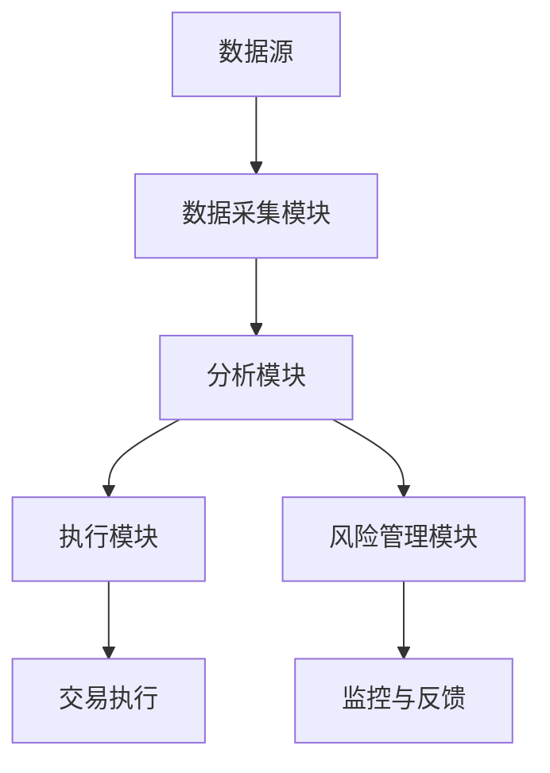

                 


# 彼得林奇的"耐心投资"在市场高波动期的执行策略优化

> 关键词：彼得林奇，耐心投资，市场波动，投资策略，风险管理，心理因素

> 摘要：本文探讨了彼得林奇的耐心投资策略在市场高波动期的优化执行方法，结合技术分析、风险管理、心理因素和系统设计，提供实战案例和数学模型，帮助投资者在高波动市场中制定有效的投资策略。

---

## 第一部分: 背景介绍

### 第1章: 彼得林奇的耐心投资策略概述

#### 1.1 耐心投资的核心理念
- **耐心投资的定义**：长期持有优质资产，避免频繁交易。
- **核心原则**：选择优秀公司，长期持有，忽略短期波动。
- **成功案例**：彼得林奇管理的基金长期表现优异，证明耐心投资的有效性。

#### 1.2 高波动市场的特点
- **高波动市场的定义**：价格波动剧烈，短期走势难预测。
- **市场波动的常见特征**：成交量大、波动率高、投资者情绪化。
- **高波动市场对投资策略的影响**：增加风险，传统策略面临挑战。

---

### 第2章: 高波动期投资策略的挑战

#### 2.1 高波动市场中的投资风险
- **市场波动对投资组合的影响**：波动率高，投资组合价值波动大。
- **风险管理的重要性**：控制风险是投资成功的关键。
- **高波动市场中的常见风险**：市场崩盘、流动性风险、操作风险。

#### 2.2 传统投资策略的不足
- **短期交易策略的局限性**：高交易成本、难以捕捉短期波动。
- **长期持有策略的挑战**：市场波动可能导致短期亏损。
- **价值投资策略的适应性**：需要更灵活的执行策略。

---

## 第二部分: 策略优化的核心概念

### 第3章: 策略优化的框架与方法

#### 3.1 策略优化的基本框架
- **策略目标的设定**：明确长期和短期目标，平衡风险和收益。
- **策略优化的步骤**：数据收集、模型构建、回测、优化、执行。
- **策略优化的工具与技术**：技术分析工具、量化模型、风险管理工具。

#### 3.2 策略优化的核心方法
- **基于技术分析的优化方法**：使用指标如RSI、MACD等优化策略。
- **基于基本面分析的优化方法**：结合公司基本面信息优化投资组合。
- **基于量化分析的优化方法**：利用算法和数学模型优化投资组合。

---

### 第4章: 风险管理与心理因素

#### 4.1 风险管理的核心原则
- **风险管理的定义**：识别、评估、控制和监控投资风险。
- **风险管理的步骤**：风险识别、风险评估、风险控制。
- **风险管理的工具**：止损订单、风险分散、对冲策略。

#### 4.2 投资者心理与行为分析
- **投资者心理的常见偏差**：过度自信、从众心理、损失厌恶。
- **高波动市场中的投资者行为**：情绪化交易、羊群效应。
- **心理因素对投资决策的影响**：如何克服心理偏差，保持理性。

---

## 第三部分: 算法与数学模型

### 第5章: 技术分析与数学模型

#### 5.1 技术分析的数学模型
- **移动平均线（MA）**：计算N日移动平均线，用于判断趋势。
  $$ MA_{n}(t) = \frac{1}{n} \sum_{i=1}^{n} P(t-i+1) $$
- **相对强弱指数（RSI）**：衡量超买或超卖状态。
  $$ RSI(t) = \frac{100}{1 + \frac{A}{B}} $$
  其中，A为上涨幅度，B为下跌幅度。

#### 5.2 算法实现
```python
def calculate_RSI(prices, n=14):
    # 计算上涨幅度和下跌幅度
    up = [max(0, prices[i] - prices[i-1]) for i in range(1, len(prices))]
    down = [max(0, prices[i-1] - prices[i]) for i in range(1, len(prices))]
    
    # 计算平均上涨和平均下跌
    avg_up = []
    avg_down = []
    for i in range(len(up)):
        if i < n-1:
            avg_up.append(up[:i+1].mean())
            avg_down.append(down[:i+1].mean())
        else:
            avg_up.append(up[i-n+1:i+1].mean())
            avg_down.append(down[i-n+1:i+1].mean())
    
    # 计算RSI
    rsi = []
    for i in range(len(avg_up)):
        if avg_down[i] == 0:
            rsi_val = 100
        else:
            rsi_val = 100 - (100 / (1 + (avg_up[i] / avg_down[i])))
        rsi.append(rsi_val)
    return rsi
```

---

## 第四部分: 系统分析与架构设计

### 第6章: 系统架构与功能设计

#### 6.1 系统功能设计
- **数据采集模块**：获取实时市场数据。
- **分析模块**：技术分析和量化分析。
- **执行模块**：根据策略执行交易。

#### 6.2 系统架构图


---

## 第五部分: 项目实战

### 第7章: 实战案例分析

#### 7.1 环境安装与数据准备
- **环境安装**：安装Python、Pandas、Matplotlib。
- **数据准备**：获取历史数据，如股票价格、成交量。

#### 7.2 核心代码实现
```python
import pandas as pd
import matplotlib.pyplot as plt

# 加载数据
data = pd.read_csv('stock_data.csv')

# 计算RSI
rsi = calculate_RSI(data['Close'])

# 绘制RSI图表
plt.plot(data['Date'], rsi)
plt.xlabel('Date')
plt.ylabel('RSI')
plt.show()
```

---

## 第六部分: 最佳实践与总结

### 第8章: 总结与注意事项

#### 8.1 总结
- 彼得林奇的耐心投资策略在高波动市场中仍有效，但需要优化。
- 优化策略包括技术分析、风险管理、心理控制和系统设计。

#### 8.2 注意事项
- 保持纪律性，避免情绪化交易。
- 定期回顾和调整策略，适应市场变化。
- 结合多种策略，分散风险，提高收益。

---

作者：AI天才研究院 & 禅与计算机程序设计艺术

