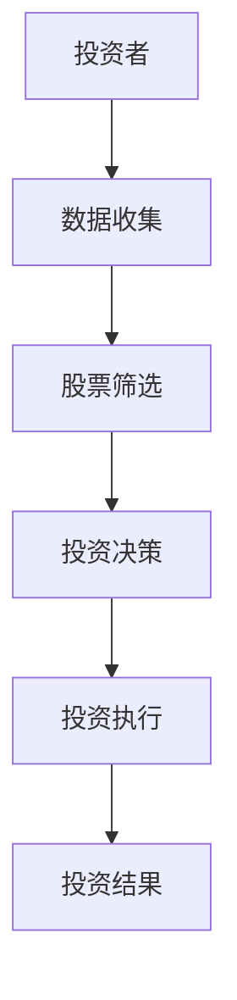
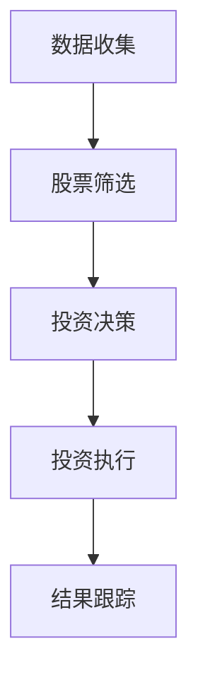

                 


# 彼得林奇的"耐心投资"在波动市场中的优势

## 关键词：
- 彼得林奇
- 耐心投资
- 股票投资
- 市场波动
- 投资策略
- 长期持有
- 价值投资

## 摘要：
本文深入探讨了彼得林奇的耐心投资理念及其在波动市场中的优势。通过分析耐心投资的核心概念、策略和数学模型，结合实际案例和系统架构设计，本文展示了如何在市场波动中通过长期持有优质股票实现稳健收益。文章还提供了详细的Python代码实现和系统设计，帮助读者更好地理解和应用这些投资策略。

---

## 第1章：彼得林奇与耐心投资的背景

### 1.1 彼得林奇的背景介绍
#### 1.1.1 彼得林奇的生平简介
彼得·林奇（Peter Lynch）是美国著名的投资经理人，曾任富达麦哲伦基金的经理。他以卓越的投资业绩和对市场的深刻理解闻名。林奇的投资风格注重长期价值，强调对企业的深入了解和长期持有。

#### 1.1.2 彼得林奇的投资理念
林奇的投资理念可以总结为“耐心投资”。他认为，短期市场的波动并不能决定股票的长期价值，真正的投资回报来源于企业的成长和长期价值的实现。

#### 1.1.3 耐心投资的定义与核心思想
耐心投资是指投资者在选择股票后，长期持有，避免频繁交易。这种策略的核心思想是通过长期持有优质企业，获得企业成长带来的收益，而非通过短期交易赚取市场波动的差价。

### 1.2 股票投资的基本概念
#### 1.2.1 股票投资的定义
股票投资是将资金投入股票市场，通过购买和持有股票获得收益的一种投资方式。

#### 1.2.2 股票市场的波动性与风险
股票市场具有高度的波动性，价格受多种因素影响，包括经济数据、公司业绩、市场情绪等。这种波动性带来了投资风险，但也为长期投资者提供了机会。

#### 1.2.3 耐心投资与短期投资的对比
耐心投资与短期投资在目标、策略和风险承受上存在显著差异。耐心投资注重长期价值，而短期投资关注短期价格波动。

### 1.3 耐心投资的核心要素
#### 1.3.1 长期持有股票的意义
长期持有股票可以避免频繁交易的成本和风险，同时享受企业成长带来的收益。

#### 1.3.2 价值投资与成长投资的区别
价值投资关注股票的内在价值，寻找被市场低估的股票；成长投资关注企业的成长潜力，选择高成长性的股票。

#### 1.3.3 耐心投资的边界与外延
耐心投资的边界在于长期持有优质股票，避免短期波动的干扰；其外延则包括对市场波动的适应和对投资组合的优化。

---

## 第2章：耐心投资的核心概念与联系

### 2.1 耐心投资的原理
#### 2.1.1 长期持有股票的数学模型
长期持有股票的收益可以通过以下公式计算：
$$
\text{总收益} = \prod_{i=1}^{n} (1 + r_i)
$$
其中，$r_i$ 是第 $i$ 年的收益率。

#### 2.1.2 耐心投资与市场波动的关系
市场波动是短期的，而企业的长期价值是稳定的。耐心投资通过长期持有，可以过滤掉短期波动的影响。

#### 2.1.3 耐心投资的属性特征对比表格
| 属性 | 耐心投资 | 短期投资 |
|------|----------|----------|
| 投资期限 | 长期     | 短期     |
| 风险承受 | 低       | 高       |
| 收益来源 | 企业成长 | 价格波动 |

### 2.2 耐心投资的ER实体关系图
```mermaid
er
actor 投资者 {
  has 姓名
  has 投资金额
}
actor 市场 {
  has 股票价格
  has 市场波动
}
actor 企业 {
  has 企业价值
  has 财务数据
}
```

### 2.3 耐心投资的算法流程


---

## 第3章：耐心投资的算法原理

### 3.1 耐心投资的算法流程
#### 3.1.1 数据收集与分析
数据收集包括收集企业的财务数据、市场数据等，分析企业基本面和市场趋势。

#### 3.1.2 股票筛选与评估
通过筛选优质企业，评估股票的价值和成长潜力。

#### 3.1.3 投资决策与执行
制定投资策略，执行投资操作。

### 3.2 耐心投资的数学模型
#### 3.2.1 股票价值的评估公式
股票的内在价值可以通过以下公式计算：
$$
\text{内在价值} = \sum_{t=1}^{\infty} \frac{CF_t}{(1 + r)^t}
$$
其中，$CF_t$ 是第 $t$ 年的现金流，$r$ 是折现率。

#### 3.2.2 股票风险的衡量指标
股票风险可以通过波动率、Beta值等指标衡量：
$$
\text{Beta} = \frac{\text{协方差}(r_i, r_m)}{\text{方差}(r_m)}
$$
其中，$r_i$ 是股票的收益率，$r_m$ 是市场收益率。

#### 3.2.3 投资组合的优化模型
投资组合优化可以通过以下公式实现：
$$
\text{Minimize} \quad \sum_{i=1}^{n} w_i^2
$$
$$
\text{Subject to} \quad \sum_{i=1}^{n} w_i = 1, \quad \sum_{i=1}^{n} w_i r_i = \text{目标收益}
$$
其中，$w_i$ 是第 $i$ 只股票的权重，$r_i$ 是第 $i$ 只股票的预期收益率。

### 3.3 耐心投资的系统架构设计
#### 3.3.1 系统功能设计
系统功能包括数据收集、股票筛选、投资决策、投资执行和结果跟踪。

#### 3.3.2 系统架构图


---

## 第4章：耐心投资的项目实战

### 4.1 环境安装与配置
#### 4.1.1 Python环境的搭建
安装Python和必要的库，如Pandas、NumPy等。

#### 4.1.2 数据分析库的安装
安装Pandas、Matplotlib等库，用于数据处理和可视化。

#### 4.1.3 数据源的获取与处理
从股票数据库获取数据，进行清洗和预处理。

### 4.2 核心算法实现
#### 4.2.1 股票筛选算法
根据财务指标筛选优质企业。

#### 4.2.2 投资组合优化算法
使用数学模型优化投资组合。

#### 4.2.3 风险评估与调整算法
评估投资组合的风险，并进行调整。

### 4.3 代码实现与解读
#### 4.3.1 数据收集与预处理
```python
import pandas as pd
import numpy as np

# 数据收集
data = pd.read_csv('stock_data.csv')

# 数据预处理
data.dropna(inplace=True)
data = data[['Date', 'Close', 'Volume']]
```

#### 4.3.2 股票分析与筛选
```python
def calculate_momentum(data, window=10):
    return data['Close'].rolling(window).mean()

# 计算动量指标
momentum = calculate_momentum(data)
```

#### 4.3.3 投资组合优化与模拟
```python
import matplotlib.pyplot as plt

# 绘制股价走势
plt.plot(data['Date'], data['Close'])
plt.xlabel('Date')
plt.ylabel('Price')
plt.title('Stock Price Trend')
plt.show()
```

### 4.4 投资组合的优化与模拟
通过Python代码实现投资组合的优化，并模拟股价走势，评估投资策略的有效性。

---

## 第5章：耐心投资的最佳实践与总结

### 5.1 投资策略的总结
耐心投资的核心在于长期持有优质股票，避免短期波动的干扰。

### 5.2 投资心态的培养
投资者需要保持耐心，避免情绪化决策，坚持长期投资。

### 5.3 投资组合的动态调整
定期评估投资组合，根据市场变化进行适当调整。

### 5.4 注意事项
- 避免过度分散投资。
- 选择优质企业长期持有。
- 持续学习，优化投资策略。

---

## 作者：AI天才研究院/AI Genius Institute & 禅与计算机程序设计艺术 /Zen And The Art of Computer Programming

---

本文通过详细的分析和实际案例，展示了彼得林奇的耐心投资策略在波动市场中的优势。通过系统的数学模型和算法实现，帮助读者更好地理解和应用这些投资策略。希望本文能为投资者提供有价值的参考和启发。

