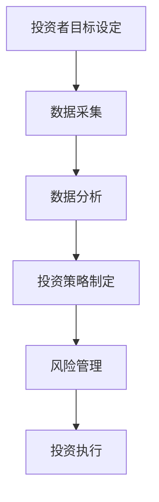
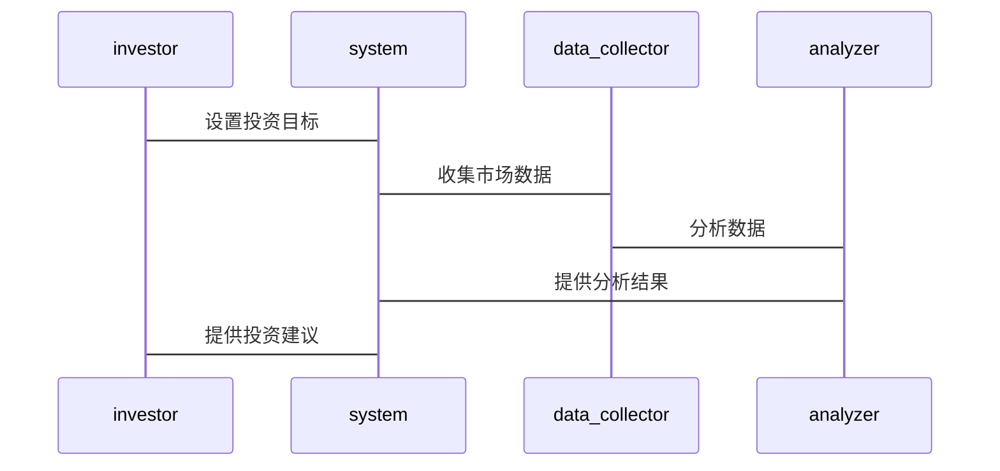

                 


# 彼得林奇的"耐心投资"在短期主义盛行时的价值

> 关键词：耐心投资，彼得·林奇，短期主义，投资策略，长期视角

> 摘要：本文深入探讨了彼得·林奇的耐心投资理念及其在当前短期主义盛行的市场环境下的价值。通过分析耐心投资的核心原则、与短期主义的对比，以及在实际投资中的应用，本文揭示了长期投资的潜在优势和实际操作中的策略。结合系统架构设计和数学模型分析，本文为投资者提供了在短期波动中保持长期视角的实用建议。

---

## 第1章：耐心投资的背景与核心理念

### 1.1 耐心投资的核心概念

#### 1.1.1 什么是耐心投资
耐心投资是一种以长期视角为基础的投资策略，强调持有优质资产并长期关注其价值增长。这种策略要求投资者具备耐心，避免因短期市场波动而做出非理性决策。

#### 1.1.2 耐心投资与短期投资的区别
- **目标时间跨度**：耐心投资关注3年以上，甚至更长；短期投资则关注几周或几个月。
- **决策依据**：耐心投资基于企业的长期价值和基本面分析；短期投资则更多关注市场情绪和短期价格波动。
- **风险承受**：耐心投资者能够容忍短期波动，追求长期收益；短期投资者则对波动更加敏感，容易受到市场情绪影响。

#### 1.1.3 耐心投资的哲学基础
耐心投资的哲学基础在于相信市场的长期合理性。彼得·林奇认为，优质企业会在长期内持续创造价值，因此投资者应专注于选择这些企业，而非追逐短期收益。

---

### 1.2 短期主义的盛行及其影响

#### 1.2.1 短期主义的定义与表现
短期主义是指投资者仅关注短期市场波动和价格变化，忽视企业长期价值的投资行为。其表现包括频繁交易、过度关注市场情绪、追逐热点等。

#### 1.2.2 短期主义对市场的负面影响
- **市场波动加剧**：短期投资者的行为会导致市场波动加剧，影响市场的稳定性和效率。
- **资源浪费**：短期投资可能导致资源的浪费，企业无法获得长期稳定的资金支持。
- **投资决策偏差**：短期主义可能导致投资者忽视企业的基本面，追求短期收益，增加投资风险。

#### 1.2.3 短期主义与耐心投资的冲突
- **目标不一致**：短期投资追求短期收益，耐心投资关注长期价值。
- **决策压力**：短期主义者在市场波动中面临更大的压力，容易做出错误决策。
- **机会成本**：耐心投资可能在短期内表现不佳，但长期来看更具可持续性。

---

## 第2章：彼得·林奇的投资理念

### 2.1 彼得·林奇的耐心投资策略

#### 2.1.1 林奇的投资哲学
彼得·林奇强调，成功的投资需要耐心、专注和长期视角。他认为，投资者应选择那些具有强大基本面、良好管理团队和增长潜力的企业。

#### 2.1.2 林奇的选股标准
- **企业基本面**：关注企业的盈利能力、财务状况和市场地位。
- **管理团队**：选择经验丰富、能力强的管理团队。
- **行业前景**：投资于具有增长潜力的行业。

#### 2.1.3 林奇的长期持有策略
林奇主张长期持有优质企业股票，避免频繁交易。他认为，短期波动不应影响长期投资决策。

---

### 2.2 林奇投资理念的核心要素

#### 2.2.1 长期视角的重要性
长期视角使投资者能够忽略短期波动，专注于企业的长期价值。林奇认为，短期市场波动无法决定企业的长期价值。

#### 2.2.2 价值投资的真谛
价值投资强调以合理价格购买优质企业。林奇认为，找到这样的企业并长期持有，是实现长期收益的关键。

#### 2.2.3 耐心与市场的波动
耐心使投资者能够在市场波动中保持冷静，避免因短期亏损而恐慌卖出。林奇认为，耐心是长期投资成功的关键因素。

---

## 第3章：耐心投资与短期主义的对比分析

### 3.1 短期投资的优缺点

#### 3.1.1 短期投资的优点
- **灵活性**：短期投资者可以根据市场变化快速调整投资组合。
- **高流动性**：短期投资允许投资者快速变现，应对紧急资金需求。
- **短期收益**：在某些情况下，短期投资可以获得较高的短期收益。

#### 3.1.2 短期投资的缺点
- **高风险**：短期投资容易受到市场波动和情绪影响，增加投资风险。
- **机会成本**：频繁交易可能导致较高的交易成本和税收负担。
- **缺乏耐心**：短期投资者容易忽视企业的长期价值，导致决策失误。

---

### 3.2 耐心投资的优缺点

#### 3.2.1 耐心投资的优点
- **长期收益**：耐心投资能够捕捉企业的长期增长，实现较高的长期收益。
- **风险分散**：长期持有优质企业可以分散短期市场波动带来的风险。
- **低交易成本**：长期投资减少交易频率，降低交易成本和税费。

#### 3.2.2 耐心投资的缺点
- **短期表现不佳**：在某些情况下，长期投资可能在短期内表现不佳。
- **需要较高的耐心**：长期投资需要投资者具备强大的心理素质，能够承受短期波动。
- **市场周期影响**：长期投资仍受市场周期影响，无法完全避免损失。

---

### 3.3 两者在实际投资中的表现对比

#### 3.3.1 短期投资的风险与收益
- **风险**：短期投资风险较高，容易受到市场情绪和波动影响。
- **收益**：在某些情况下，短期投资可以获得较高的短期收益，但难以持续。

#### 3.3.2 耐心投资的风险与收益
- **风险**：长期投资风险较低，但市场周期仍可能影响收益。
- **收益**：长期投资能够捕捉企业的长期增长，实现较高的长期收益。

#### 3.3.3 长期与短期策略的动态平衡
- **策略结合**：投资者可以结合长期和短期策略，根据市场环境调整投资组合。
- **风险管理**：通过分散投资和合理的资产配置，降低投资风险。

---

## 第4章：投资者心态与决策分析

### 4.1 投资者心态的分类

#### 4.1.1 短期投资者的心态特征
- **短期收益导向**：关注短期价格波动，追求短期收益。
- **情绪化决策**：容易受到市场情绪影响，做出非理性决策。
- **高风险承受**：对短期风险较为敏感，容易因波动而恐慌。

#### 4.1.2 长期投资者的心态特征
- **长期价值导向**：关注企业的长期价值，追求长期收益。
- **理性决策**：能够忽略短期波动，保持冷静和耐心。
- **低风险承受**：对短期波动较为容忍，注重长期风险控制。

#### 4.1.3 两种心态的对比与影响
- **对比**：短期投资者关注短期收益和情绪，长期投资者关注长期价值和理性。
- **影响**：短期心态可能导致短期波动，长期心态能够稳定市场并促进长期增长。

---

### 4.2 心态对投资决策的影响

#### 4.2.1 短期心态如何影响投资决策
- **决策偏差**：短期心态可能导致投资者过度关注市场情绪，忽视基本面分析。
- **交易频率**：短期心态促使投资者频繁交易，增加交易成本和风险。

#### 4.2.2 长期心态如何影响投资决策
- **决策稳定性**：长期心态使投资者能够在市场波动中保持冷静，做出理性的决策。
- **投资策略**：长期心态促使投资者制定长期投资计划，注重资产配置和风险控制。

#### 4.2.3 心态波动对投资结果的影响
- **心态波动**：投资者的心态波动可能导致投资策略的频繁调整，影响投资结果。
- **情绪控制**：投资者需要学会控制情绪，避免因心态波动而做出错误决策。

---

## 第5章：耐心投资的系统分析与架构设计

### 5.1 系统功能设计

#### 5.1.1 投资目标设定
- **长期目标**：设定长期投资目标，如资产增值、财富积累等。
- **短期目标**：设定短期目标，如资金流动性、风险控制等。

#### 5.1.2 投资策略制定
- **资产配置**：根据长期目标制定合理的资产配置方案。
- **投资组合管理**：根据市场变化调整投资组合，确保风险可控。

#### 5.1.3 风险管理
- **风险评估**：定期评估投资组合的风险，确保与投资目标一致。
- **风险控制**：制定风险控制措施，如止损、分散投资等。

---

### 5.2 系统架构设计

#### 5.2.1 系统模块划分
- **数据采集**：采集市场数据、企业基本面数据等。
- **数据分析**：分析数据，评估企业价值和投资机会。
- **投资决策**：根据分析结果制定投资策略。
- **风险管理**：监控投资组合，控制风险。

#### 5.2.2 系统功能流程图


#### 5.2.3 系统交互设计


---

## 第6章：项目实战与数学模型分析

### 6.1 环境安装
- **工具安装**：安装数据分析工具、投资管理系统等。
- **数据准备**：收集市场数据、企业基本面数据等。

### 6.2 核心实现源代码

#### 6.2.1 数据分析代码
```python
import pandas as pd

# 数据采集
data = pd.read_csv('market_data.csv')

# 数据分析
mean_return = data['return'].mean()
std_deviation = data['return'].std()

print(f'平均回报：{mean_return}')
print(f'标准差：{std_deviation}')
```

#### 6.2.2 投资组合优化代码
```python
import numpy as np

# 投资组合优化
def optimize_portfolio(returns):
    n = len(returns.columns)
    return np.mean(returns, axis=0)

returns = pd.DataFrame({'股票A': [0.05, 0.03, 0.07], 
                         '股票B': [0.04, 0.06, 0.05]})
weights = optimize_portfolio(returns)
print(weights)
```

### 6.3 案例分析与解读
- **案例背景**：假设投资者选择长期持有优质企业股票，如苹果公司。
- **数据分析**：分析苹果公司的长期股价走势和基本面数据。
- **结果解读**：长期持有苹果公司股票能够实现较高的长期收益，验证耐心投资的有效性。

### 6.4 项目小结
- **总结**：耐心投资在长期来看能够实现较高的收益，但需要投资者具备长期视角和耐心。
- **注意事项**：投资者需要根据自身情况制定合理的投资策略，避免盲目跟风。

---

## 第7章：系统架构优化与最佳实践

### 7.1 系统优化建议
- **数据更新频率**：根据市场变化调整数据更新频率，确保投资决策的及时性。
- **风险控制机制**：优化风险控制机制，提高系统的稳定性和可靠性。

### 7.2 最佳实践 tips
- **定期评估**：定期评估投资组合的表现，根据市场变化调整策略。
- **分散投资**：通过分散投资降低风险，避免过度依赖单一资产。
- **耐心持有**：保持耐心，避免因短期波动而做出错误决策。

---

## 第8章：总结与展望

### 8.1 总结
- **核心观点**：耐心投资在短期主义盛行的市场环境中具有重要的价值，能够帮助投资者实现长期收益。
- **主要收获**：通过本文的分析，读者能够理解耐心投资的核心理念和实际应用，掌握长期投资的策略和方法。

### 8.2 未来展望
- **技术进步**：随着技术的进步，投资者可以利用更多工具和方法进行长期投资。
- **市场变化**：未来市场环境的变化将为耐心投资带来新的机遇和挑战。

---

## 作者：AI天才研究院 & 禅与计算机程序设计艺术

---

通过本文的系统分析和实际案例，我们深入探讨了彼得·林奇的耐心投资理念及其在当前市场环境下的价值。希望本文能够为投资者提供有价值的见解和实用的建议，帮助他们在短期波动中保持长期视角，实现可持续的投资收益。

