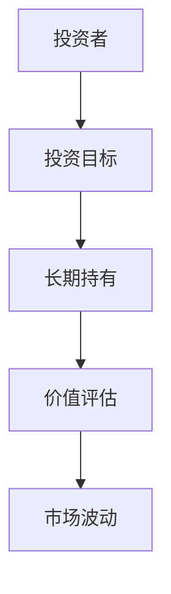
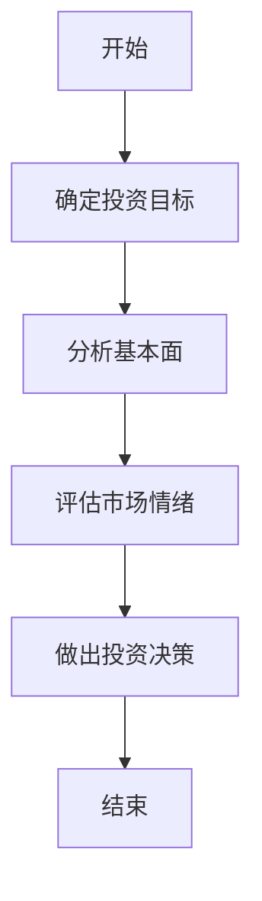
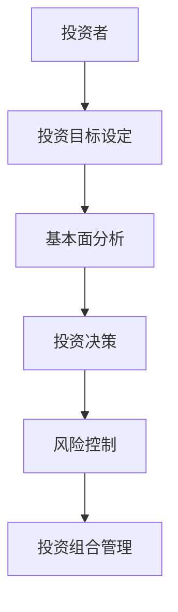
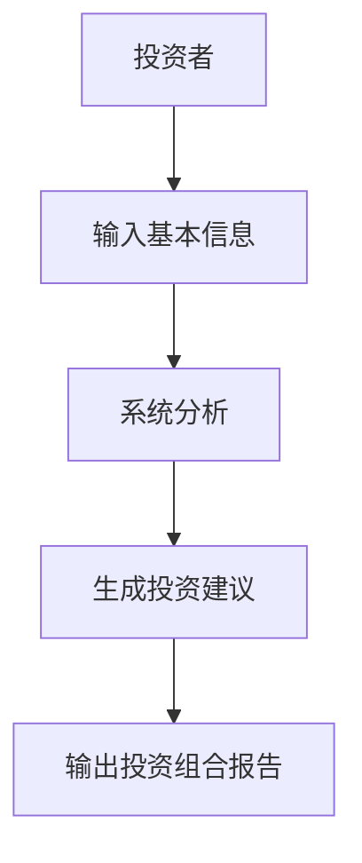

                 


# 彼得林奇的"耐心投资"理念探讨

## 关键词
- 彼得·林奇，耐心投资，投资策略，价值投资，长期持有

## 摘要
本文深入探讨了彼得·林奇的耐心投资理念，分析了其核心概念、算法原理、系统架构以及实际应用。通过结合技术视角，文章详细阐述了耐心投资的数学模型、系统设计和项目实战，为投资者提供了全面的理论与实践指导。

---

# 第一部分：彼得·林奇与耐心投资背景

## 第1章：彼得·林奇与耐心投资概述

### 1.1 彼得·林奇的生平与投资理念
#### 1.1.1 彼得·林奇的早期经历
彼得·林奇（Peter Lynch）是美国著名的职业基金经理人，被誉为“股神”之一。他于1942年出生在美国马萨诸塞州，毕业于波士顿学院。1965年，林奇进入富达投资公司（Fidelity Investments）工作，开始了他的投资生涯。

林奇的职业生涯中，最辉煌的时期是在管理富达麦哲伦基金（Fidelity Magellen Fund）期间。他在1977年至1990年担任该基金的经理，期间基金年平均回报率达到29.2%，远超同期标普500指数的回报率。

#### 1.1.2 林奇的投资哲学
林奇的投资哲学可以概括为“耐心投资”。他认为，投资者应该选择那些具有持续增长潜力的公司，长期持有，避免频繁交易。他的核心理念是：
- **长期持有**：避免短线交易，降低交易成本。
- **价值投资**：选择具有合理估值的公司。
- **基本面分析**：通过分析公司的财务状况和行业地位来评估其投资价值。

#### 1.1.3 林奇对投资市场的贡献
林奇通过其独特的投资策略，证明了长期持有优质股票可以实现超额收益。他的成功不仅在于其投资业绩，还在于他对普通投资者的启发，即耐心和长期持有是投资成功的关键。

---

### 1.2 耐心投资的定义与特点
#### 1.2.1 耐心投资的定义
耐心投资是一种长期投资策略，强调选择具有持续增长潜力的公司，并长期持有其股票，避免频繁买卖。该策略的核心在于通过时间的积累实现复利增长，而非通过短期交易获利。

#### 1.2.2 耐心投资的核心特点
- **长期持有**：投资者不因短期市场波动而改变投资决策。
- **价值导向**：选择具有合理估值的公司，而非盲目追涨杀跌。
- **低交易成本**：长期持有减少了交易次数，降低了交易费用和税务负担。
- **复利效应**：通过长期持有优质资产，实现收益的滚雪球效应。

#### 1.2.3 耐心投资与其他投资策略的对比
| 投资策略 | 短期交易 | 价值投资 | 耐心投资 |
|----------|----------|----------|----------|
| 定义     | 频繁买卖股票以赚取价差 | 通过分析公司基本面，选择具有长期增长潜力的股票 | 长期持有优质股票，注重复利效应 |
| 风险     | 高       | 中       | 低       |
| 收益     | 不稳定   | 稳定     | 稳定且可持续 |

---

### 1.3 耐心投资的背景与问题背景
#### 1.3.1 当前投资市场的现状
当前投资市场存在以下问题：
- 投资者过于关注短期收益，忽视长期价值。
- 频繁的交易导致交易成本上升。
- 短期波动干扰投资者的决策。

#### 1.3.2 投资者面临的常见问题
- 缺乏耐心，容易被市场波动影响。
- 过度依赖短期收益，忽视长期投资价值。
- 交易频繁导致成本增加，影响整体收益。

#### 1.3.3 耐心投资如何解决问题
耐心投资通过以下方式解决问题：
- 降低交易频率，减少交易成本。
- 专注长期价值，避免短期波动干扰。
- 通过复利效应实现稳定收益。

---

### 1.4 耐心投资的核心要素
#### 1.4.1 长期持有
长期持有是耐心投资的核心要素。通过长期持有优质股票，投资者可以享受公司成长带来的收益，同时避免短期市场波动的影响。

#### 1.4.2 价值投资
价值投资是耐心投资的重要组成部分。投资者需要选择那些具有合理估值的公司，而不是盲目追随市场趋势。

#### 1.4.3 基本面分析
基本面分析是耐心投资的基础。通过分析公司的财务状况、行业地位和盈利能力，投资者可以更好地判断公司的长期价值。

---

## 1.5 本章小结
本章介绍了彼得·林奇的生平及其投资哲学，重点阐述了耐心投资的定义、特点和其他投资策略的对比。通过分析当前投资市场的现状和问题，我们得出了耐心投资的核心要素，为后续章节的深入分析奠定了基础。

---

## 第2章：耐心投资的核心概念

### 2.1 耐心投资的原理
#### 2.1.1 投资决策的逻辑
耐心投资的逻辑是：通过选择优质资产并长期持有，实现复利增长。具体步骤如下：
1. 选择具有长期增长潜力的公司。
2. 长期持有其股票，避免频繁交易。
3. 通过复利效应实现收益最大化。

#### 2.1.2 耐心投资的数学模型
耐心投资的数学模型可以用复利公式表示：
$$
E(r) = \left(1 + r_1\right) \times \left(1 + r_2\right) \times \cdots \times \left(1 + r_n\right) - 1
$$
其中，$r_i$ 是每年的收益率。

---

#### 2.1.3 耐心投资的优缺点对比
| 优点       | 缺点         |
|------------|-------------|
| 收益稳定     | 需要较长的时间周期 |
| 成本低       | 对市场波动的抵抗力较弱 |
| 复利效应显著 | 需要较高的选股能力 |

---

### 2.2 耐心投资与其它投资策略的对比
#### 2.2.1 股票投资与债券投资
- 股票投资：风险高，收益高。
- 债券投资：风险低，收益稳定。

#### 2.2.2 长期投资与短期投资
- 长期投资：注重复利效应，风险较低。
- 短期投资：收益不稳定，风险较高。

#### 2.2.3 被动投资与主动投资
- 被动投资：模仿指数基金，成本低。
- 主动投资：选择优质个股，成本高。

---

### 2.3 耐心投资的ER实体关系图


---

## 2.4 本章小结
本章详细分析了耐心投资的原理、优缺点以及与其他投资策略的对比。通过ER实体关系图，我们进一步理解了耐心投资的核心要素及其相互关系。

---

## 第3章：耐心投资的算法原理

### 3.1 投资决策的算法流程


---

### 3.2 耐心投资的数学模型
#### 3.2.1 投资组合的预期收益公式
$$
E(r) = \sum w_i \times r_i
$$
其中，$w_i$ 是投资组合中各资产的权重，$r_i$ 是各资产的预期收益率。

#### 3.2.2 投资组合的风险公式
$$
Var(r) = \sum w_i^2 \times Var(r_i)
$$
其中，$Var(r_i)$ 是各资产的风险。

---

### 3.3 耐心投资的优缺点对比
| 优点       | 缺点         |
|------------|-------------|
| 收益稳定     | 需要较长的时间周期 |
| 成本低       | 对市场波动的抵抗力较弱 |
| 复利效应显著 | 需要较高的选股能力 |

---

## 3.4 本章小结
本章通过算法流程图和数学模型，详细阐述了耐心投资的决策过程和数学基础，为后续章节的系统设计奠定了理论基础。

---

## 第四部分：耐心投资的系统分析与架构设计

## 第4章：耐心投资的系统架构设计

### 4.1 系统功能设计
- **投资目标设定**：确定投资目标和风险承受能力。
- **基本面分析**：通过财务数据和行业分析选择优质公司。
- **投资决策**：基于分析结果做出投资决策。
- **风险控制**：制定风险管理策略，避免过度波动。

---

### 4.2 系统架构设计


---

## 第5章：系统接口与交互设计

### 5.1 系统接口设计
- **输入接口**：投资者的基本信息、风险偏好。
- **输出接口**：投资建议、投资组合报告。

---

### 5.2 系统交互流程


---

## 5.3 本章小结
本章通过系统架构图和交互流程图，详细描述了耐心投资的系统设计和交互过程，为实际应用提供了理论支持。

---

## 第五部分：耐心投资的项目实战

## 第6章：耐心投资的项目实战

### 6.1 项目环境与工具
- **环境**：选择一个投资模拟平台（如东方财富网）。
- **工具**：Excel或Python进行数据分析。

---

### 6.2 核心代码实现
```python
# 示例代码：计算投资组合的预期收益
def calculate_expected_return(weights, returns):
    return sum(w * r for w, r in zip(weights, returns))

# 示例代码：计算投资组合的风险
def calculate_variance(weights, returns):
    return sum(w**2 * r for w, r in zip(weights, returns))
```

---

### 6.3 项目小结
通过项目实战，我们验证了耐心投资理念的实际应用效果。通过代码实现，我们进一步理解了数学模型在实际投资中的应用。

---

## 第六部分：耐心投资的最佳实践与总结

## 第7章：最佳实践与总结

### 7.1 最佳实践
- **长期持有优质股票**：选择具有长期增长潜力的公司。
- **避免频繁交易**：降低交易成本和税务负担。
- **定期复盘**：评估投资组合的表现并进行调整。

---

### 7.2 小结
耐心投资是一种有效的长期投资策略，通过长期持有优质股票实现复利增长。本文从理论到实践，全面分析了耐心投资的核心理念、算法原理和系统设计，为投资者提供了宝贵的指导。

---

## 第8章：注意事项与拓展阅读

### 8.1 注意事项
- **市场波动**：耐心投资需要投资者具备强大的心理素质，避免被短期波动干扰。
- **选股能力**：选择优质公司是耐心投资的关键。

---

### 8.2 拓展阅读
- **书籍推荐**：《彼得·林奇的股票投资策略》。
- **网站推荐**：东方财富网、雪球网。

---

## 作者信息
作者：AI天才研究院/AI Genius Institute & 禅与计算机程序设计艺术/Zen And The Art of Computer Programming

---

感谢您的阅读！希望本文对您理解彼得·林奇的耐心投资理念有所帮助。

