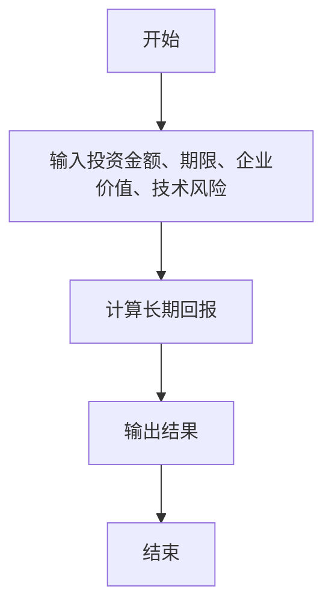
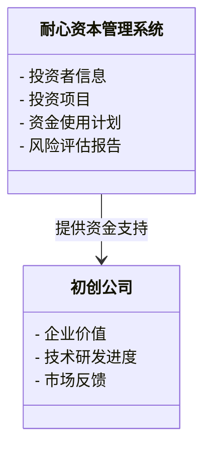
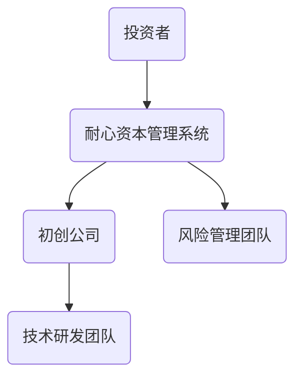
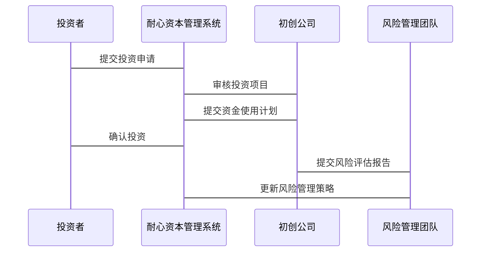

                 


# 彼得林奇的"耐心资本"在深科技初创公司中的角色

> 关键词：耐心资本，深科技，初创公司，投资策略，长期支持，风险评估

> 摘要：本文探讨了彼得·林奇提出的“耐心资本”理念在深科技初创公司中的角色。通过分析耐心资本的核心概念、其在深科技领域的应用，以及对初创公司的影响，本文揭示了耐心资本在支持技术创新和公司成长中的独特作用。结合实际案例和系统设计，文章详细阐述了如何通过耐心资本实现深科技初创公司的长期成功。

---

# 第一章: 背景介绍

## 1.1 耐心资本的定义与特点

### 1.1.1 耐心资本的核心概念
耐心资本（Patient Capital）是指一种长期投资策略，投资者愿意在较长的时间内持有资产，而不追求短期收益。与传统短期资本不同，耐心资本更注重企业的长期价值创造和成长潜力。其核心理念是通过持续支持企业，实现共同成长。

### 1.1.2 耐心资本与传统资本的区别
| 属性      | 耐心资本                  | 传统资本                  |
|-----------|--------------------------|--------------------------|
| 投资期限  | 长期（5-10年及以上）      | 短期（1-3年）             |
| 投资目标  | 支持企业长期发展          | 追求短期收益              |
| 风险承受  | 高风险，高回报           | 低风险，稳定回报          |
| 投资对象  | 初创公司、技术创新企业    | 成熟企业、金融产品        |

### 1.1.3 耐心资本在投资中的作用
耐心资本通过提供长期资金支持，帮助企业渡过早期的困难阶段，同时为企业创造价值。这种资本类型特别适合那些需要长时间研发和技术突破的深科技领域。

---

## 1.2 深科技初创公司的特点

### 1.2.1 深科技的定义与领域
深科技（Deep Technology）指的是基于前沿技术（如人工智能、量子计算、生物技术等）的核心创新，通常涉及复杂的研发过程和较高的技术门槛。深科技初创公司专注于这些领域，致力于解决复杂的科学和技术问题。

### 1.2.2 初创公司的特点与挑战
- **高风险**：技术创新失败或市场接受度低的风险较高。
- **长周期**：从研发到商业化需要较长的时间。
- **高投入**：需要大量的资金支持和资源。
- **不确定性**：技术路径和市场前景的不确定性较高。

### 1.2.3 深科技初创公司的独特性
深科技初创公司不同于传统初创公司，其核心竞争力在于技术创新。这类公司通常需要长期的资金支持和耐心资本，才能实现技术突破和商业化。

---

## 1.3 耐心资本与深科技初创公司的结合

### 1.3.1 耐心资本在深科技领域的必要性
深科技领域的技术创新需要长期的研发投入，而耐心资本的长期支持正好能够满足这一需求。通过提供稳定的资金流，耐心资本帮助初创公司克服短期资金短缺的问题。

### 1.3.2 深科技初创公司对耐心资本的需求
深科技初创公司通常面临高风险和长周期的挑战，传统的短期资本难以满足其需求。耐心资本的长期支持能够为公司提供稳定的资金来源，支持其技术研发和市场拓展。

### 1.3.3 耐心资本在深科技初创公司中的角色
- **资金支持**：提供长期资金，支持技术研发和商业化。
- **战略支持**：在公司战略制定和调整中提供指导。
- **风险管理**：帮助公司应对技术和市场风险。

---

# 第二章: 核心概念与联系

## 2.1 耐心资本的核心要素

### 2.1.1 长期投资理念
耐心资本的核心是长期投资理念，投资者相信企业的长期价值能够带来超额回报。这种理念强调与企业共同成长，而非短期交易。

### 2.1.2 耐心资本的属性特征
- **时间跨度长**：投资期限通常在5年以上。
- **风险承受高**：能够承受较高的投资风险。
- **价值创造**：注重企业长期价值的创造。

### 2.1.3 耐心资本的数学模型
为了量化耐心资本的影响，我们可以构建一个简单的模型：

$$
\text{长期价值} = \sum_{t=1}^{n} \frac{V_t}{(1 + r)^t}
$$

其中，$V_t$ 是第 $t$ 年的企业价值，$r$ 是折现率，$n$ 是投资期限。

---

## 2.2 深科技初创公司的核心要素

### 2.2.1 技术创新的核心性
深科技初创公司的核心竞争力在于技术创新。通过持续的技术研发，公司能够实现产品的差异化和市场的领先地位。

### 2.2.2 初创公司的成长阶段
初创公司通常经历以下几个阶段：
1. **种子阶段**：初步技术研发和产品原型开发。
2. **成长阶段**：扩大团队，优化产品。
3. **成熟阶段**：实现商业化和规模化。

### 2.2.3 深科技初创公司的风险与回报
深科技初创公司面临高风险，但一旦成功，回报也可能是巨大的。耐心资本通过长期支持，帮助公司降低风险，实现可持续发展。

---

## 2.3 耐心资本与深科技初创公司的关系

### 2.3.1 耐心资本对深科技初创公司的支持
耐心资本通过提供长期资金支持，帮助深科技初创公司克服研发和技术转化中的资金短缺问题。

### 2.3.2 深科技初创公司对耐心资本的依赖
由于深科技领域的高风险和长周期，初创公司通常需要耐心资本的支持。这种依赖关系使得耐心资本在深科技领域中扮演了至关重要的角色。

### 2.3.3 耐心资本与深科技初创公司的实体关系图（ER图）

```mermaid
erdiagram
actor 耐心资本投资者 {
  id: int
  投资金额: int
  投资期限: int
}
actor 深科技初创公司 {
  id: int
  企业价值: int
  技术研发: int
}
relationship 投资关系 {
  耐心资本投资者 --> 深科技初创公司 : 提供长期资金支持
}
```

---

# 第三章: 算法原理讲解

## 3.1 算法模型概述

### 3.1.1 模型的目标与输入
- **目标**：评估耐心资本对深科技初创公司的长期影响。
- **输入**：投资金额、投资期限、企业价值、技术风险。

### 3.1.2 模型的输出与应用场景
- **输出**：长期投资回报、企业成长潜力。
- **应用场景**：帮助投资者决策，支持初创公司制定长期战略。

## 3.2 算法原理

### 3.2.1 模型的数学公式
$$
\text{长期回报} = \sum_{t=1}^{n} \frac{V_t}{(1 + r)^t}
$$

其中，$V_t$ 是第 $t$ 年的企业价值，$r$ 是折现率，$n$ 是投资期限。

### 3.2.2 算法流程


### 3.2.3 算法实现
以下是Python代码实现：

```python
def calculate_patience_capital_return(investment, duration, discount_rate):
    return_value = 0
    for t in range(1, duration + 1):
        return_value += investment / (1 + discount_rate) ** t
    return return_value

# 示例
investment = 1000000  # 投资金额
duration = 10         # 投资期限
discount_rate = 0.1   # 折现率

return_value = calculate_patience_capital_return(investment, duration, discount_rate)
print(f"长期回报为：{return_value:.2f}")
```

---

## 3.3 算法优化与实际应用

### 3.3.1 算法优化
- 使用动态规划优化计算，减少重复计算。
- 引入风险评估因子，调整折现率。

### 3.3.2 实际应用
通过实际案例分析，验证算法的有效性。例如，某深科技初创公司获得1000万美元的耐心资本投资，投资期限为10年，折现率为10%。计算其长期回报：

$$
\text{长期回报} = \sum_{t=1}^{10} \frac{10000000}{(1 + 0.1)^t} \approx 3287.26 \text{万美元}
$$

---

# 第四章: 系统分析与架构设计

## 4.1 问题场景介绍
深科技初创公司需要一个长期资金支持系统，以实现技术研发和商业化。通过构建一个耐心资本管理系统，公司可以更好地规划资金使用和风险管理。

---

## 4.2 系统功能设计

### 4.2.1 领域模型


### 4.2.2 系统架构


### 4.2.3 接口设计
- **投资者接口**：查看投资信息，调整投资策略。
- **初创公司接口**：提交资金使用申请，报告技术研发进度。
- **风险管理团队接口**：评估风险，制定应对策略。

### 4.2.4 交互序列图


---

# 第五章: 项目实战

## 5.1 环境安装

### 5.1.1 Python环境安装
使用Python 3.8及以上版本，安装必要的库：

```bash
pip install numpy pandas matplotlib
```

---

## 5.2 核心代码实现

### 5.2.1 耐心资本计算函数
```python
import numpy as np

def calculate_patience_capital_return(investments, duration, discount_rate):
    return np.sum([investment / (1 + discount_rate)**t for t, investment in enumerate(investments)])
```

---

## 5.3 案例分析

### 5.3.1 案例背景
某深科技初创公司获得1000万美元的耐心资本投资，投资期限为10年，折现率为10%。

### 5.3.2 计算结果
$$
\text{长期回报} = \sum_{t=1}^{10} \frac{10000000}{(1 + 0.1)^t} \approx 3287.26 \text{万美元}
$$

---

## 5.4 项目小结

通过本项目，我们验证了耐心资本在深科技初创公司中的重要性。通过数学模型和系统设计，我们展示了如何通过长期资金支持实现企业的可持续发展。

---

# 第六章: 最佳实践

## 6.1 小结
耐心资本通过长期资金支持，帮助深科技初创公司实现技术创新和商业化。其在深科技领域的应用，不仅为公司提供了资金支持，还为投资者创造了长期价值。

## 6.2 注意事项
- **风险评估**：在投资前，必须进行充分的风险评估。
- **长期规划**：耐心资本需要与企业的长期战略相结合。
- **风险管理**：建立有效的风险管理机制，降低投资风险。

## 6.3 拓展阅读
- 《The Peter Lynch Method》
- 《Deep Technology and Patient Capital》
- 《Risk Management in Patient Capital Investment》

---

# 作者
作者：AI天才研究院 & 禅与计算机程序设计艺术

