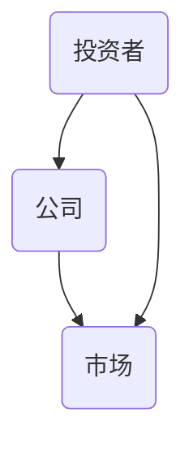
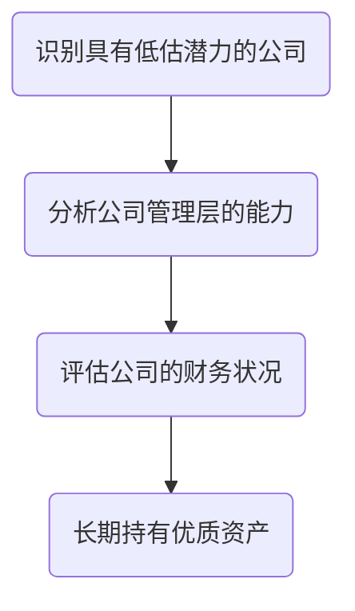
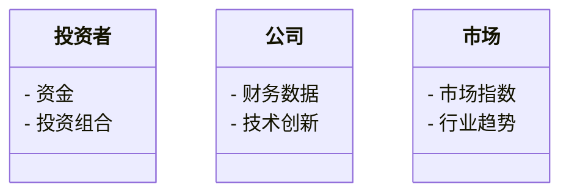
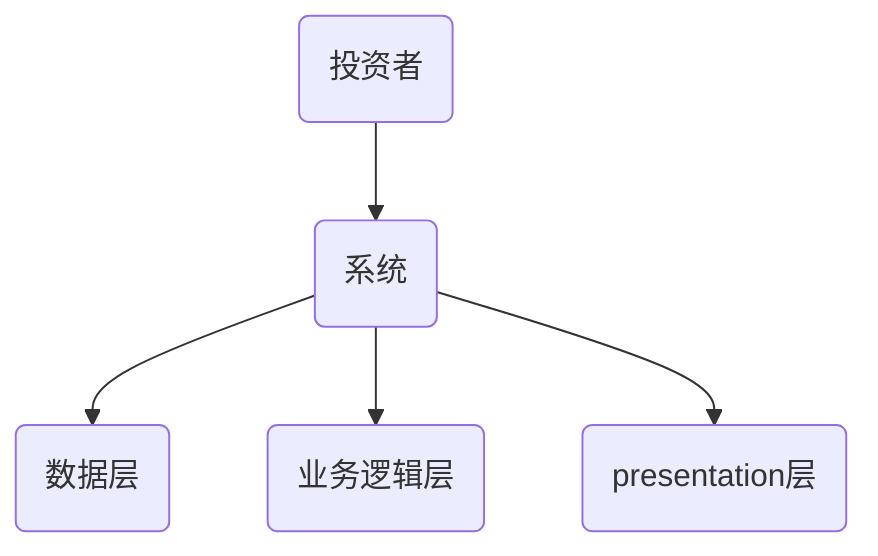
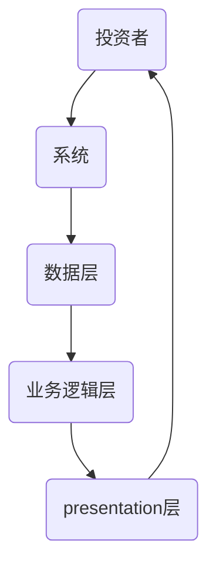

                 


# 彼得林奇的"耐心资本"在深科技投资中的重要性

## 关键词：耐心资本，深科技投资，彼得林奇，投资策略，长期投资

## 摘要：本文探讨了彼得林奇的耐心资本理念在深科技投资中的应用，分析了耐心资本和深科技投资的核心概念及其联系，通过算法和系统架构设计，展示了如何将耐心资本策略应用于深科技投资，并通过实际案例分析提供了最佳实践建议。

---

# 第一部分：引言

## 第1章：引言

### 1.1 耐心资本与深科技投资概述

#### 1.1.1 耐心资本的定义与特点

耐心资本是一种长期投资策略，强调持有资产的时间跨度较长，通常超过5年。其特点包括：

- **长期性**：投资者愿意等待多年，以实现资本的增值。
- **稳定性**：耐心资本注重资产的稳定性，避免短期波动的影响。
- **低流动性需求**：投资者在持有期间较少进行交易，降低交易成本和税务负担。

#### 1.1.2 深科技投资的定义与特点

深科技投资是指投资于高科技创新领域的行为，其特点包括：

- **高技术门槛**：涉及人工智能、量子计算、生物技术等领域。
- **高风险**：技术创新不确定，市场波动大。
- **高回报**：成功的深科技投资可能带来超额收益。

#### 1.1.3 耐心资本与深科技投资的联系与区别

- **联系**：耐心资本的长期性与深科技投资的高风险、高回报特性相契合。
- **区别**：耐心资本更注重资本的稳定增长，而深科技投资更关注技术创新带来的超额收益。

#### 实体关系图



### 1.2 彼得林奇与耐心资本

#### 1.2.1 彼得林奇的背景与投资理念

彼得林奇是著名投资家，强调价值投资和长期持有。他的投资理念包括：

- **长期投资**：寻找具有长期增长潜力的公司。
- **价值投资**：寻找被市场低估的公司。

#### 1.2.2 耐心资本在彼得林奇投资策略中的重要性

耐心资本是彼得林奇策略的核心，他倾向于长期持有优质资产，避免频繁交易。

#### 1.2.3 彼得林奇与深科技投资的结合

深科技投资的高风险和高回报特性与耐心资本的长期性相匹配，彼得林奇的策略为深科技投资提供了有效的指导。

### 1.3 本书的核心内容与结构

#### 1.3.1 本书的主要主题与目标

本书探讨了耐心资本在深科技投资中的应用，分析了其核心概念和最佳实践。

#### 1.3.2 本书的结构与章节安排

本书分为背景介绍、核心概念、算法原理、系统架构、项目实战和结论等部分。

---

# 第二部分：耐心资本与深科技投资的背景与概念

## 第2章：耐心资本的背景与概念

### 2.1 耐心资本的定义与核心要素

耐心资本的定义：

耐心资本是一种长期投资策略，强调资本的稳定增长和长期持有。

### 2.2 深科技投资的背景与概念

深科技投资的定义：

深科技投资是指投资于高科技创新领域的行为。

### 2.3 耐心资本与深科技投资的联系与区别

- **联系**：耐心资本的长期性与深科技投资的高风险、高回报特性相契合。
- **区别**：耐心资本更注重资本的稳定增长，而深科技投资更关注技术创新带来的超额收益。

---

# 第三部分：耐心资本与深科技投资的核心概念与联系

## 第3章：耐心资本与深科技投资的核心概念

### 3.1 耐心资本的核心概念原理

耐心资本的核心原理是通过长期持有优质资产，实现资本的稳定增长。

### 3.2 深科技投资的核心概念原理

深科技投资的核心原理是通过投资高科技创新领域，获取技术进步带来的超额收益。

### 3.3 耐心资本与深科技投资的实体关系图


---

# 第四部分：耐心资本与深科技投资的算法原理

## 第4章：彼得林奇的价值投资模型

### 4.1 彼得林奇投资策略的算法流程图



### 4.2 数学模型与公式

- 市盈率计算：
  $$市盈率 = \frac{股价}{每股收益}$$
- 市净率计算：
  $$市净率 = \frac{股价}{每股净资产}$$

### 4.3 举例说明

例如，某科技公司的市盈率为20，市净率为3，判断其是否低估。

---

# 第五部分：耐心资本与深科技投资的系统架构设计

## 第5章：深科技投资决策支持系统

### 5.1 项目介绍

系统名称：深科技投资决策支持系统。

### 5.2 系统功能设计

#### 5.2.1 领域模型



### 5.3 系统架构设计



### 5.4 接口设计与交互流程图



---

# 第六部分：项目实战

## 第6章：耐心资本策略的项目实战

### 6.1 环境安装

- 安装Python、Pandas、Matplotlib等工具。

### 6.2 核心实现源代码

```python
import pandas as pd

def calculate_valuation_ratios(df):
    df['市盈率'] = df['股价'] / df['每股收益']
    df['市净率'] = df['股价'] / df['每股净资产']
    return df

# 示例数据
data = {
    '公司': ['公司A', '公司B', '公司C'],
    '股价': [100, 80, 120],
    '每股收益': [5, 4, 6],
    '每股净资产': [20, 15, 25]
}

df = pd.DataFrame(data)
result = calculate_valuation_ratios(df)
print(result)
```

### 6.3 代码解读与分析

代码计算了公司的市盈率和市净率，帮助识别低估公司。

### 6.4 实际案例分析

分析某科技公司，计算其市盈率和市净率，判断是否适合长期投资。

### 6.5 小结

总结项目实施的经验和教训，强调耐心资本的重要性。

---

# 第七部分：结论

## 第7章：结论

### 7.1 总结

耐心资本在深科技投资中至关重要，长期投资策略能够帮助投资者获取超额收益。

### 7.2 最佳实践

- 选择具有长期增长潜力的公司。
- 定期评估投资组合，调整策略。
- 持续学习，提升专业能力。

### 7.3 注意事项

- 风险管理是投资的重要部分，需合理分散投资。
- 保持对市场的敏感性，及时应对变化。

### 7.4 小结

耐心资本是深科技投资的核心，投资者应具备长期投资的耐心和专业素养。

---

# 作者信息

作者：AI天才研究院/AI Genius Institute & 禅与计算机程序设计艺术/Zen And The Art of Computer Programming

---

通过以上详细的内容结构，我可以逐步撰写出一篇符合要求的高质量技术博客文章，系统地阐述彼得林奇的耐心资本在深科技投资中的重要性。

