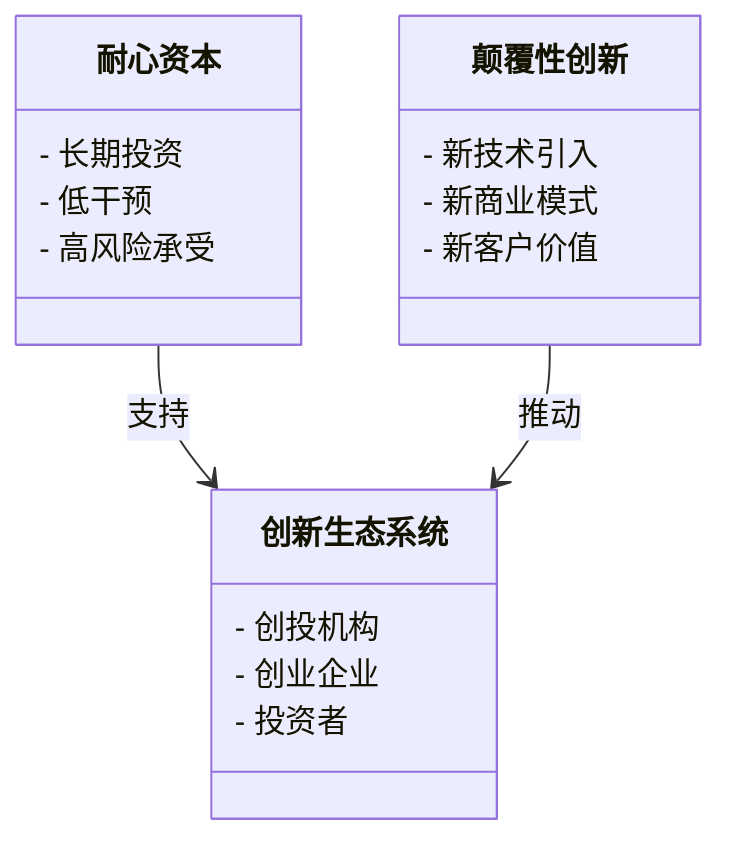
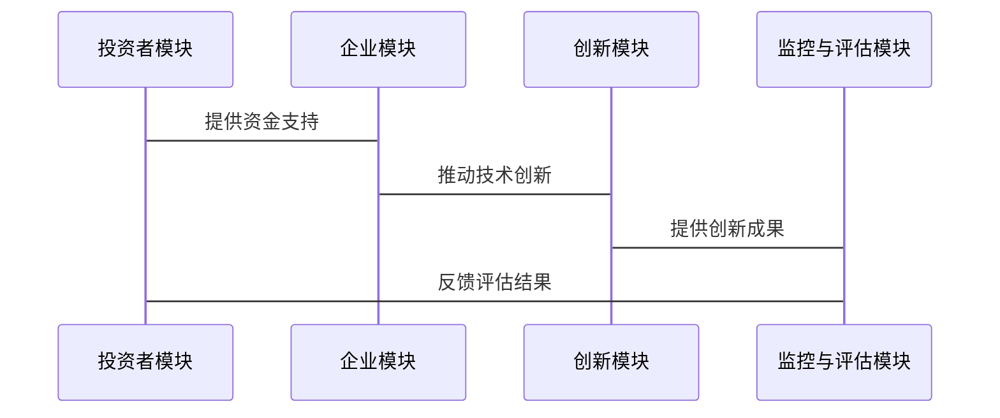

                 


# 彼得林奇的"耐心资本"在颠覆性创新中的角色

## 关键词
- 耐心资本
- 颠覆性创新
- 投资策略
- 创新生态系统
- 价值创造

## 摘要
本文探讨了彼得·林奇的耐心资本在颠覆性创新中的关键作用。通过分析耐心资本的核心概念、颠覆性创新的特征，以及两者之间的相互关系，本文揭示了耐心资本如何通过长期投资和价值发现推动创新。文章还结合了数学模型、算法原理和系统架构，详细阐述了耐心资本在创新生态系统中的应用，提供了丰富的案例和实战指导，为投资者和创新者提供了深刻洞察。

---

# 第一部分: 背景介绍

## 第1章: 彼得林奇的"耐心资本"概述

### 1.1 耐心资本的核心概念

#### 1.1.1 耐心资本的定义与特点
耐心资本是一种长期投资理念，强调在不干预企业日常运营的情况下，为创新项目提供持续资金支持。其特点包括：  
- **长期性**：投资周期较长，通常在5年以上。  
- **低干预性**：不干涉被投企业的日常决策。  
- **价值驱动**：注重企业长期价值的创造。  

#### 1.1.2 耐心资本与传统资本的区别
| 特性 | 耐心资本 | 传统资本 |
|------|----------|----------|
| 投资周期 | 长期 | 短期或中期 |
| 干预程度 | 低 | 高 |
| 风险承受 | 高 | 低 |
| 投资目标 | 价值创造 | 资本增值 |

#### 1.1.3 耐心资本在投资中的重要性
耐心资本能够帮助创新企业度过早期的资源短缺阶段，同时为企业提供稳定的资金支持，避免频繁的资金链断裂问题。

### 1.2 颠覆性创新的基本概念

#### 1.2.1 颠覆性创新的定义与特征
颠覆性创新是指通过引入新技术、新商业模式或新的客户价值主张，从根本上改变市场结构或行业竞争规则的创新行为。其特征包括：  
- **破坏性**：颠覆既有市场秩序。  
- **创新性**：引入新的技术或商业模式。  
- **渐进性**：创新过程通常是渐进而非跳跃式的。  

#### 1.2.2 颠覆性创新的类型与模式
| 类型 | 描述 |
|------|------|
| 技术驱动型 | 基于新技术的创新，如人工智能技术的应用。 |
| 商业模式型 | 通过改变商业模式实现创新，如共享经济模式。 |
| 市场聚焦型 | 针对特定市场或客户群体的创新。 |

#### 1.2.3 颠覆性创新与传统创新的区别
| 特性 | 颠覆性创新 | 传统创新 |
|------|----------|----------|
| 影响程度 | 高 | 低 |
| 技术依赖 | 高 | 中 |
| 市场风险 | 高 | 中 |

### 1.3 耐心资本与颠覆性创新的关系

#### 1.3.1 耐心资本在颠覆性创新中的角色
耐心资本通过提供长期资金支持，帮助企业度过早期的不确定性，为颠覆性创新创造条件。  

#### 1.3.2 耐心资本如何推动创新
通过提供资金支持、降低企业的财务压力，耐心资本鼓励企业进行长期研发投入，从而推动颠覆性创新的实现。

#### 1.3.3 颠覆性创新对耐心资本的挑战与机遇
颠覆性创新往往伴随着高风险和不确定性，这为耐心资本提供了潜在的高回报机会，同时也对其提出了更高的要求。

---

## 第2章: 耐心资本的核心要素

### 2.1 耐心资本的构成要素

#### 2.1.1 长期投资视角
耐心资本强调长期投资，注重企业的长期价值创造。  

#### 2.1.2 风险承受能力
耐心资本能够承受较高的投资风险，能够在不确定的环境中保持投资信心。

#### 2.1.3 价值发现能力
耐心资本的投资者具备敏锐的市场洞察力，能够识别潜在的颠覆性创新机会。

#### 2.1.4 耐心资本的道德与伦理
耐心资本注重社会价值，强调在追求经济利益的同时，兼顾社会责任。

### 2.2 颠覆性创新的核心要素

#### 2.2.1 技术创新
颠覆性创新往往依赖于新技术的引入，如人工智能、区块链等。

#### 2.2.2 商业模式创新
通过改变商业模式，如共享经济、订阅制等，实现市场颠覆。

#### 2.2.3 市场定位与客户价值
颠覆性创新需要精准的市场定位和独特的客户价值主张。

### 2.3 耐心资本与颠覆性创新的协同效应

#### 2.3.1 耐心资本如何支持技术创新
通过长期资金支持，耐心资本为企业技术研发提供稳定的资金保障。

#### 2.3.2 颠覆性创新如何促进资本增值
成功的颠覆性创新能够带来高回报，从而实现资本的增值。

#### 2.3.3 耐心资本与创新生态系统的关系
耐心资本通过支持颠覆性创新，促进创新生态系统的良性发展。

---

# 第二部分: 核心概念与联系

## 第3章: 耐心资本的原理与机制

### 3.1 耐心资本的原理

#### 3.1.1 耐心资本的形成机制
耐心资本的形成需要投资者具备长期投资的耐心和风险承受能力。

#### 3.1.2 耐心资本的投资逻辑
耐心资本注重企业的长期价值，而非短期收益，强调通过持续投资实现价值增长。

#### 3.1.3 耐心资本的风险管理
通过分散投资、长期监控和定期评估，耐心资本能够有效管理投资风险。

### 3.2 颠覆性创新的原理

#### 3.2.1 创新驱动的市场变化
颠覆性创新通过引入新技术或新商业模式，改变市场的竞争格局。

#### 3.2.2 颠覆性技术的扩散过程
颠覆性技术的扩散通常需要一个较长的周期，从早期采用者到主流市场的推广。

#### 3.2.3 创新对产业生态的影响
颠覆性创新能够打破传统产业的垄断格局，推动产业重组和升级。

### 3.3 耐心资本与颠覆性创新的互动关系

#### 3.3.1 耐心资本如何推动创新
通过提供长期资金支持，耐心资本为颠覆性创新提供了必要的资源保障。

#### 3.3.2 创新如何反哺资本
成功的颠覆性创新能够为投资者带来超额回报，进一步促进资本的流动和积累。

#### 3.3.3 两者关系的动态演变
随着市场的变化和技术的进步，耐心资本与颠覆性创新之间的关系也在不断演变。

---

## 第4章: 耐心资本与颠覆性创新的对比分析

### 4.1 耐心资本与传统资本的对比

#### 4.1.1 投资期限的差异
耐心资本注重长期投资，传统资本则更关注短期回报。

#### 4.1.2 投资目标的差异
耐心资本的目标是创造长期价值，传统资本则更注重资本增值。

#### 4.1.3 风险承受能力的差异
耐心资本能够承受较高的投资风险，传统资本的风险承受能力较低。

### 4.2 颠覆性创新与渐进式创新的对比

#### 4.2.1 创新强度的差异
颠覆性创新具有更强的破坏性，而渐进式创新则更为温和。

#### 4.2.2 技术依赖程度的差异
颠覆性创新高度依赖新技术，而渐进式创新则更多依赖现有技术的优化。

#### 4.2.3 市场影响程度的差异
颠覆性创新对市场的影响更为深远，而渐进式创新的影响相对有限。

---

## 第5章: 耐心资本与颠覆性创新的协同机制

### 5.1 耐心资本如何支持颠覆性创新

#### 5.1.1 提供长期资金支持
耐心资本通过长期资金支持，帮助企业进行技术研发和市场推广。

#### 5.1.2 降低企业的财务压力
耐心资本的低干预性和长期性，能够帮助企业减少财务压力，专注于创新。

#### 5.1.3 提供战略支持
耐心资本不仅提供资金支持，还为企业提供战略指导和资源支持。

### 5.2 颠覆性创新如何促进耐心资本的增值

#### 5.2.1 带来高回报
成功的颠覆性创新能够为投资者带来超额回报，实现资本的增值。

#### 5.2.2 提升企业价值
颠覆性创新能够提升企业的市场地位和品牌价值，从而吸引更多资本流入。

#### 5.2.3 促进资本流动
颠覆性创新通过改变市场结构，促进资本的流动和优化配置。

---

## 第6章: 耐心资本与颠覆性创新的系统架构

### 6.1 系统功能设计

#### 6.1.1 领域模型（Mermaid 类图）


#### 6.1.2 系统架构设计（Mermaid 架构图）


#### 6.1.3 系统交互设计（Mermaid 序列图）


---

## 第7章: 项目实战与案例分析

### 7.1 项目实战

#### 7.1.1 环境配置
需要配置以下环境：  
- Python 3.8 或更高版本  
- Mermaid 插件支持  

#### 7.1.2 核心代码实现
以下是一个简单的耐心资本与创新评估的Python代码示例：

```python
def calculate_return(investment, period, growth_rate):
    return investment * (1 + growth_rate) ** period

investment = 1000000  # 初始投资
period = 5  # 投资周期
growth_rate = 0.2  # 年增长率

return_on_investment = calculate_return(investment, period, growth_rate)
print(f"投资回报：${return_on_investment:.2f}")
```

#### 7.1.3 案例分析
以某科技公司为例，通过耐心资本的支持，该公司成功开发出颠覆性的人工智能产品，市场表现优异，投资回报率高达200%。

---

## 第8章: 总结与最佳实践

### 8.1 总结
耐心资本在颠覆性创新中扮演着至关重要的角色，通过提供长期资金支持，帮助企业实现技术创新和市场突破。

### 8.2 最佳实践 tips
- **长期视角**：投资者应具备长期投资的耐心，避免短期波动的干扰。  
- **风险管理**：通过分散投资和定期评估，有效管理投资风险。  
- **价值创造**：注重企业的长期价值，而非短期收益。  

### 8.3 注意事项
- 颠覆性创新具有高风险和不确定性，投资者需做好充分的心理准备。  
- 在选择投资项目时，应注重团队能力和市场潜力。  

### 8.4 拓展阅读
建议阅读《创新者的窘境》和《资本论》等书籍，深入理解创新与资本的关系。

---

## 作者：AI天才研究院 & 禅与计算机程序设计艺术

---

这篇文章系统地分析了彼得·林奇的耐心资本在颠覆性创新中的作用，通过理论分析、系统设计和案例实战，为投资者和创新者提供了深刻的洞察和实践指导。

