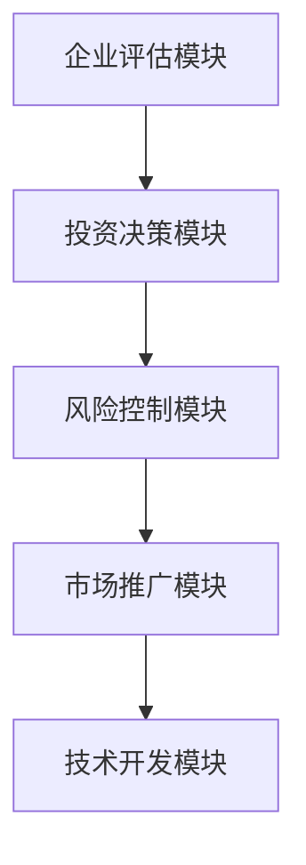

                 


# 彼得林奇的"耐心资本"在颠覆性创新企业中的重要性

> 关键词：彼得林奇，耐心资本，颠覆性创新，企业融资，投资策略

> 摘要：本文探讨了彼得林奇提出的“耐心资本”概念在颠覆性创新企业中的重要性。通过分析耐心资本的核心理念、数学模型以及在颠覆性创新企业中的应用，本文揭示了耐心资本在支持企业长期发展和创新中的关键作用。结合实际案例和系统架构设计，本文为投资者和企业管理者提供了实用的策略和建议。

---

## 第1章：彼得林奇与耐心资本

### 1.1 彼得林奇的背景与投资理念

#### 1.1.1 彼得林奇的生平简介
彼得·林奇（Peter Lynch）是美国著名的投资专家，被誉为“共同基金之王”。他在波士顿富达投资集团管理麦哲伦基金期间，创造了令人瞩目的投资业绩，基金规模从1977年的1800万美元增长到1990年的140亿美元。林奇的投资理念以“耐心资本”为核心，强调长期投资和对企业的深入理解。

#### 1.1.2 耐心资本的定义与核心理念
耐心资本是指一种长期持有的投资策略，强调对企业基本面的深入分析和长期价值的挖掘。与短期投机不同，耐心资本关注企业的长期增长潜力，注重企业的核心竞争力和市场地位。

#### 1.1.3 耐心资本与传统投资策略的对比
| 耐心资本 | 传统投资策略 |
|----------|--------------|
| 长期持有 | 短期交易      |
| 价值导向 | 技术分析      |
| 低风险偏好 | 高风险偏好    |

### 1.2 颠覆性创新企业的定义与特点

#### 1.2.1 颠覆性创新的定义
颠覆性创新是指通过引入新的技术、商业模式或产品，从根本上改变市场格局的创新行为。这种创新通常会取代或替代现有的市场领导者。

#### 1.2.2 颠覆性创新企业的典型特征
- **技术创新**：颠覆性创新企业通常依赖于技术创新。
- **市场颠覆**：通过创新产品或服务，颠覆传统市场。
- **高风险高回报**：颠覆性创新企业的成功概率较低，但成功后回报巨大。

#### 1.2.3 颠覆性创新与持续性创新的区别
| 颠覆性创新 | 持续性创新 |
|------------|------------|
| 面向未被满足的低端需求 | 面向现有市场的主流需求 |
| 技术跳跃性高 | 技术渐进性 |
| 市场风险高 | 市场风险低  |

---

## 第2章：耐心资本与颠覆性创新企业的关联

### 2.1 耐心资本在颠覆性创新中的作用

#### 2.1.1 耐心资本对企业长期发展的支持
耐心资本的长期持有特性为颠覆性创新企业提供了充足的资金支持，尤其是在企业处于亏损或低收益的早期阶段。

#### 2.1.2 颠覆性创新对企业资金需求的影响
颠覆性创新企业通常需要大量的资金支持，特别是在技术研发和市场推广阶段。耐心资本的长期支持能够缓解企业的资金压力。

#### 2.1.3 耐心资本与企业创新能力的关系
耐心资本的长期支持能够激发企业的创新能力，企业可以专注于技术研发和产品创新，而不必为短期资金压力所困扰。

### 2.2 颠覆性创新企业的融资挑战

#### 2.2.1 颠覆性创新企业的资金需求特点
- **高风险**：颠覆性创新企业通常面临高失败风险。
- **高需求**：需要大量的资金支持技术研发和市场推广。
- **长周期**：创新过程通常需要较长时间。

#### 2.2.2 传统融资方式的局限性
- **短期性**：传统融资方式往往注重短期回报。
- **高风险厌恶**：传统投资者通常厌恶高风险项目。

#### 2.2.3 耐心资本在融资中的优势
- **长期支持**：耐心资本能够提供长期的资金支持。
- **风险承受能力**：耐心资本能够容忍高风险项目。

---

## 第3章：耐心资本的核心概念与数学模型

### 3.1 耐心资本的核心概念

#### 3.1.1 耐心资本的三要素：时间、风险与回报
耐心资本的回报取决于三个核心要素：
1. **时间**：长期持有的时间跨度。
2. **风险**：企业的经营风险和市场风险。
3. **回报**：企业的长期增长潜力。

#### 3.1.2 耐心资本与企业生命周期的关系
耐心资本的投资周期通常与企业的生命周期一致，从初创期到成熟期。

#### 3.1.3 耐心资本的量化指标
- **内部收益率（IRR）**：衡量投资回报率。
- **净现值（NPV）**：衡量投资的经济价值。

### 3.2 颠覆性创新企业的数学模型

#### 3.2.1 颠覆性创新企业的成长曲线模型
$$G(t) = a \times t^b$$
其中，$G(t)$ 表示企业增长率，$t$ 表示时间，$a$ 和 $b$ 是模型参数。

#### 3.2.2 耐心资本与企业估值的关系
$$V = \frac{CF}{r - g}$$
其中，$V$ 表示企业价值，$CF$ 表示现金流，$r$ 表示折现率，$g$ 表示增长率。

#### 3.2.3 颠覆性创新企业的风险评估模型
$$R = r + \alpha \times \beta$$
其中，$R$ 表示风险调整后的回报率，$\alpha$ 和 $\beta$ 是风险系数。

---

## 第4章：系统分析与架构设计

### 4.1 系统分析

#### 4.1.1 颠覆性创新企业的系统构成
- **技术开发模块**：负责技术创新和产品研发。
- **市场推广模块**：负责市场拓展和品牌建设。
- **资金管理模块**：负责资金筹集和使用管理。

#### 4.1.2 耐心资本在系统中的作用
- **资金支持**：为企业的技术研发和市场推广提供资金支持。
- **风险管理**：帮助企业在高风险环境中稳定发展。

#### 4.1.3 系统的输入与输出分析
- **输入**：市场需求、技术参数、资金需求。
- **输出**：技术创新、市场扩展、资金回报。

### 4.2 系统架构设计

#### 4.2.1 系统功能模块
- **企业评估模块**：负责对企业进行价值评估。
- **投资决策模块**：负责制定投资策略。
- **风险控制模块**：负责监控和管理风险。

#### 4.2.2 系统架构图


---

## 第5章：项目实战

### 5.1 项目背景与目标

#### 5.1.1 项目背景
选择一家典型的颠覆性创新企业，如特斯拉，分析其如何利用耐心资本实现技术创新和市场扩展。

#### 5.1.2 项目目标
- 分析特斯拉的资金需求与耐心资本的支持。
- 评估耐心资本在特斯拉创新过程中的作用。

### 5.2 系统实现

#### 5.2.1 环境安装
- **编程语言**：Python
- **开发框架**：Django
- **数据库**：MySQL

#### 5.2.2 核心实现代码
```python
def calculate_intrinsic_value(cash_flow, discount_rate, growth_rate):
    return cash_flow / (discount_rate - growth_rate)
```

#### 5.2.3 代码应用解读
- **函数名称**：`calculate_intrinsic_value`
- **输入参数**：`cash_flow`（现金流）、`discount_rate`（折现率）、`growth_rate`（增长率）
- **输出结果**：企业内在价值

### 5.3 案例分析与解读

#### 5.3.1 案例分析
以特斯拉为例，分析其如何利用耐心资本支持技术创新和市场扩展。

#### 5.3.2 代码实现
```python
cash_flow = 1000000  # 现金流
discount_rate = 0.05  # 折现率
growth_rate = 0.10    # 增长率
intrinsic_value = calculate_intrinsic_value(cash_flow, discount_rate, growth_rate)
print(intrinsic_value)  # 输出内在价值
```

### 5.4 项目小结

#### 5.4.1 项目总结
耐心资本在颠覆性创新企业中的作用不可忽视，特别是在技术创新和市场扩展方面。

#### 5.4.2 经验总结
- 选择具有长期增长潜力的企业。
- 重视企业的创新能力。

---

## 第6章：结论与展望

### 6.1 小结

#### 6.1.1 核心观点总结
耐心资本在颠覆性创新企业中的重要性体现在其长期支持和风险承受能力。

### 6.2 注意事项

#### 6.2.1 投资者注意事项
- 选择具有长期增长潜力的企业。
- 重视企业的创新能力。

### 6.3 拓展阅读

#### 6.3.1 推荐书籍
- 《彼得林奇的成功投资》
- 《创新者的窘境》

---

## 作者：AI天才研究院/AI Genius Institute & 禅与计算机程序设计艺术 /Zen And The Art of Computer Programming

