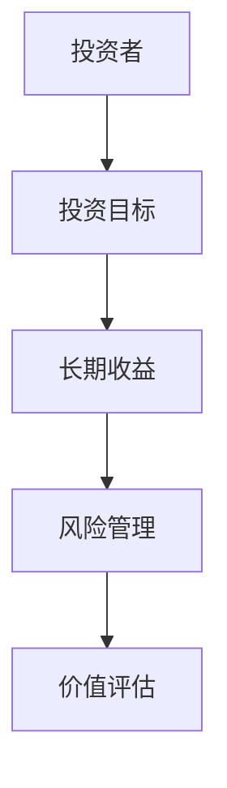

                 


# 彼得林奇的"耐心资本"投资案例

## 关键词：彼得林奇，耐心资本，投资策略，价值投资，风险管理，长期收益

## 摘要：本文深入分析了彼得·林奇的“耐心资本”投资理念，探讨其理论基础、核心策略及实际案例，揭示了耐心资本在现代投资中的重要性。文章从背景、概念、算法、系统、实战和最佳实践等方面展开，为读者提供全面的视角。

---

## 第一部分: 背景介绍

### 第1章: 耐心资本的定义与背景

#### 1.1 什么是耐心资本

- **1.1.1 耐心资本的定义**  
  耐心资本是指投资者以长期视角进行投资，注重企业的内在价值，而非短期市场波动。它强调持有优质资产，等待其价值逐步实现。

- **1.1.2 耐心资本的核心要素**  
  耐心资本的核心要素包括：长期视角、基本面分析、风险管理、价值评估和持续学习。

- **1.1.3 耐心资本与传统投资的区别**  
  | 方面 | 耐心资本 | 传统投资 |
  |------|----------|----------|
  | 时间框架 | 长期持有 | 短期交易 |
  | 目标 | 价值增长 | 价格波动 |
  | 风险管理 | 严格控制 | 较为宽松 |

#### 1.2 彼得·林奇的投资理念

- **1.2.1 彼得·林奇的生平简介**  
  彼得·林奇是美国著名投资家，管理富达麦哲伦基金期间取得了卓越成绩，以价值投资和基本面分析闻名。

- **1.2.2 彼得·林奇的投资哲学**  
  林奇强调买入低估的优质企业，长期持有，避免频繁交易，注重企业内在价值。

- **1.2.3 耐心资本在彼得·林奇投资中的重要性**  
  耐心资本是林奇成功的关键，他通过长期持有优质资产，实现稳定收益。

#### 1.3 耐心资本的背景与现状

- **1.3.1 当前投资环境的挑战**  
  现代市场波动剧烈，短期投机盛行，耐心资本面临考验。

- **1.3.2 耐心资本在现代投资中的应用**  
  耐心资本在机构和个人投资者中逐渐受到重视，被视为稳健投资策略。

- **1.3.3 耐心资本的未来发展趋势**  
  随着市场成熟，耐心资本将获得更多应用，尤其是在ESG投资等领域。

---

## 第二部分: 核心概念与联系

### 第2章: 耐心资本的核心要素

#### 2.1 耐心资本的核心原理

- **2.1.1 长期视角的重要性**  
  长期视角帮助投资者忽视短期波动，专注于企业的长期增长。

- **2.1.2 基本面分析的关键性**  
  通过分析企业的财务状况、行业地位和竞争优势，识别低估资产。

- **2.1.3 风险管理的必要性**  
  通过分散投资和严格止损，降低风险，确保资本安全。

#### 2.2 耐心资本的核心概念对比

- **2.2.1 耐心资本与短期投资的对比**  
  耐心资本注重长期价值，短期投资关注价格波动。

- **2.2.2 耐心资本与投机投资的对比**  
  耐心资本基于基本面分析，投机投资依赖市场情绪。

- **2.2.3 耐心资本与价值投资的对比**  
  两者都注重内在价值，但耐心资本更强调长期持有。

#### 2.3 耐心资本的ER实体关系图



---

## 第三部分: 算法原理讲解

### 第3章: 耐心资本的算法原理

#### 3.1 耐心资本的算法概述

- **3.1.1 算法的输入与输出**  
  输入：企业财务数据、市场数据；输出：投资建议、风险评估。

- **3.1.2 算法的核心步骤**  
  1. 数据收集与预处理  
  2. 基本面分析  
  3. 风险评估  
  4. 投资决策  

- **3.1.3 算法的优化与改进**  
  通过机器学习优化基本面分析，提高模型准确性。

#### 3.2 耐心资本算法的详细步骤

- **3.2.1 数据收集与预处理**  
  收集企业财务报表、行业数据、市场指数等，清洗和标准化数据。

- **3.2.2 基本面分析模型**  
  使用市盈率、市净率等指标评估企业价值。

- **3.2.3 风险评估模型**  
  通过波动率和行业风险评估整体风险。

- **3.2.4 投资决策模型**  
  综合价值和风险评估，制定投资策略。

#### 3.3 算法的数学模型与公式

- **3.3.1 基本面分析公式**  
  内在价值计算公式：  
  $$ \text{内在价值} = \frac{\text{EBIT} \times (1 + g)}{r - g} $$  
  其中，EBIT为息税前利润，g为增长率，r为贴现率。

- **3.3.2 风险评估公式**  
  风险调整后价值公式：  
  $$ \text{调整价值} = \text{内在价值} \times (1 - \text{风险权重}) $$

---

## 第四部分: 系统分析与架构设计

### 第4章: 耐心资本的系统分析

#### 4.1 问题场景介绍

- 投资者需要一个系统化的方法来应用耐心资本策略，实现长期收益。

#### 4.2 系统功能设计

- **4.2.1 领域模型类图**  
  ```mermaid
  classDiagram
      class 投资者 {
          帐户
          投资组合
          风险承受能力
      }
      class 投资目标 {
          企业
          股票
          行业
      }
      class 系统功能 {
          数据收集
          基本面分析
          风险评估
          投资决策
      }
      投资者 --> 系统功能
      投资目标 --> 系统功能
  ```

- **4.2.2 系统架构图**  
  ```mermaid
  architecture
      客户端 <---> 服务器
      服务器 <---> 数据库
      服务器 <---> 分析模块
  ```

- **4.2.3 系统接口设计**  
  REST API：`/api/invest/value`，接收企业数据，返回内在价值。

- **4.2.4 系统交互序列图**  
  ```mermaid
  sequenceDiagram
      投资者 -> 系统功能: 提交投资目标
      系统功能 -> 数据库: 获取企业数据
      数据库 -> 系统功能: 返回数据
      系统功能 -> 分析模块: 进行基本面分析
      分析模块 -> 系统功能: 返回分析结果
      系统功能 -> 投资者: 提供投资建议
  ```

---

## 第五部分: 项目实战

### 第5章: 耐心资本的项目实战

#### 5.1 环境安装

- **5.1.1 安装Python和相关库**  
  使用Anaconda安装Python，安装pandas、numpy、scikit-learn等库。

#### 5.2 系统核心实现源代码

- **5.2.1 数据收集代码**  
  ```python
  import pandas as pd

  def collect_data(tickers):
      data = {}
      for ticker in tickers:
          df = pd.DataFrame(columns=['price', 'eps', 'revenue'])
          data[ticker] = df
      return data
  ```

- **5.2.2 基本面分析代码**  
  ```python
  def calculate_intrinsic_value(data):
      for ticker in data:
          df = data[ticker]
          df['intrinsic_value'] = df['eps'] * (1 + 0.05) / (0.1 - 0.05)
      return data
  ```

#### 5.3 代码应用解读与分析

- 代码实现耐心资本的算法，包括数据收集和内在价值计算，帮助投资者做出决策。

#### 5.4 实际案例分析

- **5.4.1 微软公司案例**  
  分析微软的财务数据，计算其内在价值，评估投资潜力。

- **5.4.2 可口可乐公司案例**  
  通过基本面分析，评估可口可乐的投资价值。

#### 5.5 项目小结

- 项目展示了如何将耐心资本理念应用于实际投资，帮助投资者实现长期收益。

---

## 第六部分: 最佳实践

### 第6章: 耐心资本的最佳实践

#### 6.1 小结

- 耐心资本强调长期投资，基本面分析和风险管理是关键。

#### 6.2 注意事项

- 避免短期市场波动干扰，保持长期视角，定期复盘和调整。

#### 6.3 拓展阅读

- 推荐书籍：《彼得·林奇的成功投资》、《投资最重要的少数事》。

---

## 结语

耐心资本是实现长期投资收益的有效策略，通过系统的分析和实战案例，投资者可以更好地理解和应用这一理念。

---

## 作者：AI天才研究院/AI Genius Institute & 禅与计算机程序设计艺术 /Zen And The Art of Computer Programming

