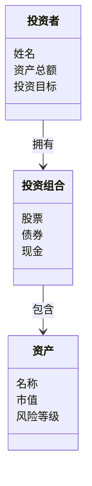
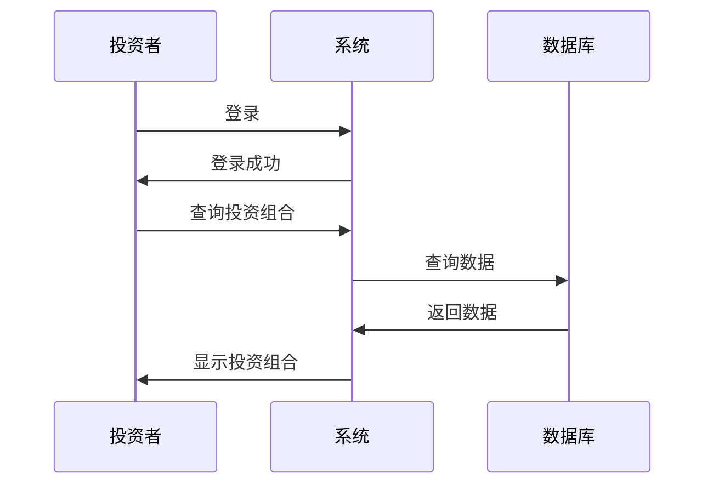

                 


# 彼得林奇的"耐心资本"投资理念

## 关键词：耐心资本，彼得林奇，投资理念，长期投资，风险管理

## 摘要：彼得·林奇的耐心资本投资理念强调长期投资、价值投资和分散投资。通过耐心持有优质股票，投资者能够在市场波动中获得稳定的收益。本文将详细探讨耐心资本的核心概念、投资策略、风险管理以及实际应用，帮助读者掌握这一经典的投资理念。

---

# 第一部分: 背景介绍

# 第1章: 耐心资本投资理念的背景与起源

## 1.1 投资理念的起源与发展
### 1.1.1 传统投资理念的演进
从早期的短期交易到长期投资的演变，耐心资本的起源与发展。

### 1.1.2 耐心资本的定义与特点
耐心资本是指投资者长期持有优质资产，不因短期波动而改变投资策略。

### 1.1.3 耐心资本在现代投资中的地位
耐心资本作为价值投资的重要组成部分，强调长期持有的优势。

## 1.2 投资理念的核心要素
### 1.2.1 长期投资的核心要素
耐心资本的核心要素包括长期持有、价值发现和分散投资。

### 1.2.2 耐心资本与价值投资的联系
耐心资本与价值投资的共同点在于寻找优质资产，长期持有。

### 1.2.3 耐心资本与其他投资策略的区别
耐心资本与短期交易、投机投资等策略的区别在于其长期性和稳定性。

## 1.3 耐心资本投资理念的应用场景
### 1.3.1 耐心资本在股票投资中的应用
通过长期持有优质股票，获得稳定的收益。

### 1.3.2 耐心资本在风险投资中的应用
在风险投资中，耐心资本帮助投资者在波动的市场中保持稳定。

### 1.3.3 耐心资本在私募基金中的应用
私募基金通过长期投资优质项目，实现资本的稳步增长。

## 1.4 本章小结
总结耐心资本投资理念的背景、定义、特点及其在不同投资领域中的应用。

---

# 第二部分: 核心概念与联系

# 第2章: 耐心资本的核心概念与联系

## 2.1 耐心资本的核心概念
### 2.1.1 耐心资本的核心原理
耐心资本通过长期持有优质资产，实现价值增长。

### 2.1.2 耐心资本的属性特征对比
使用表格对比耐心资本与短期投资、投机投资的属性特征。

| 投资理念 | 时间跨度 | 风险承受 | 资产选择 |
|----------|----------|----------|----------|
| 耐心资本 | 长期     | 较低     | 优质资产 |
| 短期投资 | 短期     | 较高     | 操作灵活 |

### 2.1.3 耐心资本的ER实体关系图
使用mermaid绘制耐心资本相关的实体关系图。

```mermaid
erDiagram
    customer[投资者] 
    portfolio[投资组合] 
    asset[资产] 
    relation1: 1 investor ->> 1 portfolio
    relation2: 1 portfolio ->> 1 asset
```

## 2.2 耐心资本与其他投资理念的对比
### 2.2.1 耐心资本与短期投资的对比
长期与短期投资在目标、策略和风险上的对比。

### 2.2.2 耐心资本与投机投资的对比
价值投资与投机投资在理念和风险上的差异。

### 2.2.3 耐心资本与价值投资的对比
耐心资本作为价值投资的一部分，强调长期持有。

## 2.3 耐心资本的数学模型与公式
### 2.3.1 投资回报率的计算公式
$$ ROI = \frac{\text{收益} - \text{投入}}{\text{投入}} \times 100\% $$

### 2.3.2 投资组合的收益与风险模型
使用方差和标准差衡量投资组合的风险。

### 2.3.3 耐心资本的数学模型
通过公式展示耐心资本在长期投资中的优势。

---

# 第三部分: 投资策略与风险管理

# 第3章: 耐心资本的投资策略

## 3.1 耐心资本的投资策略概述
### 3.1.1 长期持有策略
耐心资本的核心策略，通过长期持有优质资产获得收益。

### 3.1.2 价值发现策略
寻找被市场低估的资产，长期持有以实现价值回归。

### 3.1.3 股票选择策略
选择基本面良好、管理团队优秀的企业股票。

## 3.2 投资组合的构建与优化
### 3.2.1 投资组合的构建原则
分散投资、长期持有、定期调整。

### 3.2.2 投资组合的优化方法
通过数学模型优化投资组合的风险和收益。

### 3.2.3 耐心资本在投资组合中的应用
将耐心资本理念融入投资组合管理。

## 3.3 风险管理与控制
### 3.3.1 风险识别与评估
识别市场风险、流动性风险等，并进行评估。

### 3.3.2 风险控制的策略
通过分散投资、定期评估等方式控制风险。

### 3.3.3 耐心资本的风险管理框架
构建风险管理框架，确保长期投资的安全性。

---

# 第四部分: 系统分析与架构设计

# 第4章: 耐心资本投资理念的系统架构

## 4.1 系统功能设计
### 4.1.1 投资组合管理
系统功能包括资产配置、风险评估、收益预测等。

### 4.1.2 数据分析与决策支持
通过数据分析提供投资建议，辅助决策。

### 4.1.3 风险管理与监控
实时监控投资组合的风险，及时调整策略。

## 4.2 领域模型mermaid类图
绘制领域模型类图，展示投资者、投资组合、资产之间的关系。



## 4.3 系统架构设计mermaid架构图
展示系统整体架构，包括前端、后端、数据库等模块。


## 4.4 系统接口设计
定义系统接口，如API接口，用于数据交互。

## 4.5 系统交互mermaid序列图
展示投资者与系统之间的交互流程。



---

# 第五部分: 项目实战

# 第5章: 耐心资本投资理念的项目实战

## 5.1 项目介绍
模拟投资组合构建，应用耐心资本理念进行投资。

## 5.2 环境安装
安装必要的工具和软件，如数据分析工具、投资管理软件等。

## 5.3 系统核心实现源代码
提供投资组合管理系统的源代码示例，如Python代码。

```python
def calculate_return(portfolio):
    return sum(asset.return for asset in portfolio.assets)

def risk_assessment(portfolio):
    returns = [asset.return for asset in portfolio.assets]
    variance = np.var(returns)
    return variance
```

## 5.4 代码应用解读与分析
解释代码的功能，展示如何通过代码实现投资组合的收益计算和风险评估。

## 5.5 实际案例分析
通过具体案例分析，展示耐心资本在实际投资中的应用效果。

## 5.6 项目小结
总结项目实施过程中的经验与教训，强调耐心资本理念的有效性。

---

# 第六部分: 最佳实践

# 第6章: 耐心资本投资理念的最佳实践

## 6.1 最佳实践 tips
### 6.1.1 投资策略选择
根据市场环境和个人风险承受能力选择合适的策略。

### 6.1.2 资产配置建议
合理配置资产，分散投资风险。

### 6.1.3 定期评估与调整
定期评估投资组合，根据市场变化进行调整。

## 6.2 小结
总结耐心资本投资理念的核心要点和实际应用中的注意事项。

## 6.3 注意事项
提醒投资者在实际操作中需要注意的问题，如市场波动、信息滞后等。

## 6.4 拓展阅读
推荐相关书籍和资源，帮助读者深入学习耐心资本理念。

---

# 结语

耐心资本投资理念作为一种长期有效的投资策略，通过耐心持有优质资产，能够在市场波动中实现稳健的收益。希望本书能够为投资者提供有价值的指导，帮助他们在投资道路上走得更稳更远。

---

# 作者：AI天才研究院/AI Genius Institute & 禅与计算机程序设计艺术 /Zen And The Art of Computer Programming

