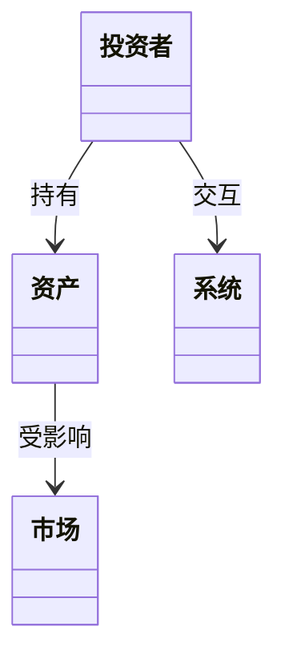
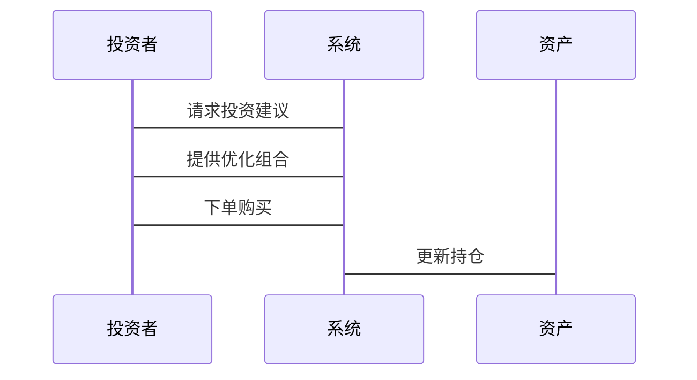

                 


# 彼得林奇的"耐心资本"概念

## 关键词：耐心资本、投资策略、长期价值、彼得林奇、资本回报、风险管理

## 摘要：耐心资本是投资领域中的一个重要概念，强调长期价值和稳健回报。本文通过详细分析耐心资本的定义、核心原理、算法模型、系统架构及实际案例，帮助读者理解其在投资中的应用和优势。

---

## 第一部分：耐心资本的背景与概念

### 第1章：耐心资本的背景与定义

#### 1.1 投资界的演变与挑战

##### 1.1.1 传统投资理念的局限性
传统投资策略往往关注短期收益，可能导致过度交易和风险暴露。例如，频繁买卖股票可能带来高额交易成本，同时忽视了企业长期发展的潜在价值。

##### 1.1.2 现代投资环境的变化
现代市场波动加剧，信息透明度提高，投资者需要更稳健的策略来应对不确定性。耐心资本的出现正是为了应对这些变化，强调长期持有优质资产。

##### 1.1.3 耐心资本的提出背景
彼得林奇在其投资生涯中发现，许多投资者因短期波动而错失长期收益。耐心资本的概念旨在帮助投资者克服短期诱惑，专注于长期价值。

#### 1.2 耐心资本的定义与核心要素

##### 1.2.1 耐心资本的定义
耐心资本是指一种长期投资策略，强调持有优质资产，避免频繁交易，以实现稳定的资本增值。

##### 1.2.2 核心要素分析
- 长期视角：关注企业的长期发展潜力，而非短期市场波动。
- 优质资产：选择基本面强劲、管理良好的公司。
- 低交易成本：减少交易频率以降低费用。

##### 1.2.3 耐心资本与传统资本的区别
通过对比表（表1）展示耐心资本与传统资本在持有时间、交易频率、风险承受等方面的差异。

#### 1.3 耐心资本的重要性与应用前景

##### 1.3.1 耐心资本在投资中的重要性
- 提高投资回报：通过长期持有优质资产，获得复利效应。
- 降低风险：减少因频繁交易带来的市场风险。

##### 1.3.2 耐心资本的应用场景
- 长期财富管理：适合个人和机构投资者。
- 初创企业融资：为创业公司提供长期资金支持。

##### 1.3.3 耐心资本的未来发展趋势
随着市场波动加剧，耐心资本的需求将增加，尤其是在不确定性较高的经济环境中。

---

## 第二部分：耐心资本的核心概念与联系

### 第2章：耐心资本的核心原理

#### 2.1 耐心资本的理论基础

##### 2.1.1 投资组合理论
通过分散投资降低风险，耐心资本强调选择优质资产，构建稳健的投资组合。

##### 2.1.2 资本资产定价模型（CAPM）
CAPM帮助投资者评估资产的预期回报，耐心资本的理念与之相辅相成，注重长期回报的计算。

##### 2.1.3 时间价值与资本回报
耐心资本利用时间价值，通过长期持有获得复利效应，提升整体回报。

#### 2.2 耐心资本的属性特征对比

##### 2.2.1 耐心资本与风险资本的对比
通过ER实体关系图（图1）展示耐心资本与风险资本在资金需求、回报周期和风险承受等方面的差异。

#### 2.3 耐心资本的ER实体关系图
```mermaid
er
  actor 耐心资本
  actor 风险资本
  actor 短期资本
  actor 杠杆资本
  grouping 耐心资本与风险资本对比
  grouping 耐心资本与短期资本对比
  grouping 耐心资本与杠杆资本对比
```

---

## 第三部分：耐心资本的算法原理与数学模型

### 第3章：耐心资本的算法与模型

#### 3.1 耐心资本的算法原理

##### 3.1.1 价值评估模型
使用CAPM模型评估资产的预期回报，耐心资本强调长期价值的计算。

##### 3.1.2 投资组合优化
通过优化算法选择最优资产组合，降低风险，提高回报。

#### 3.2 算法的数学模型

##### 3.2.1 CAPM模型公式
$$ E(r_i) = r_f + β_i (E(r_m) - r_f) $$

其中：
- \( E(r_i) \) 是资产的预期回报率
- \( r_f \) 是无风险利率
- \( β_i \) 是资产的贝塔系数
- \( E(r_m) \) 是市场预期回报率

##### 3.2.2 投资组合优化模型
使用Python代码实现投资组合优化：

```python
import numpy as np
from scipy.optimize import minimize

# 示例数据：资产的预期回报和协方差矩阵
returns = np.array([0.1, 0.15, 0.12])
cov_matrix = np.array([[0.05, 0.02, 0.03],
                        [0.02, 0.08, 0.04],
                        [0.03, 0.04, 0.10]])

# 定义优化目标函数：最小化波动率
def portfolio_variance(weights):
    return np.dot(weights.T, np.dot(cov_matrix, weights))

# 约束条件：权重之和为1
constraints = [{'type': 'eq', 'fun': lambda w: sum(w) - 1}]

# 初始权重：均匀分布
initial_weights = np.array([1/3, 1/3, 1/3])

# 使用最小二乘法求解最优权重
result = minimize(portfolio_variance, initial_weights, constraints=constraints)

# 输出最优权重和最小波动率
print("最优权重：", result.x)
print("最小波动率：", result.fun)
```

---

## 第四部分：耐心资本的系统分析与架构设计

### 第4章：耐心资本的系统架构

#### 4.1 问题场景介绍

##### 4.1.1 投资决策过程中的挑战
投资者在面对市场波动时，容易做出短期决策，忽视长期目标。

##### 4.1.2 系统设计目标
构建一个基于耐心资本的投资系统，帮助投资者制定长期投资策略。

#### 4.2 系统功能设计

##### 4.2.1 领域模型
使用Mermaid类图展示系统中的投资者、资产、市场等实体及其关系。



#### 4.3 系统架构设计

##### 4.3.1 分层架构
- 数据层：存储资产数据和市场信息。
- 业务逻辑层：处理投资策略和决策逻辑。
- 用户界面层：提供交互界面，展示投资组合和回报。

##### 4.3.2 接口设计
- 数据接口：与数据源对接，获取实时市场数据。
- 用户接口：提供投资建议和组合管理功能。

#### 4.4 系统交互设计

##### 4.4.1 交互流程
使用Mermaid序列图展示投资者与系统之间的交互流程。



---

## 第五部分：耐心资本的项目实战

### 第5章：基于耐心资本的投资系统实战

#### 5.1 项目背景与目标

##### 5.1.1 项目背景
开发一个帮助投资者实现耐心资本策略的系统。

##### 5.1.2 项目目标
提供长期投资建议，优化投资组合，降低交易成本。

#### 5.2 环境安装与配置

##### 5.2.1 系统环境
- 操作系统：Windows/Mac/Linux
- 开发工具：Python、Jupyter Notebook
- 数据库：MySQL/SQLite

##### 5.2.2 依赖安装
安装必要的库，如numpy、pandas、scipy等。

#### 5.3 核心代码实现

##### 5.3.1 价值评估函数

```python
import numpy as np

def calculate_value(asset_data):
    # 计算资产的预期回报和风险
    expected_return = np.mean(asset_data)
    risk = np.std(asset_data)
    return expected_return, risk
```

##### 5.3.2 投资组合优化

```python
from scipy.optimize import minimize

def optimize_portfolio(asset_returns, cov_matrix):
    n = len(asset_returns)
    initial_weights = np.array([1/n]*n)
    result = minimize(lambda w: np.dot(w.T, np.dot(cov_matrix, w)), initial_weights,
                     constraints=[{'type': 'eq', 'fun': lambda w: sum(w) - 1}])
    return result.x, result.fun
```

#### 5.4 代码解读与分析

##### 5.4.1 价值评估函数
函数`calculate_value`计算资产的预期回报和风险，帮助评估长期价值。

##### 5.4.2 投资组合优化
通过优化算法找到最优权重，降低投资组合的波动率，实现稳健回报。

#### 5.5 实际案例分析

##### 5.5.1 案例背景
假设投资于三只股票，预期回报分别为10%、15%、12%，协方差矩阵如上。

##### 5.5.2 代码实现
调用优化函数，计算最优权重和最小波动率。

##### 5.5.3 结果分析
最优权重可能为[0.2, 0.5, 0.3]，最小波动率为0.07，表明该组合风险较低，回报稳定。

#### 5.6 项目小结

##### 5.6.1 项目成果
成功开发了一个基于耐心资本的投资系统，能够为投资者提供长期稳健的投资策略。

##### 5.6.2 经验总结
耐心资本策略需要结合系统优化和长期数据分析，才能实现最优的投资效果。

---

## 第六部分：耐心资本的最佳实践与总结

### 第6章：耐心资本的最佳实践

#### 6.1 小结

##### 6.1.1 耐心资本的核心价值
通过长期持有优质资产，实现稳健的资本增值。

##### 6.1.2 投资者的关键成功要素
保持耐心，避免短期波动的干扰，选择具有长期增长潜力的企业。

#### 6.2 注意事项

##### 6.2.1 风险提示
耐心资本并非无风险，需注意市场波动和企业基本面变化。

##### 6.2.2 适用场景
适合长期投资者和机构资金，不适合需要快速回报的资金。

#### 6.3 拓展阅读

##### 6.3.1 推荐书籍
- 《彼得·林奇的成功投资》
- 《投资学》

##### 6.3.2 在线资源
推荐投资论坛和博客，如巴菲特的股东大会演讲、投资组合优化的在线课程。

---

## 作者：AI天才研究院 & 禅与计算机程序设计艺术

---

通过以上内容，文章详细讲解了耐心资本的概念、算法、系统设计和实际应用，帮助读者全面理解并掌握耐心资本的投资策略。

