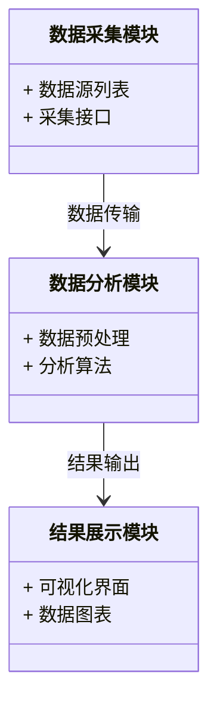
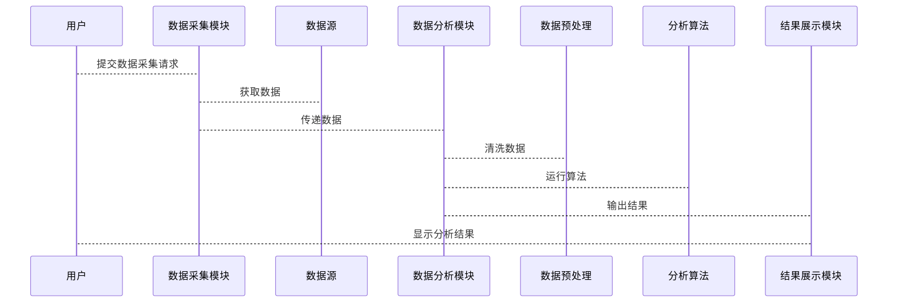

                 


# 彼得林奇的"行业分析"在虚拟现实产业中的调整

> 关键词：行业分析，彼得·林奇，虚拟现实，产业调整，战略优化

> 摘要：本文探讨了彼得·林奇的行业分析方法在虚拟现实产业中的应用，通过详细分析虚拟现实产业的特点，结合行业分析的核心要素，提出了一系列调整和优化的策略，以提升企业竞争力和投资决策的准确性。

---

## 第一部分: 背景介绍

### 第1章: 彼得·林奇的行业分析方法

#### 1.1 彼得·林奇的行业分析概述
##### 1.1.1 彼得·林奇的背景介绍
彼得·林奇是美国著名投资家，以其独特的行业分析方法闻名。他的方法强调对行业趋势的深刻理解，以及对市场动态的敏锐洞察，为投资者提供了科学的决策依据。

##### 1.1.2 行业分析的核心概念
行业分析是通过对市场结构、竞争格局、技术发展等多方面的研究，评估行业的整体发展趋势和投资价值。林奇的方法注重从宏观到微观的多维度分析，为企业和投资者提供全面的视角。

##### 1.1.3 行业分析的步骤与方法
林奇的行业分析方法包括行业生命周期分析、市场结构分析、竞争分析等步骤，强调数据的收集与分析，以及对行业未来趋势的预测。

#### 1.2 虚拟现实产业的现状与挑战
##### 1.2.1 虚拟现实技术的发展历程
虚拟现实技术起源于20世纪60年代，经历了多年的技术积累和市场验证，近年来随着技术的进步和市场需求的增加，得到了快速发展。

##### 1.2.2 当前虚拟现实产业的主要特点
虚拟现实产业目前呈现出硬件技术快速迭代、软件应用多样化、市场需求增长迅速的特点，但同时也面临着技术瓶颈、市场竞争激烈等挑战。

##### 1.2.3 产业中的主要参与者与竞争格局
虚拟现实产业的主要参与者包括硬件制造商（如 Oculus、HTC）、软件开发商（如Unity、Unreal Engine）以及内容创作者。竞争格局呈现多元化，形成了从硬件到软件再到内容的完整产业链。

#### 1.3 彼得·林奇行业分析方法在虚拟现实产业中的应用背景
##### 1.3.1 行业分析方法的普适性
林奇的行业分析方法具有普适性，适用于多个行业，其核心在于对行业趋势的准确把握和对竞争格局的深入分析。

##### 1.3.2 虚拟现实产业的独特性
虚拟现实产业技术驱动性强，市场增长快，但同时也面临着技术门槛高、用户接受度差异大等独特挑战。

##### 1.3.3 应用彼得·林奇方法的必要性
通过林奇的行业分析方法，可以更好地把握虚拟现实产业的市场动态，优化企业战略，提升投资决策的准确性。

### 第2章: 行业分析的核心要素与虚拟现实产业的结合

#### 2.1 行业分析的核心要素
##### 2.1.1 行业生命周期
行业生命周期包括导入期、成长期、成熟期和衰退期，分析行业所处阶段有助于制定相应战略。

##### 2.1.2 市场结构
分析市场结构（如完全竞争、垄断竞争等）有助于理解行业的竞争态势和市场进入壁垒。

##### 2.1.3 竞争格局
研究主要竞争者的市场份额、竞争优势和劣势，有助于制定有效的竞争策略。

##### 2.1.4 宏观经济环境
宏观经济因素如GDP增长、政策法规等对行业有重要影响，需纳入分析范围。

##### 2.1.5 技术发展与创新
技术进步是虚拟现实产业的核心驱动力，需关注技术发展趋势和创新点。

#### 2.2 虚拟现实产业的核心要素
##### 2.2.1 技术层面：硬件与软件的结合
虚拟现实技术的实现依赖于高性能硬件（如VR头显）和先进的软件（如渲染引擎）的结合。

##### 2.2.2 市场层面：消费者需求与企业应用
虚拟现实技术在消费市场和企业市场均有广泛应用，需分析不同市场的需求特点。

##### 2.2.3 产业层面：产业链的协同与整合
虚拟现实产业涉及硬件制造、软件开发、内容创作等多个环节，产业链的协同与整合至关重要。

#### 2.3 行业分析方法与虚拟现实产业结合的必要性
##### 2.3.1 通过行业分析识别产业发展趋势
行业分析方法可以帮助识别虚拟现实产业的未来发展趋势，为企业的战略制定提供依据。

##### 2.3.2 通过行业分析优化企业战略
了解行业竞争格局和市场动态，企业可以调整产品策略、市场推广策略等，提升竞争力。

##### 2.3.3 通过行业分析提升投资决策的准确性
投资者可以通过行业分析方法，更准确地评估虚拟现实产业的投资价值和风险。

---

## 第二部分: 核心概念与联系

### 第3章: 行业分析的核心原理

#### 3.1 行业分析的基本原理
##### 3.1.1 行业分析的理论基础
行业分析基于经济学、管理学等多学科理论，结合市场数据和行业动态，构建分析模型。

##### 3.1.2 行业分析的逻辑框架
从宏观环境到微观企业，层层递进，全面分析行业的现状、趋势和潜在机会。

##### 3.1.3 行业分析的关键指标
包括市场规模、增长率、市场份额、利润率等指标，用于评估行业的健康状况和发展潜力。

#### 3.2 虚拟现实产业的行业分析框架
##### 3.2.1 技术成熟度分析
评估虚拟现实技术的成熟度，判断其在不同应用领域的可行性。

##### 3.2.2 市场需求分析
分析消费者和企业的实际需求，预测市场增长潜力。

##### 3.2.3 产业链分析
研究产业链的各个环节，识别关键节点和潜在合作机会。

##### 3.2.4 竞争格局分析
通过五力分析模型（波特五力）等工具，评估行业的竞争程度和企业优势。

##### 3.2.5 宏观环境分析
考虑政策、经济、社会和技术等宏观因素对虚拟现实产业的影响。

### 第4章: 核心概念的对比分析

#### 4.1 行业分析方法与虚拟现实产业特点的对比
##### 4.1.1 行业分析方法的普适性与虚拟现实产业的独特性
行业分析方法适用于所有行业，但虚拟现实产业的技术驱动性和市场多样性有其独特性。

##### 4.1.2 技术驱动与市场驱动的对比
虚拟现实产业以技术驱动为主，而传统行业可能更多受到市场驱动的影响。

##### 4.1.3 竞争格局的差异性分析
虚拟现实产业竞争格局复杂，参与者包括硬件、软件和内容创作者，而传统行业可能竞争格局相对单一。

#### 4.2 行业分析与虚拟现实产业结合的对比
##### 4.2.1 传统行业分析的局限性
传统行业分析方法在面对技术快速变化的虚拟现实产业时，可能无法完全适应。

##### 4.2.2 虚拟现实产业的特殊需求
虚拟现实产业需要更关注技术发展和用户体验，这需要在行业分析中加入特定的指标和方法。

##### 4.2.3 结合后的优势与挑战
结合后的优势在于能够更全面地分析产业动态，挑战在于如何平衡普适性与特殊性，避免分析偏差。

### 第5章: 核心概念的联系

#### 5.1 行业分析与虚拟现实产业的联系
##### 5.1.1 技术进步推动行业变革
虚拟现实技术的快速发展推动了行业分析方法的创新和应用。

##### 5.1.2 市场需求影响产业布局
虚拟现实市场需求的变化直接影响产业布局和竞争策略。

##### 5.1.3 行业分析优化企业决策
通过行业分析，企业能够优化产品开发、市场推广等决策，提升竞争力。

---

## 第三部分: 算法原理

### 第6章: 算法原理

#### 6.1 算法原理概述
##### 6.1.1 算法的基本原理
行业分析算法基于统计学和数据分析，用于预测市场趋势和评估竞争态势。

##### 6.1.2 算法的数学模型
使用回归分析、聚类分析等方法，构建数学模型用于数据分析和预测。

#### 6.2 算法实现步骤
##### 6.2.1 数据收集
从公开数据源、行业报告等渠道收集市场数据。

##### 6.2.2 数据预处理
对数据进行清洗、标准化等预处理，确保数据质量。

##### 6.2.3 模型构建
根据数据特点选择合适的算法模型，如线性回归、决策树等。

##### 6.2.4 模型训练
使用训练数据对模型进行训练，调整模型参数，优化预测精度。

##### 6.2.5 模型评估
通过测试数据评估模型的准确性和稳定性，调整模型以适应实际需求。

#### 6.3 算法优化与调整
##### 6.3.1 算法选择的优化
根据具体问题选择最合适的算法，避免盲目使用复杂算法。

##### 6.3.2 参数调优
通过网格搜索、随机搜索等方法，找到最优的模型参数组合。

##### 6.3.3 模型集成
将多个模型的结果进行融合，提升预测的准确性和稳定性。

---

## 第四部分: 系统分析与架构设计

### 第7章: 系统分析与架构设计

#### 7.1 问题场景介绍
##### 7.1.1 系统目标
构建一个基于彼得·林奇行业分析方法的虚拟现实产业分析系统，帮助用户进行市场分析和决策支持。

##### 7.1.2 系统需求
用户需求包括数据采集、分析模型构建、结果展示等功能。

##### 7.1.3 约束条件
系统需具备高效的数据处理能力，支持大规模数据的分析和实时反馈。

#### 7.2 系统功能设计
##### 7.2.1 数据采集模块
负责从多种数据源采集市场数据，包括行业报告、企业财报等。

##### 7.2.2 数据分析模块
基于行业分析算法，对采集的数据进行处理和分析，生成分析结果。

##### 7.2.3 结果展示模块
以可视化的方式展示分析结果，帮助用户直观理解市场动态。

##### 7.2.4 决策支持模块
提供基于分析结果的决策建议，辅助用户制定企业战略和投资决策。

#### 7.3 系统架构设计
##### 7.3.1 领域模型类图


##### 7.3.2 系统架构图
```mermaid
server
    server = 前端展示层
    server --> 数据分析层: 分析请求
    数据分析层 --> 数据采集层: 数据获取
    数据采集层 --> 数据源: 数据采集
```

##### 7.3.3 系统接口设计
系统接口包括数据接口和用户接口，数据接口用于与其他系统的数据交互，用户接口用于与用户的交互。

##### 7.3.4 系统交互序列图


---

## 第五部分: 项目实战

### 第8章: 项目实战

#### 8.1 环境安装
##### 8.1.1 安装Python
```bash
# 安装Python
sudo apt-get install python3
```

##### 8.1.2 安装必要的库
```bash
pip install numpy pandas scikit-learn matplotlib
```

#### 8.2 系统核心实现
##### 8.2.1 数据采集模块实现
```python
import requests
import json

def fetch_data(url):
    response = requests.get(url)
    if response.status_code == 200:
        return json.loads(response.text)
    else:
        return None
```

##### 8.2.2 数据分析模块实现
```python
from sklearn.linear_model import LinearRegression
import pandas as pd

def analyze_data(data):
    model = LinearRegression()
    model.fit(data[['year']], data['revenue'])
    return model.predict(data[['year']])
```

##### 8.2.3 结果展示模块实现
```python
import matplotlib.pyplot as plt

def visualize_results(predicted, actual):
    plt.plot(actual, label='Actual')
    plt.plot(predicted, label='Predicted')
    plt.xlabel('Year')
    plt.ylabel('Revenue')
    plt.legend()
    plt.show()
```

#### 8.3 代码应用解读与分析
##### 8.3.1 数据采集模块解读
数据采集模块通过HTTP请求获取数据，返回结构化的数据格式，方便后续处理。

##### 8.3.2 数据分析模块解读
使用线性回归模型对数据进行预测，展示模型的拟合效果和预测能力。

##### 8.3.3 结果展示模块解读
通过可视化工具（如Matplotlib）将预测结果与实际数据进行对比，直观展示分析结果。

#### 8.4 实际案例分析
##### 8.4.1 案例背景
以一家虚拟现实硬件制造商为例，分析其市场表现和未来趋势。

##### 8.4.2 数据分析与预测
使用上述代码对历史数据进行分析，预测未来几年的市场收入。

##### 8.4.3 结果解读与策略调整
根据预测结果，调整企业的市场推广策略和产品开发计划。

#### 8.5 项目小结
通过项目实战，验证了彼得·林奇行业分析方法在虚拟现实产业中的应用效果，展示了如何通过技术手段优化企业决策。

---

## 第六部分: 总结与展望

### 第9章: 总结与展望

#### 9.1 总结
##### 9.1.1 核心内容回顾
本文详细探讨了彼得·林奇的行业分析方法在虚拟现实产业中的应用，分析了虚拟现实产业的特点，并提出了一系列优化和调整的策略。

##### 9.1.2 研究结论
通过行业分析，可以更准确地把握虚拟现实产业的市场动态，优化企业战略，提升投资决策的准确性。

#### 9.2 展望
##### 9.2.1 未来研究方向
进一步研究虚拟现实技术的创新应用，探索更多行业分析方法与虚拟现实产业结合的可能性。

##### 9.2.2 行业发展趋势
随着技术的不断进步，虚拟现实产业将呈现更加多样化的应用和更激烈的市场竞争，行业分析方法将发挥越来越重要的作用。

##### 9.2.3 研究意义
通过本文的研究，为虚拟现实产业的企业和投资者提供了科学的决策工具，具有重要的理论和实践意义。

---

## 第七部分: 最佳实践与注意事项

### 第10章: 最佳实践与注意事项

#### 10.1 最佳实践
##### 10.1.1 数据收集的准确性
确保数据来源可靠，数据清洗充分，避免分析偏差。

##### 10.1.2 模型选择的合理性
根据具体问题选择合适的算法模型，避免过度复杂化。

##### 10.1.3 结果展示的直观性
使用清晰直观的可视化工具，帮助用户更好地理解和应用分析结果。

#### 10.2 注意事项
##### 10.2.1 数据隐私与安全
在数据采集和处理过程中，注意保护用户隐私和数据安全。

##### 10.2.2 模型的适用性
确保分析模型适用于具体场景，避免生搬硬套，导致分析结果偏差。

##### 10.2.3 持续优化与调整
根据市场动态和技术发展，持续优化分析模型和方法，保持分析的准确性。

---

## 作者

作者：AI天才研究院/AI Genius Institute & 禅与计算机程序设计艺术 /Zen And The Art of Computer Programming

---

以上是《彼得林奇的"行业分析"在虚拟现实产业中的调整》的完整目录大纲，确保每个部分都涵盖必要的内容，并且逻辑清晰，便于读者理解和应用。

