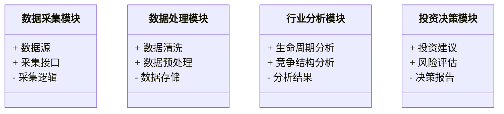

                 


# 彼得林奇的"行业分析"方法论

> **关键词**：彼得林奇、行业分析、投资方法、基本面分析、价值投资  
>
> **摘要**：本文深入探讨了彼得林奇的行业分析方法论，从其核心理念、分析框架、数学模型到实际应用进行了全面解析。通过对比分析和案例研究，揭示了彼得林奇方法的独特性及其在投资决策中的重要性。

---

## 第1章：彼得林奇的投资理念与行业分析背景

### 1.1 彼得林奇的投资理念

#### 1.1.1 价值投资的核心思想
彼得林奇是价值投资的代表人物之一，他强调通过深入研究企业基本面，寻找被市场低估的投资机会。他的核心思想包括：
- **长期投资**：避免短期市场波动的干扰，关注企业的长期价值。
- **基本面分析**：通过财务报表、行业趋势和企业管理层分析企业价值。
- **分散投资**：通过分散投资降低风险，同时关注优质企业。

#### 1.1.2 投资中的"烟圈"理论
彼得林奇提出了"烟圈"理论，即投资者应关注那些具有竞争优势、管理优秀且财务健康的公司，就像寻找烟屁股上的烟圈一样，这些公司往往具有持续增长的潜力。

#### 1.1.3 行业分析在投资中的重要性
行业分析是彼得林奇投资方法的核心部分。他认为，一个企业的价值不仅取决于其自身财务状况，还与其所在行业的竞争环境、生命周期和市场趋势密切相关。

---

### 1.2 行业分析的背景与意义

#### 1.2.1 行业分析的定义与作用
行业分析是指对特定行业的发展现状、竞争结构、市场趋势和财务指标进行系统性研究的过程。其作用在于帮助投资者识别行业风险和机会，从而做出更明智的投资决策。

#### 1.2.2 行业分析在投资决策中的地位
行业分析是投资决策的重要组成部分。通过对行业生命周期、竞争结构和财务指标的分析，投资者可以更好地评估企业的潜在价值和风险。

#### 1.2.3 彼得林奇行业分析方法的独特性
彼得林奇的行业分析方法注重对企业微观层面的分析，结合行业宏观趋势，提出了一套独特的分析框架，强调行业与企业的互动关系。

---

### 1.3 彼得林奇的行业研究方法

#### 1.3.1 基于基本面的行业分析
彼得林奇通过分析行业的财务指标（如收入增长率、利润率、资产负债率等）来评估行业的健康状况和潜在投资机会。

#### 1.3.2 行业生命周期与投资机会
彼得林奇将行业生命周期划分为初创期、成长期、成熟期和衰退期，并根据每个阶段的特点，寻找具有增长潜力的行业。

#### 1.3.3 行业竞争结构的分析框架
彼得林奇提出了一个行业竞争结构的分析框架，包括新进入者威胁、替代品威胁、供应商议价能力、买家议价能力和现有竞争者竞争程度。

---

### 1.4 彼得林奇行业分析方法与传统方法的区别

#### 1.4.1 传统行业分析方法的局限性
传统行业分析方法往往过于依赖宏观数据，忽视了企业的微观层面分析。而彼得林奇的方法强调行业与企业的互动关系，注重企业竞争优势的分析。

#### 1.4.2 彼得林奇方法的核心创新点
彼得林奇通过结合行业分析和企业基本面分析，提出了一个更加全面的投资分析框架，强调行业与企业的互动关系。

#### 1.4.3 方法适用性的对比分析
彼得林奇的方法适用于长期投资者，尤其是那些关注企业基本面和行业趋势的投资者。而传统方法更适用于短期交易者或宏观投资者。

---

## 第2章：彼得林奇行业分析的核心概念与联系

### 2.1 核心概念原理

#### 2.1.1 行业分析的关键要素
- 行业生命周期
- 行业竞争结构
- 行业财务指标

#### 2.1.2 彼得林奇的行业评估标准
- 行业增长潜力
- 行业竞争优势
- 行业财务健康状况

#### 2.1.3 行业分析与公司估值的关系
行业分析是公司估值的重要基础。通过分析行业趋势和竞争环境，投资者可以更好地评估企业的潜在价值。

---

### 2.2 核心概念属性特征对比表

| **概念**       | **行业生命周期**          | **行业竞争结构**          | **行业财务指标**          |
|----------------|--------------------------|---------------------------|---------------------------|
| **定义**       | 行业从初创到衰退的阶段划分 | 行业内的竞争格局分析     | 行业的财务健康状况评估   |
| **特征**       | 初创期、成长期、成熟期、衰退期 | 竞争者数量、新进入者威胁、替代品威胁 | 收入增长率、利润率、资产负债率 |
| **重要性**     | 影响企业的投资价值       | 影响企业的竞争优势       | 影响企业的财务健康状况   |

---

### 2.3 ER实体关系图

```mermaid
er
  actor 投资者
  actor 行业分析师
  actor 公司管理层
  database 行业数据
  database 公司财务数据
  database

 投资者 --> 行业分析师: 委托分析
 行业分析师 --> 行业数据: 数据来源
 行业分析师 --> 公司财务数据: 数据来源
 行业分析师 --> 公司管理层: 调研访谈
```

---

## 第3章：彼得林奇行业分析的算法原理

### 3.1 算法原理概述

彼得林奇的行业分析方法可以转化为一个系统化的分析框架，包括以下几个步骤：
1. 收集行业数据和企业财务数据。
2. 分析行业生命周期和竞争结构。
3. 评估企业的竞争优势和财务状况。
4. 综合分析得出投资结论。

---

### 3.2 算法实现

#### 3.2.1 数据收集与处理
```python
import pandas as pd

# 数据收集
industry_data = pd.read_csv('industry.csv')
company_data = pd.read_csv('company.csv')

# 数据处理
industry_data = industry_data.dropna()
company_data = company_data.dropna()
```

#### 3.2.2 生命周期阶段判定
```python
def getLifecycleStage(revenue_growth, profit_margin):
    if revenue_growth > 20 and profit_margin > 15:
        return "成长期"
    elif revenue_growth < 5 and profit_margin < 5:
        return "衰退期"
    else:
        return "成熟期"
```

#### 3.2.3 行业竞争结构分析
```python
def analyzeCompetition(structure):
    if structure['new_entry_threat'] < 0.2 and structure['substitute_threat'] < 0.2:
        return "低竞争压力"
    elif structure['new_entry_threat'] > 0.5 or structure['substitute_threat'] > 0.5:
        return "高竞争压力"
    else:
        return "中等竞争压力"
```

---

### 3.3 数学模型与公式

#### 3.3.1 行业增长潜力评估公式
$$ \text{行业增长潜力} = \frac{\text{收入增长率} + \text{利润增长率}}{2} $$

#### 3.3.2 行业财务健康状况评估公式
$$ \text{财务健康指数} = \frac{\text{净利润率} + \text{ROE}}{2} $$

---

## 第4章：系统分析与架构设计方案

### 4.1 问题场景介绍

为了实现彼得林奇行业分析方法的系统化，我们构建了一个行业分析系统，用于自动化收集、处理和分析行业数据。

---

### 4.2 系统功能设计

#### 4.2.1 功能模块
- 数据采集模块：负责收集行业数据和企业财务数据。
- 数据处理模块：对数据进行清洗和预处理。
- 行业分析模块：基于彼得林奇方法进行行业分析。
- 投资决策模块：根据分析结果生成投资建议。

#### 4.2.2 领域模型


---

### 4.3 系统架构设计

```mermaid
graph TD
    I1 --> S1: 数据采集
    S1 --> D1: 数据存储
    D1 --> S2: 数据处理
    S2 --> A1: 行业分析
    A1 --> D2: 分析结果
    D2 --> S3: 投资决策
```

---

### 4.4 接口设计与交互流程

#### 4.4.1 接口设计
- 数据采集接口：提供API用于数据采集。
- 分析结果接口：返回行业分析结果。

#### 4.4.2 交互流程
1. 投资者发起分析请求。
2. 系统通过API采集行业数据。
3. 数据处理模块对数据进行清洗和预处理。
4. 行业分析模块生成分析结果。
5. 投资决策模块根据结果生成投资建议。

---

## 第5章：项目实战与案例分析

### 5.1 环境安装与数据准备

#### 5.1.1 环境安装
```bash
pip install pandas numpy matplotlib
```

#### 5.1.2 数据准备
```python
import pandas as pd

# 读取数据
industry_data = pd.read_csv('industry.csv')
company_data = pd.read_csv('company.csv')
```

---

### 5.2 核心实现

#### 5.2.1 行业生命周期分析
```python
def getLifecycleStage(revenue_growth, profit_margin):
    if revenue_growth > 20 and profit_margin > 15:
        return "成长期"
    elif revenue_growth < 5 and profit_margin < 5:
        return "衰退期"
    else:
        return "成熟期"
```

#### 5.2.2 行业竞争结构分析
```python
def analyzeCompetition(structure):
    if structure['new_entry_threat'] < 0.2 and structure['substitute_threat'] < 0.2:
        return "低竞争压力"
    elif structure['new_entry_threat'] > 0.5 or structure['substitute_threat'] > 0.5:
        return "高竞争压力"
    else:
        return "中等竞争压力"
```

---

### 5.3 案例分析

#### 5.3.1 案例背景
以科技行业为例，分析其行业生命周期和竞争结构。

#### 5.3.2 分析结果
- 行业生命周期：成长期
- 行业竞争结构：高竞争压力

---

## 第6章：最佳实践与小结

### 6.1 小结
彼得林奇的行业分析方法通过结合行业趋势和企业基本面分析，为投资者提供了一套系统化的投资分析框架。本文详细探讨了其核心概念、算法原理和系统架构，并通过实际案例展示了其应用。

### 6.2 注意事项
- 数据来源的可靠性
- 分析模型的适用性
- 投资决策的综合性

### 6.3 拓展阅读
- 彼得林奇的其他投资方法
- 行业分析的最新研究

---

## 作者：AI天才研究院 & 禅与计算机程序设计艺术

---

以上是《彼得林奇的"行业分析"方法论》的完整目录和文章内容框架，涵盖了从理论到实践的全过程，结合了技术细节和实际案例，帮助读者深入理解彼得林奇的行业分析方法。

