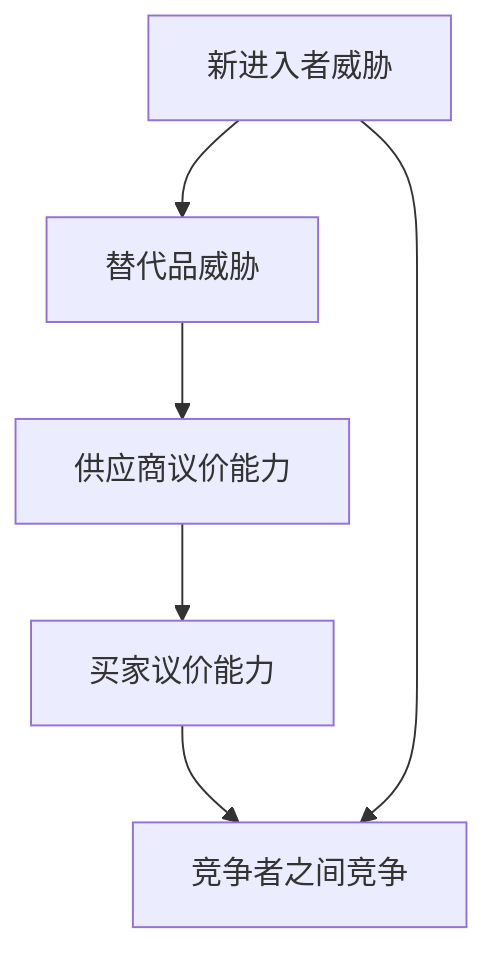
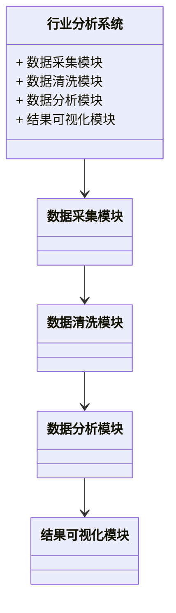
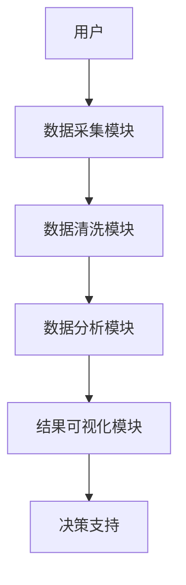
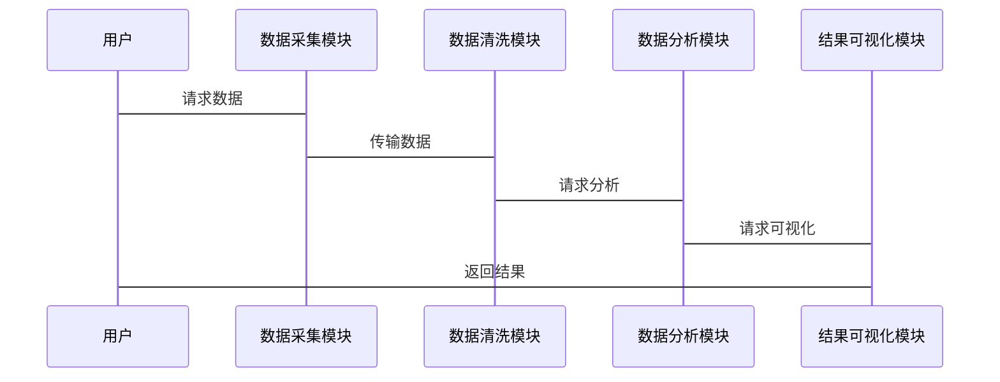

                 


# 彼得林奇的"行业分析"框架

> 关键词：彼得林奇，行业分析，投资框架，市场分析，技术分析，投资策略

> 摘要：本文深入探讨了彼得·林奇的行业分析框架，从其核心概念、数学模型、系统架构到实际应用，全面解析了这一经典投资分析方法的精髓。通过逐步分析，我们将帮助读者掌握如何利用行业分析框架进行投资决策，优化投资组合，并在复杂多变的市场中把握机遇、规避风险。

---

# 第一部分: 行业分析框架的核心概念

## 第1章: 引言

### 1.1 彼得·林奇与他的投资理念
- **彼得·林奇的生平简介**：他被誉为“费城最伟大的基金经理”，管理富达麦哲伦基金期间取得了辉煌的业绩。
- **他独特的投资风格**：以长期投资、深入研究和逆向思维著称。
- **行业分析在投资中的重要性**：行业分析是彼得·林奇投资策略的核心，帮助他识别高增长行业和优质企业。

### 1.2 本书的目的与结构
- **本书的核心目标**：帮助读者理解彼得·林奇的行业分析框架，并能够将其应用到实际投资中。
- **目录结构概览**：从基础概念到高级应用，层层递进，全面解析行业分析框架。
- **学习本书的方法建议**：结合实际案例和公式推导，深入理解框架的精髓。

---

## 第2章: 行业分析框架的核心概念

### 2.1 行业分析的定义与背景
- **行业分析的定义**：对特定行业内的企业、市场结构、竞争态势和经济表现进行系统性研究的过程。
- **行业分析的背景**：在全球化和信息化背景下，行业分析成为投资决策的关键工具。
- **行业分析的边界与外延**：明确行业分析的范围，避免过度外延或遗漏关键因素。

### 2.2 行业分析的核心要素
- **行业生命周期**：
  - 初创期：高增长、高风险。
  - 成长期：稳定增长，竞争加剧。
  - 成熟期：增长放缓，利润稳定。
  - 衰退期：需求下降，企业倒闭。
- **行业竞争结构**：
  - 五力模型：新进入者威胁、替代品威胁、供应商议价能力、买家议价能力、现有竞争者之间的竞争。
- **行业财务指标**：
  - 市盈率（PE）、市净率（PB）、市销率（PS）等。

### 2.3 行业分析框架的结构
- **框架的核心组成**：生命周期、竞争结构、财务指标。
- **框架的逻辑关系**：行业生命周期决定增长潜力，竞争结构影响利润率，财务指标反映市场估值。
- **框架的适用场景**：适用于股票投资、行业配置、风险评估等。

---

## 第3章: 行业分析框架的数学模型与算法

### 3.1 行业分析的核心指标
- **市盈率（PE）的计算公式**：
  $$ PE = \frac{\text{股价}}{\text{每股收益}} $$
- **市净率（PB）的计算公式**：
  $$ PB = \frac{\text{股价}}{\text{每股净资产}} $$
- **市销率（PS）的计算公式**：
  $$ PS = \frac{\text{股价}}{\text{每股收入}} $$

### 3.2 行业生命周期的数学模型
- **行业生命周期的阶段划分**：
  - 初创期：高增长，低利润。
  - 成长期：稳定增长，利润上升。
  - 成熟期：增长放缓，利润稳定。
  - 衰退期：需求下降，利润下降。
- **行业生命周期的数学表示**：
  $$ S(t) = A + Bt + Ct^2 + Dt^3 $$
  其中，t 表示时间，A、B、C、D 为常数。

### 3.3 竞争结构的分析算法
- **竞争结构的指标计算**：
  - 新进入者威胁：行业进入壁垒。
  - 替代品威胁：替代品的价格和质量。
  - 供应商议价能力：供应商集中度和替代品。
  - 买家议价能力：买方集中度和采购规模。
  - 竞争者之间竞争：行业内企业数量和市场份额。
- **竞争结构的分类算法**：
  - 使用五力模型对行业进行综合评分。
  - 通过因子分析确定行业竞争的关键因素。
- **竞争结构的可视化图示（Mermaid流程图）**：



---

## 第4章: 行业分析框架的系统分析与架构设计

### 4.1 系统分析的背景与目标
- **系统分析的背景**：在信息化和数据化的今天，行业分析需要结合系统化的方法。
- **系统分析的目标**：构建一个完整的行业分析系统，实现数据采集、分析、预测和决策支持。
- **系统分析的步骤**：
  1. 明确需求。
  2. 数据采集。
  3. 数据清洗。
  4. 数据分析。
  5. 结果可视化。

### 4.2 行业分析系统的功能设计
- **领域模型（Mermaid类图）**：


### 4.3 系统架构设计
- **系统架构图（Mermaid架构图）**：


### 4.4 系统接口设计
- **系统接口设计**：定义API接口，用于数据输入和输出。
- **系统交互设计（Mermaid序列图）**：


---

## 第5章: 项目实战

### 5.1 环境安装
- **安装Python**：下载并安装Python 3.x。
- **安装数据分析库**：安装Pandas、NumPy、Matplotlib、Scikit-learn等。
- **安装可视化工具**：安装Plotly或Seaborn。

### 5.2 系统核心实现源代码
- **数据采集模块**：
  ```python
  import pandas as pd
  import requests

  def get_industry_data():
      url = "https://example.com/industry_data"
      response = requests.get(url)
      data = response.json()
      df = pd.DataFrame(data)
      return df
  ```

- **数据分析模块**：
  ```python
  def analyze_industry(df):
      # 计算市盈率
      df['PE'] = df['股价'] / df['每股收益']
      # 计算市净率
      df['PB'] = df['股价'] / df['每股净资产']
      return df
  ```

- **结果可视化模块**：
  ```python
  import matplotlib.pyplot as plt

  def visualize_results(df):
      plt.figure(figsize=(10, 6))
      plt.plot(df['时间'], df['PE'], label='PE')
      plt.plot(df['时间'], df['PB'], label='PB')
      plt.title('行业分析结果')
      plt.xlabel('时间')
      plt.ylabel('指标值')
      plt.legend()
      plt.show()
  ```

### 5.3 实际案例分析
- **案例分析**：以科技行业为例，分析其生命周期和竞争结构。
- **详细解读**：结合实际数据，计算市盈率、市净率等指标，判断行业投资价值。

### 5.4 项目小结
- **小结**：通过项目实战，读者能够掌握如何将彼得·林奇的行业分析框架应用到实际投资中。

---

## 第6章: 总结与最佳实践

### 6.1 本章小结
- **核心概念总结**：行业分析是投资决策的关键工具，彼得·林奇的框架提供了系统化的分析方法。
- **框架的初步印象**：通过数学模型和系统架构，读者能够深入理解行业分析的逻辑。
- **下一章的预览**：将结合实际案例，总结框架的应用价值和注意事项。

### 6.2 最佳实践 tips
- **注意事项**：避免过度依赖单一指标，结合市场变化和企业基本面。
- **拓展阅读**：建议阅读彼得·林奇的《投资之道》和《股市投资策略》。

---

# 作者：AI天才研究院 & 禅与计算机程序设计艺术

