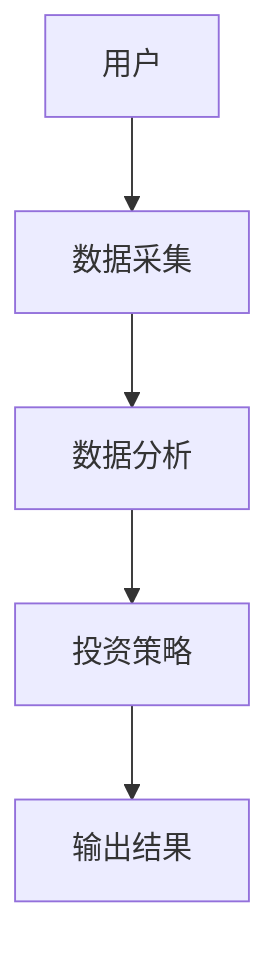

                 


# 彼得林奇的"行业分析"深度研究方法

## 关键词：彼得林奇，行业分析，基本面分析，竞争优势，投资策略

## 摘要：  
彼得林奇作为全球最著名的基金经理之一，以其独特的行业分析方法闻名。本文深入探讨了彼得林奇的行业分析方法，从基本概念、数学模型、系统架构到实际案例，全面解析其理论与实践的结合。通过详细分析行业生命周期、竞争结构、财务指标等核心要素，结合具体的数学模型和系统设计，帮助读者掌握彼得林奇的行业分析精髓。

---

# 第一部分: 彼得林奇的行业分析概述

## 第1章: 彼得林奇与行业分析概述

### 1.1 彼得林奇的基本投资理念
#### 1.1.1 彼得林奇的生平简介
彼得·林奇（Peter Lynch）是全球最著名的基金经理之一，曾管理富达麦哲伦基金，创造了辉煌的投资业绩。他主张长期投资，注重基本面分析，尤其是对行业和公司的深入研究。

#### 1.1.2 彼得林奇的投资哲学
彼得林奇强调投资的长期性，反对短期交易。他认为，成功的投资取决于对行业和公司的深刻理解，尤其是对行业趋势和公司竞争优势的把握。

#### 1.1.3 行业分析在投资中的重要性
行业分析是彼得林奇投资方法的核心。通过对行业的深入分析，投资者可以识别出具有持续竞争优势的公司，从而制定有效的投资策略。

### 1.2 行业分析的核心概念
#### 1.2.1 行业分析的定义
行业分析是通过对行业内部结构、竞争格局、财务状况和外部环境的研究，评估行业的潜力和风险，为投资决策提供依据。

#### 1.2.2 行业分析的关键要素
- **行业生命周期**：行业的成长阶段（导入期、成长期、成熟期、衰退期）。
- **行业竞争结构**：行业的五力模型（波特五力分析）。
- **行业财务指标**：如市盈率、ROE等。
- **行业政策环境**：政策对行业的影响。

#### 1.2.3 行业分析的分类与应用场景
行业分析可以分为宏观分析和微观分析，应用于投资决策、公司战略制定等领域。

### 1.3 行业分析的基本步骤
#### 1.3.1 确定行业研究的目标
明确研究的目标，如评估行业潜力、寻找投资机会等。

#### 1.3.2 收集行业数据与信息
通过行业报告、财务数据、政策文件等多渠道收集信息。

#### 1.3.3 分析行业竞争格局
使用五力模型分析行业的竞争结构，识别关键竞争优势。

#### 1.3.4 评估行业风险与机会
评估行业面临的外部风险（如政策变化）和内部机会（如技术创新）。

#### 1.3.5 制定行业投资策略
根据分析结果，制定长期的投资策略，选择具有竞争优势的公司。

### 1.4 本章小结
本章介绍了彼得林奇的投资理念和行业分析的核心概念，为后续的深入分析奠定了基础。

---

# 第二部分: 行业分析的核心概念与联系

## 第2章: 行业分析的核心概念

### 2.1 行业分析的核心要素
#### 2.1.1 行业生命周期
行业的生命周期决定了其发展阶段和投资价值。例如，成长期的行业具有较高的增长潜力。

#### 2.1.2 行业竞争结构
通过五力模型分析行业竞争格局，识别行业内的主要竞争对手和潜在进入者的威胁。

#### 2.1.3 行业财务指标
财务指标如ROE（净资产收益率）和市盈率是评估行业健康状况的重要指标。

#### 2.1.4 行业政策环境
政策的变化对行业的影响至关重要，例如税收政策的变化可能影响行业的盈利能力。

### 2.2 行业分析的核心原理
#### 2.2.1 行业生命周期的阶段划分
行业生命周期分为导入期、成长期、成熟期和衰退期，不同阶段的投资策略不同。

#### 2.2.2 行业竞争结构的五力模型
五力模型包括现有竞争者、新进入者、替代品、供应商和买家的议价能力。

#### 2.2.3 行业财务指标的计算方法
ROE = 净利润 / 净资产  
市盈率 = 股价 / 每股收益

#### 2.2.4 行业政策环境的影响因素
政策变化可能影响行业的供需关系和利润率。

### 2.3 行业分析的核心联系
#### 2.3.1 行业生命周期与投资策略的关系
成长期行业适合长期投资，衰退期行业则需要谨慎。

#### 2.3.2 行业竞争结构与企业竞争优势的关系
竞争优势强的企业在行业中更具投资价值。

#### 2.3.3 行业财务指标与企业估值的关系
通过财务指标评估企业的盈利能力，进而判断其估值是否合理。

#### 2.3.4 行业政策环境与投资风险的关系
政策风险可能影响行业的稳定性和盈利能力。

### 2.4 本章小结
本章深入分析了行业分析的核心要素及其相互关系，为后续的数学模型和系统设计提供了理论基础。

---

# 第三部分: 行业分析的数学模型与算法原理

## 第3章: 行业分析的数学模型

### 3.1 行业生命周期模型
#### 3.1.1 行业生命周期的数学表示
通过时间序列分析模型（ARIMA）预测行业的发展阶段。

#### 3.1.2 行业生命周期的阶段划分公式
$$ \text{阶段} = \begin{cases} 
\text{导入期} & \text{if } t < t_1 \\
\text{成长期} & \text{if } t_1 \leq t < t_2 \\
\text{成熟期} & \text{if } t_2 \leq t < t_3 \\
\text{衰退期} & \text{otherwise}
\end{cases} $$

#### 3.1.3 行业生命周期与投资策略的关系
根据行业所处阶段，调整投资策略，如成长期行业适合高成长股票。

### 3.2 行业竞争结构模型
#### 3.2.1 五力模型的数学表示
$$ \text{竞争力} = f(\text{现有竞争者数量}, \text{新进入者威胁}, \text{替代品威胁}, \text{供应商议价能力}, \text{买家议价能力}) $$

#### 3.2.2 行业竞争结构的量化分析
通过定量分析各因素的权重，计算行业的综合竞争力指数。

### 3.3 行业财务指标模型
#### 3.3.1 常用财务指标的公式
$$ \text{ROE} = \frac{\text{净利润}}{\text{净资产}} $$
$$ \text{市盈率} = \frac{\text{股价}}{\text{每股收益}} $$

#### 3.3.2 财务指标的计算与分析
通过对比行业平均值，评估企业的财务健康状况。

#### 3.3.3 财务指标与企业估值的关系
$$ \text{合理估值} = \text{市盈率} \times \text{每股收益} $$

### 3.4 行业政策环境模型
#### 3.4.1 行业政策环境的影响因素
政策变化可能影响行业的供需关系和成本结构。

#### 3.4.2 政策环境对行业的影响程度分析
通过政策变化的敏感性分析，评估政策风险。

#### 3.4.3 政策环境与投资风险的关系
政策风险高的行业需要谨慎投资。

### 3.5 本章小结
本章通过数学模型量化行业分析的核心要素，为投资决策提供了科学依据。

---

# 第四部分: 行业分析的系统架构与设计

## 第4章: 行业分析的系统架构

### 4.1 行业分析系统的功能设计
#### 4.1.1 系统功能模块划分
- 数据采集模块：收集行业数据。
- 数据分析模块：分析行业生命周期、竞争结构等。
- 投资策略模块：制定投资策略。

#### 4.1.2 功能模块的实现方式
使用Python编写数据分析模块，利用机器学习算法预测行业趋势。

#### 4.1.3 系统功能模块的交互
通过模块化设计，确保各功能模块协同工作。

### 4.2 行业分析系统的架构设计
#### 4.2.1 系统架构图（mermaid）


#### 4.2.2 系统架构设计的细节
系统分为前端（用户界面）和后端（数据分析），采用微服务架构。

### 4.3 行业分析系统的接口设计
#### 4.3.1 接口设计
- 数据接口：与数据源对接，获取行业数据。
- API接口：提供分析结果给其他系统使用。

#### 4.3.2 接口设计的细节
使用RESTful API设计接口，确保数据传输的安全性和高效性。

### 4.4 行业分析系统的交互设计
#### 4.4.1 交互设计
用户输入行业名称，系统输出行业分析报告。

#### 4.4.2 交互设计的细节
通过图形化界面展示分析结果，用户可以直观了解行业状况。

### 4.5 本章小结
本章通过系统架构设计，展示了如何将行业分析方法应用于实际投资决策中。

---

# 第五部分: 行业分析的项目实战

## 第5章: 行业分析的项目实战

### 5.1 项目介绍
选择一个具体行业（如科技行业）进行分析，展示如何应用彼得林奇的方法。

### 5.2 核心代码实现
#### 5.2.1 环境安装
安装Python、Pandas、NumPy等工具。

#### 5.2.2 核心代码实现
```python
import pandas as pd
import numpy as np

# 数据加载
df = pd.read_csv('industry_data.csv')

# 行业生命周期分析
def get_stage(t):
    if t < 5:
        return '导入期'
    elif 5 <= t < 10:
        return '成长期'
    elif 10 <= t < 15:
        return '成熟期'
    else:
        return '衰退期'

# 竞争结构分析
def get_competitiveness(current_competitors, new entrants, substitutes, suppliers, buyers):
    return current_competitors * 0.2 + new_entrants * 0.2 + substitutes * 0.2 + suppliers * 0.2 + buyers * 0.2

# 财务指标计算
roe = df['ROE'].mean()
市盈率 = df['市盈率'].mean()

print(f"行业平均ROE: {roe}")
print(f"行业平均市盈率: {市盈率}")
```

#### 5.2.3 代码应用解读与分析
通过代码计算行业平均ROE和市盈率，评估行业的财务状况。

### 5.3 实际案例分析
#### 5.3.1 案例背景
选择科技行业，分析其行业生命周期和竞争结构。

#### 5.3.2 案例分析
科技行业处于成长期，竞争激烈，但具有较高的投资价值。

### 5.4 项目小结
本章通过实际案例展示了彼得林奇行业分析方法的应用，帮助读者掌握实际操作技能。

---

# 第六部分: 总结与展望

## 第6章: 总结与展望

### 6.1 本章总结
彼得林奇的行业分析方法通过深入研究行业生命周期、竞争结构、财务指标和政策环境，帮助投资者制定科学的投资策略。

### 6.2 未来展望
随着技术的发展，行业分析将更加智能化，投资者可以利用大数据和人工智能进一步提升分析的准确性和效率。

### 6.3 最佳实践Tips
- 投资者应持续关注行业动态，及时调整投资策略。
- 行业分析是长期投资的基础，需要时间和耐心。

### 6.4 小结
行业分析是投资成功的关键，彼得林奇的方法为投资者提供了宝贵的指导。

---

# 作者信息

作者：AI天才研究院/AI Genius Institute & 禅与计算机程序设计艺术 /Zen And The Art of Computer Programming

---

通过以上目录和内容，您可以根据需要进一步扩展每个部分的具体内容，添加详细的分析、图表和案例，以完成一篇完整的博客文章。

