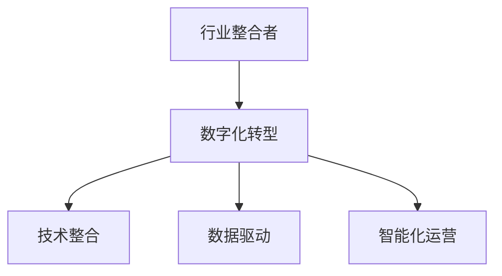
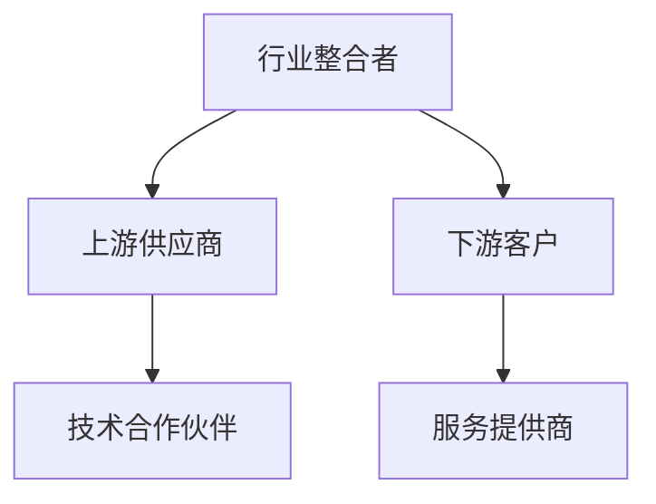
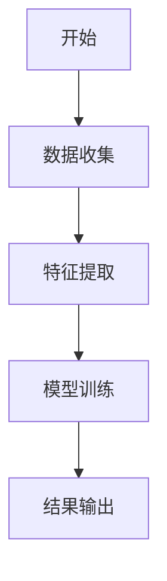
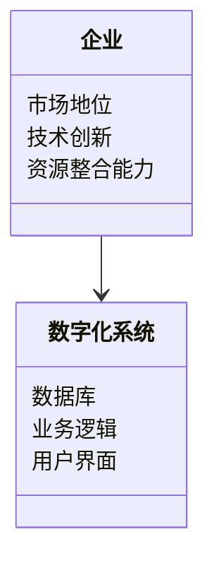
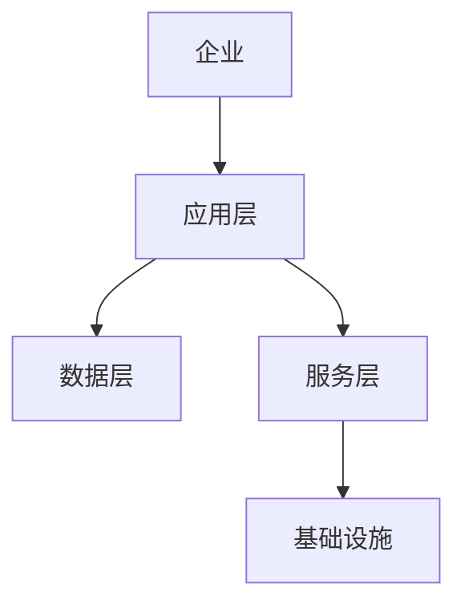

                 


# 彼得林奇的"行业整合者"在数字化浪潮中的特征

## 关键词
- 彼得·林奇
- 行业整合者
- 数字化转型
- 企业战略
- 技术创新

## 摘要
本文探讨了彼得·林奇提出的“行业整合者”概念在当前数字化浪潮中的特征与作用。通过分析行业整合者的市场地位、资源整合能力、技术创新性以及数字化转型中的关键角色，本文揭示了这些企业在数字时代中的独特优势和面临的挑战。同时，结合实际案例和数学模型，本文详细阐述了行业整合者在数字化转型中的策略选择和成功路径。

---

# 第一部分：彼得林奇的行业整合者概述

## 第1章：行业整合者的定义与特征

### 1.1 行业整合者的定义

#### 1.1.1 行业整合者的概念
行业整合者是指在某一行业中，能够通过资源整合、技术整合和战略整合，将分散的资源和能力集中起来，形成竞争优势的企业。这类企业在行业内具有较强的影响力，能够推动行业的整合和发展。

#### 1.1.2 彼得·林奇对行业整合者的定义
彼得·林奇在其投资理论中，将行业整合者定义为那些能够在行业内占据主导地位，并通过整合上下游资源来提升自身竞争力的企业。他认为，行业整合者通常具有较强的市场地位、技术创新能力和资源整合能力。

#### 1.1.3 行业整合者的市场地位与影响力
行业整合者通常在行业内具有领先地位，能够通过其强大的资源和能力，影响行业的格局。它们不仅是行业的重要参与者，也是行业发展的引领者。

---

### 1.2 行业整合者的特征

#### 1.2.1 市场领导力
行业整合者通常在市场上具有较强的领导力，能够通过市场占有率和品牌影响力来推动行业的发展。

#### 1.2.2 技术创新性
行业整合者往往具备较强的技术创新能力，能够通过技术创新来提升自身的竞争力，并推动行业的技术进步。

#### 1.2.3 资源整合能力
行业整合者的核心能力之一是资源整合能力。它们能够有效地整合行业内分散的资源，形成协同效应，从而提升整体竞争力。

#### 1.2.4 战略前瞻性
行业整合者通常具有较强的战略前瞻性，能够通过长远的战略规划和布局，抓住行业发展的机会，并应对潜在的挑战。

---

## 1.3 本章小结

本章主要介绍了彼得·林奇提出的行业整合者的定义及其核心特征。行业整合者在市场中具有较强的领导力、技术创新能力和资源整合能力，并且具有战略前瞻性。这些特征使得行业整合者在行业中具有重要的地位和影响力。

---

# 第二部分：数字化浪潮中的行业整合者

## 第2章：数字化转型对企业的影响

### 2.1 数字化转型的定义与目标

#### 2.1.1 数字化转型的概念
数字化转型是指企业利用数字技术（如大数据、人工智能、云计算等）对业务模式、流程、文化等进行全面的革新，以适应数字化时代的竞争需求。

#### 2.1.2 数字化转型的核心目标
数字化转型的核心目标是通过技术创新和数据驱动，提升企业的效率、竞争力和创新能力，实现业务的可持续发展。

#### 2.1.3 数字化转型对企业竞争力的影响
数字化转型能够显著提升企业的竞争力，使其在市场中更具灵活性和创新能力。通过数字化转型，企业能够更好地满足客户需求，优化资源配置，并推动业务模式的创新。

---

### 2.2 数字化浪潮中的行业整合者特征

#### 2.2.1 数据驱动的决策能力
行业整合者在数字化转型中，通过大数据分析和人工智能技术，能够实现数据驱动的决策，从而提高决策的科学性和准确性。

#### 2.2.2 智能化运营模式
行业整合者通过智能化的运营模式，能够实现业务流程的自动化和智能化，从而提高效率和降低成本。

#### 2.2.3 数字化生态系统的构建
行业整合者能够通过数字化技术构建生态系统，整合产业链上下游资源，形成协同效应，从而提升整体竞争力。

---

## 第3章：行业整合者与数字化转型的核心概念

### 3.1 行业整合者的特征与数字化转型的关系

#### 3.1.1 行业整合者的市场地位与数字化转型的推动作用
行业整合者在市场中具有较强的影响力，能够通过自身的市场地位推动数字化转型的进程，从而实现行业的整体升级。

#### 3.1.2 技术创新性与数字化能力的结合
行业整合者通过技术创新性与数字化能力的结合，能够实现业务模式的创新和优化，从而在数字化转型中占据优势。

#### 3.1.3 资源整合能力与数字化生态系统的构建
行业整合者通过资源整合能力与数字化生态系统的构建，能够形成协同效应，从而提升整体竞争力。

---

### 3.2 核心概念对比分析

#### 3.2.1 行业整合者与传统企业的对比
| 特征         | 行业整合者                 | 传统企业                 |
|--------------|--------------------------|--------------------------|
| 市场地位       | 领导地位                   | 一般地位                 |
| 技术创新性     | 高                         | 低                         |
| 资源整合能力   | 强                         | 弱                         |

#### 3.2.2 数字化转型与信息化转型的对比
| 特征         | 数字化转型                 | 信息化转型               |
|--------------|--------------------------|--------------------------|
| 核心目标       | 创新和数字化               | 信息化和自动化             |
| 技术基础       | 大数据、人工智能           | 信息技术                   |
| 影响范围       | 全面影响                   | 局部影响                   |

#### 3.2.3 不同行业中的行业整合者特征分析
以金融行业为例，行业整合者通常具有较强的金融科技能力，能够通过数字化技术提升金融服务的效率和创新能力。而在制造业，行业整合者通常通过工业互联网和物联网技术实现智能化生产。

---

## 3.3 实体关系图

### 3.3.1 行业整合者与数字化转型的实体关系



### 3.3.2 数字化生态系统中的各参与方关系



---

## 第4章：数学模型与公式

### 4.1 行业整合能力评估模型

#### 4.1.1 模型公式
$$ \text{整合能力} = \alpha \times \text{市场地位} + \beta \times \text{技术创新} + \gamma \times \text{资源整合能力} $$

其中，$\alpha$、$\beta$、$\gamma$为权重系数，通常取值为0.4、0.3、0.3。

#### 4.1.2 模型解释
该模型通过加权平均的方式，评估企业的整合能力。市场地位、技术创新和资源整合能力是影响整合能力的关键因素。

---

## 第5章：算法原理与实现

### 5.1 行业整合者识别算法

#### 5.1.1 算法流程图



#### 5.1.2 示例代码

```python
def industry_integrator_identification(data):
    import pandas as pd
    import numpy as np
    from sklearn.linear_model import LinearRegression

    # 特征提取
    features = data[['市场地位', '技术创新', '资源整合能力']]
    target = data['整合能力']

    # 模型训练
    model = LinearRegression()
    model.fit(features, target)

    # 预测结果
    predictions = model.predict(features)

    return predictions

# 示例分析
data = {
    '市场地位': [0.8, 0.6, 0.7],
    '技术创新': [0.9, 0.5, 0.6],
    '资源整合能力': [0.7, 0.6, 0.8]
}
df = pd.DataFrame(data)
result = industry_integrator_identification(df)
print(result)
```

---

## 第6章：系统分析与架构设计

### 6.1 问题场景介绍

#### 6.1.1 问题背景
在数字化转型中，行业整合者需要通过系统化的架构设计，实现资源整合和技术创新的双重目标。

#### 6.1.2 问题描述
企业需要构建一个能够支持数字化转型的系统架构，整合行业内分散的资源和能力，形成协同效应。

---

### 6.2 系统架构设计

#### 6.2.1 领域模型



#### 6.2.2 系统架构



---

## 第7章：项目实战

### 7.1 环境安装

#### 7.1.1 需要的工具
- Python 3.8+
- Jupyter Notebook
- Pandas、NumPy、Scikit-learn

#### 7.1.2 安装步骤
```bash
pip install pandas numpy scikit-learn
```

---

### 7.2 核心代码实现

#### 7.2.1 数据预处理

```python
import pandas as pd
import numpy as np

data = pd.read_csv('industry_data.csv')
data.dropna(inplace=True)
data = pd.get_dummies(data)
```

#### 7.2.2 模型训练

```python
from sklearn.model_selection import train_test_split
from sklearn.linear_model import LinearRegression

X = data[['市场地位', '技术创新', '资源整合能力']]
y = data['整合能力']

X_train, X_test, y_train, y_test = train_test_split(X, y, test_size=0.2)
model = LinearRegression()
model.fit(X_train, y_train)
```

---

## 第8章：最佳实践

### 8.1 小结

行业整合者在数字化转型中具有重要的作用，它们通过资源整合、技术创新和战略前瞻性，能够推动行业的整体升级。数字化转型不仅提升了企业的竞争力，还为企业提供了更多的发展机会。

---

### 8.2 注意事项

- 数字化转型需要长期投入，企业需要制定清晰的战略规划。
- 行业整合者需要具备较强的技术创新能力，才能在数字化转型中占据优势。
- 在实际应用中，企业需要结合自身的特点，选择适合的数字化转型路径。

---

### 8.3 拓展阅读

- 《彼得·林奇投资经典》
- 《数字化转型：企业如何利用数字技术实现竞争优势》
- 《行业整合者的战略选择与实践》

---

## 作者：AI天才研究院 & 禅与计算机程序设计艺术

本文由AI天才研究院与禅与计算机程序设计艺术联合撰写，旨在通过深入分析彼得·林奇的行业整合者在数字化浪潮中的特征，为企业提供有价值的参考和借鉴。

