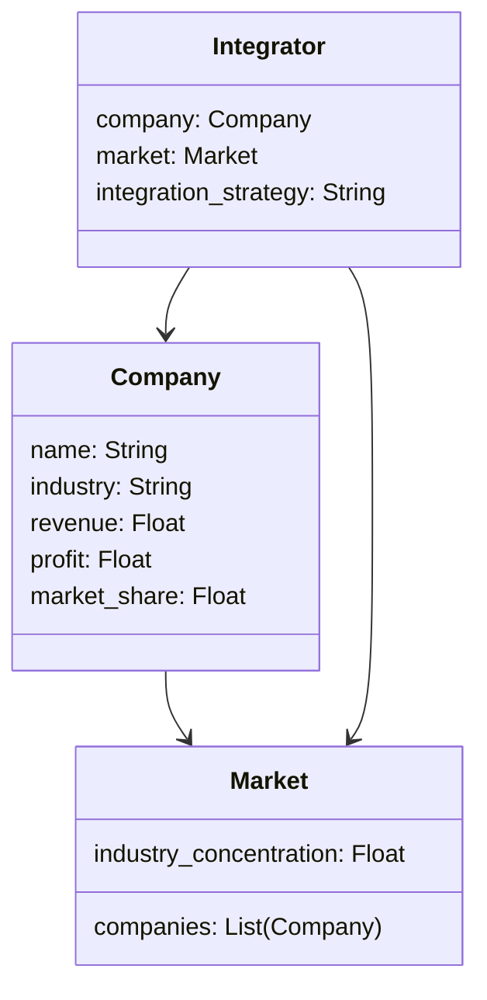
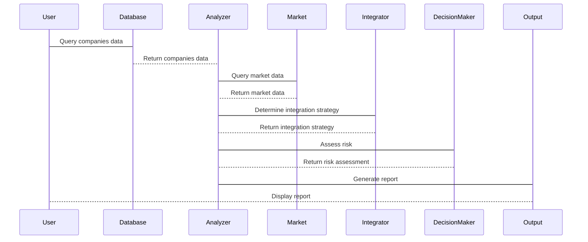

                 


# 彼得林奇的"行业整合者"识别方法

> 关键词：彼得林奇，行业整合者，投资策略，财务分析，风险管理

> 摘要：本文详细介绍了彼得林奇提出的“行业整合者”识别方法，分析了其核心概念、识别标准、财务指标、战略分析和投资策略。通过实际案例和系统架构设计，展示了如何在实际投资中应用这些方法，帮助投资者识别和投资行业整合者。

---

## 第一章：彼得林奇与行业整合者概述

### 1.1 彼得林奇的投资理念

#### 1.1.1 彼得林奇的生平简介
彼得·林奇（Peter Lynch）是美国著名的股票基金经理，以其在富达投资管理公司的成功投资而闻名。他在任职期间（1977年-1990年）管理的基金取得了年均29%的回报率，远超市场平均水平。林奇的投资哲学强调长期投资、深入研究和选择具有强大竞争优势的公司。

#### 1.1.2 彼得林奇的投资哲学
林奇认为，投资者应该选择那些在行业中具有整合能力的公司。这些公司能够通过整合上下游资源、并购竞争对手或扩展市场份额，从而在行业中占据主导地位。他的投资策略强调长期持有优质股票，避免短期市场波动的干扰。

#### 1.1.3 彼得林奇的成功投资案例
林奇成功投资的公司包括苹果、可口可乐和强生公司等。这些公司在行业内具有强大的整合能力，能够持续增长并为股东创造价值。

### 1.2 行业整合者的定义与特征

#### 1.2.1 行业整合者的定义
行业整合者是指在特定行业中，能够通过整合资源、技术和市场，逐步扩大市场份额并提升行业集中度的公司。这些公司通常具有强大的竞争优势和财务实力，能够在行业中占据主导地位。

#### 1.2.2 行业整合者的核心特征
- **市场集中度高**：整合者通常在市场中占据较大的份额，能够通过规模效应降低成本。
- **竞争优势明显**：整合者在技术、成本或品牌等方面具有显著优势，能够抵御竞争对手的挑战。
- **财务实力雄厚**：整合者通常具有较强的现金流和资产负债表，能够支持大规模的整合活动。
- **管理层能力突出**：整合者需要具备战略眼光和执行力的管理层，能够推动整合战略的实施。

#### 1.2.3 行业整合者与行业领导者的区别
行业整合者更注重通过整合资源和市场来扩大影响力，而行业领导者则更注重在现有市场中保持领先地位。整合者的目标是通过整合实现更大的市场份额和行业影响力。

### 1.3 行业整合者的战略意义

#### 1.3.1 行业整合者的市场地位
整合者在市场中通常具有较高的议价能力和市场影响力，能够通过整合上下游资源来优化供应链，降低成本。

#### 1.3.2 行业整合者对行业的影响
整合者通过并购、合作等方式，能够推动行业的整合和优化，提高行业的整体效率和竞争力。

#### 1.3.3 行业整合者的投资价值
整合者通常具有较高的增长潜力和稳定的盈利能力，能够为投资者带来超额回报。通过识别和投资行业整合者，投资者可以在长期获得较高的收益。

---

## 第二章：行业整合者的识别方法

### 2.1 行业整合者的识别标准

#### 2.1.1 市场集中度分析
市场集中度是判断行业整合潜力的重要指标。高市场集中度的行业通常更容易出现整合者，因为少数几家公司占据了大部分市场份额。

#### 2.1.2 竞争优势分析
整合者通常具有显著的竞争优势，如技术壁垒、成本优势或品牌影响力。这些优势使得他们在整合过程中能够占据主导地位。

#### 2.1.3 财务表现分析
整合者通常具有稳健的财务表现，包括高ROE（净资产收益率）、稳定的现金流和较低的负债率。这些财务指标能够支持整合者进行大规模的并购和投资。

#### 2.1.4 管理层能力分析
整合者的管理层通常具有战略眼光和执行力，能够在整合过程中有效推动战略实施。

### 2.2 行业整合者的财务指标分析

#### 2.2.1 营业收入与利润分析
整合者的营业收入和利润通常呈现稳定增长趋势。通过分析收入和利润的增长率，可以判断整合者的市场地位和盈利能力。

#### 2.2.2 资产负债表分析
整合者的资产负债表通常具有较低的负债率和较高的资产流动性。这些指标表明整合者具有较强的财务健康状况和抗风险能力。

#### 2.2.3 现金流分析
整合者通常具有稳定的现金流，能够支持大规模的整合活动。现金流分析是判断整合者财务实力的重要指标。

### 2.3 行业整合者的估值方法

#### 2.3.1 市盈率法
市盈率（P/E）是衡量公司估值的重要指标。整合者的市盈率通常低于行业平均水平，表明其具有较高的投资价值。

$$ P/E = \frac{股价}{每股收益} $$

#### 2.3.2 市净率法
市净率（P/B）是公司股价与每股净资产的比率。整合者的市净率通常较低，表明其资产价值被市场低估。

$$ P/B = \frac{股价}{每股净资产} $$

#### 2.3.3 EV/EBITDA法
EV/EBITDA是企业价值与息税折旧及摊销前利润的比率。整合者的EV/EBITDA通常较低，表明其具有较高的投资价值。

$$ EV/EBITDA = \frac{企业价值}{EBITDA} $$

---

## 第三章：行业整合者的战略分析

### 3.1 行业整合者的战略选择

#### 3.1.1 横向整合
横向整合是指整合者通过并购竞争对手来扩大市场份额。这种整合方式通常发生在市场集中度较低的行业，整合者通过并购实现规模效应和成本优势。

#### 3.1.2 纵向整合
纵向整合是指整合者通过并购上下游企业来优化供应链。这种整合方式通常发生在供应链较长的行业，整合者通过纵向整合降低采购成本和生产成本。

#### 3.1.3 战略联盟
战略联盟是指整合者与其他企业通过合作实现资源整合。这种整合方式通常发生在技术壁垒较高的行业，整合者通过战略联盟获取技术和资源。

### 3.2 行业整合者的竞争优势

#### 3.2.1 成本优势
整合者通过规模效应和供应链优化，能够在成本控制方面具有显著优势。

#### 3.2.2 技术优势
整合者通常具有领先的技术和创新能力，能够通过技术优势获取竞争优势。

#### 3.2.3 市场优势
整合者在市场中通常具有较高的品牌影响力和客户忠诚度，能够通过市场优势获取更多的市场份额。

### 3.3 行业整合者的风险管理

#### 3.3.1 行业整合的风险类型
- **市场风险**：整合者可能面临市场需求变化和价格竞争的压力。
- **财务风险**：整合者可能面临大规模并购带来的财务负担。
- **运营风险**：整合者可能面临整合过程中的管理和运营挑战。

#### 3.3.2 风险评估与控制
整合者需要通过详细的风险评估和控制措施，如建立风险管理团队、制定风险应对计划等，来降低整合过程中的风险。

#### 3.3.3 风险应对策略
整合者可以通过多元化战略、加强内部管理和优化运营流程等措施，来应对整合过程中的各种风险。

---

## 第四章：行业整合者的投资策略

### 4.1 行业整合者的投资机会

#### 4.1.1 垂直整合机会
垂直整合机会通常出现在供应链较长的行业，整合者通过并购上下游企业优化供应链。

#### 4.1.2 水平整合机会
水平整合机会通常出现在市场集中度较低的行业，整合者通过并购竞争对手扩大市场份额。

#### 4.1.3 全球化整合机会
全球化整合机会通常出现在跨国公司，整合者通过跨国并购实现全球化布局。

### 4.2 行业整合者的投资组合构建

#### 4.2.1 投资组合的分散化
投资者应该分散投资于不同行业和不同规模的整合者，以降低投资风险。

#### 4.2.2 投资组合的风险管理
投资者需要通过定期监控和调整投资组合，来应对市场变化和风险。

#### 4.2.3 投资组合的动态调整
投资者需要根据市场变化和整合者的最新动态，动态调整投资组合。

### 4.3 行业整合者的长期投资策略

#### 4.3.1 长期投资的目标设定
长期投资者应该选择具有持续整合能力和稳定增长的整合者。

#### 4.3.2 长期投资的风险管理
长期投资者需要通过分散投资和长期持有，来降低投资风险。

#### 4.3.3 长期投资的动态调整
长期投资者需要根据市场变化和整合者的最新动态，动态调整投资策略。

---

## 第五章：行业整合者的系统架构设计

### 5.1 问题场景介绍
为了识别行业整合者，我们需要构建一个系统化的识别模型，包括数据收集、分析和决策三个阶段。

### 5.2 项目介绍
本章介绍了一个基于彼得林奇理论的行业整合者识别系统，该系统能够帮助投资者快速识别具有整合潜力的公司。

### 5.3 系统功能设计

#### 5.3.1 领域模型
以下是领域模型的Mermaid类图：



#### 5.3.2 系统架构
以下是系统架构的Mermaid架构图：

```mermaid
div title System Architecture
    rectangle Database {
        Companies Data
        Market Data
    }
    rectangle Analyzer {
        Financial Analysis
        Market Analysis
    }
    rectangle DecisionMaker {
        Integration Strategy
        Risk Assessment
    }
    Database --> Analyzer
    Analyzer --> DecisionMaker
    DecisionMaker --> Output
```

#### 5.3.3 系统接口设计
系统接口设计包括数据输入、分析模块调用和结果输出三个部分。

#### 5.3.4 系统交互
以下是系统交互的Mermaid序列图：



---

## 第六章：行业整合者的项目实战

### 6.1 环境安装
为了实现行业整合者识别系统，我们需要安装以下工具：
- Python编程语言
- 数据分析库（Pandas、NumPy）
- 可视化库（Matplotlib、Seaborn）
- 数据库（MySQL、MongoDB）

### 6.2 系统核心实现源代码

#### 6.2.1 数据收集
以下是数据收集的Python代码示例：

```python
import pandas as pd
import requests

# 下载行业数据
url = "https://www.example.com/industry_data.csv"
data = pd.read_csv(url)
print(data.head())
```

#### 6.2.2 数据分析
以下是数据分析的Python代码示例：

```python
# 计算市场集中度
market_concentration = data["market_share"].sum()
print(f"Market Concentration: {market_concentration}%")

# 计算财务指标
revenue = data["revenue"].mean()
profit = data["profit"].mean()
print(f"Average Revenue: {revenue}$, Average Profit: {profit}$")
```

#### 6.2.3 系统交互
以下是系统交互的Python代码示例：

```python
# 定义整合者识别函数
def identify_integrator(companies):
    integrators = []
    for company in companies:
        if company["market_share"] > 0.2 and company["profit"] > industry_avg_profit:
            integrators.append(company)
    return integrators

# 调用识别函数
integrators = identify_integrator(data)
print(f"Identified Integrators: {len(integrators)}")
```

---

## 第七章：行业整合者的总结与展望

### 7.1 总结
彼得林奇的行业整合者识别方法为投资者提供了一种系统化的识别和投资策略。通过深入分析行业整合者的特征、财务指标和战略选择，投资者可以更好地识别和投资行业整合者。

### 7.2 投资策略
投资者应该选择具有强大竞争优势和财务实力的行业整合者，同时注重分散投资和风险管理。

### 7.3 未来展望
随着市场的不断发展，行业整合者识别方法将更加复杂和多样化。投资者需要不断学习和适应市场变化，以更好地识别和投资行业整合者。

---

## 作者：AI天才研究院/AI Genius Institute & 禅与计算机程序设计艺术 /Zen And The Art of Computer Programming

---

以上就是《彼得林奇的"行业整合者"识别方法》的完整目录和内容概要。希望这篇文章能为投资者提供有价值的参考和指导。

