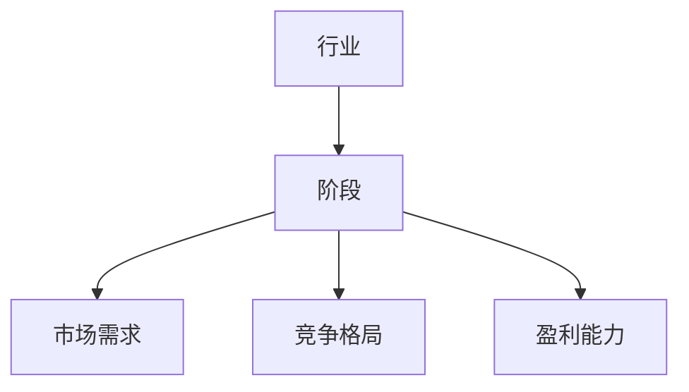
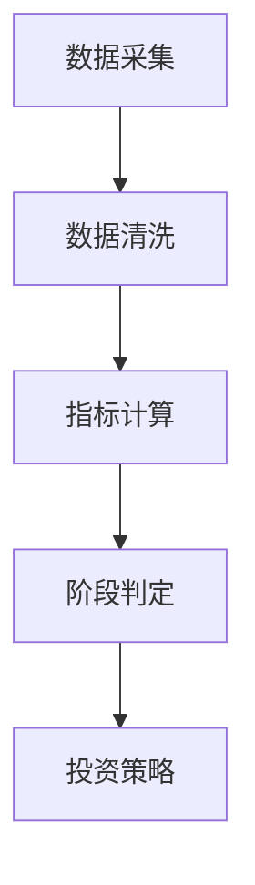
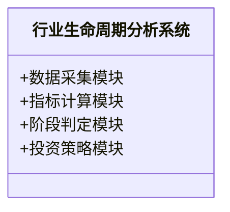
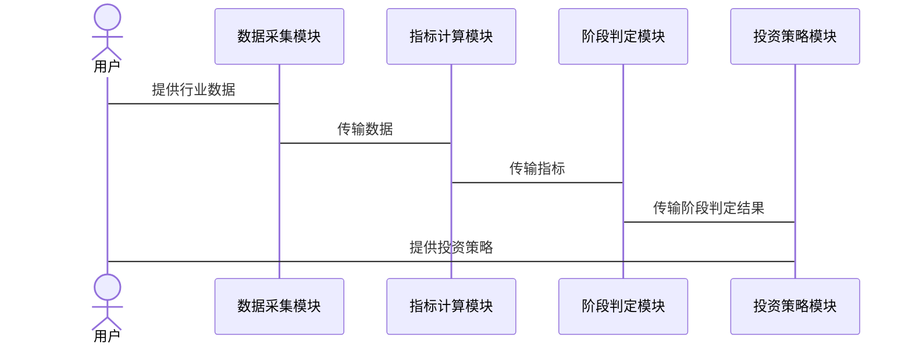

                 


# 彼得林奇的"行业生命周期"分析框架

> 关键词：行业生命周期，彼得林奇，投资分析，市场研究，企业战略

> 摘要：本文深入探讨彼得林奇提出的“行业生命周期”分析框架，从理论基础、核心概念、算法原理到系统架构和项目实战，全面解析其在投资决策、企业战略和行业研究中的应用价值。通过详细分析行业生命周期的四个阶段及其特征，结合实际案例和数学模型，帮助读者掌握如何利用这一框架进行有效的行业分析和投资决策。

---

## 第一部分: 行业生命周期分析框架概述

### 第1章: 行业生命周期的背景与概念

#### 1.1 行业生命周期的定义与核心要素

- **1.1.1 行业生命周期的定义**
  - 行业生命周期是指一个行业从诞生到衰退的完整发展过程。
  - 包括初创阶段、成长阶段、成熟阶段和衰退阶段四个阶段。

- **1.1.2 行业生命周期的核心要素**
  - **市场需求**：行业产品或服务的需求量和需求结构。
  - **竞争格局**：行业内企业的数量、市场份额和竞争强度。
  - **盈利能力**：行业的收入、利润和利润率变化趋势。
  - **技术进步**：行业内技术的创新和应用对行业生命周期的影响。

- **1.1.3 行业生命周期与企业生命周期的区别**
  - 行业生命周期是整个行业的整体发展趋势，而企业生命周期是单个企业的个体发展轨迹。
  - 行业生命周期影响企业的发展机会和挑战。

#### 1.2 行业生命周期的阶段划分

- **1.2.1 初创阶段**
  - 特征：市场需求小，企业数量少，技术不成熟，盈利能力低。
  - 核心问题：技术创新和市场验证。

- **1.2.2 成长阶段**
  - 特征：市场需求快速增长，企业数量增加，行业规模扩大。
  - 核心问题：市场份额争夺和规模化生产。

- **1.2.3 成熟阶段**
  - 特征：市场需求稳定，行业规模达到顶峰，竞争格局稳定。
  - 核心问题：利润最大化和成本控制。

- **1.2.4 衰退阶段**
  - 特征：市场需求下降，行业规模缩小，企业数量减少。
  - 核心问题：资源优化和转型。

#### 1.3 行业生命周期的影响因素

- **1.3.1 市场需求的变化**
  - 消费者偏好、技术进步、政策变化等因素影响市场需求。

- **1.3.2 技术进步的影响**
  - 技术创新推动行业升级，但也可能引发行业衰退。

- **1.3.3 竞争格局的演变**
  - 新进入者的加入和现有企业的竞争策略影响行业生命周期。

- **1.3.4 宏观经济环境的作用**
  - 经济周期、政策法规、国际贸易等因素影响行业的发展。

#### 1.4 行业生命周期分析的意义

- **1.4.1 投资决策的重要性**
  - 投资者可以根据行业生命周期选择合适的投资时机和标的。

- **1.4.2 企业战略规划的价值**
  - 企业可以根据行业所处的生命周期阶段制定相应的战略。

- **1.4.3 行业研究的应用场景**
  - 行业研究机构可以利用行业生命周期理论分析行业发展趋势。

#### 1.5 本章小结

- 介绍了行业生命周期的基本概念和阶段划分。
- 分析了影响行业生命周期的主要因素。
- 强调了行业生命周期分析在投资、企业战略和行业研究中的重要性。

---

### 第2章: 行业生命周期的核心概念与联系

#### 2.1 行业生命周期的核心概念

- **2.1.1 行业生命周期的四个阶段特征**
  - 初创阶段：高风险、低回报。
  - 成长阶段：高增长、高回报。
  - 成熟阶段：稳定增长、高回报。
  - 衰退阶段：低增长、低回报。

- **2.1.2 行业生命周期与企业生命周期的关系**
  - 行业生命周期影响企业的发展机会和挑战。
  - 企业生命周期与行业生命周期相互作用。

- **2.1.3 行业生命周期与宏观经济周期的关联**
  - 经济繁荣时期，行业生命周期可能加速进入成长阶段。
  - 经济衰退时期，行业生命周期可能提前进入衰退阶段。

#### 2.2 行业生命周期的核心要素对比

- **2.2.1 不同阶段的市场需求特征对比**
  | 阶段       | 需求特征             |
  |------------|----------------------|
  | 初创阶段   | 需求小，不确定性高     |
  | 成长阶段   | 需求快速增长         |
  | 成熟阶段   | 需求稳定             |
  | 衰退阶段   | 需求下降             |

- **2.2.2 不同阶段的竞争格局对比**
  | 阶段       | 竞争格局特征         |
  |------------|----------------------|
  | 初创阶段   | 竞争弱，企业数量少     |
  | 成长阶段   | 竞争加剧，企业数量增加 |
  | 成熟阶段   | 竞争稳定，企业数量稳定 |
  | 衰退阶段   | 竞争减弱，企业数量减少 |

- **2.2.3 不同阶段的盈利能力对比**
  | 阶段       | 盈利能力特征         |
  |------------|----------------------|
  | 初创阶段   | 盈利能力低           |
  | 成长阶段   | 盈利能力快速提升     |
  | 成熟阶段   | 盈利能力稳定         |
  | 衰退阶段   | 盈利能力下降         |

#### 2.3 行业生命周期的ER实体关系图



- **2.4 本章小结**
  - 详细对比了不同阶段的市场需求、竞争格局和盈利能力。
  - 通过ER实体关系图展示了行业生命周期的核心要素之间的关系。

---

### 第3章: 行业生命周期分析的算法原理

#### 3.1 行业生命周期分析的步骤

- **3.1.1 数据采集与清洗**
  - 数据来源：行业报告、财务数据、市场调研。
  - 数据清洗：去除缺失值、异常值，确保数据质量。

- **3.1.2 指标计算与分析**
  - 主要指标：收入增长率、利润增长率、市场份额变化率、技术更新速度。
  - 指标计算：使用统计方法计算增长率、变化率等。

- **3.1.3 行业阶段判定**
  - 判定方法：基于指标的综合判断，结合行业专家意见。
  - 判定模型：使用机器学习算法（如决策树、随机森林）进行分类。

- **3.1.4 投资策略制定**
  - 投资策略：根据行业生命周期阶段，制定相应的投资策略（如成长阶段投资高增长行业，衰退阶段寻找转型机会）。

#### 3.2 行业生命周期分析的流程图



- **3.3 行业生命周期分析的数学模型**

- **3.3.1 行业生命周期指数计算公式**
  $$
  \text{指数} = \frac{\text{当前阶段} - \text{起始阶段}}{\text{总阶段数}}
  $$

- **3.3.2 行业增长速度模型**
  $$
  \text{增长率} = \frac{\text{收入增长}}{\text{基期收入}}
  $$

#### 3.4 算法实现代码示例

```python
def industry_lifecycle_analysis(data):
    # 数据清洗
    cleaned_data = data.dropna()
    # 指标计算
    growth_rate = cleaned_data['收入'].pct_change()
    # 阶段判定
    lifecycle_stage = []
    for rate in growth_rate:
        if rate > 0.3:
            lifecycle_stage.append('成长阶段')
        elif rate > 0:
            lifecycle_stage.append('成熟阶段')
        else:
            lifecycle_stage.append('衰退阶段')
    return lifecycle_stage
```

#### 3.5 本章小结

- 介绍了行业生命周期分析的基本步骤和流程。
- 提供了数学模型和Python代码示例，展示了如何通过数据和算法进行行业生命周期分析。

---

### 第4章: 行业生命周期分析的系统架构与设计

#### 4.1 系统功能设计

- **4.1.1 功能模块**
  - 数据采集模块：负责采集行业数据。
  - 指标计算模块：负责计算行业指标。
  - 阶段判定模块：负责判定行业生命周期阶段。
  - 投资策略模块：负责制定投资策略。

- **4.1.2 领域模型（Mermaid类图）**


#### 4.2 系统架构设计

- **4.2.1 系统架构图（Mermaid架构图）**


#### 4.3 系统接口设计

- **4.3.1 数据接口**
  - 输入接口：行业数据输入。
  - 输出接口：分析结果输出。

- **4.3.2 系统交互（Mermaid序列图）**


#### 4.4 本章小结

- 介绍了行业生命周期分析系统的功能模块和系统架构。
- 使用Mermaid图展示了系统设计的类图、架构图和序列图。

---

### 第5章: 行业生命周期分析的项目实战

#### 5.1 项目背景与目标

- **项目背景**：选择一个具体行业（如科技行业）进行分析。
- **项目目标**：通过行业生命周期分析框架，制定投资策略。

#### 5.2 项目核心实现

- **5.2.1 环境安装**
  - 安装Python、Pandas、NumPy等工具。

- **5.2.2 核心代码实现**
```python
import pandas as pd
import numpy as np

def calculate_growth_rate(data):
    return data['收入'].pct_change()

def determineLifecycleStage(growth_rate):
    stages = []
    for rate in growth_rate:
        if rate > 0.3:
            stages.append('成长阶段')
        elif rate > 0:
            stages.append('成熟阶段')
        else:
            stages.append('衰退阶段')
    return stages

data = pd.read_csv('industry_data.csv')
growth_rate = calculate_growth_rate(data)
stages = determineLifecycleStage(growth_rate)
print(stages)
```

- **5.2.3 代码应用解读与分析**
  - 代码实现了行业增长率为指标的计算，根据增长率判断行业所处的生命周期阶段。

#### 5.3 实际案例分析

- **5.3.1 案例分析**
  - 以科技行业为例，分析其生命周期阶段。
  - 数据来源：科技行业的收入、利润、市场份额等数据。

- **5.3.2 案例解读**
  - 分析结果：科技行业当前处于成长阶段。
  - 投资策略：建议投资高增长的科技公司。

#### 5.4 项目小结

- 通过实际案例展示了行业生命周期分析框架的应用。
- 强调了数据分析和模型应用在投资决策中的重要性。

---

## 第二部分: 总结与展望

### 第6章: 行业生命周期分析的最佳实践

#### 6.1 总结

- 行业生命周期分析是投资决策和企业战略的重要工具。
- 通过数据和算法可以更准确地判断行业所处的生命周期阶段。

#### 6.2 最佳实践 tips

- 数据质量是分析的基础，确保数据准确性和完整性。
- 结合行业专家意见，避免单一依赖数据模型。
- 定期更新分析结果，适应行业变化。

#### 6.3 注意事项

- 行业生命周期分析具有一定的局限性，需结合其他分析方法。
- 数据模型需要根据行业特点进行调整和优化。

#### 6.4 拓展阅读

- 彼得·林奇的《投资学入门：股票的入门与实践》。
- 其他相关书籍和文献。

### 第7章: 未来展望

#### 7.1 未来研究方向

- 结合人工智能技术，提升行业生命周期分析的准确性。
- 开发更复杂的模型，考虑更多影响行业生命周期的因素。

#### 7.2 技术发展趋势

- 数据分析技术的进一步发展，提升行业分析的深度和广度。
- 大数据分析和机器学习技术在行业生命周期分析中的应用。

---

## 作者：AI天才研究院/AI Genius Institute & 禅与计算机程序设计艺术/Zen And The Art of Computer Programming

