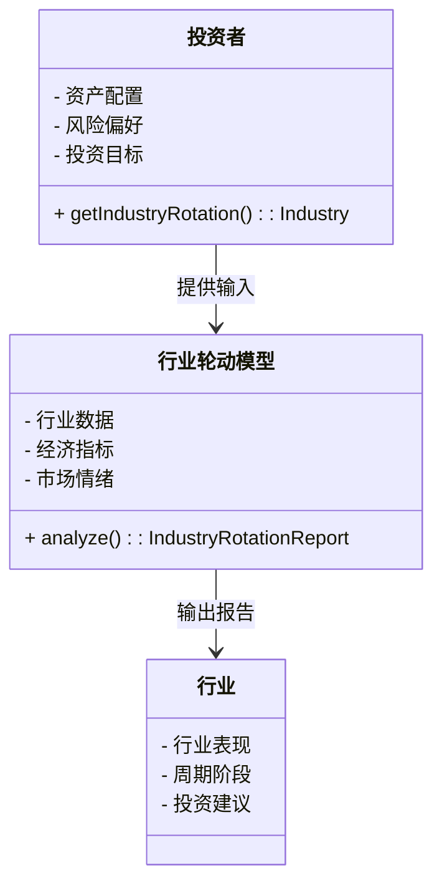
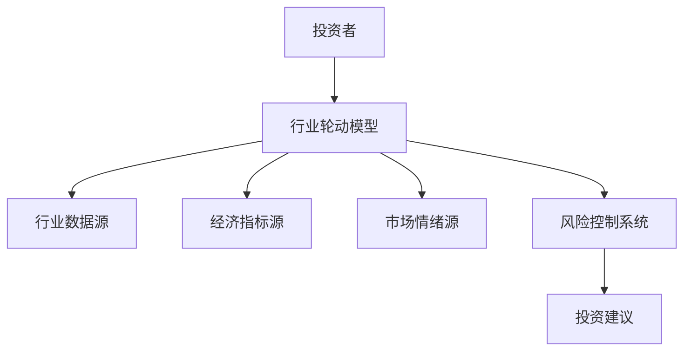

                 


# 彼得林奇的"行业轮动"在全球产业链重构中的应用

> **关键词**：行业轮动、彼得林奇、产业链重构、投资策略、系统分析、算法原理  
> **摘要**：本文深入探讨了彼得林奇提出的“行业轮动”策略在全球产业链重构中的应用。通过系统分析行业轮动的核心原理、产业链重构的现状与趋势，结合数学模型和实际案例，展示了如何将行业轮动策略应用于全球产业链重构中的投资决策。文章还提供了代码示例和系统架构图，帮助读者更好地理解和应用这一策略。

---

## 第1章: 行业轮动的基本概念

### 1.1 行业轮动的定义与背景

#### 1.1.1 行业轮动的定义
行业轮动是指在不同的经济周期中，不同行业表现轮流上升的现象。它基于市场的周期性波动，强调通过行业间的动态平衡来优化投资组合。

#### 1.1.2 行业轮动的历史背景
行业轮动的概念源于20世纪70年代的美国经济波动，彼得林奇在这一背景下提出了行业轮动的投资策略，强调行业间的轮动机会。

#### 1.1.3 行业轮动的经济意义
行业轮动帮助投资者在经济周期变化中捕捉行业增长潜力，分散投资风险，优化资产配置。

### 1.2 彼得林奇与行业轮动

#### 1.2.1 彼得林奇的投资理念
彼得林奇强调长期投资和价值发现，认为行业轮动是捕捉市场机会的有效工具。

#### 1.2.2 彼得林奇对行业轮动的贡献
彼得林奇通过长期实践，总结出行业轮动的关键策略，如行业选择和时机把握。

#### 1.2.3 行业轮动在彼得林奇投资策略中的地位
行业轮动是彼得林奇策略的核心部分，帮助其在不同经济周期中实现投资收益的最大化。

---

## 第2章: 全球产业链重构的背景与趋势

### 2.1 全球化与产业链重构的现状

#### 2.1.1 全球化的历史演变
从早期的全球化到当前的区域化，产业链经历了多次重构。

#### 2.1.2 当前全球化面临的新挑战
地缘政治、贸易摩擦和技术封锁等因素推动了产业链的重构。

#### 2.1.3 产业链重构的主要驱动力
技术进步、成本变化和政策调整是推动产业链重构的主要因素。

### 2.2 产业链重构对全球经济的影响

#### 2.2.1 产业链重构对各国经济的影响
重构可能导致某些国家的产业升级，而其他国家可能面临产业转移的压力。

#### 2.2.2 产业链重构对行业轮动的影响
重构可能导致某些行业的需求激增，而其他行业则可能面临压力，从而引发行业轮动。

#### 2.2.3 产业链重构中的机会与风险
重构带来新兴行业的投资机会，但也伴随技术和地缘政治的风险。

---

## 第3章: 行业轮动的核心原理与分析

### 3.1 行业轮动的驱动因素

#### 3.1.1 经济周期的影响
经济周期波动直接影响行业的兴衰，推动行业轮动的发生。

#### 3.1.2 政策环境的变化
政策调整如税收变化和贸易政策直接影响产业链的布局。

#### 3.1.3 技术进步与创新
技术创新改变行业结构，推动行业轮动。

### 3.2 行业轮动的机制分析

#### 3.2.1 行业轮动的基本模型
行业轮动模型包括经济指标、行业表现和市场情绪等因素。

#### 3.2.2 行业轮动的周期性特征
行业轮动呈现周期性，不同行业在不同阶段交替上升。

#### 3.2.3 行业轮动与市场情绪的关系
市场情绪影响行业轮动的速度和幅度，投资者情绪波动加速轮动。

---

## 第4章: 全球产业链重构中的行业轮动分析

### 4.1 产业链重构与行业轮动的关系

#### 4.1.1 产业链重构影响行业轮动的方向
重构可能导致某些行业需求增加，推动行业轮动。

#### 4.1.2 重构影响行业轮动的速度
重构过程中的政策变化和技术进步加速行业轮动。

#### 4.1.3 重构影响行业轮动的风险
重构中的不确定性增加行业轮动的波动性。

### 4.2 全球产业链重构中的行业轮动策略

#### 4.2.1 基于行业轮动的重构机会
识别重构中的新兴行业，提前布局。

#### 4.2.2 重构中的风险控制
通过多样化投资和风险对冲降低轮动带来的风险。

#### 4.2.3 重构中的长期投资策略
关注产业升级趋势，投资具备长期增长潜力的行业。

---

## 第5章: 行业轮动的系统分析与架构设计

### 5.1 系统功能设计

#### 5.1.1 问题场景介绍
在产业链重构中，投资者需要实时监控行业动态，识别轮动机会。

#### 5.1.2 领域模型mermaid类图


### 5.2 系统架构设计

#### 5.2.1 系统架构图


#### 5.2.2 系统接口设计
- 输入：行业数据、经济指标、市场情绪
- 输出：行业轮动报告、投资建议

#### 5.2.3 系统交互序列图
```mermaid
sequenceDiagram
   投资者 -> 行业轮动模型: 提供数据
    industryModel -> 数据处理模块: 处理行业数据
    数据处理模块 -> 投资建议模块: 生成建议
    投资者 <- 投资建议模块: 提供建议
```

---

## 第6章: 行业轮动的算法实现

### 6.1 行业轮动算法的数学模型

#### 6.1.1 行业轮动指数的计算
$$ R_i = \sum_{j=1}^{n} (w_j \times P_j) $$
其中，$R_i$为行业轮动指数，$w_j$为权重，$P_j$为行业表现指标。

#### 6.1.2 轮动时机的判断
$$ S_i = \frac{R_i - \mu}{\sigma} $$
其中，$S_i$为行业轮动强度，$\mu$为均值，$\sigma$为标准差。

### 6.2 Python实现代码示例

```python
import pandas as pd
import numpy as np

# 示例数据：行业表现
data = {
    '行业A': [1.2, 1.3, 1.1, 1.4],
    '行业B': [0.8, 0.9, 1.0, 1.1],
    '行业C': [1.5, 1.6, 1.4, 1.7]
}
df = pd.DataFrame(data)

# 计算行业轮动指数
weights = [0.4, 0.3, 0.3]
industry_rotation = df.dot(weights)

# 判断轮动时机
def get_rotation_strength(r):
    mu = np.mean(r)
    std = np.std(r)
    return (r - mu) / std

rotation_strength = get_rotation_strength(industry_rotation)
```

---

## 第7章: 案例分析与实际应用

### 7.1 案例分析

#### 7.1.1 案例背景
假设全球经济处于复苏期，科技行业需求激增，传统制造业面临压力。

#### 7.1.2 行业轮动分析
应用上述算法，发现科技行业轮动强度高，具备投资机会。

#### 7.1.3 投资建议
增加科技行业投资比例，减少传统制造业投资。

### 7.2 实际应用

#### 7.2.1 环境安装
确保安装Python和相关库（pandas、numpy）。

#### 7.2.2 系统实现
运行上述代码，生成行业轮动指数和投资建议。

#### 7.2.3 应用解读
根据结果调整投资组合，捕捉行业轮动带来的收益。

---

## 第8章: 总结与展望

### 8.1 总结

#### 8.1.1 行业轮动的核心作用
行业轮动在产业链重构中帮助投资者捕捉机会，分散风险。

#### 8.1.2 系统分析的重要性
系统分析和架构设计是成功应用行业轮动的关键。

### 8.2 展望

#### 8.2.1 未来的研究方向
进一步研究行业轮动与产业链重构的动态关系。

#### 8.2.2 技术与实践的结合
开发更智能的行业轮动算法，结合人工智能优化投资决策。

### 8.3 最佳实践 Tips

- 定期评估投资组合，调整行业配置。
- 结合宏观经济指标，判断轮动时机。
- 保持对行业动态的关注，及时调整策略。

### 8.4 小结
本文通过系统分析和案例研究，展示了彼得林奇的行业轮动策略在全球产业链重构中的应用，为投资者提供了实用的指导和建议。

---

## 作者信息

作者：AI天才研究院/AI Genius Institute & 禅与计算机程序设计艺术 /Zen And The Art of Computer Programming

---

**全文结束**

