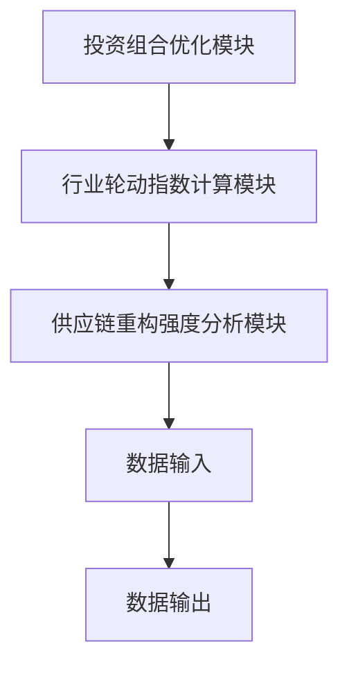
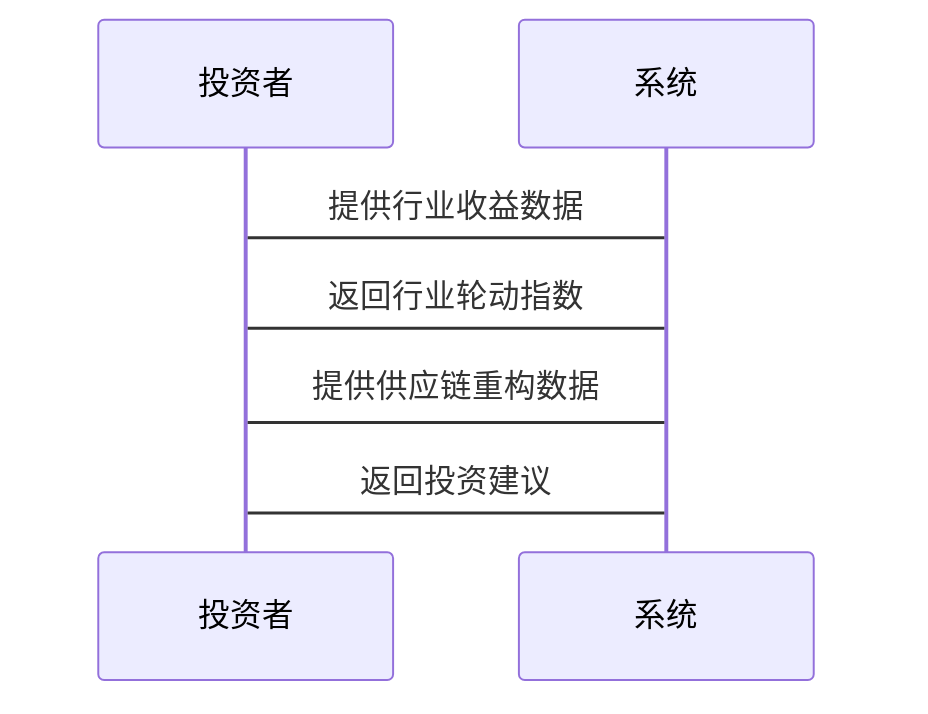

                 


# 彼得林奇的"行业轮动"在全球供应链重构中的投资机会识别

## 关键词：行业轮动，供应链重构，投资机会，彼得林奇，全球供应链

## 摘要：本文深入探讨了彼得·林奇提出的“行业轮动”理论在全球供应链重构背景下的应用。通过分析行业轮动与供应链重构的关系，结合数学模型和系统架构设计，识别投资机会。文章详细讲解了行业轮动的基本概念、供应链重构的背景与趋势、行业轮动与供应链重构的关联，以及如何利用行业轮动指数和数学模型进行投资决策。最后，通过实际案例分析和项目实战，为投资者提供了实用的指导。

---

# 第一部分：行业轮动与供应链重构的背景与概念

## 第1章：行业轮动的基本概念

### 1.1 行业轮动的定义与特点

行业轮动是指在不同的经济周期中，不同行业之间表现轮流上升的现象。其特点是周期性、轮动性、行业间差异性。行业轮动的核心在于识别经济周期变化中的行业趋势，从而优化投资组合。

### 1.2 供应链重构的背景与趋势

全球供应链重构是近年来全球经济的重大变革，主要由地缘政治风险、疫情冲击、技术进步等因素驱动。重构的目标是提高供应链的韧性和效率，降低风险。

### 1.3 行业轮动与供应链重构的关联

行业轮动与供应链重构密切相关。供应链重构会改变行业间的竞争格局，进而影响行业轮动的节奏和方向。例如，供应链本地化可能导致某些行业（如制造业）在特定地区轮动上升。

---

## 第2章：行业轮动与供应链重构的关联

### 2.1 行业轮动在供应链重构中的作用

行业轮动能够帮助投资者识别供应链重构中的机会。例如，当供应链从中国转移到东南亚时，东南亚的制造业和物流行业可能进入轮动上升阶段。

### 2.2 供应链重构对行业轮动的影响

供应链重构可能改变行业的周期性。例如，某些行业可能因为供应链重构而提前进入上升周期，而其他行业则可能因为供应链断裂而进入衰退周期。

---

## 第3章：彼得林奇的行业轮动理论

### 3.1 彼得林奇的投资理念

彼得林奇强调长期投资和行业轮动。他认为，行业轮动是市场周期的一部分，投资者应根据经济周期的变化调整投资组合。

### 3.2 彼得林奇行业轮动模型

彼得林奇的行业轮动模型基于经济周期分析。模型包括以下几个步骤：
1. 分析当前经济周期所处的阶段（复苏、过热、滞胀、衰退）。
2. 根据经济周期阶段，选择表现较好的行业。
3. 调整投资组合，增加轮动上升行业的权重。

---

## 第4章：供应链重构中的行业轮动分析

### 4.1 供应链重构对行业轮动的影响

供应链重构可能导致行业轮动周期缩短或延长。例如，地缘政治风险可能加速某些行业的轮动。

### 4.2 全球供应链重构中的行业轮动案例

以半导体行业为例，供应链重构可能导致芯片制造行业在东南亚和中国的轮动上升。

---

## 第5章：行业轮动与供应链重构的数学模型

### 5.1 行业轮动指数的构建

行业轮动指数是衡量行业轮动强度的重要指标。公式如下：
$$
I = \sum_{i=1}^{n} w_i \cdot r_i
$$
其中，\( w_i \) 是行业权重，\( r_i \) 是行业收益。

### 5.2 供应链重构对行业轮动的影响模型

供应链重构对行业轮动的影响可以通过以下公式表示：
$$
R = \alpha \cdot S + \beta \cdot T
$$
其中，\( R \) 是行业轮动强度，\( S \) 是供应链重构强度，\( T \) 是时间因素。

---

## 第6章：行业轮动与供应链重构的系统架构设计

### 6.1 问题场景介绍

供应链重构可能导致行业轮动周期变化，投资者需要实时监控行业轮动指数。

### 6.2 系统功能设计

系统功能包括：
1. 行业轮动指数计算模块。
2. 供应链重构强度分析模块。
3. 投资组合优化模块。

### 6.3 系统架构设计

以下是系统架构的Mermaid图：



### 6.4 系统接口设计

系统接口包括：
1. 数据输入接口：接收行业收益和供应链重构数据。
2. 数据输出接口：输出行业轮动指数和投资建议。

### 6.5 系统交互流程

以下是系统交互的Mermaid序列图：



---

## 第7章：项目实战

### 7.1 环境安装

需要安装Python和相关库（如NumPy、Pandas、Matplotlib）。

### 7.2 系统核心实现源代码

以下是行业轮动指数计算的Python代码：

```python
import numpy as np
import pandas as pd
import matplotlib.pyplot as plt

# 示例数据
industry_returns = pd.DataFrame({
    '制造业': [0.1, 0.2, 0.15, 0.05, 0.1],
    '科技': [0.05, 0.1, 0.2, 0.15, 0.05],
    '物流': [0.15, 0.05, 0.2, 0.1, 0.15]
})

# 行业权重
weights = pd.Series([0.4, 0.3, 0.3], index=['制造业', '科技', '物流'])

# 计算行业轮动指数
def calculate_index(returns, weights):
    index = returns.dot(weights)
    return index

index = calculate_index(industry_returns, weights)
print("行业轮动指数：")
print(index)
```

### 7.3 代码应用解读与分析

上述代码计算了不同行业的轮动指数，权重反映了各行业的影响力。投资者可以根据指数调整投资组合。

### 7.4 实际案例分析

以制造业为例，供应链重构可能导致制造业的轮动指数上升，投资者可以增加对该行业的投资。

### 7.5 项目小结

通过项目实战，我们可以看到行业轮动指数在供应链重构中的应用价值。

---

## 第8章：最佳实践、小结与注意事项

### 8.1 最佳实践

1. 定期更新行业轮动指数。
2. 结合宏观经济指标进行投资决策。
3. 注意行业轮动的周期性。

### 8.2 小结

本文通过理论分析和实战案例，展示了如何利用行业轮动理论在全球供应链重构中识别投资机会。

### 8.3 注意事项

投资者应关注地缘政治风险和供应链重构的长期影响。

---

## 作者

作者：AI天才研究院 & 禅与计算机程序设计艺术

