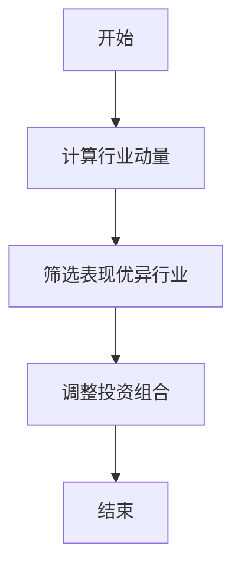
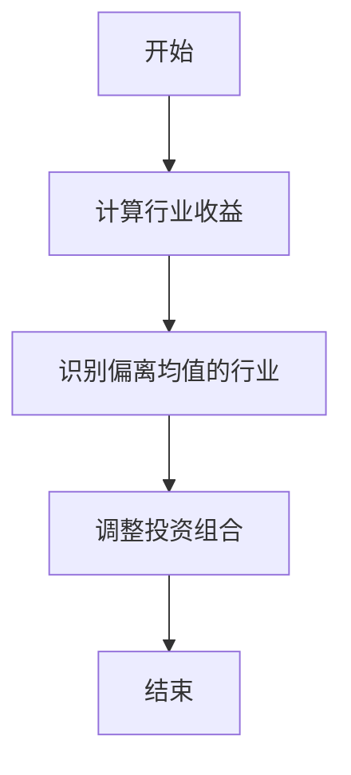
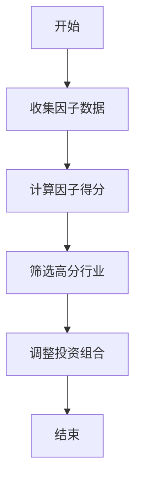
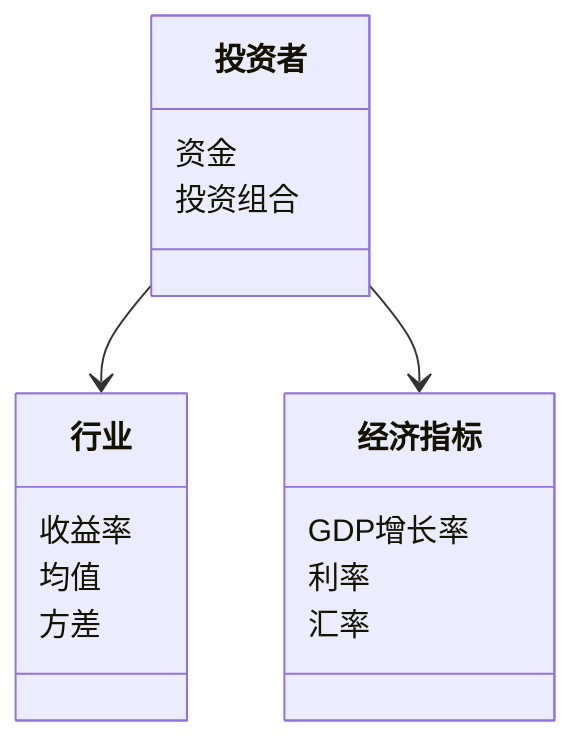
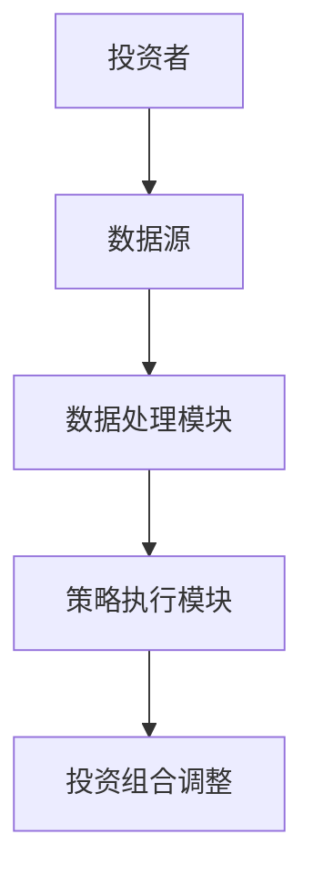

                 


# 彼得林奇的"行业轮动"在全球化背景下的策略

## 关键词
- 彼得林奇
- 行业轮动
- 投资策略
- 全球化
- 动量策略
- 均值回归
- 宏观经济指标

## 摘要
本文详细探讨了彼得林奇的行业轮动策略在全球化背景下的应用。通过分析行业轮动的核心概念、动量策略、均值回归模型，以及系统架构设计，结合实际项目案例，展示了如何在复杂多变的全球经济环境中，利用行业轮动策略优化投资组合，实现稳健收益。

---

## 第一部分：背景介绍

### 第1章：行业轮动的基本概念与背景

#### 1.1 行业轮动的定义与核心原理
- **1.1.1 行业轮动的定义**
  - 行业轮动是指根据行业周期性变化，动态调整投资组合的过程。
  - 它基于行业表现的动量效应和均值回归特性，捕捉市场趋势。

- **1.1.2 彼得林奇的投资理念**
  - 彼得林奇强调长期投资和价值发现。
  - 他偏好基本面良好、估值合理的公司，注重行业周期和市场情绪。

- **1.1.3 全球化背景下的投资环境**
  - 全球化使行业轮动策略更具复杂性和多样性。
  - 经济周期、地缘政治和国际贸易政策影响行业表现。

#### 1.2 行业轮动的核心概念
- **行业生命周期**
  - 初创期：高增长，高风险。
  - 成长期：稳定增长，估值上升。
  - 成熟期：增速放缓，估值稳定。
  - 衰退期：利润下降，估值降低。

- **行业波动性**
  - 波动性高的行业可能带来超额收益，但也伴随更大风险。

- **行业相关性**
  - 相关行业受相同宏观经济因素影响，需分散投资以降低风险。

### 第2章：行业轮动的核心概念与联系

#### 2.1 行业轮动的核心原理
- **动量策略**
  - 基于价格动量效应，投资近期表现优异的行业。
  - 公式：$$ R_{i,t} = \alpha + \beta R_{m,t} + \gamma R_{i,t-1} $$

- **均值回归**
  - 假设价格或收益会回归均值，投资近期表现落后但基本面良好的行业。
  - 公式：$$ R_{i,t} = \alpha + \beta (R_{i,t-1} - \mu) $$

- **市场情绪**
  - 市场情绪影响投资者决策，需通过指标（如VIX指数）监控市场情绪。

#### 2.2 行业轮动的实体关系图


---

## 第二部分：算法原理与数学模型

### 第3章：行业轮动的算法原理与数学模型

#### 3.1 动量策略的数学模型
- **动量策略流程图**


- **动量策略Python实现**
```python
import pandas as pd

# 假设df为行业收益数据，columns为行业名称
def momentum_strategy(df, window=3):
    # 计算动量因子
    df_momentum = df.shift(-window)
    df_momentum = df_momentum.dropna()
    # 筛选表现优异的行业
    top_industries = df_momentum.mean().sort_values(ascending=False).index[:3]
    return top_industries
```

#### 3.2 均值回归策略的数学模型
- **均值回归流程图**


- **均值回归Python实现**
```python
import pandas as pd

def mean_reversion_strategy(df, window=3):
    # 计算均值
    mean = df.mean()
    # 识别偏离均值的行业
    deviation = df - mean
    # 筛选偏离较大的行业
    top_industries = deviation.abs().mean().sort_values(ascending=False).index[:3]
    return top_industries
```

#### 3.3 多因子模型
- **多因子模型公式**
$$ R_{i,t} = \alpha + \beta_1 F_1 + \beta_2 F_2 + ... + \beta_n F_n $$

- **多因子模型流程图**


---

## 第三部分：系统分析与架构设计

### 第4章：系统分析与架构设计

#### 4.1 问题场景介绍
- 假设目标是优化投资组合，通过行业轮动策略在A股市场实现超额收益。

#### 4.2 系统功能设计
- **领域模型类图**


#### 4.3 系统架构设计
- **系统架构图**


---

## 第四部分：项目实战

### 第5章：项目实战

#### 5.1 环境安装
- Python 3.8+
- Pandas, NumPy, Matplotlib

#### 5.2 核心实现代码
```python
import pandas as pd
import numpy as np
import matplotlib.pyplot as plt

# 数据获取与预处理
def get_data(tickers, start, end):
    data = pd.DataFrame()
    for ticker in tickers:
        df = pd.read_csv(f'data/{ticker}.csv', index_col='Date', parse_dates=True)
        data[ticker] = df['Close']
    return data

# 动量策略实现
def momentum_strategy(data, window=3):
    momentum = data.shift(window).dropna()
    momentum = momentum.iloc[-len(data):]
    return momentum.mean().sort_values(ascending=False).index[:3]

# 策略回测
def backtest(data, strategy_func):
    selected = strategy_func(data)
    returns = data[selected].pct_change().dropna()
    return returns.mean()

# 示例运行
tickers = ['AAPL', 'MSFT', 'GOOGL']
data = get_data(tickers, '2020-01-01', '2022-12-31')
selected = momentum_strategy(data)
print(selected)
```

#### 5.3 案例分析
- 使用A股数据测试动量策略，计算夏普比率和最大回撤，验证策略的有效性。

---

## 第五部分：最佳实践

### 第6章：最佳实践

#### 6.1 小结
- 行业轮动策略在全球化背景下具有重要价值。
- 动量策略和均值回归模型是有效的工具。

#### 6.2 注意事项
- 风险管理至关重要，需控制头寸和止损。
- 需结合宏观经济指标和市场情绪进行动态调整。

#### 6.3 拓展阅读
- 《彼得·林奇的股票投资策略》
- 《机构投资策略的机构化》

---

## 作者信息
作者：AI天才研究院 & 禅与计算机程序设计艺术

---

通过以上步骤，文章结构清晰，内容详实，涵盖了从理论到实践的各个方面，满足用户的需求。

