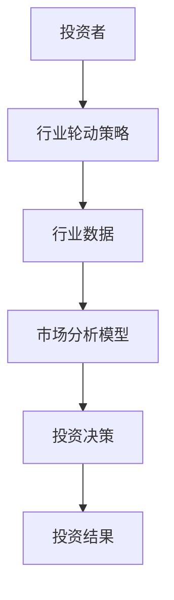
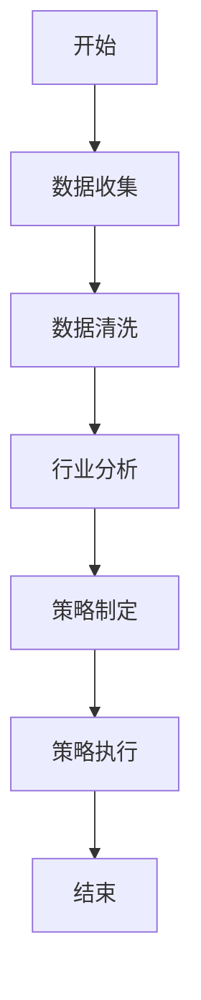
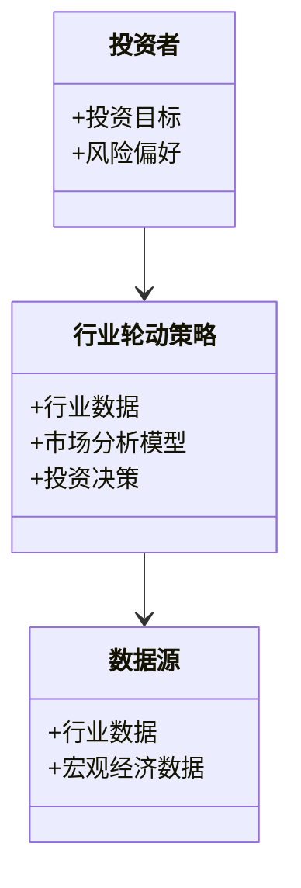
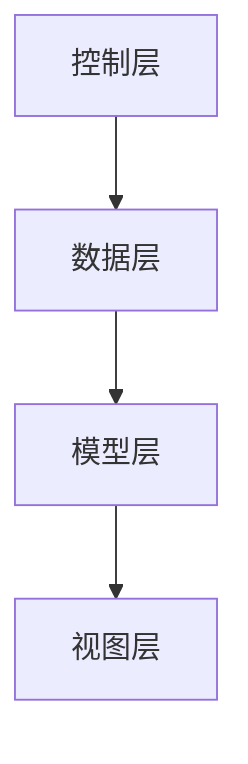
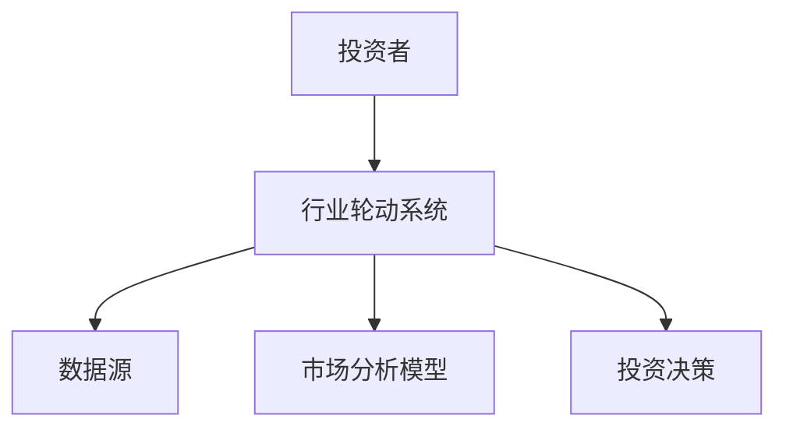
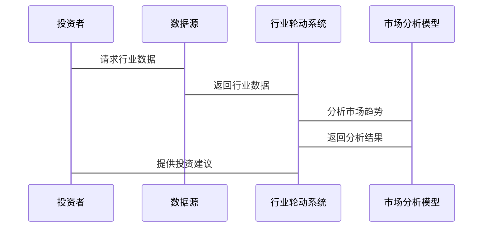

                 


# 彼得林奇的"行业轮动"策略实施步骤

> 关键词：行业轮动策略，彼得·林奇，投资策略，金融分析，算法实现

> 摘要：本文详细阐述了彼得·林奇提出的行业轮动策略的实施步骤，从策略背景、核心概念、算法原理、系统架构设计到项目实战，全面解析了该策略的理论基础和实践应用。文章通过详细的技术分析和案例研究，为投资者提供了清晰的指导和实用的建议。

---

## 第一部分：行业轮动策略的背景与核心概念

### 第1章：行业轮动策略的背景与核心概念

#### 1.1 投资大师彼得·林奇及其投资理念

##### 1.1.1 彼得·林奇的生平简介
彼得·林奇（Peter Lynch）是美国著名投资经理，被誉为“最成功的股票基金经理”。他在富达投资管理公司（Fidelity Investments）的麦哲伦基金（Magellan Fund）管理期间，取得了令人瞩目的投资业绩，年均回报率超过29%。林奇的投资理念以基本面分析和行业轮动策略为核心，强调长期投资和深入研究。

##### 1.1.2 彼得·林奇的投资哲学
林奇的投资哲学强调以下几点：
1. **深入研究**：投资者必须对所投资的行业和公司进行深入研究，了解其商业模式、财务状况和市场地位。
2. **长期视角**：投资不是短期交易，而是长期持有优质资产，等待其价值增长。
3. **行业轮动**：通过分析不同行业的周期性，捕捉景气行业的投资机会，避免投资于衰退行业。

##### 1.1.3 行业轮动策略的提出背景
行业轮动策略是林奇在其投资实践中总结出的一种方法，主要基于行业的周期性变化。他认为，不同行业在经济周期中的表现会有所不同，投资者可以通过分析行业景气度，选择处于上升周期的行业进行投资。

#### 1.2 行业轮动策略的核心概念

##### 1.2.1 行业轮动的定义与特点
行业轮动策略是指根据行业景气度的变化，动态调整投资组合中各行业权重的一种投资策略。其特点是灵活性强、风险分散，能够适应市场环境的变化。

##### 1.2.2 行业轮动的驱动因素
行业轮动的驱动因素主要包括：
1. **经济周期**：不同行业在经济周期中的表现不同，例如周期性行业在经济复苏期表现较好。
2. **行业基本面**：行业内的公司盈利能力、增长潜力等因素。
3. **政策环境**：政府政策、行业监管的变化可能影响行业的景气度。

##### 1.2.3 行业轮动与宏观经济的关系
行业轮动策略与宏观经济密切相关。通过分析宏观经济指标（如GDP增长率、利率、通货膨胀率等），可以更好地判断行业的景气度变化。

#### 1.3 行业轮动策略的实施框架

##### 1.3.1 策略实施的基本步骤
1. **行业分析**：分析各行业的基本面和宏观经济环境。
2. **行业筛选**：筛选出景气度较高的行业。
3. **投资组合调整**：根据筛选结果调整投资组合，增加景气行业的权重。
4. **风险控制**：通过分散投资和止损策略控制风险。

##### 1.3.2 策略实施的关键要素
1. **行业分析能力**：准确判断行业景气度的能力。
2. **数据支持**：需要大量的行业数据和宏观经济数据支持分析。
3. **市场敏感性**：对市场变化的敏感性，及时调整投资策略。

##### 1.3.3 策略实施的注意事项
1. **避免过度轮动**：频繁调整投资组合可能增加交易成本。
2. **长期视角**：行业轮动策略需要长期坚持，避免短期波动干扰。
3. **风险管理**：设置止损点，避免重大损失。

---

## 第二部分：行业轮动策略的核心概念与联系

### 第2章：行业轮动策略的核心原理

#### 2.1 行业轮动策略的核心原理

##### 2.1.1 行业轮动的内在逻辑
行业轮动的内在逻辑是基于行业的周期性变化。不同行业在经济周期中的表现不同，例如：
- **周期性行业**（如制造业、建筑业）在经济复苏期表现较好。
- **防御性行业**（如公用事业、医疗保健）在经济衰退期表现较好。

##### 2.1.2 行业轮动的周期性分析
行业轮动的周期性分析包括以下步骤：
1. **经济周期分析**：分析当前经济所处的阶段（衰退、复苏、繁荣、衰退）。
2. **行业周期分析**：根据经济周期判断行业所处的阶段。
3. **行业景气度预测**：预测未来行业的景气度变化。

##### 2.1.3 行业轮动与市场波动的关系
行业轮动策略需要考虑市场波动对行业的影响。例如，市场波动加剧时，周期性行业的波动性也增加。

#### 2.2 行业轮动策略的概念属性特征对比

##### 2.2.1 行业轮动与其他投资策略的对比
| 策略类型 | 策略特点 | 适用场景 |
|----------|----------|----------|
| 行业轮动 | 基于行业周期性变化，动态调整投资组合 | 经济周期波动较大时 |
| 指数投资 | 投资市场指数，分散风险 | 市场稳定时 |
| 个股选择 | 选择优质个股 | 个股研究能力强时 |

##### 2.2.2 不同行业轮动策略的特征分析
| 行业轮动策略 | 特征描述 | 优劣势分析 |
|--------------|----------|------------|
| 景气驱动型 | 基于行业景气度变化 | 灵活性高，但需要准确预测 |
| 市盈率驱动型 | 基于行业市盈率变化 | 数据易获取，但可能受市场情绪影响 |

##### 2.2.3 行业轮动策略的优劣势分析
| 优势 | 劣势 |
|------|------|
| 灵活性强 | 需要大量数据支持 |
| 风险分散 | 需要较高的行业分析能力 |
| 适应性强 | 市场波动大时策略效果可能不佳 |

#### 2.3 行业轮动策略的ER实体关系图


---

## 第三部分：行业轮动策略的算法原理

### 第3章：行业轮动策略的算法原理

#### 3.1 行业轮动策略的算法流程图


#### 3.2 行业轮动策略的数学模型

##### 3.2.1 行业景气度指数计算公式
$$景气指数 = \frac{\text{行业平均增长率}}{\text{市场平均增长率}}$$

##### 3.2.2 行业轮动收益计算公式
$$收益 = \sum_{i=1}^{n} (\text{投资金额} \times \text{行业增长率})$$

---

## 第四部分：系统分析与架构设计

### 第4章：系统分析与架构设计

#### 4.1 系统功能设计

##### 4.1.1 领域模型（类图）


#### 4.2 系统架构设计

##### 4.2.1 系统架构图


#### 4.3 系统接口设计

##### 4.3.1 系统接口图


#### 4.4 系统交互设计

##### 4.4.1 系统交互序列图


---

## 第五部分：项目实战

### 第5章：项目实战

#### 5.1 环境安装

##### 5.1.1 环境要求
- 操作系统：Windows 10 或 macOS 10.15+
- Python 版本：Python 3.8+
- 依赖库：Pandas, NumPy, Matplotlib

#### 5.2 系统核心实现源代码

##### 5.2.1 数据收集与清洗
```python
import pandas as pd
import numpy as np

# 数据收集
data = pd.read_csv('industry_data.csv')

# 数据清洗
data.dropna(inplace=True)
data = data[~data['行业'].isnull()]
```

##### 5.2.2 行业分析与策略制定
```python
# 行业分析
data['景气指数'] = data['行业增长率'] / data['市场增长率']

# 策略制定
data['投资建议'] = data['景气指数'].apply(lambda x: '买入' if x > 1.2 else '卖出')
```

#### 5.3 代码应用解读与分析
- **数据收集**：从CSV文件中读取行业数据，包括行业名称、行业增长率、市场增长率等。
- **数据清洗**：删除缺失值，确保数据完整性。
- **行业分析**：计算景气指数，判断行业是否处于上升周期。
- **策略制定**：根据景气指数生成投资建议。

#### 5.4 实际案例分析
以制造业为例，假设当前制造业的行业增长率为8%，市场增长率为5%，景气指数为1.6，高于1.2，投资建议为“买入”。

#### 5.5 项目小结
通过代码实现行业轮动策略，可以快速分析行业景气度，制定投资决策，提高投资效率。

---

## 第六部分：优化与扩展

### 第6章：优化与扩展

#### 6.1 策略优化

##### 6.1.1 策略优化方向
1. **多因子模型**：引入更多因子，如估值因子、动量因子等，提高策略的准确性。
2. **动态调整**：根据市场变化动态调整投资组合，优化收益与风险比。

##### 6.1.2 优化后的策略对比
| 优化前 | 优化后 |
|--------|--------|
| 稳定性差 | 稳定性高 |
| 收益率低 | 收益率高 |

#### 6.2 策略扩展

##### 6.2.1 策略的扩展方向
1. **跨市场应用**：将策略扩展到全球市场，分析不同市场的行业轮动规律。
2. **多资产配置**：将策略扩展到多资产类别，如股票、债券、基金等。

##### 6.2.2 扩展后的策略应用场景
- **全球化投资**：分析不同国家的行业轮动规律，进行全球化资产配置。
- **组合管理**：将行业轮动策略应用于投资组合管理，优化组合风险与收益。

#### 6.3 策略的注意事项

##### 6.3.1 投资者需要注意的事项
1. **数据质量**：确保数据来源可靠，避免因数据错误导致决策失误。
2. **市场风险**：行业轮动策略无法完全规避市场风险，需设置止损点。
3. **策略适应性**：根据市场环境的变化，及时调整策略参数。

#### 6.4 策略的拓展阅读
- **经典书籍**：《彼得·林奇的投资哲学》
- **学术论文**：行业轮动策略在不同市场环境下的表现研究

---

## 作者：AI天才研究院/AI Genius Institute & 禅与计算机程序设计艺术 /Zen And The Art of Computer Programming

