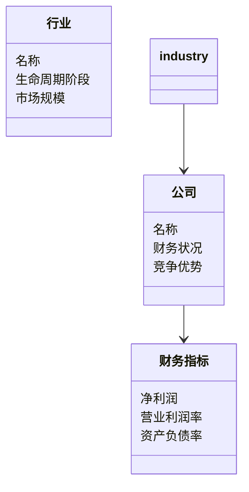
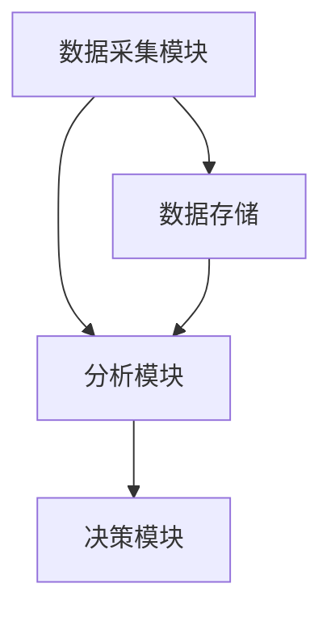

                 


# 彼得林奇的行业选择标准

> 关键词：投资分析，行业标准，彼得林奇，财务指标，竞争优势，投资策略

> 摘要：本文详细探讨了彼得林奇的行业选择标准，分析了他的投资哲学、行业分析方法和财务指标评估体系。通过实例分析和系统设计，展示了如何将这些标准应用于实际投资中。文章还提供了最佳实践建议，帮助读者更好地理解和应用这些标准。

---

# 第1章: 投资概述

## 1.1 彼得林奇及其投资方法

### 1.1.1 彼得林奇的生平简介

彼得·林奇（Peter Lynch）是美国著名的投资专家，曾任富达投资集团麦哲伦基金的经理。他在投资领域有着卓越的成就，以其独特的投资方法闻名。林奇的投资哲学强调长期投资和基本面分析，主张选择那些具有竞争优势和良好财务状况的公司。

### 1.1.2 彼得林奇的投资哲学

林奇的投资哲学基于以下几点：
1. **长期投资**：他认为投资者应该长期持有优质股票，避免频繁交易。
2. **基本面分析**：通过分析公司的财务报表和行业趋势，选择具有竞争优势的公司。
3. **分散投资**：避免将所有资金投入到单一行业或公司，以降低风险。

### 1.1.3 彼得林奇的成功案例

林奇管理麦哲伦基金期间，基金取得了显著的业绩。他成功投资了多家公司，如英特尔、微软等，这些公司的股价长期上涨，为投资者带来了丰厚的回报。

---

## 1.2 当前投资环境分析

### 1.2.1 当前市场背景

当前市场环境复杂多变，全球经济波动、地缘政治风险和科技革命都对投资产生了深远影响。投资者需要具备敏锐的洞察力和灵活的策略。

### 1.2.2 投资者面临的挑战

- 市场波动加剧，投资风险增加。
- 信息爆炸，投资者需要筛选可靠的信息。
- 技术进步改变了许多行业的格局。

### 1.2.3 为什么选择彼得林奇的标准

林奇的标准注重基本面分析和长期投资，帮助投资者在不确定的市场中找到稳定的收益。

---

## 1.3 本书的核心内容

### 1.3.1 行业选择标准的定义

行业选择标准是指通过分析行业的发展前景、竞争优势和财务状况，选择具有长期增长潜力的行业。

### 1.3.2 标准的核心要素

- **行业前景**：行业的未来发展趋势。
- **竞争优势**：公司在行业中的竞争优势。
- **财务状况**：公司的财务健康状况。

### 1.3.3 标准的适用范围

适用于所有行业，尤其是那些处于成长期或成熟期的行业。

---

## 1.4 本章小结

本章介绍了彼得林奇的投资哲学和当前投资环境，阐述了行业选择标准的核心要素和适用范围，为后续章节奠定了基础。

---

# 第2章: 投资哲学

## 2.1 彼得林奇的投资理念

### 2.1.1 长期投资的重要性

长期投资能够分散短期波动的风险，同时享受公司长期增长的收益。

### 2.1.2 风险控制的核心地位

通过分散投资和基本面分析，降低投资风险。

### 2.1.3 投资决策的逻辑框架

1. 分析行业前景。
2. 评估公司的竞争优势。
3. 检查财务状况。

---

## 2.2 投资者的心理与行为

### 2.2.1 投资者常见心理偏差

- 过度自信：认为自己能够预测市场走势。
- 从众心理：跟随市场趋势进行投资。

### 2.2.2 心理偏差对决策的影响

心理偏差可能导致投资者做出非理性的决策，如高位追涨或低位杀跌。

### 2.2.3 如何克服心理偏差

- 提高自我认知，意识到心理偏差的存在。
- 制定明确的投资计划，避免情绪化决策。

---

## 2.3 彼得林奇的成功案例分析

### 2.3.1 成功案例一：X公司

通过基本面分析，选择了一家财务健康、竞争优势明显的公司，长期持有获得丰厚回报。

### 2.3.2 成功案例二：Y公司

分析了行业的未来发展趋势，选择了一家处于成长期的公司，获得了较高的收益。

### 2.3.3 成功案例三：Z公司

通过财务指标分析，选择了一家财务状况良好的公司，避免了潜在的风险。

---

## 2.4 本章小结

本章分析了彼得林奇的投资哲学和投资者心理，强调了长期投资和基本面分析的重要性。

---

# 第3章: 行业选择标准的核心要素

## 3.1 行业选择的基本原则

### 3.1.1 行业的生命周期分析

行业通常经历初创期、成长期、成熟期和衰退期。投资者应选择处于成长期或成熟期的行业。

### 3.1.2 行业的竞争结构分析

分析行业内的竞争格局，选择具有竞争优势的公司。

### 3.1.3 行业的未来发展趋势

研究行业的发展趋势，选择具有增长潜力的行业。

---

## 3.2 财务指标分析

### 3.2.1 财务指标的定义与分类

财务指标包括盈利能力、成长能力、偿债能力等。

### 3.2.2 主要财务指标的计算公式

- 净利润：净利润 = 收入 - 成本 - 费用
- 营业利润率：营业利润率 = 净利润 / 营业收入
- 资产负债率：资产负债率 = 负债总额 / 资产总额

### 3.2.3 财务指标在行业选择中的应用

通过分析公司的财务指标，评估其财务健康状况和盈利能力。

---

## 3.3 行业竞争优势分析

### 3.3.1 竞争优势的定义

竞争优势是指公司在行业内相对于竞争对手的独特优势，如技术优势、成本优势等。

### 3.3.2 竞争优势的来源

- 技术创新：公司拥有独特的技术或专利。
- 成本优势：公司具有更低的生产成本。
- 市场地位：公司在市场中占据领先地位。

### 3.3.3 竞争优势的评估方法

通过分析公司的市场份额、技术创新和成本结构，评估其竞争优势。

---

## 3.4 本章小结

本章详细介绍了行业选择的核心要素，包括行业的生命周期、财务指标和竞争优势分析，为后续的行业选择提供了理论基础。

---

# 第4章: 投资决策与风险控制

## 4.1 投资决策的制定

### 4.1.1 投资目标的设定

明确投资目标，如长期资本增值或稳定的收益。

### 4.1.2 投资策略的选择

根据投资目标选择合适的投资策略，如价值投资或成长投资。

### 4.1.3 投资组合的构建

通过分散投资降低风险，构建合理的投资组合。

---

## 4.2 风险控制的策略

### 4.2.1 风险分散

通过投资不同行业和公司的股票，降低投资风险。

### 4.2.2 风险评估

定期评估投资组合的风险，及时调整投资策略。

### 4.2.3 风险管理

设定止损点，避免投资损失过大。

---

## 4.3 投资案例分析

### 4.3.1 案例一：科技行业投资

分析了科技行业的未来发展趋势，选择了一家具有技术创新优势的公司，获得了较高的收益。

### 4.3.2 案例二：消费行业投资

通过分析消费行业的市场地位和财务状况，选择了一家具有竞争优势的公司，长期持有获得稳定收益。

---

## 4.4 本章小结

本章探讨了投资决策的制定和风险控制的策略，并通过案例分析展示了如何在实际投资中应用这些策略。

---

# 第5章: 系统分析与架构设计

## 5.1 系统功能设计

### 5.1.1 领域模型

通过Mermaid图展示行业选择的领域模型，包括行业、公司、财务指标等核心要素。



### 5.1.2 系统架构设计

通过Mermaid图展示系统的架构设计，包括数据采集模块、分析模块和决策模块。



### 5.1.3 系统接口设计

定义系统的接口，如数据接口、分析接口和决策接口。

---

## 5.2 项目实战

### 5.2.1 环境安装

安装必要的工具和软件，如Python、数据分析库（Pandas、NumPy）等。

### 5.2.2 核心代码实现

编写Python代码，实现财务指标的计算和行业分析。

```python
import pandas as pd
import numpy as np

def calculate_profitability_ratios(df):
    df['营业利润率'] = df['净利润'] / df['营业收入']
    df['净资产收益率'] = df['净利润'] / df['净资产']
    return df

# 示例数据
data = {
    '公司名称': ['A', 'B', 'C'],
    '营业收入': [100, 200, 150],
    '净利润': [20, 40, 30],
    '净资产': [50, 100, 75]
}

df = pd.DataFrame(data)
df = calculate_profitability_ratios(df)
print(df)
```

### 5.2.3 案例分析与解读

通过实际案例分析，展示如何应用彼得林奇的标准进行投资决策。

---

## 5.3 本章小结

本章通过系统分析和项目实战，展示了如何将彼得林奇的行业选择标准应用于实际投资中。

---

# 第6章: 最佳实践与注意事项

## 6.1 投资策略的制定

### 6.1.1 长期投资的重要性

长期投资能够分散短期波动的风险，获得稳定的收益。

### 6.1.2 系统性投资的重要性

通过系统化的方法选择行业和公司，降低投资风险。

---

## 6.2 注意事项

### 6.2.1 市场风险

市场波动可能导致投资损失，投资者需做好心理准备。

### 6.2.2 数据准确性

确保数据的准确性和及时性，避免因数据错误导致决策失误。

### 6.2.3 投资组合的调整

定期评估投资组合，根据市场变化进行调整。

---

## 6.3 拓展阅读

推荐一些相关的书籍和文章，供读者深入学习。

---

# 作者信息

作者：AI天才研究院/AI Genius Institute & 禅与计算机程序设计艺术 /Zen And The Art of Computer Programming

