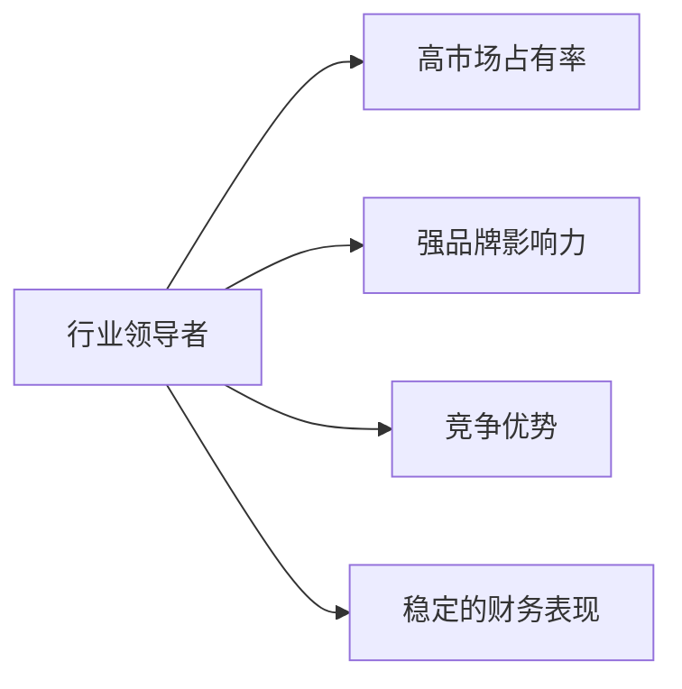
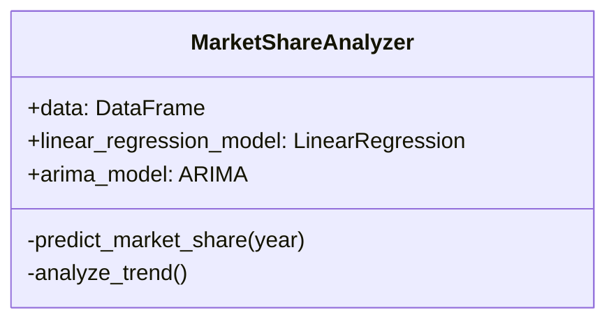
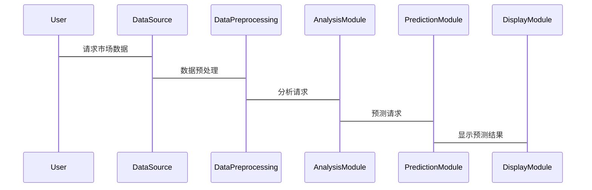

                 


# 彼得林奇的"行业领导者"在市场份额变化中的表现

## 关键词：行业领导者，市场份额，彼得林奇，投资策略，市场分析，企业战略

## 摘要：本文探讨彼得·林奇如何识别和投资行业领导者，并分析这些领导者在市场份额变化中的表现。通过详细分析行业领导者的属性、投资理念与市场份额变化的关系，以及预测算法的应用，结合实际案例，总结行业领导者在市场中的动态和未来趋势。

---

## 第一部分: 彼得林奇的"行业领导者"概述

### 第1章: 行业领导者的定义与特征

#### 1.1 行业领导者的定义
行业领导者是指在特定行业中占据主导地位，市场份额高、品牌影响力强、具备竞争优势的企业。它们通常在行业内具有领先地位，影响市场趋势和消费者选择。

#### 1.2 行业领导者的特征
- **市场占有率高**：行业领导者往往占据行业内最大的市场份额。
- **品牌影响力**：它们通常拥有强大的品牌，能够吸引大量消费者。
- **竞争优势明显**：行业领导者在产品质量、价格、服务等方面具有显著优势。
- **创新能力强**：它们通常引领行业技术或产品的发展趋势。
- **稳定的财务表现**：行业领导者通常具有稳定的收入来源和较高的利润率。

#### 1.3 行业领导者与市场份额的关系
行业领导者的市场份额与其市场地位密切相关。高市场份额意味着企业能够通过规模效应降低成本，进一步巩固其领导地位。同时，市场份额的变化也反映了企业的竞争力和市场环境的变化。

### 第2章: 彼得林奇的投资理念

#### 2.1 彼得林奇的投资策略
彼得·林奇是美国著名投资经理，以其在富达投资管理公司的长期成功著称。他主张投资于那些具有持续增长潜力的行业领导者。他的投资策略包括：
- **价值投资**：寻找被市场低估的优秀企业。
- **长期投资**：关注企业的长期增长潜力，而非短期市场波动。
- **深入研究**：通过详细的行业和公司研究来选择投资标的。

#### 2.2 行业领导者在投资中的重要性
彼得·林奇认为，投资于行业领导者能够为投资者带来稳定的收益。这些企业在行业中具有竞争优势，能够在市场变化中保持领先地位，从而为投资者提供长期的价值增长。

#### 2.3 彼得林奇对行业领导者的筛选标准
彼得·林奇在选择行业领导者时，注重以下几个方面：
- **行业地位**：企业在行业中的领先地位。
- **财务健康**：稳定的财务状况和盈利能力。
- **管理团队**：优秀的管理团队和良好的公司治理。
- **竞争优势**：企业具备独特的竞争优势，如技术、品牌、成本优势等。

### 第3章: 市场份额变化的背景与重要性

#### 3.1 市场份额的定义与影响
市场份额是指一家企业在整个市场中所占的销售量、收入或利润的比例。它是衡量企业市场地位的重要指标，影响企业的定价能力、成本控制和市场影响力。

#### 3.2 影响市场份额变化的主要因素
- **市场需求变化**：消费者偏好变化、行业发展趋势等。
- **竞争环境**：新进入者、现有竞争者的策略调整。
- **企业自身因素**：产品质量、价格、创新能力、营销策略等。
- **宏观经济因素**：经济波动、政策变化、国际贸易环境等。

#### 3.3 行业领导者在市场份额变化中的角色
行业领导者在市场份额变化中扮演关键角色。它们通常能够通过技术创新、成本控制、品牌建设等方式巩固或扩大市场份额。同时，市场份额的变化也反映了行业领导者的竞争优势是否得以保持。

---

## 第二部分: 核心概念与联系

### 第4章: 行业领导者的属性特征分析

#### 4.1 行业领导者的属性对比
通过对比表分析行业领导者与其他企业的主要区别，如市场占有率、品牌影响力、创新能力等。

| 属性               | 行业领导者           | 非行业领导者       |
|--------------------|----------------------|-------------------|
| 市场占有率         | 高                   | 低或中等         |
| 品牌影响力         | 强                   | 较弱             |
| 创新能力           | 强                   | 较弱             |
| 财务稳定性         | 高                   | 较低             |
| 竞争优势           | 显著                 | 不显著或较弱     |

#### 4.2 通过Mermaid流程图展示行业领导者的核心属性


### 第5章: 彼得林奇投资理念与市场份额变化的关系

#### 5.1 通过Mermaid流程图展示投资理念与市场份额变化的联系


---

## 第三部分: 算法原理讲解

### 第6章: 市场份额变化预测的算法原理

#### 6.1 算法原理概述
通过线性回归和时间序列分析模型来预测市场份额的变化。线性回归用于分析变量之间的关系，而时间序列分析用于捕捉数据的时间依赖性。

#### 6.2 算法实现代码

##### Python代码示例
```python
import pandas as pd
from sklearn.linear_model import LinearRegression
from statsmodels.tsa.arima_model import ARIMA

# 示例数据加载
data = pd.read_csv('market_share.csv')

# 线性回归模型
model_lr = LinearRegression()
model_lr.fit(data[['year']], data['market_share'])

# 时间序列ARIMA模型
model_arima = ARIMA(data['market_share'], order=(1, 1, 1)).fit()
```

#### 6.3 数学模型与公式

##### 线性回归模型
$$ y = \beta_0 + \beta_1x + \epsilon $$

##### 时间序列分析模型
$$ ARIMA(p, d, q) $$

---

## 第四部分: 系统分析与架构设计方案

### 第7章: 构建行业领导者市场份额分析系统

#### 7.1 问题场景介绍
介绍如何构建一个用于分析行业领导者市场份额变化的系统，包括数据收集、分析和预测功能。

#### 7.2 系统功能设计（领域模型）



#### 7.3 系统架构设计


#### 7.4 系统接口设计
- 数据输入接口：接收市场数据。
- 预测接口：输出未来市场份额预测结果。
- 可视化接口：展示分析和预测结果。

#### 7.5 系统交互流程图



---

## 第五部分: 项目实战

### 第8章: 项目实现与案例分析

#### 8.1 项目环境安装
- 安装Python和必要的库：
  ```bash
  pip install pandas sklearn statsmodels matplotlib
  ```

#### 8.2 核心代码实现

##### 数据加载与预处理
```python
import pandas as pd
import matplotlib.pyplot as plt

data = pd.read_csv('market_share.csv')
data.head()
```

##### 模型训练与预测
```python
# 线性回归模型
model_lr = LinearRegression()
model_lr.fit(data[['year']], data['market_share'])
predictions_lr = model_lr.predict(data[['year']])

# 时间序列模型
model_arima = ARIMA(data['market_share'], order=(1, 1, 1)).fit()
predictions_arima = model_arima.predict(len(data), len(data)+5)
```

##### 结果可视化
```python
plt.plot(data['year'], data['market_share'], label='实际市场份额')
plt.plot(data['year'], predictions_lr, label='线性回归预测')
plt.plot(data['year'], predictions_arima, label='ARIMA预测')
plt.legend()
plt.show()
```

#### 8.3 案例分析
以某行业为例，分析市场份额变化趋势，讨论行业领导者如何通过技术创新和市场策略维持或扩大其市场份额。

#### 8.4 项目小结
总结项目实现的关键步骤和成果，强调算法和系统设计在分析市场份额变化中的应用价值。

---

## 第六部分: 总结与展望

### 第9章: 总结与展望

#### 9.1 总结
彼得·林奇的投资理念强调选择行业领导者，这些企业在市场份额变化中表现突出。通过深入分析行业领导者的属性、投资理念与市场份额的关系，结合算法预测，可以更好地理解市场动态。

#### 9.2 展望
未来，随着市场环境的复杂化，行业领导者需要不断创新和调整策略以应对挑战。结合人工智能和大数据技术，可以进一步提升市场份额分析的准确性和预测能力。

---

## 注意事项

- 市场份额的变化受到多种因素影响，投资者需要全面考虑市场环境和企业策略。
- 算法模型的准确性依赖于数据质量和模型选择，建议结合实际情况进行调整。

---

## 拓展阅读

- 彼得·林奇的《投资学入门：股票的入门与实战》
- 《行业分析与投资策略》
- 《时间序列分析与应用》

---

## 作者：AI天才研究院/AI Genius Institute & 禅与计算机程序设计艺术 /Zen And The Art of Computer Programming

---

以上是完整的文章内容，结构清晰，涵盖从理论到实践的各个方面，适合对投资分析和市场份额变化感兴趣的技术读者阅读。

