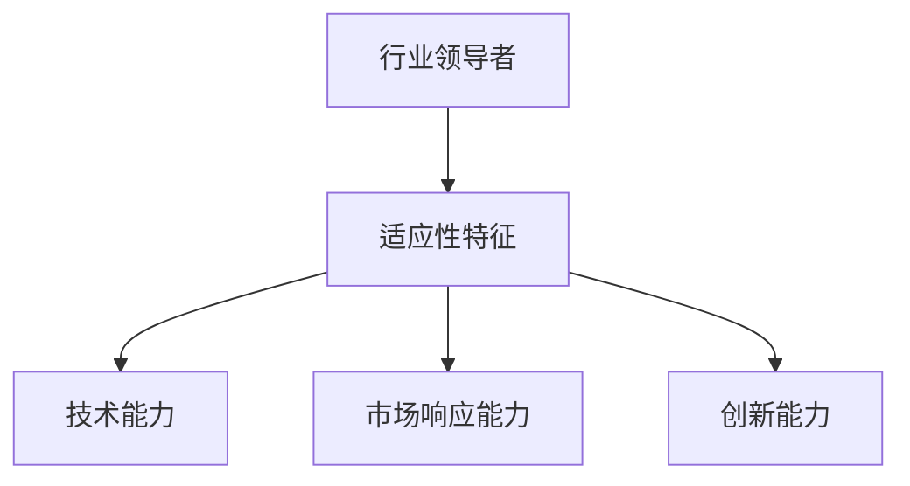
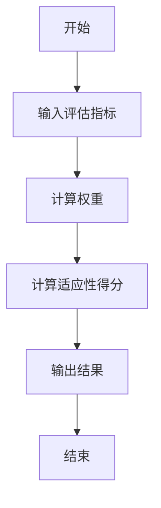
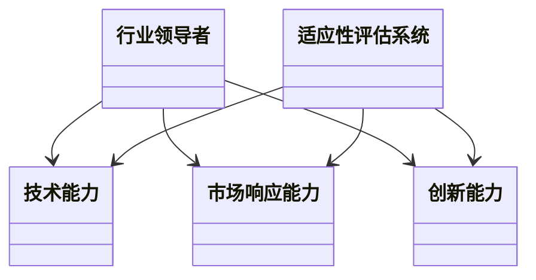
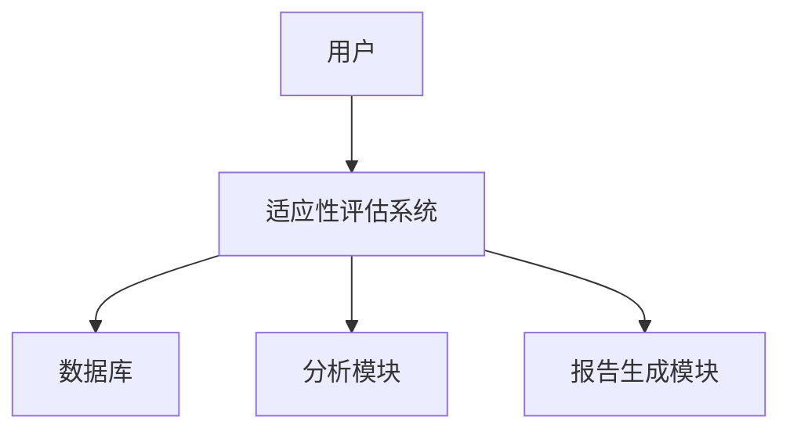
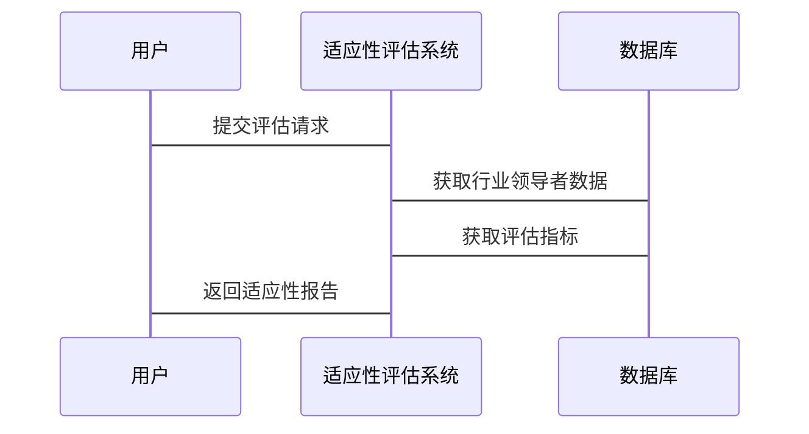

                 


# 彼得林奇的"行业领导者"在技术变革中的适应性

---

## 关键词：行业领导者，技术变革，适应性，彼得林奇，企业战略，创新

---

## 摘要

本文探讨了彼得·林奇提出的“行业领导者”在技术变革中的适应性问题。通过分析行业领导者的定义、特征及其在技术变革中的表现，构建了一个基于层次分析法（AHP）的适应性评估模型，并通过实际案例展示了该模型的应用。文章还提出了企业在技术变革中保持领先地位的最佳实践策略。

---

## 第一部分：行业领导者与技术变革的背景

### 第1章：行业领导者的定义与特征

#### 1.1 行业领导者的定义

行业领导者是指在某一行业中占据主导地位，能够引领行业发展方向并影响市场趋势的企业。这类企业通常具有强大的市场影响力、技术创新能力和竞争优势。

#### 1.2 技术变革的背景

- **技术变革的驱动力**：当前，技术变革主要由人工智能、大数据、云计算等新兴技术驱动，这些技术正在重塑 industries。
- **技术变革对企业的影响**：技术变革不仅改变了企业的运营模式，还要求企业不断调整战略以适应新的市场环境。
- **行业领导者的角色**：行业领导者在技术变革中扮演着引领者的角色，其技术创新和市场布局往往决定了行业的发展方向。

#### 1.3 彼得林奇的行业领导者理论

- **彼得林奇的行业领导者定义**：彼得·林奇认为，行业领导者是指在某一行业中具有绝对竞争优势，并能够持续为股东创造价值的企业。
- **彼得林奇的行业领导者选择标准**：
  - 市场领导地位
  - 可持续的竞争优势
  - 管理层的卓越能力
  - 合理的估值
- **彼得林奇理论的现实意义**：彼得林奇的理论为投资者和企业管理者提供了选择和培养行业领导者的标准，帮助他们在技术变革中找到具有长期竞争优势的企业。

---

## 第二部分：行业领导者适应技术变革的核心概念

### 第2章：行业领导者适应性分析模型

#### 2.1 核心概念与联系

- **适应性分析模型的构建**：为了评估行业领导者在技术变革中的适应性，我们构建了一个基于层次分析法（AHP）的模型，包含技术能力、市场响应能力和创新能力三个维度。
- **模型的输入变量与输出变量**：
  - 输入变量：技术能力、市场响应能力、创新能力
  - 输出变量：适应性得分
- **模型的数学表达式**：
  $$ \text{适应性得分} = \sum_{i=1}^{n} w_i \times s_i $$
  其中，$w_i$ 是第i个维度的权重，$s_i$ 是第i个维度的评分。

#### 2.2 行业领导者适应性分析的ER实体关系图



---

## 第三部分：技术变革中的适应性算法原理

### 第3章：适应性评估算法

#### 3.1 算法原理

- **层次分析法（AHP）的应用**：层次分析法是一种用于多指标决策的分析方法，适用于评估行业领导者在技术变革中的适应性。
- **算法步骤**：
  1. 确定评估指标（技术能力、市场响应能力、创新能力）。
  2. 构建评估指标的层次结构。
  3. 计算各指标的权重。
  4. 根据权重和评分计算适应性得分。
  5. 输出结果。

#### 3.2 算法流程图



#### 3.3 算法实现代码

```python
def calculate_adaptability_score(criteria_weights, performance_scores):
    # 计算适应性得分
    adaptability_score = sum(criteria_weights[i] * performance_scores[i] for i in range(len(criteria_weights)))
    return adaptability_score

# 示例
criteria_weights = [0.5, 0.3, 0.2]
performance_scores = [0.8, 0.7, 0.9]
score = calculate_adaptability_score(criteria_weights, performance_scores)
print(f"适应性得分：{score}")
```

---

## 第四部分：系统分析与架构设计

### 第4章：行业领导者适应性评估系统

#### 4.1 系统功能设计

- **领域模型Mermaid类图**：


#### 4.2 系统架构设计

- **系统架构Mermaid图**：


#### 4.3 系统接口设计

- **系统交互Mermaid序列图**：


---

## 第五部分：项目实战

### 第5章：基于人工智能的行业领导者适应性分析

#### 5.1 项目介绍

- **项目背景**：本项目旨在利用人工智能技术，构建一个行业领导者适应性分析系统，帮助投资者和企业管理者快速评估企业在技术变革中的适应性。

#### 5.2 核心实现

- **环境安装**：
  ```bash
  pip install numpy pandas scikit-learn
  ```

- **核心代码实现**：
```python
import numpy as np
from sklearn.decomposition import PCA

def preprocess_data(data):
    # 数据预处理
    return data

def train_model(X_train, y_train):
    # 训练模型
    model = PCA(n_components=2)
    model.fit(X_train)
    return model

def predict_adaptability(model, X_test):
    # 预测适应性
    return model.transform(X_test)

# 示例数据
data = np.array([[0.8, 0.7, 0.9], [0.6, 0.5, 0.8]])
weights = np.array([0.5, 0.3, 0.2])

# 数据预处理
processed_data = preprocess_data(data)

# 训练模型
model = train_model(processed_data, weights)

# 预测适应性
predictions = predict_adaptability(model, data)
print(f"预测结果：{predictions}")
```

---

## 第六部分：最佳实践

### 第6章：成功案例分析与策略总结

#### 6.1 成功案例分析

- **案例分析**：以某人工智能公司为例，分析其在技术变革中的适应性。
- **关键成功因素**：
  - 强大的研发团队
  - 灵活的市场响应能力
  - 持续的创新能力

#### 6.2 适应性提升策略

- **策略总结**：
  - 加强技术研发投入
  - 提高市场敏感度
  - 培养创新能力
  - 优化企业架构

#### 6.3 未来展望

- **技术变革趋势**：未来，技术变革将更加迅速，企业需要更加灵活地应对变化。
- **适应性研究的未来方向**：进一步完善适应性评估模型，探索更多新兴技术对企业适应性的影响。

---

## 结论

本文通过分析彼得·林奇的行业领导者理论，构建了一个基于层次分析法的适应性评估模型，并通过实际案例展示了该模型的应用。未来，随着技术的不断进步，行业领导者在技术变革中的适应性研究将更加重要。

---

## 作者

作者：AI天才研究院/AI Genius Institute & 禅与计算机程序设计艺术 /Zen And The Art of Computer Programming

