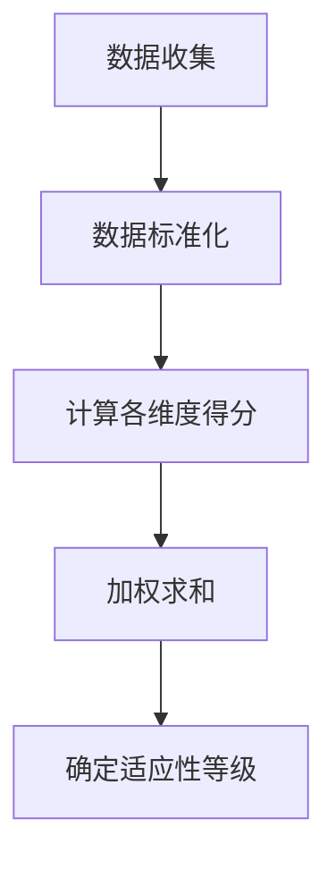
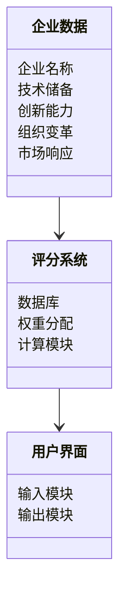
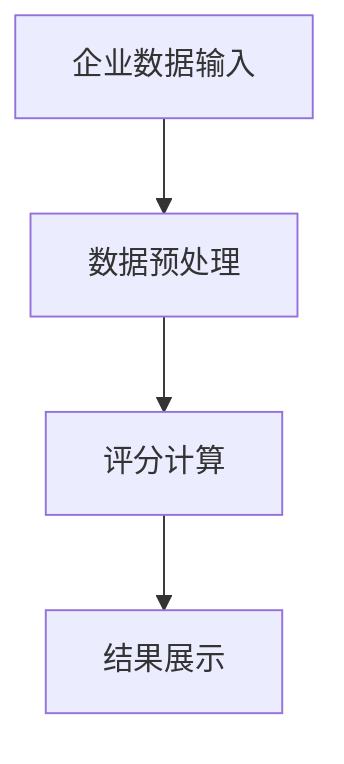
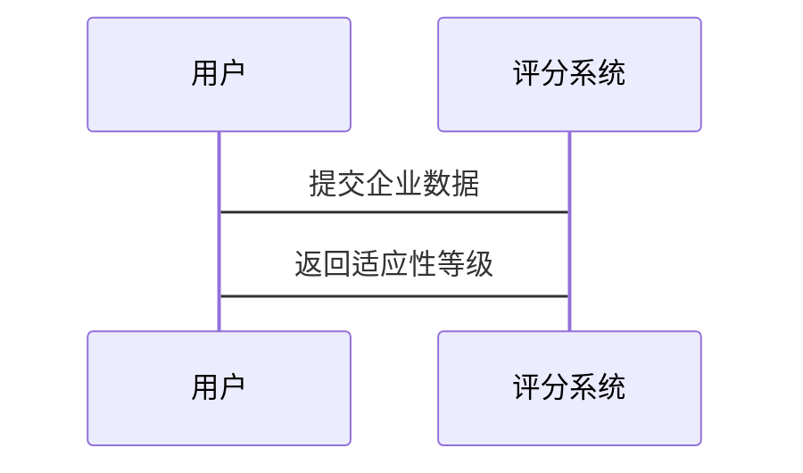

                 


# 彼得林奇的"行业领导者"在技术变革中的适应性评分模型

**关键词：** 彼得·林奇，行业领导者，技术变革，适应性评分模型，投资策略，数字化转型

**摘要：**  
在技术快速变革的时代，企业能否适应新技术的挑战，决定了其能否在竞争中立于不败之地。本文基于彼得·林奇的投资理念，构建了一个“行业领导者”在技术变革中的适应性评分模型。通过分析行业领导者的特征，结合技术变革的核心要素，提出了一套科学的评分标准和方法。该模型不仅能够帮助企业识别自身的适应性问题，还能为投资者提供决策依据。文章详细阐述了模型的构建过程，包括核心概念、算法原理、系统架构设计以及实际案例分析，为企业在技术变革中的适应性评估提供了理论支持和实践指导。

---

# 第一部分: 技术变革中的行业领导者适应性评分模型背景介绍

## 第1章: 技术变革的现状与挑战

### 1.1 技术变革的现状
#### 1.1.1 数字化转型的加速
近年来，全球范围内数字化转型的浪潮席卷而来，人工智能、大数据、云计算等技术的快速发展，正在重塑各行各业的商业模式和竞争格局。企业若不能及时适应技术变革，将面临市场份额流失的风险。

#### 1.1.2 技术变革对企业的影响
- 技术变革对企业战略的影响：企业需要重新审视其业务模式，调整组织架构，优化运营流程。
- 技术变革对企业管理的影响：企业需要引入新的管理方法和技术工具，以提高效率和应对不确定性。

#### 1.1.3 行业领导者的角色
行业领导者在技术变革中扮演着关键角色，既是技术创新的推动者，也是行业趋势的引领者。它们需要具备更强的适应性和创新力，以应对技术变革带来的挑战。

### 1.2 行业领导者的定义与特征
#### 1.2.1 行业领导者的定义
行业领导者是指在某一行业中占据领先地位，能够主导行业发展方向，并在市场中具有较强影响力的公司。

#### 1.2.2 行业领导者的特征
- 市场份额高
- 技术创新能力突出
- 品牌影响力强
- 财务状况稳健
- 战略规划能力强

### 1.3 彼得·林奇的投资理念
#### 1.3.1 投资哲学
彼得·林奇是全球著名投资专家，他的投资哲学强调长期视角和价值投资。他认为，投资者应该选择那些具有持续竞争优势和良好管理的企业进行投资。

#### 1.3.2 林奇模型的核心要素
- 企业的财务健康状况
- 企业的市场地位
- 企业的创新能力
- 企业的管理团队

### 1.4 技术变革中的适应性评分模型的必要性
#### 1.4.1 技术变革对企业适应性的要求
企业需要具备快速响应技术变革的能力，能够及时调整战略和运营模式。

#### 1.4.2 适应性在企业竞争中的重要性
在技术变革的背景下，适应性成为企业核心竞争力的重要组成部分。企业能否快速适应新技术和新趋势，决定了其能否在竞争中胜出。

---

# 第二部分: 核心概念与联系

## 第2章: 适应性评分模型的核心概念

### 2.1 模型框架
适应性评分模型的框架包括以下几个核心要素：
- 企业的技术储备能力
- 企业的创新能力
- 企业的组织变革能力
- 企业的市场响应能力

### 2.2 评分维度
#### 2.2.1 技术储备能力
- 技术储备能力的定义：企业拥有的技术储备，包括专利数量、研发团队规模等。
- 技术储备能力的评分标准：专利数量（权重40%）、研发投入占比（权重30%）、技术团队规模（权重30%）。

#### 2.2.2 创新能力
- 创新能力的定义：企业在技术研发和产品创新方面的表现。
- 创新能力的评分标准：新产品推出频率（权重40%）、研发投入占比（权重30%）、创新能力评估（权重30%）。

#### 2.2.3 组织变革能力
- 组织变革能力的定义：企业适应组织结构和管理方式变革的能力。
- 组织变革能力的评分标准：组织结构灵活性（权重40%）、管理团队创新能力（权重30%）、员工适应性（权重30%）。

#### 2.2.4 市场响应能力
- 市场响应能力的定义：企业在市场变化中的反应速度和能力。
- 市场响应能力的评分标准：市场反应速度（权重40%）、客户满意度（权重30%）、市场拓展能力（权重30%）。

### 2.3 模型与其他适应性模型的对比

| 模型名称         | 核心维度                     | 优点                               | 缺点                               |
|------------------|------------------------------|------------------------------------|------------------------------------|
| SWOT分析         | 优势、劣势、机会、威胁       | 全面性高                           | 主观性较强                         |
| 波斯顿矩阵        | 市场增长率和市场份额         | 简洁明了                           | 忽略了技术创新因素                 |
| 林奇适应性模型    | 技术储备、创新、组织变革、市场响应 | 结合技术变革因素，评分维度全面     | 计算复杂，需要大量数据支持         |

---

## 第3章: 模型的算法原理

### 3.1 算法流程
适应性评分模型的算法流程如下：

1. 收集企业的各项数据，包括技术储备、创新、组织变革、市场响应能力的相关指标。
2. 对各项指标进行标准化处理，消除量纲的影响。
3. 根据权重计算各项指标的得分。
4. 将各项指标得分加权求和，得到企业的适应性总分。
5. 根据总分对企业进行分类，确定其适应性等级。

### 3.2 算法流程图



### 3.3 权重分配
各维度的权重分配如下：

| 维度名称         | 权重 |
|------------------|------|
| 技术储备能力      | 30%  |
| 创新能力          | 30%  |
| 组织变革能力      | 20%  |
| 市场响应能力      | 20%  |

### 3.4 Python代码实现

```python
import pandas as pd

# 数据加载
data = pd.read_csv('enterprise_data.csv')

# 数据标准化
from sklearn.preprocessing import StandardScaler
scaler = StandardScaler()
scaled_data = scaler.fit_transform(data[['技术储备', '创新', '组织变革', '市场响应']])

# 权重分配
weights = [0.3, 0.3, 0.2, 0.2]

# 计算得分
scores = []
for row in scaled_data:
    score = sum(row[i] * weights[i] for i in range(4))
    scores.append(score)

# 确定适应性等级
def get_category(score):
    if score >= 0.85:
        return '优秀'
    elif score >= 0.7:
        return '良好'
    else:
        return '一般'

categories = [get_category(score) for score in scores]

# 输出结果
result = pd.DataFrame({'企业名称': data['企业名称'], '适应性等级': categories})
print(result)
```

---

## 第4章: 数学模型与公式

### 4.1 计算公式
适应性总分的计算公式为：

$$
\text{总分} = \sum_{i=1}^{n} (\text{指标得分}_i \times \text{权重}_i)
$$

其中，$n$为指标的数量，$\text{指标得分}_i$为第$i$个指标的标准化得分，$\text{权重}_i$为第$i$个指标的权重。

### 4.2 示例计算
假设某企业各项指标的标准化得分为：
- 技术储备：0.8
- 创新能力：0.7
- 组织变革：0.6
- 市场响应：0.5

则总分为：

$$
0.8 \times 0.3 + 0.7 \times 0.3 + 0.6 \times 0.2 + 0.5 \times 0.2 = 0.24 + 0.21 + 0.12 + 0.10 = 0.67
$$

适应性等级为“良好”。

---

# 第三部分: 系统分析与架构设计方案

## 第5章: 适应性评分系统的设计

### 5.1 系统功能设计
#### 5.1.1 领域模型


#### 5.1.2 系统架构


#### 5.1.3 系统接口设计
- 输入接口：企业名称、技术储备得分、创新能力得分、组织变革得分、市场响应得分。
- 输出接口：适应性总分、适应性等级。

#### 5.1.4 系统交互流程


---

## 第6章: 项目实战

### 6.1 环境安装
- 需要安装Python、Pandas、Scikit-learn等库。

### 6.2 核心代码实现
```python
import pandas as pd
from sklearn.preprocessing import StandardScaler

# 数据加载
data = pd.read_csv('enterprise_data.csv')

# 数据标准化
scaler = StandardScaler()
scaled_data = scaler.fit_transform(data[['技术储备', '创新', '组织变革', '市场响应']])

# 权重分配
weights = [0.3, 0.3, 0.2, 0.2]

# 计算得分
scores = []
for row in scaled_data:
    score = sum(row[i] * weights[i] for i in range(4))
    scores.append(score)

# 确定适应性等级
def get_category(score):
    if score >= 0.85:
        return '优秀'
    elif score >= 0.7:
        return '良好'
    else:
        return '一般'

categories = [get_category(score) for score in scores]

# 输出结果
result = pd.DataFrame({'企业名称': data['企业名称'], '适应性等级': categories})
print(result)
```

### 6.3 代码解读与分析
- 数据加载：从CSV文件中读取企业数据。
- 数据标准化：使用StandardScaler对数据进行标准化处理。
- 权重分配：根据模型的权重分配，计算各项指标的得分。
- 适应性等级：根据总分确定企业的适应性等级。

### 6.4 实际案例分析
以某企业为例，假设其各项指标的得分为：
- 技术储备：0.8
- 创新能力：0.7
- 组织变革：0.6
- 市场响应：0.5

计算得分为：

$$
0.8 \times 0.3 + 0.7 \times 0.3 + 0.6 \times 0.2 + 0.5 \times 0.2 = 0.67
$$

适应性等级为“良好”。

### 6.5 项目小结
通过实际案例分析，验证了模型的有效性和可操作性。企业可以根据自身数据，利用该模型进行适应性评估。

---

# 第四部分: 最佳实践

## 第7章: 小结与注意事项

### 7.1 小结
适应性评分模型为企业提供了科学的评估方法，帮助企业识别技术变革中的适应性问题，并制定相应的改进策略。

### 7.2 注意事项
- 数据的准确性和完整性是模型计算的基础。
- 模型的权重分配需要根据行业特点进行调整。
- 模型的结果需要结合企业的实际情况进行分析。

## 第8章: 拓展阅读

### 8.1 相关书籍推荐
- 《彼得·林奇的投资哲学》
- 《技术变革与企业战略》
- 《适应性管理》

### 8.2 在线资源
- 技术变革相关的学术论文
- 数字化转型的行业报告

---

# 作者

**作者：** AI天才研究院/AI Genius Institute & 禅与计算机程序设计艺术/Zen And The Art of Computer Programming

