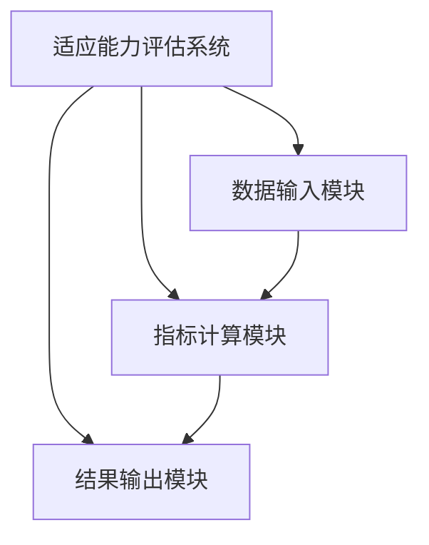

                 


# 彼得林奇的"行业领导者"在技术变革中的适应能力评估

## 关键词：技术变革，行业领导者，适应能力，彼得林奇模型，企业战略，技术驱动，竞争力

## 摘要：本文探讨了技术变革对企业竞争力的影响，特别是行业领导者在适应能力方面的能力。通过分析彼得·林奇的行业领导者概念，我们构建了一个适应能力评估模型，涵盖战略调整、组织灵活性和技术创新能力。通过实际案例和系统设计，本文提供了提升企业适应能力的策略和方法。

---

# 第1章: 技术变革对企业的影响

## 1.1 技术变革的定义与分类

### 1.1.1 技术变革的定义
技术变革是指技术的进步和创新对企业运营、产品和市场策略产生的变化。这些变化可能涉及生产流程、商业模式或技术架构的调整。

### 1.1.2 技术变革的分类
- **渐进式变革**：逐步改进现有技术和流程，如自动化系统的优化。
- **革命性变革**：引入颠覆性技术，如人工智能的出现。
- **突破性变革**：在特定领域实现重大创新，如区块链技术的应用。

### 1.1.3 技术变革对企业的影响
技术变革迫使企业不断调整策略，以保持竞争力。行业领导者需要快速适应这些变化，才能在市场中占据优势。

---

## 1.2 彼得林奇的行业领导者概念

### 1.2.1 行业领导者的定义
行业领导者是指在特定行业中占据主导地位，能够引领行业发展方向的企业。

### 1.2.2 行业领导者的特征
- **市场占有率高**：在行业内具有较高的市场份额。
- **创新能力强**：能够引领行业技术创新。
- **战略执行力强**：能够将战略目标转化为实际成果。

### 1.2.3 技术变革中的行业领导者角色
行业领导者在技术变革中不仅是跟随者，更是引领者。他们需要不断推动技术创新，保持行业领先地位。

---

# 第2章: 技术变革的类型与影响分析

## 2.1 技术变革的类型

### 2.1.1 渐进式技术变革
渐进式变革是指在现有技术和流程基础上进行的改进和优化。这种变革通常不会对企业运营产生根本性影响，但可以提高效率和降低成本。

### 2.1.2 革命性技术变革
革命性变革是指引入完全颠覆现有技术或模式的创新。这种变革可能导致整个行业结构的重组，例如互联网的出现对传统媒体行业的影响。

### 2.1.3 突破性技术变革
突破性变革是指在特定领域内实现的重大创新，可能仅影响企业部分业务或流程。例如，某企业引入新的生产技术以提高产品质量。

---

## 2.2 技术变革对企业战略的影响

### 2.2.1 技术驱动的商业模式创新
技术变革可以推动企业从传统模式向数字化、智能化模式转型。例如，电子商务的兴起推动了零售行业的商业模式变革。

### 2.2.2 技术驱动的组织结构变革
技术变革可能需要企业调整组织结构，例如引入敏捷团队或分布式办公模式，以适应快速变化的技术环境。

### 2.2.3 技术驱动的竞争优势重构
技术变革可能导致竞争优势从传统领域转向技术驱动领域。例如，数据驱动的决策能力成为企业竞争的关键因素。

---

# 第3章: 适应能力的核心概念

## 3.1 适应能力的定义与维度

### 3.1.1 适应能力的定义
适应能力是指企业在面对技术变革时，能够快速调整战略、组织和技术以保持竞争力的能力。

### 3.1.2 适应能力的维度
- **战略调整能力**：企业根据技术变革调整战略目标和方向的能力。
- **组织灵活性**：组织结构和流程能够快速响应技术变革的能力。
- **技术创新能力**：企业能够快速引入和应用新技术的能力。

### 3.1.3 核心要素与属性对比
以下是适应能力核心要素的对比表：

| 核心要素 | 战略调整能力 | 组织灵活性 | 技术创新能力 |
|----------|--------------|------------|--------------|
| 定义     | 根据技术变革调整战略目标的能力 | 调整组织结构和流程以适应变革的能力 | 引入和应用新技术的能力 |
| 重要性   | 高           | 高         | 极高         |
| 示例     | 进入新市场    | 采用敏捷方法 | 引入AI技术     |

### 3.1.4 核心概念的ER实体关系图
以下是适应能力相关实体的关系图：

```mermaid
er
actor 行业领导者
actor 技术变革
actor 适应能力
actor 评估模型
```

---

## 3.2 适应能力的数学模型

### 3.2.1 数学模型的构建
适应能力（A）由战略调整能力（S）、组织灵活性（F）和技术创新能力（T）共同决定。模型如下：

$$
适应能力 (A) = S \times F \times T
$$

### 3.2.2 模型的变量定义
- **战略调整能力 (S)**：企业根据技术变革调整战略目标的能力，范围为 [0, 1]。
- **组织灵活性 (F)**：组织结构和流程能够快速响应变革的能力，范围为 [0, 1]。
- **技术创新能力 (T)**：企业能够快速引入和应用新技术的能力，范围为 [0, 1]。

### 3.2.3 模型的应用
例如，假设某企业的战略调整能力为 0.8，组织灵活性为 0.9，技术创新能力为 0.85，则其适应能力为：

$$
A = 0.8 \times 0.9 \times 0.85 = 0.612
$$

---

# 第4章: 适应能力的评估指标与标准

## 4.1 评估指标的选择

### 4.1.1 评估指标的定义
适应能力的评估指标需要能够量化企业在面对技术变革时的应对能力。以下是常用的评估指标：

- **战略调整能力**：企业根据技术变革调整战略目标的能力。
- **组织灵活性**：组织结构和流程能够快速响应变革的能力。
- **技术创新能力**：企业能够快速引入和应用新技术的能力。

### 4.1.2 评估指标的权重分配
根据经验，我们可以将各指标的权重设定如下：

| 指标名称          | 权重 |
|-------------------|------|
| 战略调整能力      | 40%  |
| 组织灵活性        | 30%  |
| 技术创新能力      | 30%  |

### 4.1.3 评估指标的评分标准
以下是各指标的评分标准：

- **战略调整能力**：
  - 0.8及以上：优秀
  - 0.6~0.8：良好
  - 0.4~0.6：一般
  - 0.4以下：较差

- **组织灵活性**：
  - 0.8及以上：优秀
  - 0.6~0.8：良好
  - 0.4~0.6：一般
  - 0.4以下：较差

- **技术创新能力**：
  - 0.8及以上：优秀
  - 0.6~0.8：良好
  - 0.4~0.6：一般
  - 0.4以下：较差

---

## 4.2 评估指标的对比分析

### 4.2.1 维度对比分析
以下是战略调整能力、组织灵活性和技术创新能力的对比分析：

| 维度名称          | 优势 | 劣势 |
|-------------------|------|------|
| 战略调整能力      | 能够快速调整战略方向 | 受外部环境影响较大 |
| 组织灵活性        | 能够快速响应变革 | 可能缺乏长期规划 |
| 技术创新能力      | 能够快速引入新技术 | 技术风险较高 |

### 4.2.2 指标对比表格
以下是各指标的对比表格：

| 维度名称          | 重要性 | 可测量性 | 可控性 |
|-------------------|--------|----------|--------|
| 战略调整能力      | 高     | 高       | 高     |
| 组织灵活性        | 高     | 中       | 中     |
| 技术创新能力      | 极高   | 中       | 低     |

---

## 4.3 评估指标的系统分析

### 4.3.1 系统功能设计
以下是适应能力评估系统的功能设计：

- **数据输入**：收集战略调整能力、组织灵活性和技术创新能力的数据。
- **指标计算**：根据权重和评分标准计算适应能力得分。
- **结果输出**：生成适应能力评估报告，包括各维度的评分和整体适应能力得分。

### 4.3.2 系统架构设计
以下是适应能力评估系统的架构图：



### 4.3.3 系统接口设计
以下是适应能力评估系统的接口设计：

- **数据输入接口**：接收战略调整能力、组织灵活性和技术创新能力的数据。
- **指标计算接口**：调用指标计算模块，计算适应能力得分。
- **结果输出接口**：生成适应能力评估报告。

---

## 4.4 评估指标的数学公式

### 4.4.1 适应能力得分计算公式
适应能力得分（A）的计算公式如下：

$$
A = w_1 \times S + w_2 \times F + w_3 \times T
$$

其中，\( w_1 \)、\( w_2 \)、\( w_3 \) 分别是战略调整能力、组织灵活性和技术创新能力的权重，\( S \)、\( F \)、\( T \) 分别是各指标的评分。

### 4.4.2 示例计算
假设某企业的战略调整能力得分为 0.8，组织灵活性得分为 0.9，技术创新能力得分为 0.85，权重分别为 40%、30% 和 30%。则其适应能力得分为：

$$
A = 0.4 \times 0.8 + 0.3 \times 0.9 + 0.3 \times 0.85 = 0.32 + 0.27 + 0.255 = 0.845
$$

---

## 4.5 评估指标的实际应用

### 4.5.1 案例分析
以某互联网公司为例，评估其在面对人工智能技术变革时的适应能力。

- **战略调整能力**：公司迅速调整战略，将人工智能技术融入核心业务，得分为 0.85。
- **组织灵活性**：公司能够快速调整组织结构，成立专门的人工智能团队，得分为 0.8。
- **技术创新能力**：公司能够快速引入和应用人工智能技术，得分为 0.85。

适应能力得分为：

$$
A = 0.4 \times 0.85 + 0.3 \times 0.8 + 0.3 \times 0.85 = 0.34 + 0.24 + 0.255 = 0.835
$$

---

## 4.6 评估指标的注意事项

### 4.6.1 数据采集的准确性
适应能力的评估依赖于准确的数据采集，因此需要确保数据来源的可靠性和准确性。

### 4.6.2 指标权重的调整
根据不同的行业和技术变革特点，可能需要调整各指标的权重。

### 4.6.3 评估结果的动态调整
适应能力是一个动态变化的过程，需要定期评估和调整。

---

## 4.7 评估指标的总结

### 4.7.1 核心要点总结
- 适应能力的评估需要综合考虑战略调整能力、组织灵活性和技术创新能力。
- 各指标的权重和评分标准可以根据具体行业和技术变革特点进行调整。
- 适应能力的评估结果可以为企业的技术变革应对策略提供参考。

### 4.7.2 理论与实践结合
通过理论模型和实际案例的结合，我们可以更好地理解和应用适应能力的评估指标。

---

## 4.8 评估指标的进一步研究

### 4.8.1 研究方向
- 不同行业和技术变革下的适应能力评估模型研究。
- 适应能力评估指标的动态调整方法研究。
- 适应能力评估在企业战略管理中的应用研究。

### 4.8.2 研究意义
- 为企业的技术变革应对提供理论支持。
- 为企业制定适应能力提升策略提供参考。

---

# 总结

通过本文的分析，我们了解了彼得林奇的行业领导者在技术变革中的适应能力评估的核心概念和方法。适应能力是一个复杂的过程，需要企业在战略、组织和技术等多个方面进行综合调整。通过科学的评估指标和模型，企业可以更好地应对技术变革，保持行业领先地位。

---

**作者：AI天才研究院/AI Genius Institute & 禅与计算机程序设计艺术 /Zen And The Art of Computer Programming**

