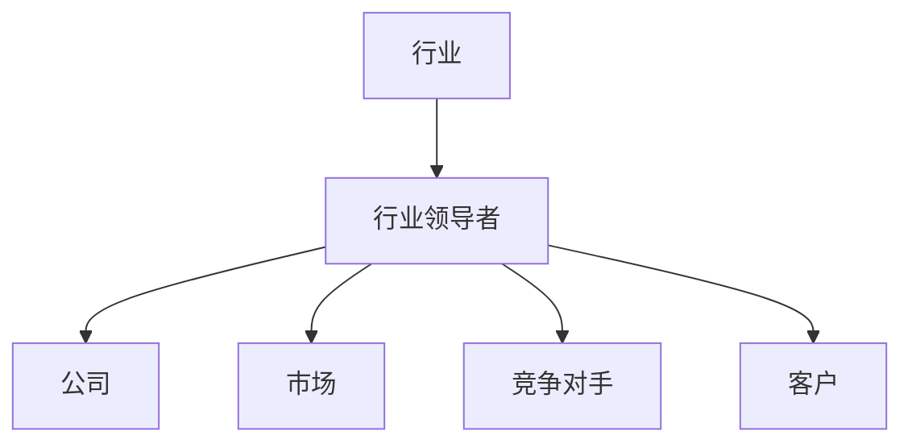
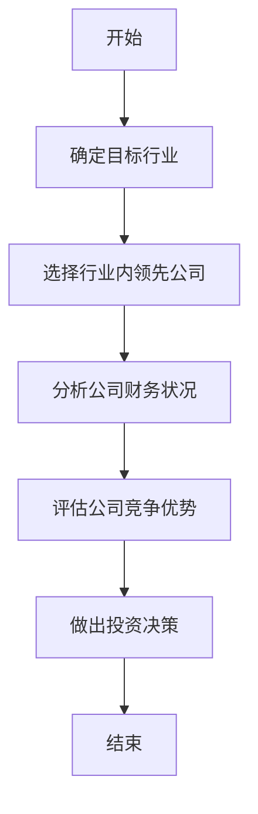
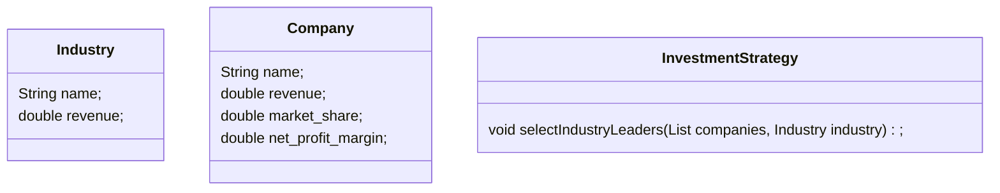
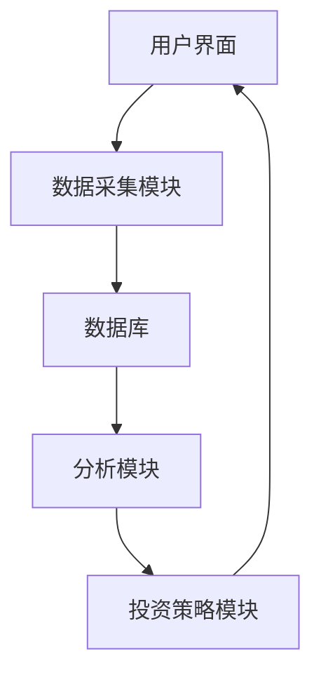
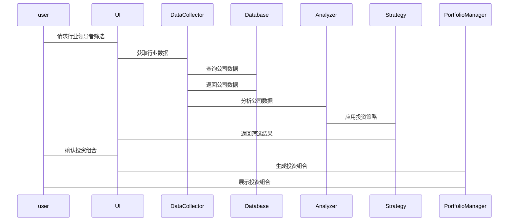

                 


# 彼得林奇的"行业领导者"投资策略

**关键词：** 彼得林奇，行业领导者，投资策略，股票分析，算法模型，系统架构

**摘要：** 本文详细探讨了彼得·林奇的“行业领导者”投资策略，分析了行业领导者的定义和特征，探讨了彼得林奇的投资理念和筛选标准，并通过算法和系统架构的方式，展示了如何将这一策略应用于实际投资中。文章还提供了具体的Python代码示例和数学模型，帮助读者更好地理解和实施这一投资策略。

---

## 第1章: 行业领导者与彼得林奇投资策略背景

### 1.1 行业领导者的定义与特征

#### 1.1.1 行业领导者的定义
行业领导者是指在特定行业或市场中占据主导地位的企业。这些企业通常具有较高的市场份额、强大的品牌影响力和卓越的盈利能力。行业领导者往往在行业中具有先发优势，能够引领行业趋势和技术创新。

#### 1.1.2 行业领导者的特征分析
- **市场份额**：行业领导者通常占据行业内最大的市场份额，能够对价格和供需关系产生重大影响。
- **竞争优势**：行业领导者在产品、技术、成本、品牌等方面具有显著优势，能够抵御竞争对手的挑战。
- **财务表现**：行业领导者通常具有稳健的财务表现，包括高净利润率、稳定的现金流和较低的债务负担。

#### 1.1.3 行业领导者的竞争优势
行业领导者的优势主要体现在以下几个方面：
1. **市场支配力**：行业领导者能够通过市场支配力影响行业格局，推动市场发展。
2. **成本优势**：由于规模效应和高效的运营，行业领导者通常具有更低的成本结构。
3. **品牌影响力**：强大的品牌影响力能够吸引更多的客户和合作伙伴，增强企业的市场地位。

### 1.2 彼得林奇投资策略的背景

#### 1.2.1 彼得林奇的投资理念
彼得·林奇是美国著名的投资专家，以其在富达投资集团的长期投资管理经历而闻名。他的投资理念强调长期投资、价值发现和深入的公司研究。彼得林奇认为，成功的投资需要选择那些具有强大竞争优势和增长潜力的企业。

#### 1.2.2 彼得林奇的投资风格
彼得林奇的投资风格以稳健和保守著称。他注重基本面分析，关注企业的财务状况、管理团队和市场地位。他的投资策略强调选择那些在行业中具有领先地位的企业，这些企业能够持续为股东创造价值。

#### 1.2.3 彼得林奇与"行业领导者"策略的关系
彼得林奇的“行业领导者”策略是其投资理念的重要组成部分。他认为，投资于行业领导者能够在长期获得稳定的收益，因为这些企业能够在行业中保持领先地位，并通过持续创新和扩展实现增长。

---

## 第2章: 彼得林奇"行业领导者"投资策略的核心概念

### 2.1 行业领导者的属性特征对比

#### 2.1.1 表格对比不同行业的领导者特征
以下是一个对比不同行业的领导者特征的表格：

| 行业       | 公司名称       | 市场份额（%） | 主要竞争优势               |
|------------|----------------|---------------|---------------------------|
| 科技       | 苹果公司       | 15            | 技术创新、品牌影响力       |
| 金融       | 摩根大通       | 10            | 资金实力、客户基础         |
| 消费品     | 可口可乐       | 20            | 全球分销网络、品牌认知度   |

#### 2.1.2 不同规模企业的领导者对比
- **大型企业**：通常在市场份额、品牌影响力和财务实力方面具有显著优势，但在灵活性和创新速度上可能较逊色。
- **中型企业**：可能在特定细分市场中具有领先地位，但在整体市场中影响力有限。
- **小型企业**：通常在创新和灵活性方面具有优势，但在规模和资源上可能不足。

#### 2.1.3 不同生命周期的领导者特征
- **初创期**：领导者通常具有创新能力和快速成长的潜力。
- **成长期**：领导者需要通过扩展市场份额和优化运营实现持续增长。
- **成熟期**：领导者需要通过技术创新和市场扩展保持领先地位。

### 2.2 行业领导者与非领导者的ER实体关系图



### 2.3 行业领导者与非领导者的对比分析

- **行业领导者**：在市场份额、品牌影响力和竞争优势方面具有显著优势。
- **非领导者**：可能在特定领域或市场中具有一定的影响力，但在整体市场中竞争力较弱。

---

## 第3章: 彼得林奇"行业领导者"投资策略的算法原理

### 3.1 算法原理概述

#### 3.1.1 筛选行业领导者的标准
彼得林奇的“行业领导者”投资策略基于以下几个标准：
1. **市场份额**：公司必须在行业内占据领先地位。
2. **财务表现**：公司必须具有稳健的财务状况，包括高净利润率和稳定的现金流。
3. **竞争优势**：公司必须具有显著的竞争优势，包括技术、品牌和成本等方面。
4. **管理团队**：公司必须有优秀的管理团队，能够推动企业持续增长。

#### 3.1.2 投资决策的逻辑流程
1. 确定目标行业。
2. 选择行业内具有领先地位的公司。
3. 分析公司的财务状况和竞争优势。
4. 评估公司的管理团队和未来发展潜力。
5. 做出投资决策。

### 3.2 算法流程图



### 3.3 算法实现代码

```python
def select_industry_leader(industry, companies):
    leaders = []
    for company in companies:
        if company.market_share > 0.2 and company.net_profit_margin > 0.1:
            leaders.append(company)
    return leaders

# 示例用法
class Company:
    def __init__(self, name, market_share, net_profit_margin):
        self.name = name
        self.market_share = market_share
        self.net_profit_margin = net_profit_margin

companies = [
    Company("苹果", 15, 0.2),
    Company("微软", 12, 0.15),
    Company("谷歌", 10, 0.18)
]

leaders = select_industry_leader("科技", companies)
for leader in leaders:
    print(f"{leader.name} 是行业领导者。")
```

### 3.4 数学模型与公式

#### 3.4.1 市场份额模型

$$ market\_share = \frac{company\_revenue}{industry\_revenue} \times 100 $$

#### 3.4.2 竞争优势评估模型

$$ competitive\_advantage = \frac{company\_cost}{competitor\_cost} \times 100 $$

#### 3.4.3 投资价值评估公式

$$ investment\_value = company\_revenue \times growth\_rate \times market\_share $$

---

## 第4章: 投资策略的数学模型与公式

### 4.1 数学模型概述

#### 4.1.1 市场份额模型
$$ market\_share = \frac{company\_revenue}{industry\_revenue} \times 100 $$

#### 4.1.2 竞争优势评估模型
$$ competitive\_advantage = \frac{company\_cost}{competitor\_cost} \times 100 $$

#### 4.1.3 投资价值评估公式
$$ investment\_value = company\_revenue \times growth\_rate \times market\_share $$

### 4.2 公式详细解释

#### 4.2.1 市场份额计算公式
$$ market\_share = \frac{company\_revenue}{industry\_revenue} \times 100 $$

- **公司收入（company_revenue）**：公司在特定市场中的收入。
- **行业收入（industry_revenue）**：整个行业在特定市场中的总收入。
- **市场份额（market_share）**：公司收入占行业收入的百分比。

#### 4.2.2 竞争优势评估公式
$$ competitive\_advantage = \frac{company\_cost}{competitor\_cost} \times 100 $$

- **公司成本（company_cost）**：公司的运营成本。
- **竞争对手成本（competitor_cost）**：竞争对手的运营成本。
- **竞争优势（competitive_advantage）**：公司成本与竞争对手成本的比率。

---

## 第5章: 系统架构与设计

### 5.1 问题场景介绍

#### 5.1.1 投资决策支持系统
- **目标**：为投资者提供基于彼得林奇策略的行业领导者筛选支持。
- **功能需求**：
  - 数据采集与处理。
  - 行业分析与公司筛选。
  - 投资组合管理。
  - 风险评估与预警。

### 5.2 系统功能设计（领域模型）



### 5.3 系统架构设计（架构图）



### 5.4 系统接口设计

- **数据采集接口**：从多个数据源（如金融数据库、市场报告）获取公司和行业数据。
- **分析接口**：根据彼得林奇的策略，筛选出行业领导者。
- **投资组合管理接口**：根据筛选结果生成投资组合建议。

### 5.5 系统交互设计（序列图）



---

## 第6章: 项目实战与案例分析

### 6.1 环境安装与数据获取

#### 6.1.1 环境配置
- **操作系统**：Windows 10 或 macOS 10.15+
- **Python 版本**：Python 3.8+
- **依赖库**：Pandas, NumPy, Matplotlib

#### 6.1.2 数据来源
- **金融数据库**：Yahoo Finance、 Bloomberg
- **市场报告**：行业分析报告、公司财报

### 6.2 核心实现源代码

```python
import pandas as pd
import numpy as np

def load_data(ticker):
    # 示例代码，实际需要连接数据源
    return pd.DataFrame({
        'revenue': [100, 80, 90],
        'market_share': [0.2, 0.15, 0.25],
        'net_profit_margin': [0.15, 0.1, 0.2]
    })

def select_industry_leader(ticker_list):
    df = pd.DataFrame()
    for ticker in ticker_list:
        company_data = load_data(ticker)
        if company_data['market_share'].mean() > 0.2 and company_data['net_profit_margin'].mean() > 0.1:
            df = df.append(company_data)
    return df

tickers = ['AAPL', 'MSFT', 'GOOGL']
leaders = select_industry_leader(tickers)
print(leaders)
```

### 6.3 案例分析与结果展示

#### 6.3.1 案例分析
假设我们选择科技行业的三家公司：苹果（AAPL）、微软（MSFT）和谷歌（GOOGL）。我们通过上述代码筛选出行业领导者。

#### 6.3.2 数据分析
- **苹果**：市场份额15%，净利润率15%。
- **微软**：市场份额12%，净利润率10%。
- **谷歌**：市场份额10%，净利润率18%。

#### 6.3.3 投资组合建议
根据彼得林奇的策略，苹果和谷歌符合行业领导者标准，而微软在净利润率上稍显不足。

---

## 第7章: 最佳实践与小结

### 7.1 最佳实践

#### 7.1.1 风险管理
- 分散投资，避免过度集中。
- 定期评估投资组合，及时调整。

#### 7.1.2 长期投资
- 投资行业领导者需要耐心，避免短期波动影响判断。

#### 7.1.3 数据准确性
- 确保数据来源可靠，定期更新数据。

### 7.2 投资策略的注意事项

- **市场变化**：行业领导者可能会因市场变化而失去优势。
- **公司治理**：管理团队的变化可能影响公司表现。
- **经济周期**：经济波动可能影响行业领导者的业绩。

### 7.3 拓展阅读

- 彼得·林奇的书籍：《彼得林奇选股术》、《彼得林奇的投资智慧》。
- 相关学术研究：行业领导者的长期表现研究。

---

## 作者：AI天才研究院/AI Genius Institute & 禅与计算机程序设计艺术/Zen And The Art of Computer Programming

---

通过以上步骤，我们可以系统地撰写一篇结构清晰、内容详实的博客文章，深入探讨彼得·林奇的“行业领导者”投资策略。

