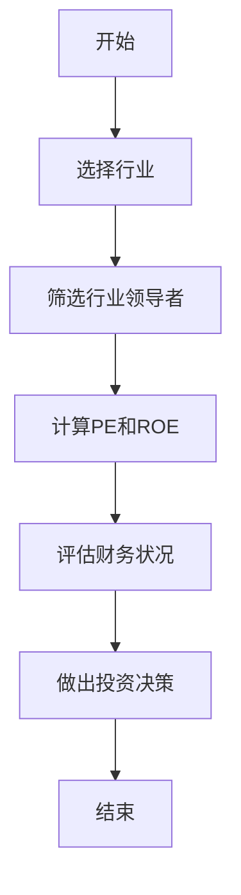
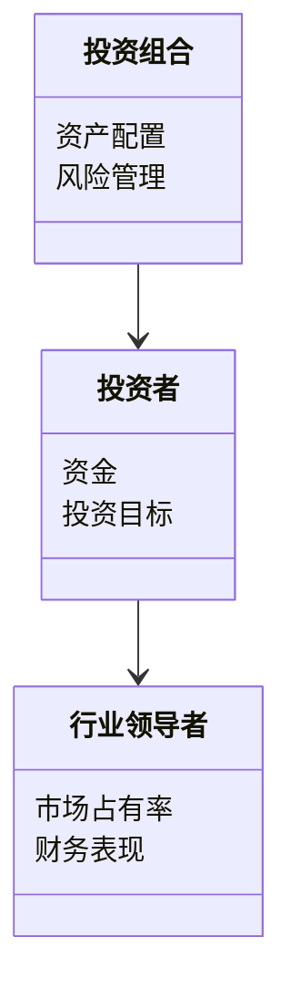

                 


# 彼得林奇的"行业领导者"投资逻辑

## 关键词：彼得·林奇，行业领导者，投资逻辑，PE比率，ROE，投资策略，股票分析

## 摘要：彼得·林奇是全球著名投资专家，其"行业领导者"投资逻辑强调投资于行业中的领先企业，以实现长期稳定的收益。本文从投资学基础出发，详细阐述了行业领导者的定义、特征、选择标准，以及彼得·林奇投资模型的算法原理。通过实际案例分析和系统设计，帮助读者掌握如何识别行业领导者，并构建高效的投资组合。

---

## 正文

### 第1章：投资学基础概述

#### 1.1 投资的基本概念

投资是指将资金投入某一项目或资产，以期在未来获得收益的行为。根据资产类型，投资可分为股票、债券、房地产等多种形式。投资的核心目标是通过价值增值实现财富增长。

- **股票投资**：购买公司股份，成为股东，分享公司利润。
- **债券投资**：购买政府或企业发行的债券，定期获得利息收益。
- **风险与收益**：高风险投资通常伴随高收益，反之亦然。

#### 1.2 彼得·林奇与"行业领导者"投资逻辑

彼得·林奇是美国著名投资专家，曾管理富达麦哲伦基金，创造了卓越的投资业绩。他提出“行业领导者”投资理念，认为应投资于行业中表现最佳的公司。

- **市场地位**：行业领导者通常在市场中占据主导地位，具有强大的竞争优势。
- **竞争优势**：包括成本优势、技术优势、品牌优势等。
- **长期增长**：行业领导者往往能够持续增长，为投资者带来稳定收益。

### 第2章：行业领导者的定义与特征

#### 2.1 行业领导者的定义

行业领导者是指在某一行业中占据领先地位，具有强大市场影响力和竞争优势的企业。

- **市场占有率**：行业领导者通常在市场份额上占据主导地位。
- **品牌影响力**：强大的品牌能够吸引更多的消费者。
- **创新能力**：行业领导者往往具有较强的研发能力，能够推出新产品。

#### 2.2 行业领导者的核心要素

- **市场地位与竞争优势**：市场占有率高，竞争对手难以超越。
- **财务表现与盈利能力**：ROE（净资产收益率）高，盈利能力强。
- **创新能力与未来发展潜力**：持续创新，保持行业领先地位。

#### 2.3 行业领导者与非行业领导者的对比分析

| 特征                | 行业领导者           | 非行业领导者         |
|---------------------|--------------------|--------------------|
| 市场占有率          | 高                 | 低或中             |
| 财务表现            | 盈利能力强           | 盈利能力较弱       |
| 创新能力            | 创新能力强           | 创新能力较弱       |

### 第3章：行业领导者的选择标准

#### 3.1 行业领导者的筛选标准

- **市场占有率分析**：通过分析公司市场份额，判断其是否为行业领导者。
- **财务健康状况评估**：通过ROE、净利率等指标，评估公司盈利能力。
- **管理团队能力评估**：优秀的管理团队能够带领公司持续发展。

#### 3.2 行业领导者的识别方法

- **基于PE（市盈率）的筛选方法**：计算股票的市盈率，选择PE合理的公司。
- **基于ROE的筛选方法**：选择ROE高的公司，通常盈利能力强。
- **基于行业趋势的筛选方法**：分析行业发展趋势，选择符合趋势的行业领导者。

### 第4章：彼得·林奇投资逻辑的算法与数学模型

#### 4.1 投资模型的数学公式

- **PE比率计算公式**
  $$ PE = \frac{股票价格}{每股收益} $$
  
- **ROE计算公式**
  $$ ROE = \frac{净利润}{股东权益} $$

#### 4.2 投资模型的流程图（Mermaid）



### 第5章：系统分析与架构设计

#### 5.1 系统功能设计（领域模型）



#### 5.2 系统架构设计


### 第6章：项目实战

#### 6.1 环境安装

- 安装Python和相关库，如pandas、numpy。

#### 6.2 核心实现源代码

```python
import pandas as pd

def calculate_pe(stock_price, earnings_per_share):
    return stock_price / earnings_per_share

def calculate_roe(net_profit, shareholders_equity):
    return net_profit / shareholders_equity

# 示例数据
stock_price = 100
earnings_per_share = 5
net_profit = 10
shareholders_equity = 50

pe = calculate_pe(stock_price, earnings_per_share)
ro

