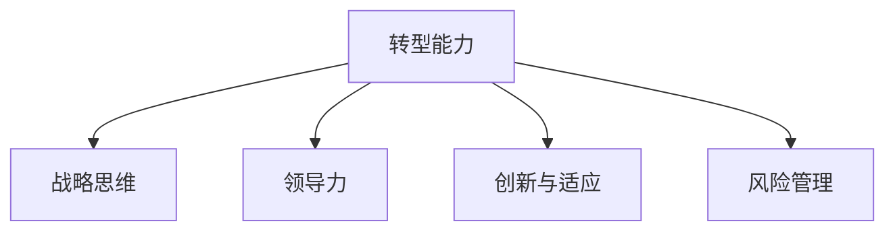

                 

# 彼得林奇的"行业领导者"转型能力评估

> 关键词：彼得林奇，行业领导者，转型能力，评估模型，案例分析

> 摘要：本文从彼得林奇的个人背景出发，探讨其从投资专家向行业领导者转型的能力评估。通过构建转型能力评估模型，结合彼得林奇的实践案例，分析其转型能力的核心要素和评估方法。文章结合系统分析与架构设计，提供具体的数学模型和案例分析，为行业领导者提供转型能力评估的理论支持和实践指导。

---

## 第一部分：彼得林奇与行业领导者转型的背景介绍

### 第1章：彼得林奇的个人背景与转型需求

#### 1.1 彼得林奇的个人简介
- 彼得·林奇的个人经历
- 他在投资领域的影响力
- 从投资专家到行业领导者的转变

#### 1.2 行业领导者转型的背景与趋势
- 转型的定义与内涵
- 行业领导者转型的背景与趋势
- 转型能力在现代企业中的重要性

#### 1.3 转型能力评估的核心概念
- 转型能力的定义
- 评估标准的建立
- 评估的目的与意义

---

## 第二部分：转型能力的核心要素与关键能力

### 第2章：转型能力的核心要素

#### 2.1 战略思维能力
- 战略思维的定义与特征
- 战略思维在转型中的作用
- 彼得林奇的战略思维实践

#### 2.2 领导力与团队管理
- 领导力的定义与核心要素
- 团队管理的关键能力
- 彼得林奇的领导风格分析

#### 2.3 创新与适应能力
- 创新能力的定义与评估
- 适应能力的特征与表现
- 彼得林奇在创新与适应方面的表现

#### 2.4 风险管理与决策能力
- 风险管理的核心要素
- 决策能力的评估标准
- 彼得林奇的风险管理策略

#### 2.5 关键能力的对比分析
- 核心能力与非核心能力的对比
- 关键能力的特征与属性
- 能力之间的相互关系

---

## 第三部分：转型能力评估模型的构建

### 第3章：评估模型的设计与数学公式

#### 3.1 转型能力评估模型的构建方法
- 确定评估目标
- 设计评估指标
- 选择评估方法
- 验证与优化模型

#### 3.2 转型能力指数计算公式
$$ TCE = \frac{\sum_{i=1}^{n} w_i \cdot s_i}{\sum_{i=1}^{n} w_i} $$
其中，$w_i$ 是第i项能力的权重，$s_i$ 是第i项能力的评分。

#### 3.3 模型的可视化表示

---

## 第四部分：彼得林奇转型能力的案例分析

### 第4章：彼得林奇的转型历程与评估实证

#### 4.1 转型历程
- 从投资专家到行业领导者的转变
- 关键转型决策与行动
- 转型中的挑战与解决方案

#### 4.2 转型能力评估的实证分析
- 评估模型的应用
- 彼得林奇的转型能力评分
- 案例分析的启示

---

## 第五部分：行业领导者转型能力评估体系的构建

### 第5章：评估体系的设计与系统分析

#### 5.1 评估体系的设计原则
- 全面性与系统性
- 可操作性与可量化性
- 客观性与公平性

#### 5.2 评估指标体系的设计
- 指标体系的构建
- 数据收集与分析方法
- 反馈与改进机制

#### 5.3 系统分析与架构设计方案
- 问题场景介绍
- 系统功能设计（领域模型）
- 系统架构设计（架构图）
- 系统接口设计
- 系统交互设计（序列图）

---

## 第六部分：项目实战与总结

### 第6章：项目实战与经验总结

#### 6.1 项目环境安装与配置
- 系统环境要求
- 工具安装与配置
- 数据集准备

#### 6.2 系统核心实现源代码
- 转型能力评估模型的实现
- 关键算法的代码实现
- 系统功能模块的代码示例

#### 6.3 代码应用解读与分析
- 代码的功能分析
- 代码的优化建议
- 代码的实际运行结果

#### 6.4 实际案例分析与详细讲解
- 案例背景介绍
- 案例分析过程
- 案例结果与总结

#### 6.5 项目小结
- 项目成果总结
- 经验与教训
- 未来改进方向

---

## 第七部分：总结与展望

### 第7章：总结与展望

#### 7.1 转型能力评估的核心总结
- 转型能力评估的重要性
- 关键能力的提升策略
- 评估模型的应用价值

#### 7.2 未来展望
- 转型能力评估的未来发展
- 新技术在评估中的应用
- 行业领导者转型能力的未来趋势

---

## 作者信息

作者：AI天才研究院/AI Genius Institute & 禅与计算机程序设计艺术 /Zen And The Art of Computer Programming

