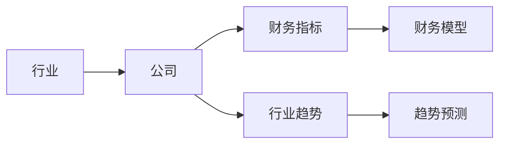
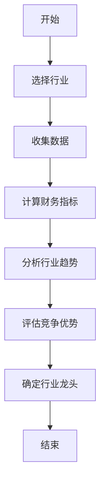
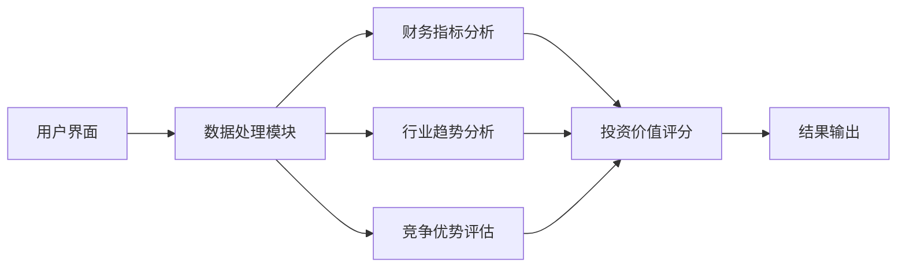

                 


# 彼得林奇的"行业龙头"识别方法

> 关键词：彼得·林奇，行业龙头，投资策略，基本面分析，财务指标，竞争优势，投资系统

> 摘要：本文详细介绍彼得·林奇的“行业龙头”识别方法，从背景介绍到实战分析，帮助读者掌握如何通过基本面分析、财务指标筛选和竞争优势评估，识别出具有长期增长潜力的行业龙头公司。文章结合理论与实践，提供详细的算法原理、系统架构和项目案例，帮助投资者提升选股能力。

---

# 第一部分: 彼得林奇的"行业龙头"识别方法概述

## 第1章: 行业龙头的基本概念

### 1.1 行业龙头的定义与特征
行业龙头是指在一个行业中占据主导地位，具有强大市场影响力和竞争优势的企业。其核心特征包括：  
1. 市场份额高，占据行业主导地位。  
2. 财务表现稳健，具有持续盈利能力。  
3. 具备强大的竞争优势，如技术壁垒、品牌优势等。  

### 1.2 彼得·林奇的投资理念
彼得·林奇是全球著名投资专家，其投资理念强调基本面分析和长期价值投资。他认为，行业龙头公司是那些能够在长期内保持稳定增长，并且能够在市场波动中表现出较强抗性的公司。

### 1.3 行业龙头识别的重要性
识别行业龙头可以帮助投资者抓住市场中的核心机会，降低投资风险。通过林奇的方法，投资者可以更好地理解行业趋势，发现潜在的高增长企业。

---

## 第2章: 彼得·林奇的行业龙头识别方法

### 2.1 林奇的基本面分析法
林奇的行业龙头识别方法以基本面分析为核心，主要关注以下几个方面：  
1. **财务指标分析**：通过ROE（净资产收益率）、净利润率等指标评估公司盈利能力。  
2. **行业趋势分析**：研究行业发展趋势，选择处于上升期的行业。  
3. **竞争优势分析**：评估公司在行业中的竞争优势，如品牌、技术、成本优势等。  

### 2.2 林奇的行业研究法
林奇强调对行业的深入了解，包括：  
1. 行业生命周期分析：判断行业所处的阶段（幼稚期、成长期、成熟期、衰退期）。  
2. 行业集中度分析：选择集中度较高或正在提高的行业。  
3. 行业政策分析：关注政策对行业的影响，选择受益于政策支持的行业。  

### 2.3 林奇的公司调研法
林奇注重对公司进行实地调研，深入了解公司运营状况。调研包括：  
1. 公司管理层：评估管理层的能力和诚信。  
2. 公司财务状况：分析资产负债表、利润表等财务报表。  
3. 公司竞争优势：考察公司的核心竞争力和市场地位。  

---

## 第3章: 林奇方法的核心概念与联系

### 3.1 核心概念的原理
林奇方法的核心在于通过基本面分析和行业趋势分析，筛选出具有长期增长潜力的行业龙头公司。其数学模型可以表示为：  
$$ \text{投资价值} = f(\text{盈利能力}，\text{行业趋势}，\text{竞争优势}) $$  

### 3.2 核心概念的对比分析
以下是几种核心概念的对比分析表：  

| **概念** | **盈利能力** | **行业趋势** | **竞争优势** |  
|----------|--------------|--------------|--------------|  
| **定义** | 公司赚取利润的能力 | 行业整体发展趋势 | 公司在市场中的竞争优势 |  
| **重要性** | 核心指标，决定公司价值 | 影响投资机会 | 决定公司在行业中的地位 |  

### 3.3 实体关系图


---

## 第4章: 林奇方法的算法原理与实现

### 4.1 算法原理
林奇的行业龙头识别算法主要分为以下几个步骤：  
1. 数据收集：收集目标行业的财务数据和行业趋势数据。  
2. 财务指标筛选：通过ROE、净利润率等指标筛选出财务表现优异的公司。  
3. 行业趋势分析：判断行业所处的生命周期阶段。  
4. 竞争优势评估：评估公司竞争优势，选择具有明显优势的公司。  

### 4.2 算法流程图


### 4.3 数学模型
以下是林奇方法的数学模型：  
$$ \text{投资价值评分} = 0.4 \times \text{ROE} + 0.3 \times \text{行业趋势评分} + 0.3 \times \text{竞争优势评分} $$  

---

## 第5章: 系统分析与架构设计

### 5.1 项目介绍
本文将基于林奇的行业龙头识别方法，设计一个行业龙头识别系统。系统功能包括：  
1. 数据收集模块：收集行业和公司的财务数据。  
2. 财务指标分析模块：计算ROE、净利润率等指标。  
3. 行业趋势分析模块：判断行业生命周期阶段。  
4. 竞争优势评估模块：评估公司竞争优势。  

### 5.2 系统架构设计


### 5.3 接口设计
系统接口包括：  
1. 数据接口：从数据库获取行业和公司数据。  
2. 分析接口：调用财务指标计算和行业趋势分析模块。  
3. 输出接口：将结果输出到用户界面或存储到数据库。  

### 5.4 交互设计


---

## 第6章: 项目实战

### 6.1 环境安装
需要安装以下工具：  
1. Python编程语言。  
2. 数据分析库（如Pandas、NumPy）。  
3. 图表绘制工具（如Matplotlib）。  

### 6.2 核心实现代码
以下是核心实现代码示例：  

```python
import pandas as pd
import matplotlib.pyplot as plt

# 数据加载
data = pd.read_csv('industry_data.csv')

# 财务指标计算
data['ROE'] = data['净利润'] / data['净资产']
data['净利润率'] = data['净利润'] / data['营业收入']

# 行业趋势分析
industry_trend = data.groupby('行业')['营业收入'].mean().plot(kind='line')
plt.title('行业趋势分析')
plt.show()

# 竞争优势评估
data['竞争优势评分'] = data['ROE'].rank() + data['净利润率'].rank()
```

### 6.3 案例分析
以科技行业为例，分析行业龙头公司：  
1. **苹果公司**：ROE高，净利润率高，行业地位稳固。  
2. **亚马逊**：ROE和净利润率表现良好，行业趋势向好。  

### 6.4 结果解读
通过上述分析，我们可以识别出具有长期增长潜力的行业龙头公司，并制定相应的投资策略。

---

## 第7章: 总结与注意事项

### 7.1 总结
本文详细介绍了彼得·林奇的行业龙头识别方法，从理论到实践，帮助读者掌握如何通过基本面分析和行业趋势分析，识别出具有长期增长潜力的行业龙头公司。

### 7.2 注意事项
1. 投资有风险，需谨慎操作。  
2. 数据分析需结合实际情况，避免片面性。  
3. 长期投资需耐心和信心。  

### 7.3 拓展阅读
推荐阅读彼得·林奇的《彼得·林奇的成功投资》和《股票投资策略》等书籍，以进一步深入理解行业龙头识别方法。

---

# 作者：AI天才研究院/AI Genius Institute & 禅与计算机程序设计艺术 /Zen And The Art of Computer Programming

