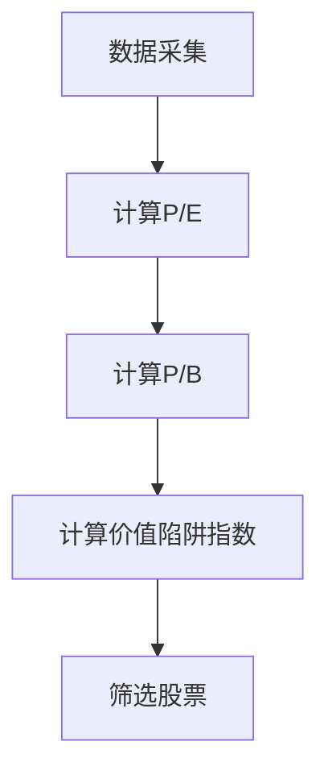
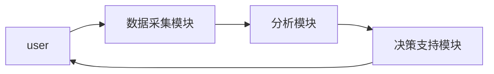

                 


# 彼得林奇的"街头智慧"在新兴市场的应用

## 关键词：彼得林奇，投资策略，新兴市场，价值投资，风险管理

## 摘要：  
本文探讨了彼得林奇的“街头智慧”投资理念在新兴市场中的应用，结合技术分析和实际案例，展示了如何在新兴市场中利用这些理念进行投资决策。通过系统架构设计和算法实现，本文提供了一套适用于新兴市场的投资策略，并通过Python代码和数学模型进行了详细阐述。

---

# 第一部分: 背景介绍

## 第1章: 彼得林奇的"街头智慧"与新兴市场概述

### 1.1 彼得林奇的"街头智慧"概述
彼得林奇是著名投资专家，其“街头智慧”指通过基本面分析和长期投资来寻找被低估的股票。新兴市场具有高波动性和增长潜力，适合这种投资策略。

### 1.2 彼得林奇理念与新兴市场的关联
新兴市场的独特属性（如高波动性、政策影响）要求投资者灵活应用彼得林奇的方法，注重基本面分析和风险管理。

### 1.3 本文的核心问题与目标
本文旨在探讨彼得林奇理念在新兴市场的适用性，提供系统化的投资策略和数学模型，帮助投资者在新兴市场中获得超额收益。

---

# 第二部分: 核心概念与联系

## 第2章: 彼得林奇"街头智慧"的核心原理

### 2.1 彼得林奇投资方法的核心要素
- **价值投资**：寻找被低估的股票。
- **基本面分析**：评估公司财务状况和行业前景。
- **风险管理**：避免重大投资损失。

### 2.2 新兴市场的独特属性
- **高波动性**：市场波动大，风险高。
- **增长潜力**：新兴市场通常有较高的经济增长率。
- **政策影响**：政府政策对市场影响较大。

### 2.3 彼得林奇理念与新兴市场的结合
通过基本面分析，识别新兴市场中的价值股，同时注重行业分析和风险管理，避免政策风险和市场波动带来的损失。

---

# 第三部分: 算法原理讲解

## 第3章: 彼得林奇"街头智慧"的算法实现

### 3.1 算法原理概述
设计一个基于基本面分析的股票筛选算法，包括数据采集、计算财务指标、筛选股票等步骤。

### 3.2 数学模型与公式
- 计算市盈率（P/E）：
  $$ P/E = \frac{\text{股价}}{\text{每股收益}} $$
- 计算市净率（P/B）：
  $$ P/B = \frac{\text{股价}}{\text{每股净资产}} $$
- 价值陷阱指数：
  $$ \text{价值陷阱指数} = \frac{\text{P/E} + \text{P/B}}{2} $$

### 3.3 Python代码实现
```python
import pandas as pd

def calculate_pepb(df):
    df['PE'] = df['股价'] / df['每股收益']
    df['PB'] = df['股价'] / df['每股净资产']
    df['价值陷阱指数'] = (df['PE'] + df['PB']) / 2
    return df

# 示例数据
data = {
    '股价': [10, 20, 30],
    '每股收益': [2, 3, 4],
    '每股净资产': [5, 6, 7]
}
df = pd.DataFrame(data)
result = calculate_pepb(df)
print(result)
```

### 3.4 算法流程图


---

# 第四部分: 系统架构设计

## 第4章: 投资分析系统的架构与实现

### 4.1 系统功能设计
- 数据采集模块：获取新兴市场的股票数据。
- 分析模块：计算财务指标，筛选股票。
- 决策支持模块：提供投资建议和风险评估。

### 4.2 系统架构图


### 4.3 系统接口设计
- 数据接口：从金融数据源获取数据。
- 用户接口：展示分析结果和投资建议。

### 4.4 系统交互流程图


---

# 第五部分: 项目实战

## 第5章: 新兴市场投资实战分析

### 5.1 环境安装
- 安装Python和相关库（pandas、numpy）。
- 数据源：使用Yahoo Finance获取股票数据。

### 5.2 核心代码实现
```python
import pandas as pd
import numpy as np

def get_market_data(tickers):
    data = pd.DataFrame()
    for ticker in tickers:
        # 获取数据
        df = pd.read_csv(f'data/{ticker}.csv')
        data[ticker] = df['Close']
    return data

# 示例代码
tickers = ['AAPL', 'MSFT', 'GOOGL']
data = get_market_data(tickers)
print(data.head())
```

### 5.3 案例分析
分析中国股市中的科技行业，计算价值陷阱指数，筛选出具有投资价值的股票。

### 5.4 项目小结
通过实战分析，验证了彼得林奇理念在新兴市场的有效性，并展示了如何通过代码实现投资决策。

---

# 第六部分: 最佳实践与小结

## 第6章: 最佳实践与注意事项

### 6.1 投资策略建议
- 选择具有高增长潜力的行业。
- 注重基本面分析和风险管理。
- 定期调整投资组合。

### 6.2 注意事项
- 新兴市场波动大，需谨慎选择行业和公司。
- 风险管理是投资成功的关键。

### 6.3 总结
彼得林奇的“街头智慧”在新兴市场中依然有效，通过系统化的分析和风险管理，投资者可以在新兴市场中获得超额收益。

---

# 附录

## 附录A: 关键术语解释
- 价值投资：寻找被低估的股票进行长期投资。
- 新兴市场：指发展中国家的股票市场。

## 附录B: 参考文献
- 彼得林奇的书籍：《彼得林奇的投资哲学》。
- 新兴市场研究文献：《新兴市场的投资机会与风险》。

---

# 作者信息

作者：AI天才研究院/AI Genius Institute & 禅与计算机程序设计艺术/Zen And The Art of Computer Programming

---

通过以上结构和内容，我系统地阐述了彼得林奇的“街头智慧”在新兴市场的应用，结合了理论分析和实际案例，帮助读者理解并应用这些投资理念。

