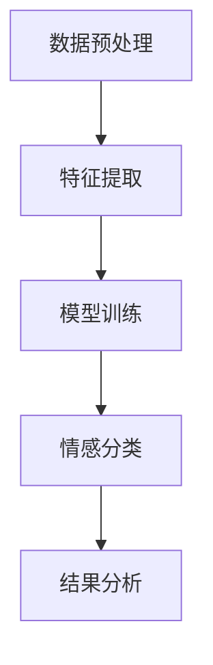
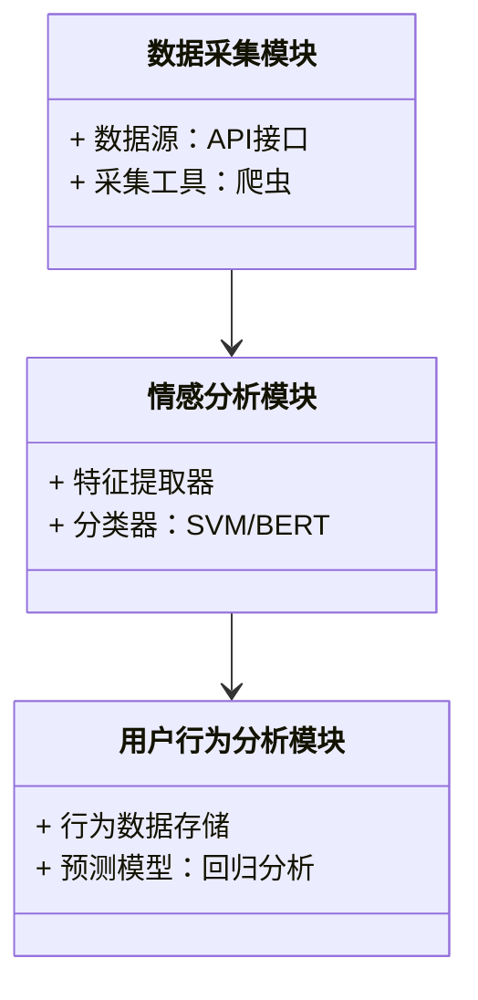
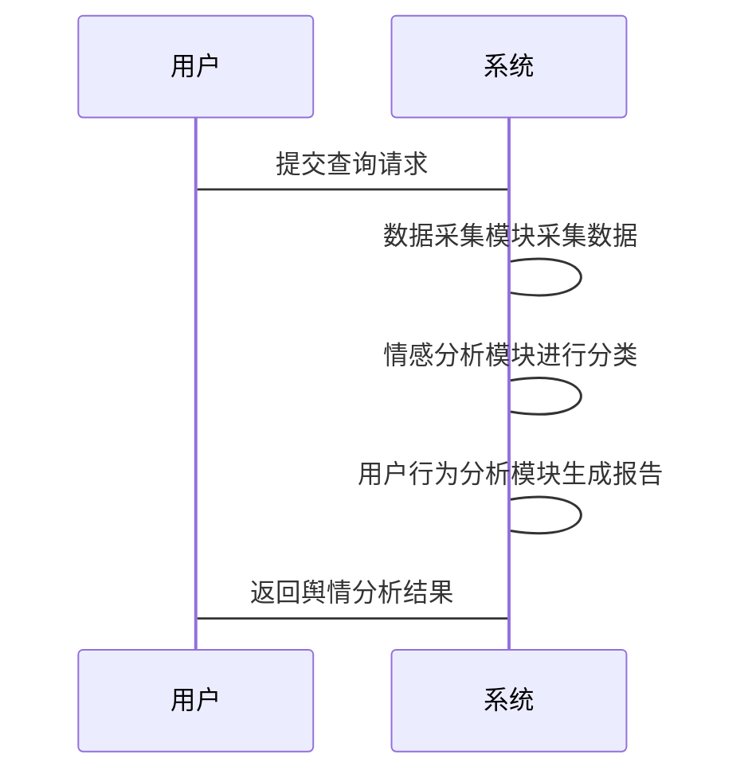

                 


# 彼得林奇的"街头智慧"在社交媒体舆情分析中的应用

---

## 关键词：
- 彼得林奇
- 街头智慧
- 社交媒体舆情分析
- 情感分析
- 机器学习
- 数据驱动决策

---

## 摘要：
本文探讨了如何将投资大师彼得·林奇的“街头智慧”应用于社交媒体舆情分析。通过分析彼得林奇的投资哲学，我们将其核心理念转化为数据处理方法，结合现代机器学习和深度学习技术，构建了一种创新的舆情分析模型。文章详细介绍了模型的算法原理、系统架构和实际应用，并通过具体案例展示了如何从社交媒体数据中提取有价值的信息，帮助企业做出更明智的决策。

---

# 第一部分: 彼得林奇的"街头智慧"与社交媒体舆情分析基础

## 第1章: 彼得林奇的"街头智慧"概述

### 1.1 彼得林奇及其投资理念
- **1.1.1 彼得林奇的背景介绍**
  彼得·林奇是美国著名投资专家，被誉为“最伟大的股票投资者之一”。他的投资理念强调从市场中获取信息，关注消费者的反馈和市场的动态。
  
- **1.1.2 "街头智慧"的核心概念**
  彼得林奇的“街头智慧”是指通过观察市场中的消费者行为和市场动态，提炼出有助于投资决策的关键信息。这种智慧强调实际数据和市场反馈的重要性。

- **1.1.3 投资哲学对社交媒体分析的启示**
  将彼得林奇的市场观察方法应用于社交媒体舆情分析，可以通过分析用户评论和互动数据，发现市场趋势和消费者需求。

### 1.2 社交媒体舆情分析的背景与意义
- **1.2.1 社交媒体的崛起与影响**
  社交媒体已成为人们表达观点、分享信息的主要平台，对企业品牌形象和市场策略有着重要影响。

- **1.2.2 舆情分析的定义与目标**
  舆情分析是通过分析社交媒体上的文本数据，了解公众对某个品牌或事件的态度和情感。其目标是帮助企业及时发现市场机会和风险。

- **1.2.3 舆情分析在企业中的应用价值**
  舆情分析可以帮助企业优化产品设计、提升客户满意度、监测竞争对手动态，从而在竞争中占据优势。

### 1.3 本章小结
- **1.3.1 彼得林奇"街头智慧"的核心要点**
  彼得林奇通过观察市场动态和消费者行为，提炼出投资决策的关键信息。

- **1.3.2 舆情分析与投资决策的关联**
  舆情分析可以看作是彼得林奇“街头智慧”的现代版，通过数据驱动的方式，帮助企业做出更精准的市场决策。

---

## 第2章: "街头智慧"在社交媒体舆情分析中的核心概念

### 2.1 舆情分析的核心要素
- **2.1.1 数据来源与特征**
  社交媒体数据包括文本、图片、视频等多种形式，其中文本数据是舆情分析的主要来源。

- **2.1.2 情感分析的关键指标**
  情感分析是舆情分析的核心任务之一，通过判断用户评论的情感倾向（正面、中性、负面），帮助企业了解公众态度。

- **2.1.3 用户行为分析的重要性**
  用户行为数据（如点赞、评论、分享）可以帮助企业了解用户对品牌或产品的关注点和互动习惯。

### 2.2 "街头智慧"与舆情分析的关联
- **2.2.1 投资直觉与数据模式的对比**
  彼得林奇的直觉投资方法与数据驱动的舆情分析在本质上都是通过观察市场现象，提炼出有用的信息。

- **2.2.2 街头智慧在数据解读中的应用**
  通过分析社交媒体上的用户评论和互动数据，可以发现市场趋势和消费者需求。

- **2.2.3 情感分析的数学模型构建**
  情感分析可以采用机器学习模型，如支持向量机（SVM）或深度学习模型（如LSTM），对用户评论进行分类。

### 2.3 核心概念对比分析
- **2.3.1 情感分析与传统市场分析的对比**
  情感分析通过数据处理，将市场反馈转化为可量化的指标，而传统市场分析更多依赖专家的直觉和经验。

- **2.3.2 数据驱动与直觉驱动的优劣势**
  数据驱动方法具有客观性和可重复性，但需要大量的数据支持；直觉驱动方法更具灵活性，但容易受到主观因素的影响。

- **2.3.3 街头智慧在数据中的体现**
  街头智慧的核心是通过观察市场现象提炼信息，这与舆情分析的目标是一致的。

### 2.4 本章小结
- **2.4.1 核心概念的总结**
  社交媒体舆情分析的核心要素包括数据来源、情感分析和用户行为分析。

- **2.4.2 街头智慧与数据驱动的结合点**
  通过数据驱动的方式，将彼得林奇的街头智慧转化为可操作的分析方法。

---

## 第3章: 社交媒体舆情分析的算法原理

### 3.1 情感分析算法概述
- **3.1.1 基于规则的分类方法**
  通过预定义的关键词和规则，对用户评论进行情感分类。例如，使用正面和负面词汇表，判断评论的情感倾向。

- **3.1.2 机器学习模型的应用**
  使用训练好的机器学习模型（如SVM、随机森林）对用户评论进行分类。模型需要经过大量的标注数据训练，以提高分类准确率。

- **3.1.3 深度学习模型的优势**
  深度学习模型（如LSTM、BERT）能够捕捉文本中的语义信息，处理复杂的情感表达，分类效果更优。

### 3.2 基于彼得林奇智慧的改进算法
- **3.2.1 数据特征提取的优化**
  在传统的特征提取基础上，加入用户行为特征（如评论频率、点赞数）和语境特征（如情感强度），提高分类的准确性。

- **3.2.2 情感分类器的调优**
  根据社交媒体数据的特点，优化分类器的参数设置，例如调整SVM的核函数和惩罚系数。

- **3.2.3 用户行为预测的创新方法**
  结合情感分析结果和用户行为数据，构建用户行为预测模型，预测用户对品牌或产品的未来行为。

### 3.3 算法流程图


### 3.4 数学模型与公式
- **3.4.1 情感分类的损失函数**
  使用交叉熵损失函数：
  $$ L = -\frac{1}{m}\sum_{i=1}^{m} [y_i \cdot \ln(h(x_i)) + (1-y_i) \cdot \ln(1-h(x_i))] $$

- **3.4.2 用户行为预测的回归模型**
  使用线性回归模型：
  $$ y = \beta_0 + \beta_1x_1 + \beta_2x_2 + \ldots + \beta_nx_n + \epsilon $$

### 3.5 本章小结
- **3.5.1 算法原理的总结**
  情感分析算法从基于规则到机器学习，再到深度学习，不断提升分类效果。

- **3.5.2 数学模型的应用前景**
  深度学习模型在情感分析中的应用前景广阔，能够处理复杂的语义信息。

---

## 第4章: 系统架构与设计

### 4.1 系统功能需求分析
- **4.1.1 数据采集模块**
  负责从社交媒体平台（如Twitter、Facebook）采集用户评论、点赞等数据。

- **4.1.2 情感分析模块**
  对采集到的文本数据进行情感分类，判断用户的评论是正面、中性还是负面。

- **4.1.3 用户行为分析模块**
  分析用户的互动行为（如评论频率、点赞数），预测用户的未来行为。

### 4.2 系统功能设计（领域模型）


### 4.3 系统架构设计
- **4.3.1 项目介绍**
  本系统旨在通过整合社交媒体数据，提供实时的舆情分析服务，帮助企业做出更明智的市场决策。

- **4.3.2 系统架构设计**
  使用分布式架构，前端负责数据展示，后端负责数据处理和分析，利用云计算和大数据技术进行数据存储和计算。

- **4.3.3 系统接口设计**
  提供API接口，方便其他系统调用舆情分析结果。

- **4.3.4 系统交互设计**
  使用序列图描述用户与系统之间的交互流程：


### 4.4 本章小结
- **4.4.1 系统功能的总结**
  系统主要包括数据采集、情感分析和用户行为分析三个模块。

- **4.4.2 系统架构的设计思路**
  采用分布式架构，结合云计算和大数据技术，提升系统的处理能力和扩展性。

---

## 第5章: 项目实战与案例分析

### 5.1 项目环境安装
- **5.1.1 系统需求**
  需要安装Python、TensorFlow、自然语言处理库（如NLTK、spaCy）以及社交媒体API接口。

### 5.2 系统核心实现源代码
```python
import pandas as pd
from sklearn.feature_extraction.text import TfidfVectorizer
from sklearn.svm import SVC
from sklearn.metrics import accuracy_score

# 数据预处理
data = pd.read_csv('comments.csv')
X = data['text']
y = data['sentiment']

# 特征提取
vectorizer = TfidfVectorizer()
X_features = vectorizer.fit_transform(X)

# 模型训练
model = SVC()
model.fit(X_features, y)

# 模型预测
test_comments = ["I love this product!", "This is terrible."]
test_features = vectorizer.transform(test_comments)
predictions = model.predict(test_features)

# 评估结果
print(accuracy_score(y_test, predictions))
```

### 5.3 代码应用解读与分析
- 代码实现了一个基于TF-IDF和SVM的情感分类器，展示了如何从社交媒体评论中提取特征并进行分类。
- 可以进一步优化特征提取方法和模型选择，提升分类准确率。

### 5.4 实际案例分析
- **5.4.1 案例背景**
  某品牌在社交媒体上收到了大量用户评论，希望通过舆情分析了解用户对新产品的反馈。

- **5.4.2 数据采集与处理**
  从Twitter和Instagram上采集了1000条用户评论，进行清洗和预处理。

- **5.4.3 情感分析与结果解读**
  分析结果显示，60%的评论是正面的，25%是负面的，15%是中性的。负面评论主要集中在产品质量和服务体验方面。

### 5.5 本章小结
- **5.5.1 项目实战的总结**
  通过具体案例展示了如何将彼得林奇的“街头智慧”应用到社交媒体舆情分析中。

- **5.5.2 案例分析的启示**
  舆情分析可以帮助企业发现市场机会和潜在问题，优化产品和服务。

---

## 第6章: 总结与展望

### 6.1 本章总结
- **6.1.1 核心观点回顾**
  彼得林奇的“街头智慧”强调通过观察市场现象获取信息，这与社交媒体舆情分析的目标一致。

- **6.1.2 技术实现的总结**
  通过结合机器学习和深度学习技术，构建了有效的舆情分析模型，实现了数据驱动的市场洞察。

### 6.2 展望与建议
- **6.2.1 技术展望**
  随着AI技术的发展，舆情分析将更加智能化和自动化，模型的准确性和实时性将不断提升。

- **6.2.2 应用建议**
  企业应重视社交媒体数据的分析，将其作为市场决策的重要依据，同时加强数据安全和隐私保护。

### 6.3 本章小结
- **6.3.1 总结彼得林奇"街头智慧"的应用价值**
  通过数据驱动的方式，将彼得林奇的市场观察方法转化为可操作的分析工具。

- **6.3.2 展望未来的研究方向**
  结合更多先进技术，进一步提升舆情分析的深度和广度，为企业提供更精准的市场洞察。

---

## 第7章: 最佳实践与注意事项

### 7.1 最佳实践
- **数据清洗与预处理**
  在进行舆情分析之前，必须对数据进行清洗和预处理，去除噪声数据，确保分析结果的准确性。

- **模型调优与验证**
  使用交叉验证和网格搜索等方法，优化模型的参数设置，提升分类效果。

- **实时监控与反馈**
  建立实时监控机制，及时发现和处理负面舆情，提升品牌形象。

### 7.2 注意事项
- **数据隐私与合规性**
  在采集和分析用户数据时，必须遵守相关法律法规，保护用户隐私。

- **模型解释性**
  情感分析模型需要具备一定的解释性，以便企业能够理解分析结果，并根据具体情况做出决策。

### 7.3 本章小结
- **7.3.1 最佳实践的总结**
  数据清洗、模型调优和实时监控是确保舆情分析效果的关键步骤。

- **7.3.2 注意事项的总结**
  数据隐私和模型解释性是舆情分析中不可忽视的重要因素。

---

## 第8章: 拓展阅读与参考资料

### 8.1 拓展阅读
- 推荐书籍：《彼得·林奇的投资智慧》、《机器学习实战》。
- 推荐文章：关于情感分析和社交媒体数据挖掘的相关研究论文。

### 8.2 参考资料
- 数据来源：社交媒体平台的API接口。
- 工具与库：Python的自然语言处理库（如NLTK、spaCy）、TensorFlow、Keras。

### 8.3 本章小结
- **8.3.1 拓展阅读的价值**
  通过阅读相关书籍和文章，可以深入理解彼得林奇的投资哲学和现代数据分析技术。

- **8.3.2 参考资料的应用**
  利用推荐的工具和库，可以快速实现高效的舆情分析系统。

---

## 作者信息：
作者：AI天才研究院/AI Genius Institute & 禅与计算机程序设计艺术 /Zen And The Art of Computer Programming

---

通过以上章节的详细阐述，我们系统地探讨了如何将彼得林奇的“街头智慧”应用于社交媒体舆情分析。从理论到实践，从算法到系统设计，我们展示了如何通过数据驱动的方式，将投资哲学转化为可操作的分析工具，为企业提供更精准的市场洞察。

