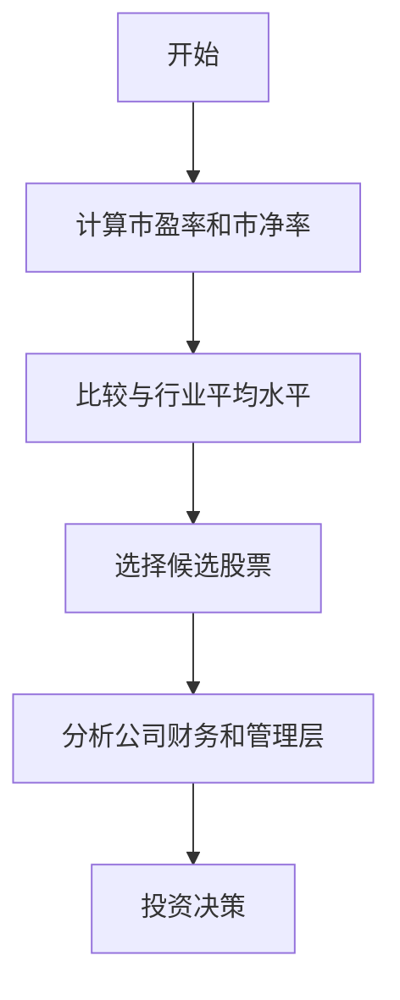
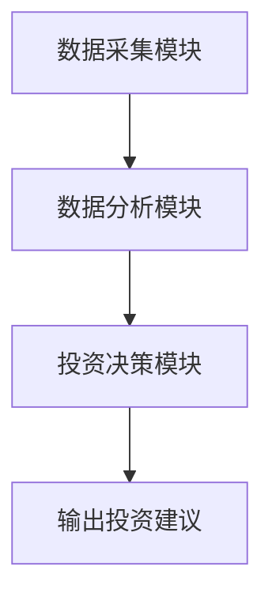

                 


# 彼得林奇的"街头智慧"投资技巧

## 关键词：彼得·林奇，投资技巧，股票分析，价值投资，投资策略

## 摘要：本文深入分析了彼得·林奇的“街头智慧”投资技巧，从背景介绍到具体策略，再到数学模型和系统架构设计，结合实战案例，全面解析了如何将日常生活观察转化为投资决策。文章通过清晰的结构和详细的讲解，帮助读者掌握彼得·林奇的投资理念，并在实际操作中应用。

---

# 第一部分：彼得·林奇“街头智慧”投资技巧概述

## 第1章：投资的基础概念

### 1.1 投资的基本概念

#### 1.1.1 投资的定义与分类

投资是指将资金投入到某种资产中，期望在未来获得收益或资本增值。投资可以分为多种类型，包括股票、债券、房地产等。股票投资是其中一种重要的形式，通过购买公司股份成为股东，分享公司收益。

#### 1.1.2 股票投资的基本原理

股票投资的核心在于分析公司的基本面和市场趋势。基本面分析包括对公司财务状况、盈利能力、管理团队等的评估，而市场趋势则关注整体市场的波动情况。投资者需要综合这两方面信息，做出投资决策。

#### 1.1.3 投资市场的基本构成

投资市场由买方、卖方、中介机构（如券商）、监管机构等构成。买方和卖方通过中介机构进行交易，监管机构则确保市场的公平与透明。

### 1.2 彼得·林奇及其投资理念

#### 1.2.1 彼得·林奇的生平简介

彼得·林奇是美国著名的共同基金经理人，以其在富达麦哲伦基金的卓越表现而闻名。他强调长期投资和价值发现，注重对公司基本面的深入分析。

#### 1.2.2 “街头智慧”的核心思想

“街头智慧”是指通过日常生活中的观察和经验，识别投资机会。林奇认为，投资者应关注身边的变化，如新开的商店、社区的发展等，这些都能提供潜在的投资线索。

#### 1.2.3 彼得·林奇的投资风格与特点

林奇的投资风格以价值投资为主，注重寻找被市场低估的股票。他善于通过分析公司财务报表和管理层决策，判断公司的成长潜力。

---

## 第2章：彼得·林奇“街头智慧”的核心策略

### 2.1 寻找“便宜货”的方法

#### 2.1.1 什么是“便宜货”

“便宜货”指的是那些市场价格低于其内在价值的股票。林奇认为，找到这些股票是投资成功的关键。

#### 2.1.2 如何识别市场中的“便宜货”

通过分析市盈率（P/E ratio）和市净率（P/B ratio）等指标，识别那些价格低于行业平均水平的股票。

#### 2.1.3 “便宜货”投资的注意事项

投资者应关注公司的财务健康状况，避免选择财务状况不佳的公司。

### 2.2 关注管理层的信号

#### 2.2.1 管理层对投资的影响

管理层的决策直接影响公司的业绩和股价。一个高效的管理团队能够带领公司实现增长。

#### 2.2.2 如何通过管理层的行为判断公司价值

观察管理层的稳定性、决策能力和扩张计划，判断公司未来的增长潜力。

#### 2.2.3 管理层信号的实战案例分析

通过分析某公司管理层的变动和战略调整，判断其投资价值。

### 2.3 从日常生活观察投资机会

#### 2.3.1 “街头智慧”的具体表现

通过日常生活的观察，发现市场趋势和投资机会。例如，发现某家餐厅生意兴隆，可能意味着其母公司业绩良好。

#### 2.3.2 如何将日常生活观察转化为投资决策

将观察到的市场变化与公司的财务数据结合，判断其投资价值。

#### 2.3.3 实战案例：从超市购物发现投资机会

通过观察超市的销售情况，发现某食品公司销售额增长，进而投资其股票。

---

## 第3章：彼得·林奇投资模型的数学解析

### 3.1 投资价值评估的数学模型

#### 3.1.1 股票内在价值的计算公式

股票的内在价值可以通过未来现金流的现值计算得出：

$$
\text{内在价值} = \sum_{t=1}^{n} \frac{\text{现金流}_t}{(1 + r)^t}
$$

其中，r为折现率，n为预测的年数。

#### 3.1.2 市盈率与市净率的数学表达

市盈率（P/E）= 股价 / 每股收益

市净率（P/B）= 股价 / 每股净资产

#### 3.1.3 投资回报率的计算方法

投资回报率 = （最终价值 - 初始投资） / 初始投资 × 100%

### 3.2 “便宜货”筛选的算法流程

#### 3.2.1 筛选优质股票的步骤

1. 计算股票的市盈率和市净率。
2. 比较这些比率与行业平均水平。
3. 选择低于行业平均水平的股票作为候选。
4. 进一步分析公司的财务状况和管理层决策。

#### 3.2.2 用mermaid图展示投资模型的流程



#### 3.2.3 算法的数学表达式与代码实现

以下是一个简单的Python代码示例，用于计算市盈率和市净率：

```python
import pandas as pd

def calculate_valuation_ratios(stock_data):
    stock_data['PE'] = stock_data['股价'] / stock_data['每股收益']
    stock_data['PB'] = stock_data['股价'] / stock_data['每股净资产']
    return stock_data

# 示例数据
data = {'股价': [100, 200, 300],
        '每股收益': [10, 20, 30],
        '每股净资产': [50, 100, 150]}
df = pd.DataFrame(data)
result = calculate_valuation_ratios(df)
print(result)
```

---

## 第4章：投资决策的系统架构设计

### 4.1 投资决策系统的功能模块

#### 4.1.1 数据采集模块

负责收集股票的财务数据和市场数据。

#### 4.1.2 数据分析模块

对数据进行处理和分析，计算各种估值指标。

#### 4.1.3 投资决策模块

根据分析结果，生成投资建议。

### 4.2 系统架构的mermaid图展示



---

## 第5章：项目实战——构建“街头智慧”投资系统

### 5.1 环境安装与配置

#### 5.1.1 投资分析工具的安装

安装Python和相关库（如Pandas、Matplotlib）。

#### 5.1.2 数据源的获取与处理

从股票数据库获取数据，并进行清洗和预处理。

#### 5.1.3 系统环境的配置

配置开发环境，确保各模块能够协同工作。

### 5.2 核心代码实现

#### 5.2.1 数据采集模块的代码实现

使用API获取实时股票数据。

#### 5.2.2 数据分析模块的代码实现

计算市盈率和市净率，并与行业平均水平进行比较。

#### 5.2.3 投资决策模块的代码实现

根据分析结果，筛选出“便宜货”股票，并生成投资建议。

### 5.3 实战案例分析

#### 5.3.1 案例背景介绍

选择某行业中的几家公司进行分析。

#### 5.3.2 数据分析与处理

计算各公司的市盈率和市净率，比较与行业平均水平的差异。

#### 5.3.3 投资决策与结果分析

根据分析结果，选择投资标的，并预测其未来的收益。

---

## 第6章：最佳实践与投资技巧总结

### 6.1 投资策略的总结与反思

彼得·林奇的“街头智慧”投资技巧通过日常生活观察和基本面分析，帮助投资者发现投资机会。然而，这种方法需要投资者具备一定的市场敏感性和分析能力。

### 6.2 投资中的常见误区

避免盲目跟风，注重深入分析和长期投资。

### 6.3 投资技巧总结

1. 关注市场趋势和公司基本面。
2. 寻找“便宜货”股票。
3. 分析管理层的决策能力。
4. 结合日常生活观察，发现投资机会。

### 6.4 小结

彼得·林奇的“街头智慧”投资技巧是一种有效的方法，但需要投资者具备敏锐的市场洞察力和扎实的分析能力。通过系统的分析和实践，投资者可以更好地应用这种方法，实现长期的财富增长。

### 6.5 注意事项

- 投资有风险，需谨慎决策。
- 定期回顾和调整投资策略。
- 保持对市场的敏感性和学习能力。

### 6.6 拓展阅读

建议阅读彼得·林奇的著作，如《彼得·林奇的成功投资》。

---

# 作者

作者：AI天才研究院/AI Genius Institute & 禅与计算机程序设计艺术 /Zen And The Art of Computer Programming

